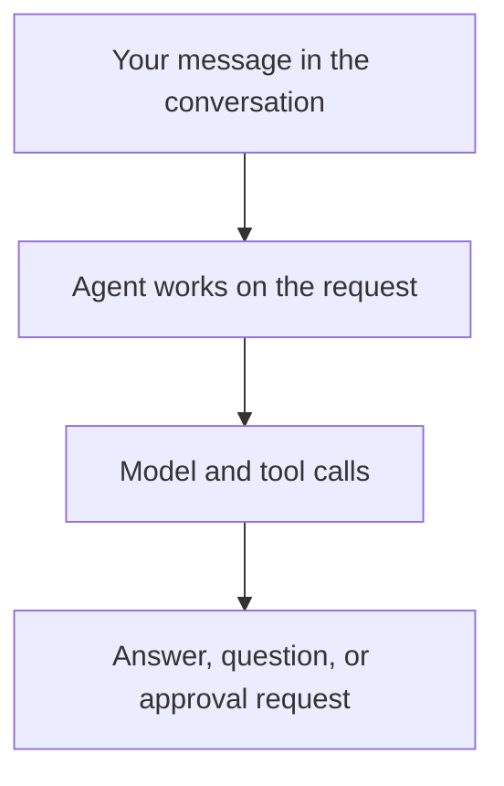

# Core concepts

Follow one conversation with a project assistant to understand the main concepts. This walkthrough uses the **Service**, the shared platform accessed through Console or the API. You can use the [Harness SDK](a13n-harness/index.md) directly without creating an organization or workspace.

## Configure an Agent for a workspace

Your team wants an assistant that reads project information, reports progress, and remembers decisions. An administrator gives you access to a **workspace** inside your **organization**. The organization groups members and workspaces; the workspace holds the agents, resources, and conversations you use together. Your role determines whether you can view, run, configure, or administer them.

You create an **Agent** with instructions such as “Summarize project progress and cite the information you used.” Its configuration selects a model and any tools or other resources it needs. You can save configurations as **versions** and choose which version new conversations use.

| Concept         | In this example                                                                             |
| --------------- | ------------------------------------------------------------------------------------------- |
| **Model**       | The language model that interprets the request and produces responses or tool calls         |
| **Tool**        | A function the Agent can call, such as looking up a task or reading a file                  |
| **Connection**  | Configured access to an external tool source, such as a remote MCP server or an app account |
| **Environment** | The sandbox or computer where file and command tools operate                                |
| **Memory**      | Information the Agent can read and update across conversations, such as project decisions   |

A model and instructions are enough to begin. Add tools and resources when the task needs them. For this assistant, you must configure access to project information before it can look up real progress.

See [Identity and access](a13n-service/identity.md), [Agents](a13n-service/agents-and-runs.md#agents), and [Resource basics](a13n-service/resources.md) for configuration details.

## Send the first message

In Console, choose the Agent and ask:

> Summarize the current project status and list the next two tasks.

The conversation is a **session**. It starts with one **thread**, which holds the messages in that discussion. If you fork the conversation to explore a different answer, the session can contain multiple threads.

When the Agent starts working, that execution is a **run**. During a run, the Agent can call the model and tools several times to complete the task. You see its response as it streams into Console or your application.

If the Agent is already working, another message may guide its current work or wait until later. See [Agents, threads and runs](a13n-service/agents-and-runs.md) when you need to submit, follow, or stop work through the API.

## Answer a question or approve a tool

Suppose the Agent proposes updating a project task, and that tool requires approval. Work pauses while Console or your application presents the request. You can approve or reject it, then the Agent continues using your decision.

The Agent may also ask a question before it can proceed. Answer it in the conversation. For an application integration, see [Waits, approvals and questions](a13n-service/agents-and-runs.md#waits-approvals-and-questions) for handling these requests through the API.

## Continue later

Ask “Which task should I do first?” in the same thread. Its history lets the Agent continue the discussion. Closing the browser or disconnecting your application does not stop the work; you can return to the saved conversation to see its progress and results.

If you start a separate conversation, shared **memory** can make saved project decisions available there. It must be configured and attached, and the Agent must record or retrieve the relevant information through its memory tools.

| Information          | Purpose                                                                                                |
| -------------------- | ------------------------------------------------------------------------------------------------------ |
| Conversation history | Continue this particular discussion                                                                    |
| Memory               | Keep information available across conversations                                                        |
| Environment files    | Hold documents and other files accessed by tools; their lifetime depends on the configured environment |

These are configured and stored separately. Continuing a conversation does not automatically turn everything it contains into shared memory. See [Memory](a13n-service/memory.md) and [Environments](a13n-service/environments.md).

## Recognize the component names

- **Service** manages shared agents, access, resources, and saved conversations, and runs the agents on your servers.
- **Console** is the browser application people use to manage and talk to agents on Service.
- **Harness** is the Python SDK Service uses to run agents. You can also use it directly in your own application.
- **Harness UI** runs agents locally through its own terminal and browser interfaces. It has its own configuration and conversations; it is separate from Service Console.
- **Envd** handles remote or isolated file and command operations for environments. It does not execute the Agent itself.
- **Stream Protocol** converts Harness observations into AG-UI events for an event consumer. Service clients use the documented [Service thread stream](a13n-service/agents-and-runs.md#follow-a-thread-stream).

Start with Service and Console for the shared platform. The [usage guide](choose-your-path.md) explains when to use the SDK, local application, or individual integration components.

## Next steps

- [Choose how to use Agent Foundation](choose-your-path.md) to select a deployment or development path.
- [Use an existing platform](a13n-service/use-platform.md) to try a first conversation in Console.
- Read the [Service overview](a13n-service/index.md) to find configuration, integration, and operation guides.
