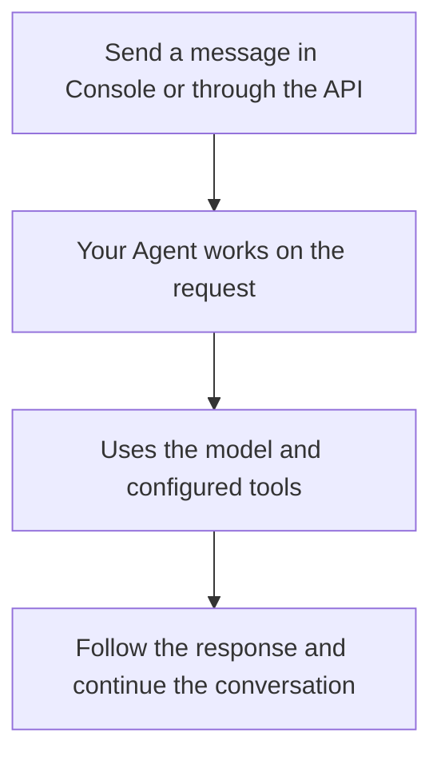

# Agent Foundation

**Build and operate your own agent platform.**

Deploy Agent Foundation on your infrastructure to manage agents, models, tools, and execution environments. Let teams use agents through the Console, or connect your applications through the API. The Service runs agents with the Python Harness SDK, built on Pydantic AI.

**[Deploy your platform](a13n-service/get-started.md)** · **[Connect your application](a13n-service/connect-application.md)**

Already have a platform URL? [Use an existing platform](a13n-service/use-platform.md). New to the terminology? Read [Core concepts](core-concepts.md).

## What you can build

- **A shared platform for your team:** configure agents and resources in workspaces, give members access, and keep conversations and results in one place.
- **Agents inside your product:** submit work through the API, display streamed output, handle questions and approvals, and receive lifecycle webhooks.
- **Agents that work with your systems:** connect tools through MCP or app connections, attach environments for files and commands, and share memory across conversations.

## Platform capabilities

| Need                                  | What the platform provides                                                                                                  | Learn more                                                                           |
| ------------------------------------- | --------------------------------------------------------------------------------------------------------------------------- | ------------------------------------------------------------------------------------ |
| Configure and reuse agents            | Models, instructions, tools, skills, subagents, and versioned agent configurations                                          | [Agents](a13n-service/agents-and-runs.md#agents)                                     |
| Keep work running                     | Work continues when you disconnect; the platform saves conversations and supports recovery after execution process failures | [Threads and runs](a13n-service/agents-and-runs.md)                                  |
| Involve a person                      | Wait for approvals, questions, or client tool results, then continue the conversation                                       | [Waits and approvals](a13n-service/agents-and-runs.md#waits-approvals-and-questions) |
| Access tools and files                | Credentialed tool connections and configurable execution environments                                                       | [Tools](a13n-service/tools.md) · [Environments](a13n-service/environments.md)        |
| Retain knowledge across conversations | Shared file or record memories that agents can read and update                                                              | [Memory](a13n-service/memory.md)                                                     |
| Control access                        | Organizations, workspaces, roles, API keys, and service accounts                                                            | [Identity and access](a13n-service/identity.md)                                      |
| Inspect execution                     | Run results, traces, usage records, logs, and operational metrics                                                           | [Monitor and troubleshoot](a13n-service/monitoring.md)                               |

## How the platform works

You configure an Agent, then send it a message through Console or the API. The Agent uses its model and tools to work on your request. You can follow the output, answer a question or approval request, and return to the saved conversation later.

Start with the [deployment guide](a13n-service/get-started.md), or read [Core concepts](core-concepts.md) for a walkthrough of one conversation.

## Start with your task

| Your task                                  | Start here                                                      | First result                                                 |
| ------------------------------------------ | --------------------------------------------------------------- | ------------------------------------------------------------ |
| Deploy a new platform                      | [Deploy your first platform](a13n-service/get-started.md)       | A ready Service, administrator account, and configured model |
| Use a platform your team already runs      | [Use an existing platform](a13n-service/use-platform.md)        | A conversation with an Agent in Console                      |
| Call agents from your application          | [Connect your application](a13n-service/connect-application.md) | An authenticated API request and a first run result          |
| Run agents inside a Python process you own | [Harness quickstart](a13n-harness/getting-started.md)           | An embedded Agent with no Service deployment                 |
| Use an agent locally                       | [Harness UI setup](a13n-harness-ui/index.md)                    | A local Agent in your terminal or browser                    |

See [Choose how to use Agent Foundation](choose-your-path.md) for prerequisites and the differences between these options.

## Components and integration

**Service** provides the shared platform; **Console** is its browser application. **Harness** is the SDK Service uses to run agents, and you can embed it in your own Python application. **Harness UI** is a separate local application using Harness, with its own terminal and browser interfaces.

For more specialized integrations, [Environments](environments/index.md) provide portable file and command operations, [Envd](a13n-envd/index.md) exposes those operations through a daemon, and [Stream Protocol](a13n-stream-protocol/index.md) converts Harness observations into typed AG-UI events. You can start using the platform before learning these integration APIs.

The [package catalog](packages.md) lists distributions, imports, and runnable example projects.

## Documentation and releases

This site tracks the repository's `main` branch. For an installed release, check its release documentation and dependency metadata; the project remains in `0.x` development, and examples on `main` may differ from published packages. [Service clients](a13n-service/sdks.md#keep-version-ownership-clear) have their own versions and compatibility requirements.

See the [package catalog](packages.md) for release boundaries, [Contributing](https://github.com/converge-ai-labs/agent-foundation/blob/main/CONTRIBUTING.md) for source setup, and the [specifications](https://github.com/converge-ai-labs/agent-foundation/tree/main/spec) for accepted architecture contracts.
