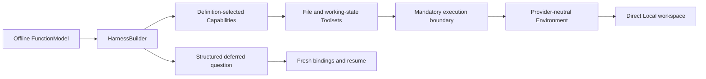

# Local Agent Harness Example

This standalone example runs the public Agent Harness entirely offline. A deterministic Pydantic AI `FunctionModel` calls real first-party tools over a Direct Local Environment, records embedded working state, suspends for structured user input, and resumes through a newly built executable with fresh run bindings.

The example demonstrates this path:



`HarnessBuilder` installs the mandatory `ToolExecutionBoundaryCapability` and innermost `MessageIntegrityFilterCapability`. Application definitions must not add another result boundary. Optional Content and ColdStart filters remain definition-selected and are not needed by this deterministic demo.

## Run It

From the repository root, run the complete examples gate:

```bash
make examples-check-all
```

Or run only this project:

```bash
cd examples/local-agent
uv sync --locked
uv run local-agent-example
uv run pytest
```

The default command uses a temporary workspace. Retain the generated plan by selecting a caller-owned directory:

```bash
uv run local-agent-example --workspace ./local-agent-workspace
```

No model API key or network access is required after dependencies are installed.

## What the Demo Proves

1. A definition selects `DynamicEnvironmentCapability`, `WorkingStateCapability`, and `UserInteractionCapability`.
2. A fresh Direct Local provider binding publishes one caller-owned workspace through the provider-neutral Environment topology.
3. A fresh `InvocationPolicyCapability` authorizes the managed local file call for that run.
4. The offline model calls `write`, `task_create`, and `note`; the file call crosses the mandatory execution boundary before reaching Direct Local.
5. `ask_user_question` produces a native deferred suspension and a portable `HarnessState` candidate.
6. The application rebuilds the executable, recreates current Environment and policy bindings, correlates the answer with `DeferredToolResume`, and completes a second Harness run.

The allow-all evaluator in this example is suitable only for its isolated teaching workspace. A real Host evaluates current identity, tool metadata, normalized arguments, and resources before authorizing each managed invocation.

See the [Agent Harness user guide](../../docs/agent-harness/index.md) and the normative [Agent Harness specification](../../spec/agent-harness/README.md) for the complete contracts.
