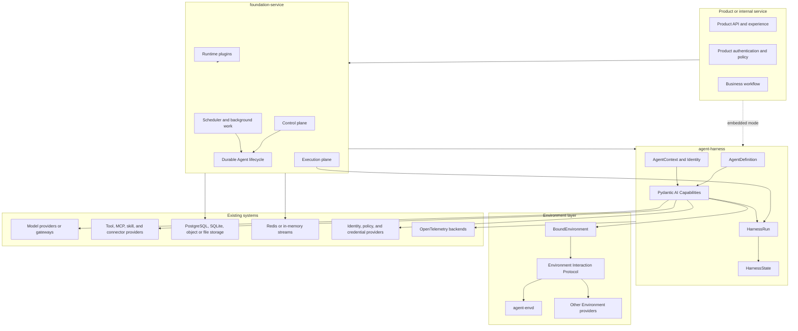
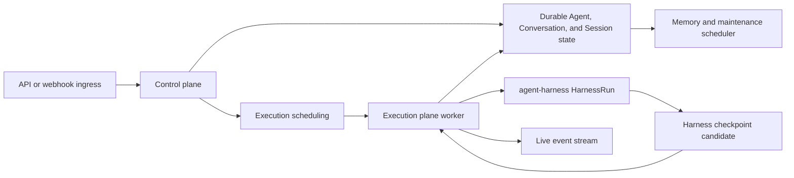
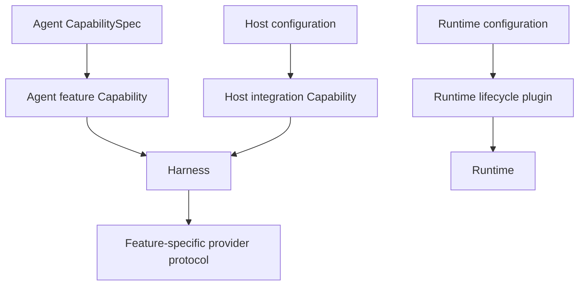
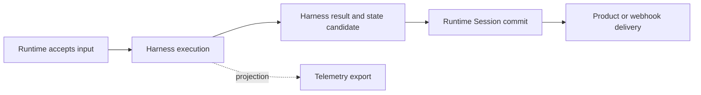

# Open-Source Agent Platform Overview

## Platform Definition

The Agent Platform is an open-source foundation for building an Agent product or operating Agents as internal services. It provides reusable execution, Environment, and hosting semantics while leaving product experience, business workflows, and infrastructure vendors to adopters.

The first platform boundary consists of:

- `agent-harness`: the Pydantic AI 2-based Harness, distributed as `converge-agent-harness`;
- `agent-envd`: an Environment Interaction Protocol provider for Environment-local operations and state, packaged as `converge-agent-envd`;
- `foundation-service`: the optional hosted control and execution service, distributed as `converge-foundation-service`.

An application can embed the Harness directly, use the complete service, or replace providers through documented Capability and protocol boundaries.

## Architecture

The dependency direction is one-way: Runtime hosts the Harness; the Harness uses Environment and provider protocols; provider implementations do not import Runtime lifecycle types.

## Component Responsibilities

| Component            | Owns                                                                                                                                                                                                      | Does not own                                                                                 |
| -------------------- | --------------------------------------------------------------------------------------------------------------------------------------------------------------------------------------------------------- | -------------------------------------------------------------------------------------------- |
| `agent-harness`      | Agent definition materialization, Capability composition, Agent Identity propagation, process-local execution, multi-Environment access, context state, delegation, events, usage, and continuation state | Durable Session lifecycle, queues, worker leases, product authentication, billing settlement |
| `agent-envd`         | Environment-local files, processes, handles, recoverable state, generation, protocol enforcement, and provider receipts                                                                                   | Agent loop, Conversation, Session, model policy, product workflow                            |
| `foundation-service` | Hosted Agent revisions, Conversation and Session lifecycle, accepted inputs, scheduling, worker coordination, durable state, webhooks, memory jobs, usage ledger, and service APIs                        | Pydantic Agent-loop semantics or provider-native Environment state                           |
| Product              | Caller authentication, user experience, business policy, workflow, and final delivery                                                                                                                     | Harness internals and provider implementation details                                        |

## Harness Foundation

The Harness is built directly on Pydantic AI 2:

- every Agent-affecting component is an `AbstractCapability[AgentContext]`;
- Toolsets are contributed by Capabilities rather than forming a second plugin system;
- `AgentContext` is the single run dependency, contains the multi-Environment facade, and coordinates Capability-namespaced recoverable state;
- Pydantic AI owns the Agent loop, messages, models, outputs, Toolsets, deferred tools, events, usage, and Capability lifecycle;
- `HarnessRun` represents one process-local execution;
- `HarnessState` is portable continuation state, not a durable Session snapshot.

Capability packages provide Agent features and host integrations. Pydantic `CapabilitySpec` and `from_spec` are the configuration mechanism. Runtime-selected SessionStore, policy, credential, Environment, and telemetry integrations enter as ordinary Capabilities with typed collaborators.

The complete Harness design is indexed in [agent-harness/README.md](agent-harness/README.md).

## Environment Foundation

`BoundEnvironment` gives tools a run- and Identity-bound multi-Environment facade over EIP operations. One binding is the simple case. A provider owns canonical resources, native authorization, state generation, handles, cursors, process trees, and side-effect evidence.

`agent-envd` is one general provider for hosting Environment state. Local, container, relay, or third-party providers can implement the same semantics. Sandbox selection is a provider or Runtime plugin decision, not a hard-coded Harness dependency.

The recoverable portion of every selected Environment binding is exported as the Environment Capability's versioned state entry. It is saved with the other `AgentContextState` entries and Pydantic `message_history` in `HarnessState`. Native files and processes remain provider-owned; saved references restore no authority and are revalidated against fresh bindings.

## Runtime Foundation

`foundation-service` adds durable hosting without replacing Harness execution semantics.

The control plane accepts work, resolves an immutable Agent revision, creates durable lifecycle records, and schedules execution. The execution plane binds Identity, Environment, storage, policy, credentials, and observability Capabilities, then maps one worker execution to one `HarnessRun`.

Runtime checkpointing wraps the complete `HarnessState` with resolved Agent, launch, delivery, and recovery state. Runtime owns checkpoint selection and fencing. A process-local Harness result becomes durable only after Runtime commits its own state transition.

External webhook handling uses a pre-Agent processing pipeline before accepted input becomes `RunInput`. Memory extraction and consolidation run as scheduled Runtime work. Raw usage observations enter a durable usage ledger; pricing and cost policy remain Runtime concerns.

## Deployment Profiles

The same domain contracts support three profiles.

| Profile             | Persistence and coordination                                                                          | Execution                                        |
| ------------------- | ----------------------------------------------------------------------------------------------------- | ------------------------------------------------ |
| Embedded            | Application-selected memory, file, or database adapters                                               | Harness inside the product process               |
| Minimal service     | SQLite durable state and in-memory event/queue adapters                                               | Control and execution in one deployment          |
| Distributed service | PostgreSQL durable authority, Redis coordination/live streams, optional shared file or object storage | Separately scalable control and execution planes |

Redis, in-memory streams, and live SSE projections are coordination or delivery mechanisms rather than independent durable authorities. NFS or object storage is optional and selected through state and Environment adapters.

## Agent Identity and Revision

The platform distinguishes:

- caller or actor identity;
- stable Agent workload Identity;
- immutable resolved Agent revision;
- root or child Agent instance;
- process-local Harness run;
- Runtime Session and attempt;
- Environment identity and generation;
- credential binding and invocation grant.

An Agent revision binds the resolved definition and Capability artifacts but stores no plaintext credential. A run receives a trusted Agent instance binding. Tools, shell operations, hosted delegation, policy, credentials, events, and usage derive their Identity from that binding rather than from prompts or environment variables.

This relationship supports EC2-style workload identity: external systems bind policy or short-lived credentials to the Agent Identity and current invocation context, while revisions and execution processes can change independently.

## Extension Model

| Extension                   | Boundary                                                                                                       |
| --------------------------- | -------------------------------------------------------------------------------------------------------------- |
| Agent feature Capability    | Instructions, models, Toolsets, hooks, and Capability state                                                    |
| Host integration Capability | Environment, SessionStore, policy, credentials, telemetry, or another run collaborator                         |
| Runtime plugin              | Ingress, storage, scheduler, lifecycle projection, connector, or hosted policy behavior outside the Agent loop |
| Provider adapter            | Model, Environment, MCP, skill registry, memory, secret, telemetry, or external operation                      |

Installed Python Capability plugins are trusted in-process code. Untrusted or separately governed behavior stays behind a tool or provider protocol. The first phase has no universal remote-plugin RPC system.

Enterprise packages can add SSO, audit retention, centralized policy, advanced connectors, and fine-grained skill/tool control through the same open-source boundaries.

## Observability and Cost

Pydantic AI's OpenTelemetry `Instrumentation` Capability owns Agent, model, and tool spans. Harness Capabilities add spans only for Harness-owned context, state, control, Environment, and delegation work. Runtime adds durable lifecycle, queue, scheduler, and delivery spans.

The default telemetry model is vendor-neutral OTel. Vendor packages enrich the same spans; a Langfuse profile propagates its session, user, tag, metadata, version, environment, and observation-type fields without introducing duplicate model/tool tracing.

Harness usage values are process-local observations. Runtime owns aggregation, deduplication, provider reconciliation, pricing versions, budgets, and cost records.

## Completion Boundaries

Input acceptance, Harness completion, Runtime Session commit, external delivery, telemetry export, and usage settlement are independent facts. No downstream projection becomes an execution authority merely because it observes a completion event.

## Design Principles

01. Reuse Pydantic AI, OpenTelemetry, databases, streams, and provider ecosystems instead of rebuilding them.
02. Keep one authority for every durable fact.
03. Use Capability as the only Agent component and plugin execution model.
04. Keep `AgentContext` cohesive and stateful without turning it into a service locator.
05. Keep Runtime durability outside process-local Harness state.
06. Bind Identity at the host boundary and propagate it through every side-effect path.
07. Enforce Environment authority again at the provider.
08. Make optional integrations explicit packages rather than base dependencies.
09. Use the same contracts in embedded, minimal, distributed, cloud, and private deployments.
10. Add enterprise behavior through extensions, not forks of core semantics.

## Specification Set

| Area                                  | Document                                                                                     |
| ------------------------------------- | -------------------------------------------------------------------------------------------- |
| Repository content and workflow model | [repository-model.md](repository-model.md)                                                   |
| Harness overview and catalog          | [agent-harness/README.md](agent-harness/README.md)                                           |
| Harness architecture                  | [agent-harness/00-overview.md](agent-harness/00-overview.md)                                 |
| Pydantic AI foundation                | [agent-harness/01-pydantic-ai-foundation.md](agent-harness/01-pydantic-ai-foundation.md)     |
| Capability and AgentContext model     | [agent-harness/04-capability-model.md](agent-harness/04-capability-model.md)                 |
| Plugin system                         | [agent-harness/05-plugin-system.md](agent-harness/05-plugin-system.md)                       |
| Public API and packaging              | [agent-harness/14-public-api-and-packaging.md](agent-harness/14-public-api-and-packaging.md) |
