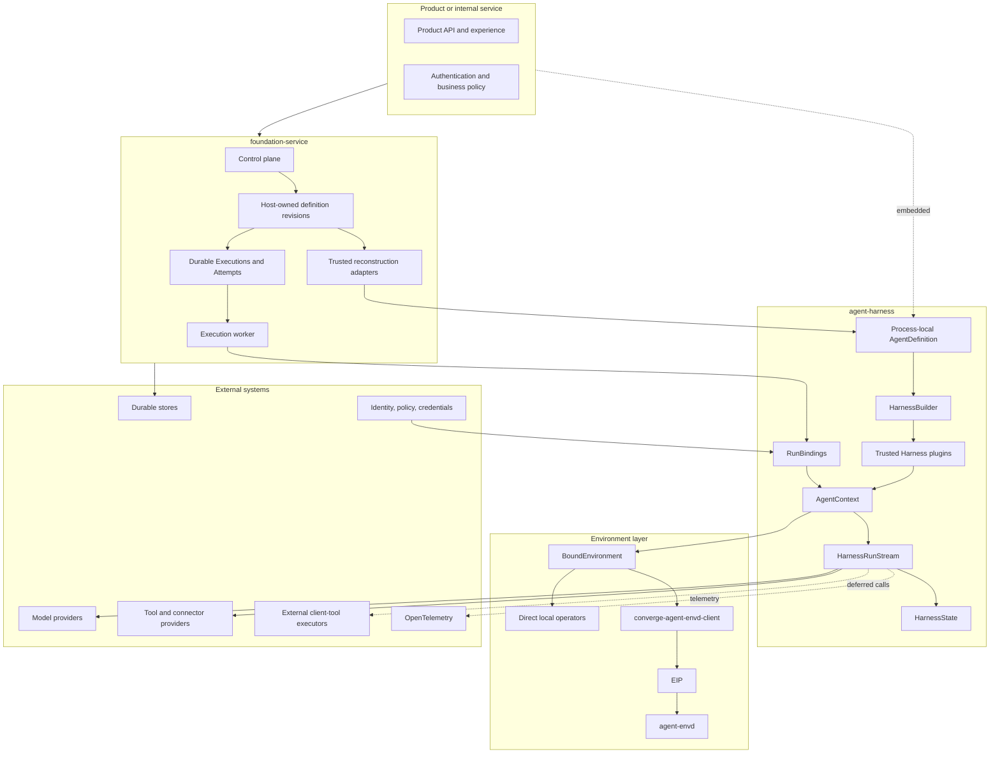
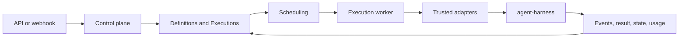
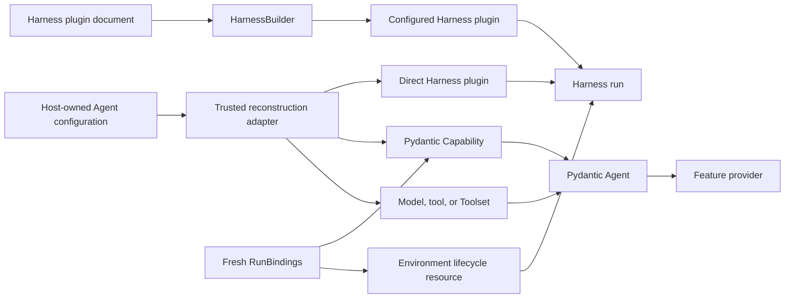
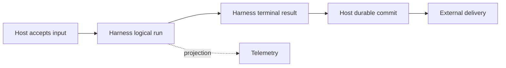

# Open-Source Agent Platform Overview

## Platform Definition

Agent Foundation is an open-source foundation for embedding Agents or hosting them as durable services. It provides reusable process-local execution, Environment, protocol, and hosting semantics while leaving product experience, business workflow, and infrastructure vendors to adopters.

The platform consists of:

- `agent-harness`, distributed as `converge-agent-harness`, for code-first Pydantic AI execution;
- `agent-envd`, distributed as `converge-agent-envd`, for Environment Interaction Protocol operations;
- `converge-agent-envd-client`, the generated low-level Python EIP client;
- `foundation-service`, distributed as `converge-foundation-service`, for optional durable hosting.

An application can embed the Harness directly, use Foundation Service, or replace providers through documented typed and protocol boundaries.

## Architecture

Dependency direction is one-way: Hosts embed the Harness; the Harness uses provider and Environment boundaries; providers do not import Host lifecycle types.

## Component Responsibilities

| Component            | Owns                                                                                                                                                       | Does not own                                                                                              |
| -------------------- | ---------------------------------------------------------------------------------------------------------------------------------------------------------- | --------------------------------------------------------------------------------------------------------- |
| `agent-harness`      | Process-local Agent construction, narrow plugin configuration/loading, trusted plugins, run context, recovery, execution, results, and continuation state  | Durable Agent authoring schemas, Presets, package installation/trust, worker lifecycle, delivery, billing |
| `agent-envd-client`  | Generated EIP control/data models, codecs, stubs, async file transfer, and bounded transport/session runtime                                               | Harness routing, product-user authorization, provider provisioning, Host lifecycle                        |
| `agent-envd`         | Client-neutral EIP Environment hosting, raw file transfer, operations, receipts, retained output, daemon generation, and native command containment        | Agent loop, browser/product authentication, arbitrary URL fetch, durable execution, model policy          |
| `foundation-service` | Host-owned definition/Presets/revisions, reconstruction locks, Executions/Attempts, client tools, APIs, events, usage records, and optional web projection | Pydantic Agent loop, Python object serialization, client-side effects, provider-native state meaning      |
| Product              | Caller authentication, business policy, user experience, and final delivery                                                                                | Harness internals and provider implementation                                                             |

## Harness Foundation

The Harness is built directly on Pydantic AI 2:

- `AgentDefinition` is an immutable process-local Python value containing native `AgentSpec`, one build-time explicit or schema-derived output contract, a Model/model name, top-level Capabilities, plugins, and recovery configuration;
- Capability is the only top-level feature-behavior plane; each feature Capability owns its tools, Toolsets, instructions, settings, and hooks;
- `HarnessBuilder` resolves an explicit or disabled-by-default ambient plugin Build Context, creates fresh configured instances, binds all trusted plugins, authorizes custom Capability types, and calls `Agent.from_spec()` once;
- `RunBindings` supplies fresh Agent instance, Environment, optional `ModelRunBinding`, run Capabilities, and metadata;
- one logical Harness run owns one context, Environment, plugin graph, state coordinator, usage accumulator, and public run ID;
- bounded model recovery can start several Pydantic inner attempts with unique inner run IDs inside that logical run;
- `HarnessState` carries public messages, detached Capability JSON namespaces, and optional portable Environment backend data; desired topology, provider incarnation envelope, and launch payload remain Host-owned;
- Pydantic AI owns native Model profiles, transport/output retries, provider-suspended continuation, deferred external calls/approvals, Toolsets, messages, events, and usage.

Harness middleware plugins are trusted concrete objects, and the Harness does not compile serialized Agent definitions. It owns a narrow versioned preferred YAML or supported JSON plugin document and Build Context that may, when explicitly enabled, select `converge_agent_harness.plugins` factories and append fresh concrete plugins during each definition build. `converge_agent_harness.environments` remains a caller-selected catalog because Environment topology and lifecycle are run-scoped. A Host owns serializable Agent schemas, artifact locks, package trust, and durable execution; package presence and Harness import alone never enable behavior or supply an arbitrary import target.

The complete design is indexed in [agent-harness/README.md](agent-harness/README.md).

## Recovery Boundaries

| Concern                             | Owner                                      |
| ----------------------------------- | ------------------------------------------ |
| Provider-suspended continuation     | Pydantic AI                                |
| Provider transport retry            | Provider/client and Pydantic `RetryConfig` |
| Exact provider-history repair       | Harness `SelfHealingModel`                 |
| Interrupted model semantic attempts | Harness run coordinator                    |
| Worker crash and durable recovery   | Host                                       |
| External side-effect reconciliation | Provider and Host                          |

Recovery never converts missing evidence into rollback or exactly-once success. Interrupted tool history records that the operation may have partially or fully completed and directs the next model to inspect state before retrying.

## Environment Foundation

Environment is a Harness-owned run lifecycle resource, not a Capability. `BoundEnvironment` gives trusted code and optional model-facing Capabilities a stable run- and Identity-bound facade over provider-neutral file, shell, process, and port operations. Its paired Host-retained controller activates after initial portable-state restore and supports atomic add, refresh, and removal throughout the active logical run. Direct local and EIP-backed implementations are first-class peers.

The Harness adapts EIP through `converge-agent-envd-client`; other trusted consumers such as product file gateways can use that client independently. `agent-envd` implements JSON-RPC control plus raw bidirectional file transfer and owns daemon-generation resources, session-scoped transfer handles, receipts, cursors, output retention, and command containment. Product/browser authentication stays at the gateway, and the envd key never reaches the browser. The Host selects providers and desired topology and materializes trusted process-local bindings. The Harness imports no vendor provisioning API, and Foundation Service does not persist a generic Sandbox resource.

Provider-defined portable backend data can enter only the explicit `HarnessState.environment_state` field after fresh bindings are selected. Provider resource-incarnation evidence and optional launch/reattachment payload remain in a separate encrypted Host envelope. Live clients, sockets, credentials, process handles, readiness, controllers, and provider authority do not become Harness state. Optional `EnvironmentToolsCapability` contributes stable tools and dynamic model context but owns neither lifecycle nor state.

## Hosted Service Foundation

Foundation Service adds durability without changing Harness execution semantics:

Foundation definitions are Host-owned serializable documents, not Harness `AgentDefinition` wire values. A worker verifies exact dependency/artifact locks, reconstructs native Pydantic/Harness objects, resolves operator-approved Environment providers, materializes current desired topology from encrypted launch-envelope entries, durably advances an unrepresented replacement resource's binding/topology incarnation revisions, and supplies fresh `RunBindings` to the same public API as an embedded application. The worker retains the paired Environment controller only for that active logical run.

One durable Foundation Attempt starts one logical Harness run. Internal Harness model attempts are not durable Attempt generations. Authorized desired Environment topology can advance during that run and is reconciled through the retained controller with separate effective publication. Worker or lease loss creates a new fenced Attempt, fresh provider bindings, and a fresh Harness run from authoritative selected Host and Harness state.

Client-side tools use native Pydantic deferred values. Foundation durably commits pending calls and approvals, authenticates external feedback, and starts a later run with fresh bindings. Asynchronous children use independent Executions and result-delivery ledgers rather than Pydantic deferred spawn calls.

The complete hosted design is indexed in [foundation-service/README.md](foundation-service/README.md).

## Deployment Profiles

| Profile             | Persistence and coordination                        | Execution                                   |
| ------------------- | --------------------------------------------------- | ------------------------------------------- |
| Embedded            | Application-selected                                | Harness in product process                  |
| Minimal service     | SQLite and in-memory coordination                   | Control and execution together              |
| Distributed service | PostgreSQL durable authority and Redis coordination | Separately scalable control/execution roles |

Coordination streams and queues do not become durable lifecycle authority.

## Identity and Version Boundaries

The platform distinguishes:

- caller/actor identity;
- stable Agent workload Identity and Agent instance;
- Host-owned immutable definition revision and dependency locks;
- process-local Harness run and inner Pydantic attempt;
- Host durable Execution and Attempt;
- Environment identity and generation;
- credential binding and invocation grant.

A Host definition revision contains only serializable Host data and exact locks. It contains no plugin/Capability class, native Model, Toolset, output Python type, callable, client, plaintext credential, or process-local object. An execution reconstructs those values without mutating the selected revision.

## Extension Model

Installed plugins and native objects are trusted in-process code. Harness plugin and Environment package presence is only availability; an operator explicitly enables or selects the relevant key before import/use. Factory-produced Harness plugins and directly constructed plugins enter the same concrete composition path. Untrusted or independently governed behavior belongs behind feature-specific protocols. The core defines no universal remote-plugin or package-installation system.

## Observability and Cost

Pydantic AI instrumentation owns Agent/model/tool spans. Harness features add spans only for Harness-owned context, plugins, recovery, state, Environment, and delegation work. Foundation adds durable lifecycle, queue, child, client-delivery, and connector spans.

`RunUsage` is a process-local accumulator. Hosts own deduplication, cross-run aggregation, pricing revisions, durable usage records, budgets, billing, and payment.

## Completion Boundaries

Acceptance, inner attempt completion, Harness terminal delivery, Host durable commit, usage recording, telemetry export, external delivery, billing, and payment are independent facts.

## Design Principles

01. Reuse Pydantic AI, OpenTelemetry, databases, streams, and provider ecosystems.
02. Keep one authority for every durable fact.
03. Preserve native Python composition inside the execution process.
04. Keep durable Host schemas outside the Harness library.
05. Bind Identity and current authority freshly at the Host boundary.
06. Keep process-local continuation separate from durable lifecycle state.
07. Preserve unknown side effects and require provider evidence for safe replay.
08. Use optional typed packages and protocols instead of a universal extension framework.
09. Use the same Harness API in embedded and hosted modes.
10. Add enterprise behavior through the same boundaries rather than forks.

## Specification Set

| Area                                  | Document                                                                                                               |
| ------------------------------------- | ---------------------------------------------------------------------------------------------------------------------- |
| Repository content and workflow model | [repository-model.md](repository-model.md)                                                                             |
| Harness catalog                       | [agent-harness/README.md](agent-harness/README.md)                                                                     |
| Harness architecture                  | [agent-harness/00-overview.md](agent-harness/00-overview.md)                                                           |
| Harness definition/build              | [agent-harness/03-agent-definition-and-build.md](agent-harness/03-agent-definition-and-build.md)                       |
| Harness plugins                       | [agent-harness/05-plugin-system.md](agent-harness/05-plugin-system.md)                                                 |
| Harness execution and recovery        | [agent-harness/06-execution-context-and-lifecycle.md](agent-harness/06-execution-context-and-lifecycle.md)             |
| Harness state                         | [agent-harness/10-snapshot-and-resume.md](agent-harness/10-snapshot-and-resume.md)                                     |
| Harness public API                    | [agent-harness/14-public-api-and-packaging.md](agent-harness/14-public-api-and-packaging.md)                           |
| Harness model/output boundary         | [agent-harness/16-input-model-and-output.md](agent-harness/16-input-model-and-output.md)                               |
| agent-envd catalog                    | [agent-envd/README.md](agent-envd/README.md)                                                                           |
| EIP architecture and protocol         | [agent-envd/00-overview.md](agent-envd/00-overview.md), [agent-envd/02-eip-protocol.md](agent-envd/02-eip-protocol.md) |
| Foundation Service catalog            | [foundation-service/README.md](foundation-service/README.md)                                                           |
| Hosted definitions and Presets        | [foundation-service/01-agent-definitions-and-presets.md](foundation-service/01-agent-definitions-and-presets.md)       |
| Hosted client-side tools              | [foundation-service/02-client-side-tools.md](foundation-service/02-client-side-tools.md)                               |
| Durable execution lifecycle           | [foundation-service/03-execution-lifecycle.md](foundation-service/03-execution-lifecycle.md)                           |
| Foundation Client API and events      | [foundation-service/04-execution-api-and-events.md](foundation-service/04-execution-api-and-events.md)                 |
| Usage accounting                      | [foundation-service/05-usage-accounting.md](foundation-service/05-usage-accounting.md)                                 |
| Environment provider integrations     | [foundation-service/06-environment-providers.md](foundation-service/06-environment-providers.md)                       |
