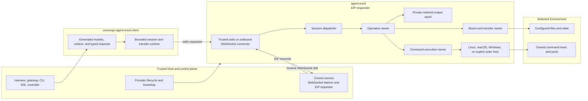
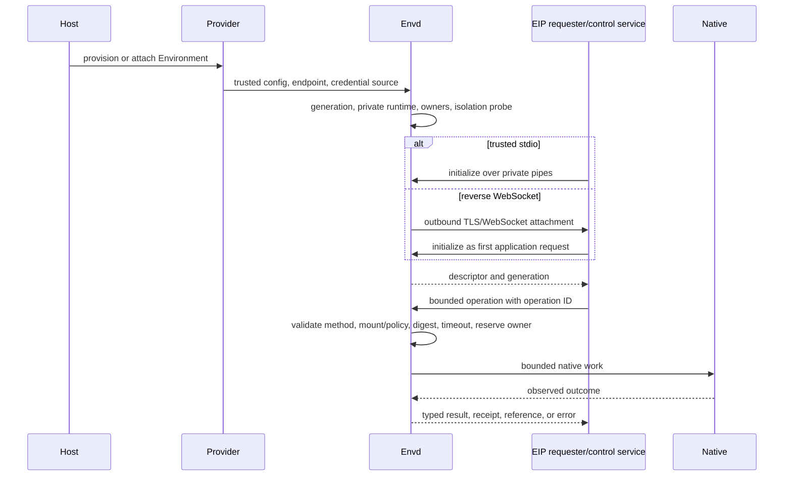

# agent-envd Overview

## Design Position

`agent-envd` is a first-class, client-neutral Environment host and data-plane daemon. One daemon serves one user and one Environment for one process generation. It keeps native filesystem operations, file transfer, command/process ownership, port observation, retained output, and enforcement beside the governed resources and exposes them through the versioned Environment Interaction Protocol (EIP).

The Harness is one EIP requester, not the reason those resources exist. Product gateways, CLIs, IDEs, provider controllers, and trusted background services can use the same generated low-level client. Envd never needs to know whether output becomes model input, a browser preview, an artifact, or another backend operation.

Envd is optional for Harness Environments. Direct Local remains first-class when an embedding process intentionally grants local roots and commands. Docker, E2B, remote, and optional local-daemon providers use EIP when they need a daemon boundary. Both satisfy the provider-neutral contracts in [Harness Environment Integration](../agent-harness/08-environment-integration.md).

Envd does not provision a container or VM. A provider creates or attaches the native Environment and supplies trusted daemon bootstrap. Envd governs operations inside it. In required mode it contains every command with a native Linux, macOS, or Windows backend. In explicit disabled mode an outer sandbox owns containment while all other envd controls remain active.

## Architecture

Carrier direction and EIP role are separate. With reverse WebSocket, envd initiates the outbound `wss` connection but remains the responder; the control service remains the requester. The same EIP JSON-RPC and binary frame contract runs over trusted stdio and reverse WebSocket. Envd exposes no inbound network listener or HTTP file/control routes.

## Boundaries

| Concern                                                                                       | Owner                                                                                  | Contract                                            |
| --------------------------------------------------------------------------------------------- | -------------------------------------------------------------------------------------- | --------------------------------------------------- |
| Provider selection, provisioning, attachment, suspension, destruction, and vendor credentials | Host provider adapter                                                                  | Outside EIP                                         |
| Product-user authentication, tenant routing, and browser policy                               | Host/product control plane                                                             | Never delegated through EIP params                  |
| Harness binding/routing and provider-neutral mapping                                          | Harness and Host                                                                       | Selects one trusted Environment binding             |
| Canonical IDL, generated wire surfaces, and low-level Python client                           | [Protocol Source, Client, and Generation](08-protocol-source-client-and-generation.md) | One reusable daemon/client realization              |
| EIP control, operation replay, transfers, receipts, errors, and method availability           | [EIP Protocol](02-eip-protocol.md)                                                     | Transport-neutral contract                          |
| Stdio/reverse-WebSocket framing, attachment authentication, sessions, and reconnect           | [Transports and Sessions](03-transports-and-sessions.md)                               | Carrier contract without method divergence          |
| Trusted config, generation, owners, readiness, and drain                                      | [Daemon Lifecycle](01-daemon-lifecycle-and-configuration.md)                           | One daemon lifecycle                                |
| Configured paths, files, search, mutations, transfers, and ports                              | [Resource Operations](04-resource-operations.md)                                       | Native resource enforcement                         |
| Foreground/background commands and process lifecycle                                          | [Command and Process Execution](05-command-and-process-execution.md)                   | One command-tree owner                              |
| Output bounds, spool, references, offsets, release, and gaps                                  | [Output Retention](06-output-retention.md)                                             | Producer-side safety                                |
| Required Linux/macOS/Windows command containment                                              | [Execution Isolation](07-execution-isolation.md)                                       | Fail-closed native isolation or explicit outer Host |
| Durable Agent attempt/completion                                                              | Host                                                                                   | Never inferred from EIP evidence                    |

`agent-envd` is not an Agent runtime, model gateway, scheduler, tool registry, durable execution store, provider marketplace, product authorization engine, browser backend, or provider resource manager.

## Major Components

### Daemon generation

The daemon validates trusted configuration, creates a fresh unpredictable generation and private runtime subtree, initializes bounded owners, probes required platform isolation, and only then admits a carrier. Configuration is immutable for the generation. Restart fences all volatile selectors and evidence.

### Generated protocol and client

One canonical Protobuf descriptor generates Rust daemon models/dispatch and Python models/codecs/typed requests plus inspection artifacts. JSON-RPC remains the control serialization; Protobuf is an IDL, not a mandatory wire transport. A small handwritten client runtime owns correlation, stdio/reverse-WebSocket sessions, backpressure, and high-level file transfers.

### Session and method dispatch

Every carrier creates a fresh session whose first request is `initialize`. Initialization verifies expected Environment identity, negotiates EIP version, checks exact `required_methods`, and returns configured mounts, optional root mount, exact `available_methods`, client-actionable limits, exact optional execution-feature support, generation, and isolation posture.

A session owns only its reader/writer handles and attachments. Accepted operations, processes, receipts, and retained output belong to daemon generation owners and can survive reverse-WebSocket reconnect within that generation.

### Operation owner

One bounded operation record owns admission, cancellation, method and semantic digest, owner execution state, terminal result/failure, and receipt. Operation ID is the sole replay/cancellation/receipt identity. Repeating the same ID and method/digest reports in-progress or replays retained terminal evidence; a different request conflicts. Losing a response waiter cannot erase accepted mutation evidence.

### Resource and transfer owner

Filesystem requests use configured logical mounts and `EIPPath`, never caller-native roots. An operator can configure broad roots deliberately; no session mode synthesizes whole-filesystem authority.

Text and structured operations are incrementally bounded. Raw file bytes use one session-scoped reader or destination-local staged writer over the binary data plane. Reader success is accepted only by `file.close_reader` after full consumption and digest comparison; readers do not send `END_ACK`. Writer `END_ACK` seals upload, while only `file.commit_writer` can publish a verified complete candidate.

### Command execution and isolation

One execution manager owns every foreground and background command tree. Structured executable selection distinguishes trusted bare names from configured-mount `EIPPath` values. Both `shell.exec` and `process.start` cross the same gated prepare/owner-commit/release/exec-acknowledgement pipeline.

Required isolation is a supported product contract on all three OS families:

- Linux: bubblewrap namespaces and PID 1 supervision;
- macOS: deny-default Seatbelt with honest residual-confined cleanup semantics;
- Windows: AppContainer/restricted capabilities plus capability-specific ACL/network projection for containment, and a non-breakaway Job Object for whole-tree ownership.

A Job Object alone is never treated as a sandbox. Every backend passes a production probe before carrier admission. Explicit `disabled` mode delegates containment to an outer sandbox without disabling envd authorization, ownership, output, or cleanup controls.

### Output retention

Every producer applies finite output policy while reading bytes. Retained output appends to generation-private spool files outside mounts and command grants; only bounded previews remain in memory. References are generation-scoped and reads use explicit caller-owned offsets with `next_offset`. There are no output cursor objects. Gaps, truncation, expiry, and dropped bytes remain explicit.

## Provider Profiles

| Profile               | Provider responsibility                                                                          | Envd posture                                                  |
| --------------------- | ------------------------------------------------------------------------------------------------ | ------------------------------------------------------------- |
| Optional local daemon | Launch envd with explicit mounts, private stdio or control-service binding, and isolation policy | Required native isolation by default                          |
| Docker/OCI            | Create container, bootstrap envd, and provide private stdio or outbound routing                  | Required or explicit disabled when container owns containment |
| E2B/remote sandbox    | Provision/resume vendor Environment and expose trusted control-service attachment                | Often explicit disabled when vendor sandbox owns containment  |
| Remote machine        | Install/launch compatible envd, issue short-lived attachment credentials, validate identity      | Required unless another documented boundary owns containment  |

Provider lifecycle credentials never enter envd. Reverse-WebSocket attachment credentials are distinct short-lived values issued for the specific control-service binding and never reach EIP payloads or commands.

## End-to-End Flow

A file transfer inserts a typed attachment between open and close/commit. Reverse-WebSocket carrier loss destroys only session transfers. Envd reconnects with jitter and waits for a fresh initialization; it never automatically replays an EIP operation or resumes a file stream.

## Identity and Lifetime Boundaries

Four lifetimes remain separate:

1. **Provider lifecycle state** belongs to the Host adapter and can identify a container, E2B environment, local daemon, remote machine, or control-service binding.
2. **Native Environment state** consists of configured files and provider resources and can outlive envd.
3. **Daemon-generation state** includes sessions, operations/receipts, process handles, output references, spool data, and cleanup evidence. Transfers have a narrower session lifetime. All volatile state ends at restart.
4. **Host execution state** owns durable Agent attempts, checkpoints, and outcomes and is never committed by envd.

Native facts also remain distinct: operation accepted, OS dispatch crossed, requested exec confirmed, initial command terminal, command tree cleaned, EIP response observed, and Host execution committed. A receipt records only named envd-observed facts.

## Security Posture

Carrier trust, EIP authorization, mount policy, process ownership, output bounds, and child containment are separate:

- stdio relies on private provider-created pipes and child ownership;
- reverse WebSocket requires outbound `wss`, certificate/hostname verification, no redirects, mandatory subprotocol, and short-lived refreshable attachment credentials;
- product/browser users authenticate to the control plane, never directly to envd;
- configured mounts and exact method availability bound each resource operation;
- required isolation adds native child containment; disabled delegates only that layer;
- daemon credentials, private spool/control roots, and ambient service credentials never reach payloads.

## Failure Model

| Boundary                                                         | Outcome                                                     |
| ---------------------------------------------------------------- | ----------------------------------------------------------- |
| Config, fresh runtime, or required isolation probe fails         | No local readiness or carrier admission                     |
| TLS/subprotocol or nonrefreshable attachment authorization fails | Generation-fatal drain; no insecure retry                   |
| Transient reverse-WebSocket connection fails                     | Capped jittered reconnect; generation state remains         |
| Initialization identity/version/required-method check fails      | No initialized session or resource dispatch                 |
| Validation, policy, path, timeout, or capacity fails             | Typed pre-dispatch error                                    |
| Carrier fails before acceptance                                  | Retry only with proven non-dispatch                         |
| Carrier fails after possible mutation acceptance                 | Reconcile the same operation ID before new mutation         |
| Reader carrier ends before close acceptance                      | No successful read completion                               |
| Writer carrier ends before commit handoff                        | Candidate abort/cleanup; destination unchanged by envd      |
| Carrier fails during/after commit                                | Receipt or unknown outcome; never automatic retry           |
| Output exceeds policy                                            | Bounded fail, truncate, or retained reference               |
| Cleanup cannot be proven                                         | Conservative ownership and explicit cleanup failure         |
| Daemon drains                                                    | Admission stops before process and generation-state cleanup |

## Trade-offs

### Outbound reverse WebSocket

A reverse channel adds credential refresh, reconnect, liveness, and a control-service listener. It avoids requiring controlled Linux, macOS, or Windows Environments to accept inbound connections and preserves one duplex control/data carrier.

### Three native isolation backends

Linux, macOS, and Windows containment materially increase platform engineering and release testing. They are necessary for correct direct-machine control. Outer VM/sandbox providers can explicitly disable the inner layer; workload size never causes implicit weakening.

### Compact operation and output identities

One operation ID removes parallel idempotency and receipt-selector stores. Explicit output offsets remove cursor lifecycle. The daemon still retains bounded replay evidence and private spool state because disconnect-resilient mutation certainty and output are intrinsic to the daemon boundary.

## Invariants

01. Envd is a client-neutral Environment host, not a provider lifecycle or Agent runtime.
02. The Harness reaches daemon-backed resources through its provider-neutral Environment adapter and generated low-level client; Direct Local remains first-class.
03. Trusted stdio and outbound reverse WebSocket carry one EIP contract; envd remains the responder even when it dials the network carrier.
04. Envd exposes no inbound EIP/HTTP/WebSocket/health listener.
05. Initialization publishes configured mounts, exact methods, actionable limits, exact execution-feature support, generation, and truthful isolation posture without granting authority.
06. Operation ID is the sole replay, cancellation, and receipt identity; response loss cannot erase accepted evidence.
07. One execution owner controls every command tree through cleanup, and required isolation fails closed on Linux, macOS, and Windows.
08. Windows containment requires AppContainer/restricted capabilities plus ACL/network projection; Job Object ownership is necessary but not sufficient.
09. Every producer, frame, queue, transfer, candidate, process, spool object, and record is bounded while created or consumed.
10. Reader close is the sole read acceptance; writer commit is the sole destination publication.
11. Carrier loss removes session transfers but never proves operation cancellation/non-dispatch or destroys generation-owned processes, receipts, or output.
12. One canonical IDL generates daemon/client wire surfaces and preserves reserved removed fields.
13. Provider credentials, attachment credentials, product identity, native roots, and model semantics never enter ordinary EIP methods.
