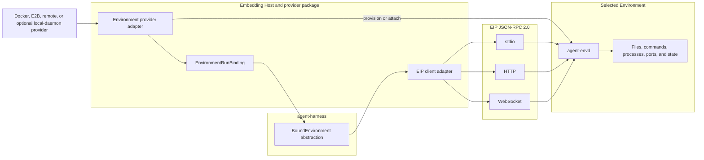
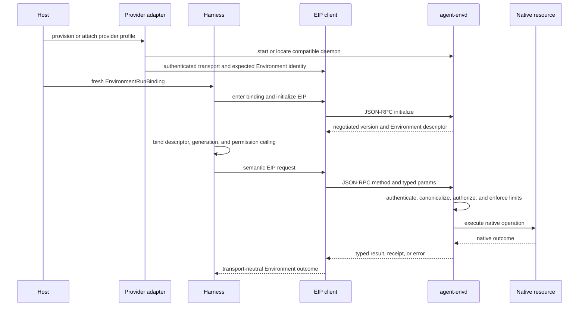

# agent-envd Overview

## Design Position

`agent-envd` is a first-class Environment data-plane daemon for sandboxed and remote execution. It implements one versioned Environment Interaction Protocol (EIP) over JSON-RPC 2.0 and keeps canonicalization, process control, retained output, and resource enforcement beside the governed resources without exposing vendor SDKs, native paths, process objects, or transport details.

It is not the mandatory implementation of every Harness Environment. The Harness provider-neutral surface also has first-class direct `LocalFileOperator` and `LocalShell` implementations. Docker, E2B, remote hosts, and other daemon-governed providers use an EIP backend; an embedding application may optionally use a local `agent-envd` when it wants the daemon boundary, but ordinary direct-local execution does not bootstrap one. Both paths meet the same semantic file, shell, process, port, state, and output-bound contracts exposed by [`BoundEnvironment`](../agent-harness/08-environment-integration.md).

The Foundation Service does not deploy, emulate, or persist a platform-owned Sandbox resource. It can select a local, Docker, E2B, or other provider adapter, but provider lifecycle and vendor credentials remain outside the Agent loop and outside EIP method payloads.



Only one transport is selected for one connection. The diagram shows equivalent choices, not simultaneous fan-out or automatic fallback.

## Boundaries

| Concern                                                        | Owner             | Contract                                                       |
| -------------------------------------------------------------- | ----------------- | -------------------------------------------------------------- |
| Daemon-governed profile and vendor selection                   | Host              | Selects Docker, E2B, remote, or optional local-daemon adapter  |
| Provision, attach, suspend, destroy, and vendor credentials    | Provider adapter  | Vendor-specific lifecycle outside EIP data-plane methods       |
| Run Identity, binding ceiling, and topology                    | Host and Harness  | Fresh `EnvironmentRunBinding` and `BoundEnvironment`           |
| Environment operation semantics                                | EIP               | One method, payload, capability, error, and lifecycle contract |
| Stdio, HTTP, and WebSocket framing and authentication          | Transport profile | Carries EIP JSON-RPC without changing method semantics         |
| Native paths, process trees, retained output, ports, and state | `agent-envd`      | Canonicalizes and enforces inside the selected Environment     |
| Durable Agent execution and completion                         | Host              | Never inferred from an EIP response or connection state        |

`agent-envd` is not an Agent runtime, scheduler, model gateway, tool registry, durable execution store, or provider marketplace. EIP does not own Presets, Agent definitions, model execution, client-side tool dispatch, delegation scheduling, product policy, or human-facing terminal UX.

## Provider Profiles

An EIP provider profile adapts lifecycle and connectivity while preserving the same daemon data plane.

| Profile               | Provider-adapter responsibility                                                                                        | `agent-envd` placement                                              |
| --------------------- | ---------------------------------------------------------------------------------------------------------------------- | ------------------------------------------------------------------- |
| Docker                | Create or attach a container, inject approved configuration, and expose one supported connection                       | Inside the target container or an equivalently scoped sidecar       |
| E2B                   | Use E2B APIs to create or resume an environment, bootstrap the compatible daemon, and establish an authenticated route | Inside the E2B environment                                          |
| Remote provider       | Map vendor lifecycle to the Host adapter and prove EIP conformance                                                     | Inside or immediately adjacent to the governed environment boundary |
| Optional local daemon | Start or attach a daemon under explicit local roots and process policy when the embedding Host requests this boundary  | Child process or local managed daemon                               |

Direct `LocalFileOperator` and `LocalShell` are defined by the Harness Environment contract and do not appear in this table because they do not speak EIP. They remain first-class rather than an EIP failure fallback.

The profile does not become visible to model-facing tools. An `EnvironmentDescriptor` reports negotiated capabilities and provider facts, while Host metadata can retain the provider identity for operations and audit. The Harness does not branch on `local`, `docker`, or `e2b` to implement file or process behavior.

Provider provisioning and EIP connection establishment are separate completion boundaries. A successfully created vendor environment is not usable until a compatible daemon connection is initialized and authorized. A successful EIP call does not commit vendor billing state or Host durable execution state.

A provider adapter can replace or reconnect a daemon only by producing a fresh binding or an authorized topology refresh. It cannot silently move a live handle to a different environment or generation. Automatic fallback between provider profiles is Host policy and is prohibited for an already dispatched mutating operation whose outcome is unknown.

## One EIP Contract

EIP has one versioned method catalog and one JSON payload schema for requests, results, notifications, and typed error data. Every supported transport carries standard JSON-RPC 2.0 envelopes using the same method names and payload meanings.

The shared contract includes:

- initialization and protocol-version negotiation;
- Environment identity, descriptor, generation, status, capabilities, mounts, shell profiles, and limits;
- semantic file, shell, process, port, and recoverable-state operations;
- request output budgets, binding-scoped aggregate retention budgets, explicit release/expiry, and bounded inline, cursor, retained-file, and truncated result dispositions;
- opaque handle, cursor, idempotency, deadline, and receipt semantics;
- typed errors, retryability hints, cancellation, and reconciliation;
- compatibility and capability negotiation.

A transport profile cannot rename methods, add authority fields to ordinary method payloads, change a successful result into a transport-only shape, or assign different side-effect semantics. Provider-specific bootstrap messages stay outside the EIP method catalog; after a connection is established, Environment operations remain EIP JSON-RPC.

### Output and Retention Budgets

```python
class OutputBudget(BaseModel):
    max_inline_bytes: int
    max_retained_bytes: int


class RetentionBudget(BaseModel):
    max_retained_total_bytes: int
    max_retained_objects: int


class OutputDisposition(BaseModel):
    kind: Literal["inline", "cursor", "file_reference", "truncated"]
    complete: bool
    captured_bytes: int
    dropped_bytes: int
    expires_at: datetime | None = None
    cursor: OpaqueCursor | None = None
    file_reference: OpaqueFileReference | None = None
```

These are protocol semantics, not serialized `HarnessToolMetadata` or `ToolOutputPolicy`. Every output-producing method receives an effective per-call budget no wider than negotiated daemon hard ceilings. Each authenticated binding also receives finite non-disableable aggregate `RetentionBudget` ceilings covering retained bytes and the combined count of files, cursors, and equivalent objects. The daemon reserves aggregate capacity atomically before creating or extending retained output; exhaustion returns bounded truncation or a typed quota error according to the request rather than oversubscribing or evicting a valid object.

The daemon counts bytes while consuming the native producer, keeps response frames bounded, and spools at most `max_retained_bytes`. An inline preview can include bounded head and tail data. When output is incomplete, `complete=false` and the captured and dropped counts are explicit; absent bytes are never presented as a complete result. A cursor or file reference remains scoped to Environment identity, generation, binding authority, retention, and operation shape. It supports explicit release and finite expiry. Binding close releases run-owned objects. Retention across a continuation boundary requires an explicit lease that remains charged to the same aggregate budget; expiry, release, provider detach, or lost retained bytes produces a typed retention gap.

EIP exposes semantic operations rather than a remote syscall shim. Directory traversal, search, path normalization, patch validation, command execution, process-tree control, output retention, and port enforcement execute beside the governed resources. Client-side validation improves errors but never replaces provider enforcement.

## Transport Profiles

### Stdio

Stdio is the direct parent-process profile. JSON-RPC messages use content-length framing on stdin and stdout. Stderr is reserved for structured daemon logs and never carries protocol frames. Parent-process trust is sufficient only when untrusted local principals cannot attach to or replace the process and its configuration.

### HTTP

HTTP sends one JSON-RPC request in each `POST /rpc` body and returns one JSON-RPC result or error. HTTP status represents failures before a valid JSON-RPC exchange; a parsed method failure remains a JSON-RPC error. Authentication, request-size limits, and routing are transport concerns and do not alter EIP payload semantics.

HTTP uses an authenticated logical EIP session that is independent of TCP connections, connection pooling, proxies, and backend replicas. Successful initialization returns an opaque session value in the `EIP-Session` response header; every later `POST /rpc` carries it in the `EIP-Session` request header. The server binds that value to the authenticated principal, Environment identity, negotiated protocol version, binding ceiling, expiry, and any safe backend routing state. It is a secret transport-session credential scoped to that bounded session, not an EIP method param or model input; clients and servers exclude it from logs and saved state. Servers reject an absent, expired, mismatched, or revoked session and never depend on HTTP connection affinity.

### WebSocket

WebSocket sends exactly one EIP JSON-RPC message in each application text frame and supports multiplexed request/response correlation plus protocol notifications where negotiated. Authentication and routing complete in the WebSocket upgrade or a trusted proxy boundary; the application stream adds no provider-specific envelope or non-JSON-RPC control protocol.

### Cross-transport rules

| Rule           | Required behavior                                                                                                                                                                                                         |
| -------------- | ------------------------------------------------------------------------------------------------------------------------------------------------------------------------------------------------------------------------- |
| Method parity  | A capability has the same method name, request, result, errors, and side-effect semantics on every transport                                                                                                              |
| Selection      | One connection uses one transport; fallback creates a new connection and performs initialization again                                                                                                                    |
| Streaming      | Producers enforce finite per-call and aggregate retention budgets while producing output; large or continuing output uses bounded responses, quota-charged references, and opaque cursors rather than post-hoc truncation |
| Notifications  | Optional notifications are JSON-RPC notifications and are hints; clients reconcile descriptor, generation, and cursor state after loss                                                                                    |
| Cancellation   | Protocol cancellation targets an accepted operation when the capability is negotiated; closing a connection is not proof of cancellation                                                                                  |
| Deadlines      | A deadline bounds waiting but does not prove that a possibly dispatched mutation did not occur                                                                                                                            |
| Authentication | Trusted transport context establishes the caller and binding ceiling before method dispatch; HTTP uses a logical session rather than TCP affinity, and model-controlled params cannot self-assert authority               |

WebSocket can reduce polling latency, while HTTP and stdio remain semantically complete through snapshots and cursor-based reads. The protocol does not define separate “streaming methods” merely because one transport is bidirectional.

## Connection and Operation Flow



Initialization binds a stdio or WebSocket connection, or an HTTP logical session, to an expected Environment identity and selects a compatible protocol version. The returned descriptor is observed capability state, not authority. A descriptor refresh or reconnect can change generation or capabilities; the Host and Harness reconcile those changes before further handle use.

Transport authentication and Host authorization are both required. A daemon repeats native path, process, port, and resource checks even when the Harness already approved an operation. A provider denial always narrows a Host decision.

## Environment Identity, Handles, and State

An Environment has stable `environment_id` and mutable `generation`. Generation changes whenever daemon or provider runtime state resets in a way that can invalidate handles or cursors. Capabilities are explicit; protocol version alone never implies that a method is available.

File paths are logical and mount-scoped at the protocol boundary. The daemon canonicalizes native paths, symlinks, case behavior, and provider roots before access. Native absolute paths are diagnostic provider data, not portable authority.

Processes and other runtime objects use opaque handles scoped to Environment identity, generation, caller binding, and provider retention. Every follow-up operation rechecks that scope. Process output is cursor-based and non-draining so independent readers do not consume each other's data. Every producing request carries an effective output budget bounded by daemon hard ceilings, and every retained object consumes the binding's aggregate retention budget until release or expiry. The daemon counts and reserves while reading native streams, keeps only bounded inline head/tail previews, spools at most the permitted bytes, and reports captured and dropped byte counts plus completeness. It never materializes unbounded stdout, stderr, file-search output, or directory results before applying limits. The provider reports retention loss explicitly rather than fabricating complete output.

Continuation has two explicit layers. An adapter-owned lifecycle record can identify a local daemon, Docker container, E2B environment, or another vendor resource that must be attached or resumed before `agent-envd` is reachable. The Host stores that opaque, versioned record with its launch/attempt continuation state outside `HarnessState`; the provider adapter consumes and validates it before constructing a fresh `EnvironmentRunBinding`.

Saved [`EnvironmentState`](../agent-harness/08-environment-integration.md#environment-state) begins only after a daemon is reachable and initialized. It can contain versioned daemon-local state or an opaque reference to a daemon-owned object reachable through the already selected Environment. It cannot identify or resume the vendor Environment itself and never contains a live transport, lifecycle or daemon credential, provider client, authorization decision, or raw bearer handle. After the adapter has created the fresh binding, Harness restore asks the current daemon to validate this narrower state against current Identity, generation, capabilities, and policy.

## Authority and Secrets

Provider lifecycle credentials, such as an E2B API key or Docker host credential, belong exclusively to the Host adapter. The adapter performs bootstrap from outside the target Environment and never places those credentials in the target filesystem, container or E2B environment, `agent-envd` process, EIP transport, method params, logs, or saved state. The daemon receives only binding-scoped non-secret configuration and an independent least-privileged EIP transport credential.

Transport credentials establish a connection principal and are distinct from model-visible arguments. The adapter converts authenticated context into a binding-scoped ceiling that `agent-envd` can enforce. Forwarding through a gateway or proxy preserves authenticated context through a trusted side channel and strips caller-controlled identity, tenant, binding, mount, and capability assertions.

`agent-envd` runs with only the native authority required by its configured profile. It enforces mount roots, path and symlink policy, command and environment policy, process ownership, network and port policy, resource limits, output retention, and generation fencing. Running inside E2B or Docker adds an outer isolation boundary but does not remove daemon-side checks. Local mode is not called a sandbox and makes no isolation claim beyond its configured OS and daemon policy.

## Failure and Side-effect Semantics

| Failure boundary                                           | Observable outcome                                                         | Retry or reconciliation                                                                                   |
| ---------------------------------------------------------- | -------------------------------------------------------------------------- | --------------------------------------------------------------------------------------------------------- |
| Provision or bootstrap fails                               | No usable `EnvironmentRunBinding` is produced                              | Provider adapter may retry under vendor policy                                                            |
| Initialization, HTTP session, or version negotiation fails | Binding entry or request fails before Agent work                           | Select a compatible daemon, reinitialize, or refresh authorization; no later method is assumed dispatched |
| Authentication or capability check fails                   | Typed denied or unsupported error                                          | Do not retry without changed authority or capability                                                      |
| Validation fails before dispatch                           | Typed invalid-request error                                                | Correct the request; no native side effect occurred                                                       |
| Transport fails before confirmed dispatch                  | Transport failure                                                          | Retry only when the adapter can establish non-dispatch or the operation is retry-safe                     |
| Transport fails after possible dispatch                    | Unknown outcome for mutation                                               | Reconcile by receipt, idempotency key, resource state, or provider-specific evidence before retry         |
| Deadline or cancellation races execution                   | Cancelled, timed out, completed, or unknown according to provider evidence | Connection close alone never resolves the race                                                            |
| Generation or handle is stale                              | Typed stale-handle or generation error                                     | Refresh descriptor and explicitly reattach or restart; never retarget silently                            |
| Retention quota is exhausted                               | Typed quota error or explicitly incomplete bounded result                  | Release or expire objects, narrow output, or fail; never oversubscribe or evict a live reference          |
| Output reference expired, released, or lost                | Typed retention-gap error with available recovery metadata                 | Resume from provider floor or report loss; never claim complete output                                    |

JSON-RPC `error.data` carries a stable EIP error type, safe detail, retryability, and relevant Environment, generation, capability, handle, cursor, or field context. Transport libraries preserve the distinction between a JSON-RPC method error and inability to complete a JSON-RPC exchange. Secrets, auth headers, native private paths, and command environment credentials are excluded from public errors and logs.

## Compatibility

EIP compatibility is negotiated independently from daemon package version and provider profile. Method names and existing field meanings are stable within a protocol major version. Additive optional fields and capabilities are compatible when old receivers can ignore them safely. Removing a field, changing its meaning or default, weakening authority checks, or changing side-effect, idempotency, cursor, generation, or cancellation semantics requires an incompatible protocol revision.

Capabilities describe the exact optional surface and can vary by provider, policy, and connection. A client fails explicitly on an unknown required capability or error semantic; it does not infer support from `local`, `docker`, `e2b`, transport choice, or daemon version.

All three transports are validated against common protocol fixtures. Transport-specific tests additionally cover framing, authentication, reconnect, multiplexing, and size limits, but cannot establish a different method contract.

## Trade-offs

### First-class daemon backend vs. mandatory daemon

Bootstrapping `agent-envd` adds a process and compatibility boundary where sandbox or remote enforcement requires it. Keeping it first-class but optional lets Docker, E2B, and remote providers centralize native enforcement without forcing embedded direct-local file and shell operations through an unnecessary daemon. The provider-neutral Harness contract and shared conformance tests, rather than mandatory transport, prevent semantic drift.

### JSON-RPC across all transports vs. transport-native APIs

JSON-RPC preserves debuggable, shared envelopes and schemas across stdio, HTTP, and WebSocket. Cursor-based output and bounded payloads require more explicit methods than transport-native byte streams, but they provide recovery and parity where persistent streaming is unavailable.

### Provider-side semantic operations vs. client composition

Provider-local search, patching, process control, and retention require a richer daemon. They avoid excessive round trips and keep canonicalization, races, resource limits, and policy at the actual resource boundary.

### No platform Sandbox domain

The platform cannot assume one universal isolation or lifecycle model. Provider adapters must do explicit lifecycle work for E2B, Docker, and local execution, while Agent definitions, Harness state, and tools stay independent from a proprietary Sandbox abstraction.

## Invariants

1. The Harness interacts with execution environments only through its provider-neutral Environment abstraction; it imports no E2B, Docker, or transport-specific execution API.
2. Docker, E2B, remote, and optional local-daemon profiles make a compatible `agent-envd` EIP endpoint available before producing an EIP-backed run binding; direct `LocalFileOperator` and `LocalShell` require none.
3. Stdio, HTTP, and WebSocket carry the same JSON-RPC method catalog, payload schemas, typed errors, capability gates, per-call output and aggregate retention budgets, and side-effect semantics.
4. Transport authentication and Host routing do not replace daemon-side canonicalization, policy, generation, and resource enforcement.
5. Provider lifecycle credentials never enter the target Environment or daemon; adapter lifecycle records, EIP transport credentials, model input, and daemon-local `EnvironmentState` remain separate data classes.
6. Handles, cursors, descriptors, and saved references grant no authority and never migrate silently across Environment identity or generation.
7. Transport loss, timeout, or connection close cannot turn an unknown mutation outcome into success, failure, or cancellation without provider evidence.
8. Retained outputs never exceed finite binding-scoped aggregate bytes or object counts; allocation reserves before spool, and release, expiry, close, and retention-gap semantics are explicit.
9. The Foundation Service defines no Sandbox resource and does not interpret provider-native state; it selects adapters, consumes fresh bindings, and can retain only bounded opaque state under generic storage custody.
