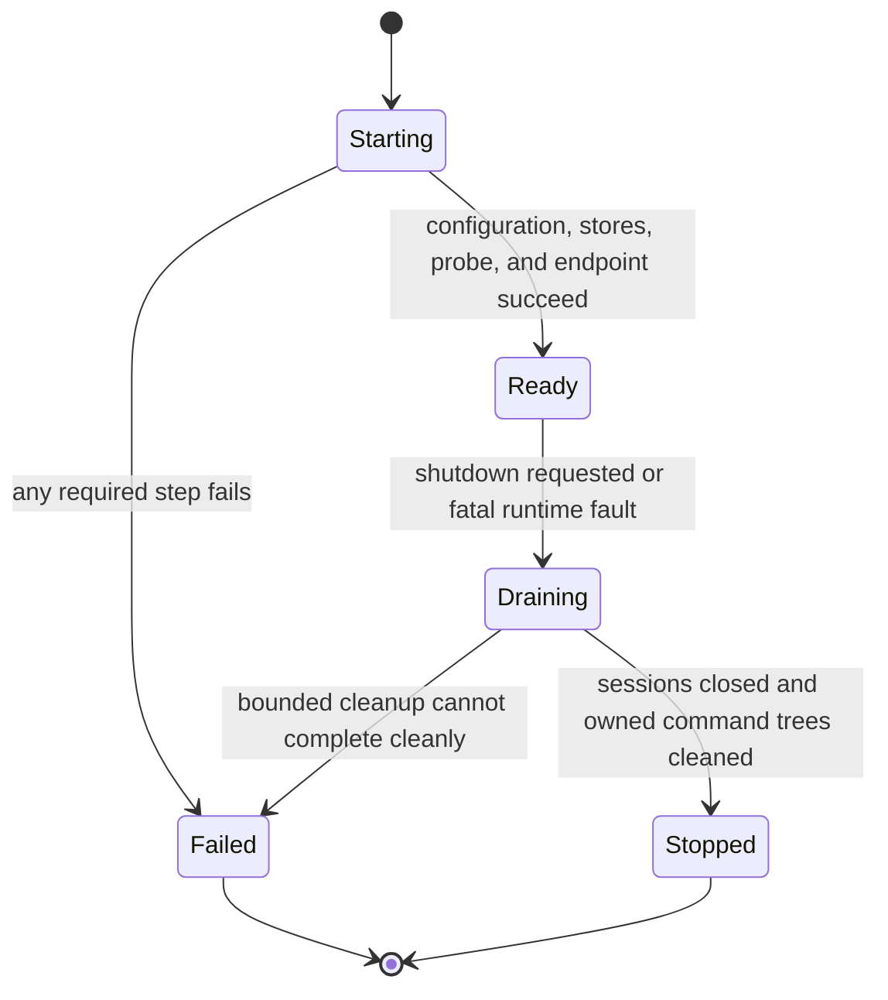

# Daemon Lifecycle and Configuration

## Design Position

`agent-envd` is one authority-bearing daemon for one Environment identity and generation. It validates all trusted bootstrap configuration, prepares native resource stores and command execution, binds its own network listener when selected, and reports readiness only after every required enforcement component is usable.

Bootstrap configuration is operator or provider-adapter input. Ordinary EIP requests can select only resources and behavior already permitted by that immutable configuration; they cannot change mount roots, transport authentication, isolation mode, protected paths, hard quotas, or Environment identity.

## Boundaries

| Concern                                                                                       | Owner                                                    | Relationship                                           |
| --------------------------------------------------------------------------------------------- | -------------------------------------------------------- | ------------------------------------------------------ |
| Provider resource creation and lifecycle credential                                           | Host provider adapter                                    | Completes before envd data-plane admission             |
| Envd executable, trusted configuration, process environment, and endpoint exposure            | Operator or provider adapter                             | Launches envd inside the selected Environment boundary |
| Configuration validation, native stores, listener bind, readiness, drain, and command cleanup | `agent-envd`                                             | One daemon lifecycle                                   |
| EIP initialization and logical sessions                                                       | [Transports and Sessions](03-transports-and-sessions.md) | Begin only after daemon readiness                      |
| Harness run and durable execution lifecycle                                                   | Harness and Host                                         | Independent of daemon process lifecycle                |

A daemon process is not a Host execution attempt. One ready daemon can serve multiple sequential or concurrent authenticated EIP sessions within its configured ceilings. A provider adapter decides whether to dedicate a daemon to one binding or share it among trusted bindings inside the same authority partition; mutually untrusted partitions use distinct daemon instances, keys, and private state roots. Sharing cannot bypass daemon-global quotas or authority.

## Trusted Configuration

The following conceptual schema defines the stable configuration classes. It is not the CLI parser or a serialized EIP schema.

```python
type EndpointMode = Literal["stdio", "network"]
type ExecutionIsolationMode = Literal["required", "disabled"]
type ExecutionNetworkMode = Literal["host", "deny"]


class NetworkEndpointConfig(BaseModel):
    listen_address: str
    principal_id: str = "network_client"
    http_enabled: bool = True
    websocket_enabled: bool = True
    api_key: SecretStr
    allowed_origins: tuple[str, ...] = ()
    tls_terminated_by_trusted_peer: bool = False


class DaemonLimits(BaseModel):
    max_request_bytes: int
    max_response_bytes: int
    max_concurrent_operations: int
    max_pending_operations: int
    max_processes: int
    max_operation_duration_ms: int
    max_retained_bytes: int
    max_retained_objects: int
    max_session_retained_bytes: int
    max_session_retained_objects: int
    default_retention_ttl_ms: int
    max_retention_ttl_ms: int


class DaemonConfig(BaseModel):
    environment_id: str | None
    state_directory: str | None
    endpoint_mode: EndpointMode
    network: NetworkEndpointConfig | None
    mounts: tuple[TrustedMountConfig, ...]
    executable_search_roots: tuple[str, ...]
    shell_profiles: tuple[TrustedShellProfile, ...]
    limits: DaemonLimits
    execution_isolation: ExecutionIsolationMode = "required"
    execution_network: ExecutionNetworkMode = "host"
    execution_extra_read_only_paths: tuple[str, ...] = ()
    payload_uid: int | None = None
    payload_gid: int | None = None
```

All numeric limits are positive and finite. Daemon-global retained-byte, retained-object, request-size, response-size, process-count, operation-duration, and admission ceilings cannot be disabled. A session or EIP request can only narrow them.

`TrustedMountConfig` is operator-owned configuration described by [Resource Operations](04-resource-operations.md); `TrustedShellProfile` is described by [Command and Process Execution](05-command-and-process-execution.md). `executable_search_roots` is the ordered operator-owned search list for bare `argv` executables. Native roots and executables are canonicalized, identity-checked, and validated against protected paths before readiness. A model, tool argument, `initialize` request, or invocation grant cannot add another native root or executable.

### Configuration sources and conflicts

The executable accepts trusted configuration from an operator-selected config file, explicit non-secret CLI flags, and documented process environment variables. One effective immutable value is computed before subsystem initialization. Duplicate sources with different values fail startup rather than depending on source order for authority-bearing settings.

Secret material is never accepted through CLI arguments because process listings and service definitions can expose argv. The network API key has exactly one bootstrap source:

| Variable                                                | Requirement                                                                          | Meaning                                                                              |
| ------------------------------------------------------- | ------------------------------------------------------------------------------------ | ------------------------------------------------------------------------------------ |
| `AGENT_ENVD_API_KEY`                                    | Required for `network`; must be absent for `stdio`                                   | High-entropy bearer secret used to authenticate HTTP requests and WebSocket upgrades |
| `AGENT_ENVD_TRANSPORT`                                  | `stdio` or `network`; default `stdio`                                                | Selects process-pipe framing or an envd-owned listener                               |
| `AGENT_ENVD_LISTEN_ADDRESS`                             | Network mode; default `127.0.0.1:0`                                                  | Address passed to envd's own bind and listen operation                               |
| `AGENT_ENVD_HTTP_ENABLED`                               | Boolean; default `true` in network mode                                              | Enables `POST /rpc`                                                                  |
| `AGENT_ENVD_WEBSOCKET_ENABLED`                          | Boolean; default `true` in network mode                                              | Enables `GET /rpc/ws` upgrade                                                        |
| `AGENT_ENVD_ENVIRONMENT_ID`                             | Optional when a trusted state directory or direct launch handshake supplies identity | Expected stable Environment identity                                                 |
| `AGENT_ENVD_STATE_DIR`                                  | Optional absolute path                                                               | Private daemon state root; never a command filesystem grant                          |
| `AGENT_ENVD_EXECUTION_ISOLATION`                        | `required` or `disabled`; default `required`                                         | Selects envd's inner command-isolation posture                                       |
| `AGENT_ENVD_EXECUTION_NETWORK`                          | `host` or `deny`; default `host`                                                     | Selects command-tree IP networking when inner isolation is required                  |
| `AGENT_ENVD_EXECUTION_EXTRA_READ_ONLY_PATHS`            | JSON array of absolute path strings; default `[]`                                    | Adds explicit operator-trusted command runtime roots in required mode                |
| `AGENT_ENVD_EXECUTION_UID` / `AGENT_ENVD_EXECUTION_GID` | Optional paired positive Linux IDs                                                   | Selects a trusted final payload identity; both must be present together              |

Network mode requires at least one of `AGENT_ENVD_HTTP_ENABLED` or `AGENT_ENVD_WEBSOCKET_ENABLED` to be true. Stdio mode rejects listener, route-enable, API-key, origin, and trusted-TLS settings rather than accepting ineffective network policy.

An API key is at least 32 bytes after UTF-8 encoding, contains no surrounding whitespace or control character, and is compared in constant time. Envd cannot prove entropy from a string, so deployment tooling generates a uniformly random value rather than using a human password. Empty or malformed keys fail startup. The key is immutable for one daemon process; rotation restarts the endpoint and invalidates existing sessions. Environment generation after that restart follows the native-state recovery rules rather than changing merely because a transport secret changed.

`AGENT_ENVD_*` names are reserved daemon configuration. EIP command-environment input cannot override them. The daemon process environment is not inherited wholesale by child commands, and `AGENT_ENVD_API_KEY` is always removed before any supervisor, sandbox helper, or payload starts.

The endpoint can bind port `0`. In that case envd discovers the assigned port from its bound listener before reporting readiness. A provider adapter never guesses the selected port and never interprets a log line as readiness.

### Network exposure and TLS

The built-in network endpoint speaks HTTP/1.1 and WebSocket over that listener. TLS can terminate in a trusted sidecar, sandbox gateway, loopback tunnel, or provider fabric; envd does not treat a caller-controlled forwarding header as proof of TLS or identity.

A non-loopback listen address requires either:

- a listener protected end to end by a trusted private provider network or tunnel; or
- trusted TLS termination that preserves the `Authorization` header only to envd and prevents untrusted plaintext access on the terminating hop.

The API key remains mandatory in both cases. Enabling a public plaintext listener is invalid configuration. Loopback does not replace the key because other processes inside the same host or sandbox may be untrusted.

## Environment Identity and Generation

```python
class EnvironmentIdentity(BaseModel):
    environment_id: str
    generation: int
```

`environment_id` identifies the logical provider Environment. A provider adapter can configure it explicitly. Otherwise, envd loads or creates it inside its private trusted state directory. Without either source, envd creates a process-lifetime identity and reports that fact in its non-secret descriptor; such an identity cannot support reattachment after restart.

`generation` is a positive monotonic value within that identity. It changes before admission whenever a reset can invalidate a process handle, output cursor, lease, backend-local state reference, mount snapshot, or native resource assumption. Examples include:

- starting with no validated continuation of the prior daemon-native state;
- replacing or resetting the resource store;
- changing trusted mounts, shell profiles, isolation posture, or hard policy in a way that invalidates live objects;
- recovering after state corruption or ambiguous native ownership.

A transport reconnect or a new Harness run alone does not change generation. A daemon restart can preserve generation only if its state store proves that every externally retainable object and policy assumption remains valid; otherwise it increments before readiness. Generation is observed state, not a credential.

## Startup State Machine



Startup follows this order:

1. Parse all trusted sources and reject unknown, conflicting, malformed, or unsafe configuration.
2. Resolve Environment identity and next generation.
3. Canonicalize mounts, protected paths, shell executables, private state, output retention, execution home, and temporary roots.
4. Create bounded admission, process, receipt, state, and retention stores.
5. Initialize the configured command execution backend.
6. In `required` isolation mode, run the production backend probe against the effective filesystem and network policy.
7. For network mode, bind and listen on the configured address; for stdio, reserve stdin and stdout for EIP framing.
8. Publish one readiness record and begin session admission.

No network socket is bound and no stdio EIP frame is accepted before a required isolation probe succeeds. An unsupported platform or failed probe in `required` mode is a startup failure, not a reason to use native execution.

## Readiness and Health

### Startup readiness record

A network-mode daemon writes exactly one newline-terminated JSON readiness record to stdout after the listener is bound and every startup gate has succeeded, then closes stdout. Stderr remains the structured log stream. A provider launcher treats only that typed record from the child it started as readiness; ordinary logs are never parsed for endpoint discovery.

```json
{
  "type": "agent-envd.ready",
  "schema_version": 1,
  "environment_id": "env_01...",
  "generation": 7,
  "listen_address": "127.0.0.1:43127",
  "http_path": "/rpc",
  "websocket_path": "/rpc/ws",
  "protocol_major_versions": [1]
}
```

Disabled routes are represented as `null`. The record contains no API key, session value, mount path, protected path, native helper location, provider credential, or process environment. The launcher validates schema, expected Environment identity, and actual child ownership before using the endpoint.

In stdio mode, stdout carries only content-length-framed EIP messages and no standalone readiness line. The parent establishes readiness by successfully completing `initialize`; startup errors go to stderr and process exit.

### Network health routes

A network endpoint exposes:

- `GET /healthz`, which returns only process liveness;
- `GET /readyz`, which returns success only in `Ready` and failure during `Starting` or `Draining`.

These routes disclose no descriptor, identity, generation, version detail, policy, metrics, or failure cause and do not create an EIP session. They are suitable for a colocated supervisor but are not proof of EIP authentication or compatibility.

## Admission and Runtime Ownership

Admission is bounded at three levels:

1. daemon-global active and pending operation counts;
2. authenticated-principal and session counts;
3. method-specific process, output, file, and payload limits.

Capacity is reserved before native dispatch. When no pending slot exists, envd returns a bounded `busy` error with retry guidance and performs no native work. Queue position is not durable, and a disconnected client does not retain a pending admission slot indefinitely.

One runtime coordinator owns:

- initialized sessions and their expiry;
- accepted operation IDs, cancellation state, and bounded receipt records;
- native command-tree ownership through the command execution manager;
- retained outputs and leases;
- Environment generation and descriptor publication.

An EIP-visible process or output record never independently owns the corresponding native resource. This single ownership rule prevents duplicate cleanup, conflicting status, and detached native children.

## Draining and Shutdown

Shutdown begins from an operator signal, parent-process loss in stdio mode, explicit administrative lifecycle action outside ordinary EIP methods, or an unrecoverable daemon fault. EIP clients cannot request process-wide shutdown through the Environment method catalog.

The daemon then:

1. enters `Draining` atomically and refuses new sessions and operations;
2. permits already completed results to drain within response deadlines;
3. requests cancellation of accepted foreground operations;
4. closes session-owned stdin and non-retained output objects;
5. terminates every non-terminal command tree, including explicitly retained processes, using the strongest backend cleanup operation;
6. waits within a finite daemon shutdown budget and records each cleanup outcome;
7. flushes only validated backend-local state that remains meaningful for the next generation;
8. closes transports and exits.

No process is contractually allowed to outlive envd shutdown. A provider that needs work to survive a client run keeps envd itself alive and uses an explicit finite process lease. Provider adapter teardown remains a separate Host action after daemon cleanup or loss.

If cleanup cannot prove complete teardown, envd exits nonzero and exposes bounded diagnostics to its supervisor. On Linux required isolation, namespace teardown normally proves completeness. On macOS, a surviving descendant can be reported as `residual_confined` because Seatbelt remains inherited even when complete process-tree observation is unavailable. Native disabled mode cannot claim confinement and therefore treats unproven residuals as cleanup failure.

## Observability

Structured daemon logs and metrics describe control-plane facts without copying request or output content by default.

Safe dimensions include:

- daemon version, protocol major, transport profile, and lifecycle state;
- Environment identity hash or approved opaque correlation, never native roots;
- isolation mode, backend class, network policy, and probe outcome class;
- method family, operation outcome, dispatch stage, duration, and bounded byte counts;
- active and pending operations, processes, retained bytes, retained objects, and quota denials;
- process termination reason and cleanup outcome;
- transport authentication, initialization, protocol, frame, and session-expiry outcome classes.

Logs and metrics exclude API keys, authorization headers, session values, invocation grants, full commands, request environments, file contents, output content, native private paths, generated isolation profiles, helper paths, and protected-path names. A content-enabled diagnostic policy is a separate trusted operator choice and still never includes credentials.

The EIP descriptor exposes non-secret posture and limits required by clients. It reports whether envd inner isolation and network isolation are active, but it cannot infer or represent the strength of an outer container, VM, or provider sandbox.

## Failure Semantics

| Failure                                     | State and observable result                                                                                             |
| ------------------------------------------- | ----------------------------------------------------------------------------------------------------------------------- |
| Invalid or conflicting configuration        | Exit nonzero before readiness; no listener admission                                                                    |
| Missing or invalid network API key          | Exit nonzero before bind                                                                                                |
| Required isolation backend or probe failure | Exit nonzero before bind or stdio initialization                                                                        |
| Listen failure                              | Exit nonzero; no ready record                                                                                           |
| Ready-record delivery fails                 | Treat startup as failed and drain the bound listener                                                                    |
| Runtime admission exhausted                 | Typed pre-dispatch `busy` error; no native work                                                                         |
| Private state cannot be validated           | Start a new fenced generation only when configured recovery policy permits dropping old objects; otherwise fail startup |
| Fatal runtime ownership inconsistency       | Enter `Draining`, stop admission, clean owned trees, and exit nonzero                                                   |
| Shutdown cleanup incomplete                 | Exit nonzero with safe supervisor diagnostics; never report normal stopped completion                                   |

## Compatibility

Readiness-record schema, configuration names, EIP protocol versions, and daemon package versions are independent compatibility axes. Additive optional readiness fields are compatible; changing a field meaning, stdout framing, route path, secret source, or ready timing requires a schema or package compatibility change.

A configuration parser rejects unknown authority-bearing fields by default. This prevents a misspelled security option from silently taking its default. A deployment migration explicitly updates the accepted config schema and restarts the daemon; live EIP requests never migrate daemon policy.

## Invariants

01. Envd reports ready only after trusted configuration, stores, required isolation probe, and endpoint setup all succeed.
02. Network mode always uses an envd-bound listener and an API key obtained only from `AGENT_ENVD_API_KEY`.
03. An envd API key never appears in argv, readiness, EIP payloads, descriptors, state, logs, metrics, or child environments.
04. Authority-bearing daemon configuration is immutable for one generation and cannot be changed through EIP.
05. Every daemon and session limit is finite; request input can only narrow an effective limit.
06. One runtime coordinator owns sessions, operations, receipts, retained objects, and command-tree lifecycle.
07. `required` isolation probes before transport admission; failed probing never selects `disabled`.
08. Port `0` is resolved from the bound socket and communicated only through the typed readiness record.
09. Shutdown stops admission before cleanup and leaves no command contractually allowed to survive the daemon.
10. Health and readiness endpoints reveal no identity, version, policy, or secret and do not create protocol sessions.
