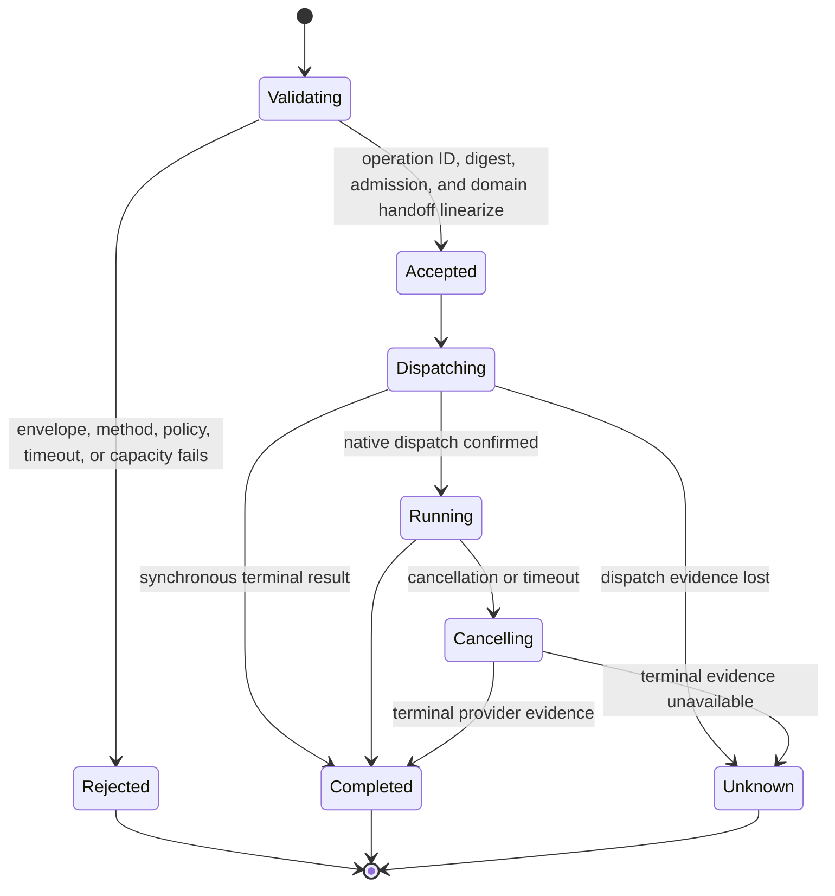

# Environment Interaction Protocol

## Design Position

The Environment Interaction Protocol (EIP) is the transport-neutral wire contract between a trusted requester and `agent-envd`. EIP 1.0 uses JSON-RPC 2.0 for bounded control operations and a correlated raw-binary data plane for file transfer. One versioned contract owns method names, payloads, transfer lifecycles, operation replay, typed errors, selectors, limits, and side-effect evidence across trusted stdio and outbound reverse WebSocket.

EIP is a semantic Environment protocol rather than a remote syscall interface. Canonical path resolution, bounded search, complete-candidate publication, command-tree control, retained-output reads, and local-port observation execute beside the native resources. Client validation improves errors but never replaces envd enforcement.

## Boundaries

| Concern                                                                                 | Owner                                                                                  | Relationship                                  |
| --------------------------------------------------------------------------------------- | -------------------------------------------------------------------------------------- | --------------------------------------------- |
| JSON-RPC methods, params/results, operation identity, transfers, errors, and versioning | This document                                                                          | Identical on every carrier                    |
| Canonical IDL and generated Rust/Python realization                                     | [Protocol Source, Client, and Generation](08-protocol-source-client-and-generation.md) | Encodes this contract without semantic drift  |
| Framing, attachment authentication, carrier direction, sessions, and liveness           | [Transports and Sessions](03-transports-and-sessions.md)                               | Establishes a trusted session before dispatch |
| Multi-Environment routing and Harness policy                                            | Harness and Host                                                                       | Selects one trusted binding before EIP        |
| Native filesystem, process, isolation, output, and receipt evidence                     | `agent-envd` resource owners                                                           | Executes accepted operations                  |
| Provider provisioning and durable Agent completion                                      | Host                                                                                   | Outside EIP                                   |

Carrier headers, stdio pipes, attachment credentials, and WebSocket upgrade fields never appear in ordinary EIP params. Carrier direction cannot change a method, result, retry rule, or side-effect classification.

## Control Envelope

Every control message is one UTF-8 JSON object conforming to JSON-RPC 2.0. EIP 1.0 supports correlated request/response only, not batch arrays or application notifications. Request IDs are strings or signed 64-bit integers; booleans and wider integers are invalid. A response carries the same nullable ID and exactly one of `result` or `error`.

Raw file bytes are not control messages. They use the bounded data-frame profile after a correlated `file.open_reader` or `file.open_writer` establishes a typed transfer. A binary frame cannot name a path, create authority, commit a mutation, or invoke another method.

```json
{
  "jsonrpc": "2.0",
  "id": "req-42",
  "method": "shell.exec",
  "params": {
    "context": {
      "operation_id": "op-01J...",
      "timeout_ms": 30000
    },
    "request": {
      "command": {
        "kind": "argv",
        "executable_spec": {"kind": "name", "name": "git"},
        "arguments": ["status", "--short"]
      },
      "cwd": {"mount_id": "workspace", "path": "/repo"}
    }
  }
}
```

JSON bytes, nesting, strings, collections, paths, arguments, environment maps, identifiers, and encoded-byte values are bounded before domain validation. Small binary values inherent to a control method, such as one stdin chunk, use unpadded base64 in typed `EncodedBytes`. Native file content never uses JSON/base64.

Unknown JSON-RPC envelope fields are handled only as JSON-RPC permits and cannot use reserved `eip_` names. Unknown fields in typed EIP requests fail closed unless a negotiated minor explicitly permits them. Numeric byte counts, offsets, generations, ports, and durations are non-negative bounded integers.

## Initialization

`initialize` is the requester's first EIP request on every stdio or reverse-WebSocket session. No other method or binary frame is admitted first.

The serialized wire shape is:

```python
class EIPClientInfo(BaseModel):
    name: str
    version: str


class InitializeParams(BaseModel):
    supported_protocol_versions: tuple[str, ...]
    client: EIPClientInfo
    expected_environment_id: str
    required_methods: tuple[str, ...] = ()


class EIPServerInfo(BaseModel):
    name: Literal["agent-envd"]
    version: str


class EIPLimits(BaseModel):
    max_request_bytes: int
    max_response_bytes: int
    max_concurrent_operations: int
    max_processes: int
    max_operation_duration_ms: int
    max_inline_output_bytes: int
    max_output_bytes: int
    max_transfer_frame_bytes: int
    max_concurrent_file_transfers: int
    max_file_transfer_bytes: int


class ExecutionFeatures(BaseModel):
    process_count_limit: bool
    memory_bytes_limit: bool
    cpu_time_limit: bool
    per_command_network_deny: bool
    signal_interrupt: bool
    signal_terminate: bool


class EnvironmentDescriptor(BaseModel):
    environment_id: str
    generation: int
    mounts: tuple[MountDescriptor, ...]
    shell_profiles: tuple[ShellProfileDescriptor, ...]
    limits: EIPLimits
    isolation: IsolationPosture
    root_mount_id: str | None
    available_methods: tuple[str, ...]
    execution_features: ExecutionFeatures


class InitializeResult(BaseModel):
    protocol_version: str
    server: EIPServerInfo
    descriptor: EnvironmentDescriptor
```

Versions use `<major>.<minor>`. The server selects the highest mutually supported minor in a mutually supported major. Selecting EIP major 1 also selects binary data-frame profile version 1. No binary attachment is legal before initialization.

`expected_environment_id` is mandatory trusted binding input. A mismatch fails initialization without publishing a usable descriptor. `required_methods` contains exact JSON-RPC names. Initialization fails if any required name is absent from `available_methods`. The list does not grant a method; it asserts compatibility with the daemon's configured policy and truthful platform support.

The descriptor contains configured logical mounts only. `root_mount_id`, when present, identifies exactly one descriptor mount and is never inferred from ordering. A provider requiring broad native access configures ordinary trusted roots explicitly. There is no session-selectable resource-authority mode or synthesized server filesystem.

`available_methods` is the sole callable-method availability surface. It permits independent platform truth: omission of one unsupported mutation or process control does not hide unrelated operations. A method absent from the negotiated protocol returns `method_not_found`; a method defined by the protocol but absent from the descriptor returns `unsupported` without native dispatch.

`execution_features` qualifies only concrete optional values already present in `CommandRequest` and `ProcessSignalParams`; it is not a method catalog, authority grant, or capability family. The three limit booleans state whether `process_count`, `memory_bytes`, and `cpu_time_ms` are enforceable for every available method carrying `CommandRequest`. `per_command_network_deny` states whether `network="deny"` is accepted and enforced for this generation. Signal booleans are the accepted `process.signal` action set: the method is present exactly when at least one is true, and an action whose boolean is false returns `unsupported` before backend control dispatch. `process.kill` remains a separate exact method. Baseline wall-time and stdin/output bounds are mandatory semantics and need no optional support flag.

Only limits a client needs before constructing or dispatching work are serialized. Record capacity, terminal-record retention, tombstones, staging aggregate quotas, transfer idle policy, spool capacity, scheduler queues, and cleanup thresholds remain bounded daemon configuration and produce typed runtime outcomes. An absolute `expires_at` in a result is an observation, not a compatibility lease.

Initialization has no `EIPCallContext`, performs no native resource mutation, and cannot repeat within a live session.

## Common Operation Context and Replay

Every method other than `initialize` carries:

```python
class EIPCallContext(BaseModel):
    operation_id: str
    timeout_ms: int | None = None
```

`operation_id` is the one replay, cancellation, and receipt identity for an EIP operation. It is a client-generated unpredictable value of at most 128 Unicode scalar values and 512 UTF-8 bytes. The client does not intentionally assign one ID to different logical operations within a daemon generation.

At operation admission, envd computes a canonical semantic request digest from:

- the selected EIP protocol version;
- the exact JSON-RPC method name;
- generated canonical JSON for typed params after excluding `context.operation_id` and `context.timeout_ms`.

Canonical JSON sorts object keys, emits UTF-8 without insignificant whitespace, uses EIP timestamp/integer/base64 rules, and omits absent values, schema defaults, and empty non-presence-sensitive collections. It never depends on JSON-RPC request ID, carrier data, object-key order, or a caller clock.

The operation owner applies these rules atomically:

| Existing operation ID | Method and digest | Result                                                                        |
| --------------------- | ----------------- | ----------------------------------------------------------------------------- |
| None                  | Any valid request | Reserve the ID and admit one operation                                        |
| Active                | Same              | `operation_in_progress`; no duplicate dispatch                                |
| Terminal and retained | Same              | Replay the same bounded result or typed terminal failure and receipt evidence |
| Any retained state    | Different         | `conflict`; no dispatch                                                       |

A handler whose work has ended but whose typed result or failure is being published remains active for replay purposes. The owner exposes `operation_in_progress` during that publication boundary and changes to terminal only in the same critical section that stores replayable evidence; a terminal record with no result or failure is never observable.

This single identity replaces a separate idempotency key. There is no provider-key mapping, late key attachment, or receipt selector. If terminal evidence has expired or been capacity-reclaimed, absence never proves non-dispatch; a client must reconcile native state or accept ambiguity rather than reassign the same uncertain mutation blindly.

The same replay rules apply according to each method's semantics. Replaying a retained read returns its original observation, not a fresh read. A caller wanting a new current-state observation uses a new operation ID. State-idempotent controls converge while their target record or bounded tombstone remains.

`timeout_ms`, when present, is a positive relative budget. Envd derives a monotonic deadline after admission and narrows it with the method and daemon ceiling. A retry of the same operation ID can supply another local wait budget without changing the semantic digest or extending already accepted native work. Expiry before dispatch is pre-dispatch timeout. Expiry after dispatch requests method-specific cancellation/reconciliation and does not prove a side effect absent.

## Method Availability and Catalog

The canonical IDL defines the EIP 1.0 method set:

| Domain              | Methods                                                                                                                                                                      | Owning contract                                                      |
| ------------------- | ---------------------------------------------------------------------------------------------------------------------------------------------------------------------------- | -------------------------------------------------------------------- |
| Environment/session | `environment.describe`, `session.close`                                                                                                                                      | This document and [Transports](03-transports-and-sessions.md)        |
| Operation evidence  | `operation.cancel`, `receipt.get`                                                                                                                                            | This document                                                        |
| File reads          | `file.stat`, `file.read_text`, `file.open_reader`, `file.close_reader`, `file.list`, `file.find`, `file.search`                                                              | [Resource Operations](04-resource-operations.md)                     |
| File writes         | `file.write_text`, `file.open_writer`, `file.commit_writer`, `file.abort_writer`, `file.mkdir`, `file.patch_text`, `file.copy`, `file.move`, `file.remove`                   | [Resource Operations](04-resource-operations.md)                     |
| Foreground command  | `shell.exec`                                                                                                                                                                 | [Command and Process Execution](05-command-and-process-execution.md) |
| Background process  | `process.start`, `process.inspect`, `process.read_output`, `process.write_stdin`, `process.close_stdin`, `process.signal`, `process.wait`, `process.kill`, `process.release` | [Command and Process Execution](05-command-and-process-execution.md) |
| Port observation    | `port.inspect`, `port.wait`                                                                                                                                                  | [Resource Operations](04-resource-operations.md)                     |
| Retained output     | `output.read`, `output.release`                                                                                                                                              | [Output Retention](06-output-retention.md)                           |

The descriptor lists each available method exactly. No capability family asserts all-or-nothing support. Optional behavior inside one method is accepted only when the method's request contract and descriptor posture report it truthfully; unsupported options fail before dispatch.

The catalog contains no provider provisioning, container lifecycle, daemon shutdown, credential rotation, arbitrary native PID/path access, URL fetching, product-user authorization, or shell-evaluated administration.

## Descriptor Refresh and Generation

`environment.describe` returns the current session's descriptor. Within one initialized session, runtime policy can only remove `available_methods` and lower numeric `EIPLimits`. Environment identity, generation, mount descriptors and ordering, root mount, shell profiles, isolation posture, and execution-feature support are immutable. A refresh that re-adds a removed method, raises a prior limit, changes topology/posture/features, or contains an unknown method is a terminal protocol violation; a client never replaces its effective descriptor with that observation. A fault that changes those generation-fixed facts drains or terminates the daemon and destroys its sessions.

A daemon restart creates a new unpredictable nonzero generation. Operation records, process handles, transfer handles, output references, receipts, and private spool data from the old generation are invalid and never restored or adopted. A selector that safely identifies another generation returns `stale_generation`; otherwise it returns its non-disclosing invalid/not-found error.

```python
class EnvironmentDescribeParams(BaseModel):
    context: EIPCallContext


class EnvironmentDescribeResult(BaseModel):
    descriptor: EnvironmentDescriptor


class OperationCancelParams(BaseModel):
    context: EIPCallContext
    target_operation_id: str


class OperationCancelResult(BaseModel):
    status: Literal[
        "not_found",
        "already_terminal",
        "cancellation_requested",
        "not_cancellable",
    ]
```

## Opaque Selectors

The base protocol has four opaque selector families:

```python
class ProcessHandle(RootModel[str]): ...
class FileReaderHandle(RootModel[str]): ...
class FileWriterHandle(RootModel[str]): ...
class OutputReference(RootModel[str]): ...
```

Private records bind Environment identity, generation, daemon user, object kind, creating operation, lifecycle, and facts required for safe follow-up. File transfer handles additionally bind the exact initialized session, direction, attachment, next offset, and expiry.

Selectors expose no native PID, path, descriptor, storage key, package SID, or credential. Possession is insufficient: every use repeats carrier trust, method availability, generation, kind, state, and policy checks. Server-created values use concise kind-prefixed generation-local identities where entropy is not a security property. Operation IDs remain unpredictable because they identify replay across reconnects.

Receipts are addressed by operation ID. Retained and process output use client-owned explicit byte offsets against an output reference or process handle; neither read path creates another server selector.

## Binary File-Transfer Control

[Resource Operations](04-resource-operations.md) owns file semantics. EIP control and the binary data plane establish these lifecycles:

### Reader

1. `file.open_reader` authorizes a path and optional byte range and returns a session-owned reader plus observed metadata.
2. The carrier attaches one server-to-client binary stream with exact contiguous offsets and finite bounds.
3. Envd sends `END` after clean producer termination. Readers do not use `END_ACK`.
4. After the public consumer drains all chunks, `file.close_reader` is the sole successful acceptance action. It returns produced-byte count and SHA-256 digest.
5. Early exit, cancellation, reset, expiry, or carrier loss closes the reader without acceptance.

`file.close_reader` has no boolean acceptance choice. It succeeds only for a clean, fully consumed reader. A successful high-level reader compares envd count and digest with locally observed bytes. This proves transfer integrity for the held stream, not an immutable pathname or file snapshot.

### Writer

1. `file.open_writer` authorizes a destination and reserves one bounded destination-local candidate without mutating the target.
2. The carrier attaches one client-to-server stream. Envd writes exact contiguous chunks while counting, hashing, and reserving staging capacity.
3. Client `END` plus envd `END_ACK` seals the uploaded stream but does not publish it.
4. `file.commit_writer` verifies count and digest, atomically hands candidate ownership to the operation, revalidates publication intent, and performs the only destination mutation.
5. `file.abort_writer` or pre-handoff session teardown deletes the candidate when cleanup can be proven.

A data frame is not independently retryable. Interrupted readers open a new explicit observation. Interrupted writers use a new candidate. Only a possibly dispatched commit has mutation ambiguity, reconciled by its operation ID and receipt evidence.

## Operation Ownership and Cancellation



One bounded generation operation record owns pending admission, active owner state, cancellation, canonical method/digest, terminal result or failure, and receipt. Native execution remains owned after response-waiter loss. A nonterminal record is never capacity-reclaimed; terminal records expire or are reclaimed oldest-first under internal bounded policy.

A domain handoff that changes cleanup ownership participates in the same admission transaction. For writer commit, sealed-writer validation, operation reservation, and session-to-operation candidate handoff linearize together. Session closing either wins before handoff or cannot delete an operation-owned candidate.

`operation.cancel` targets an operation ID in the same generation. An accepted cancellation request is not terminal proof. The target operation or later `receipt.get` reports completed, cancelled, timed out, or unknown evidence. Carrier close never requests cancellation automatically.

Because operation admission creates the one record before owner work runs, cancellation cannot overtake an earlier admitted target request and incorrectly report it absent. Both requests remain bounded by their own session and local wait budgets.

## Receipts and Side-Effect Evidence

A mutating operation can return:

```python
class OperationReceipt(BaseModel):
    operation_id: str
    method: str
    environment_id: str
    generation: int
    request_digest: str
    stage: Literal[
        "accepted",
        "dispatched",
        "exec_confirmed",
        "completed",
        "unknown",
    ]
    outcome: Literal[
        "succeeded",
        "failed",
        "cancelled",
        "timed_out",
        "unknown",
    ] | None
    observed_at: datetime


class ReceiptGetParams(BaseModel):
    context: EIPCallContext
    operation_id: str


class ReceiptGetResult(BaseModel):
    receipt: OperationReceipt
```

A receipt states only facts envd directly observed. `accepted` proves no native dispatch. `dispatched` proves the native boundary was crossed, not completion. `exec_confirmed` proves the requested executable passed the exec handshake. `completed` has a terminal outcome. `unknown` preserves lost certainty.

Receipt evidence is attached to the operation record and shares its bounded lifetime and reclamation. It has no independent selector or quota. Missing evidence never becomes proof of non-dispatch, mutation failure, Host durability, provider billing, or Agent completion.

## Error Contract

A method error has bounded `error.data`:

```python
type RetryHint = Literal[
    "never",
    "same_request",
    "after_refresh",
    "after_capacity",
    "reconcile_first",
]


type DispatchStage = Literal[
    "pre_dispatch",
    "dispatching",
    "dispatched",
    "completed",
    "unknown",
]


class EIPErrorData(BaseModel):
    error_type: str
    retry_hint: RetryHint
    dispatch_stage: DispatchStage
    operation_id: str | None = None
    environment_id: str | None = None
    generation: int | None = None
    field: str | None = None
    handle_kind: str | None = None
    produced_bytes: int | None = None
    captured_bytes: int | None = None
    dropped_bytes: int | None = None
    emitted_items: int | None = None
    dropped_items: int | None = None
    available_start: int | None = None
    available_end: int | None = None
    process_status: ProcessStatus | None = None
    receipt: OperationReceipt | None = None
    safe_detail: str | None = None
```

Stable code/type pairs are:

|     Code | `error_type`                 | Meaning                                                                    |
| -------: | ---------------------------- | -------------------------------------------------------------------------- |
| `-32700` | `parse_error`                | Invalid JSON before an EIP envelope                                        |
| `-32600` | `invalid_request`            | Invalid JSON-RPC envelope, batch, or notification                          |
| `-32601` | `method_not_found`           | Method absent from selected protocol version                               |
| `-32602` | `invalid_params`             | Typed params fail validation                                               |
| `-32603` | `internal_error`             | Bounded unexpected fault with no narrower class                            |
| `-32001` | `not_initialized`            | Method used before initialization                                          |
| `-32002` | `already_initialized`        | Initialization repeated in one session                                     |
| `-32003` | `protocol_incompatible`      | Version or required-method agreement fails                                 |
| `-32010` | `denied`                     | Configured policy denies the action                                        |
| `-32011` | `not_found_or_denied`        | Object absent or intentionally indistinguishable                           |
| `-32012` | `unsupported`                | Protocol method/option unavailable in current descriptor/posture           |
| `-32020` | `stale_generation`           | Selector belongs to another generation                                     |
| `-32021` | `invalid_handle`             | Handle kind, state, or use is invalid                                      |
| `-32022` | `retention_gap`              | Requested output interval is unavailable                                   |
| `-32030` | `busy`                       | Bounded admission capacity unavailable                                     |
| `-32031` | `quota_exceeded`             | Finite resource quota cannot reserve capacity                              |
| `-32032` | `output_limit_exceeded`      | Selected output fail policy overflowed                                     |
| `-32040` | `timeout`                    | Relative deadline expired with known timeout result                        |
| `-32041` | `cancelled`                  | Provider proves cancellation                                               |
| `-32042` | `unknown_outcome`            | Possible effect cannot be classified safely                                |
| `-32043` | `operation_in_progress`      | Same operation ID and digest is active                                     |
| `-32050` | `provider_unavailable`       | Native/provider resource unavailable                                       |
| `-32051` | `execution_isolation_failed` | Required isolation or pre-exec identity failed                             |
| `-32052` | `cleanup_failed`             | Required native cleanup cannot be proven                                   |
| `-32053` | `command_start_failed`       | Selected executable did not execute after preparation                      |
| `-32060` | `conflict`                   | Operation-ID digest, topology, publication, or state precondition conflict |
| `-32061` | `integrity_mismatch`         | Transfer count or SHA-256 evidence differs                                 |

Carrier authentication and upgrade failures happen before JSON-RPC dispatch. Once a valid request is admitted in an initialized session, method failure uses this contract.

The generated codec validates every code/type pair. For `retention_gap`, `available_start` and `available_end` identify the current readable half-open interval where the object remains. Counts and status contain bounded evidence, never output content or native identities. Clients branch on code and `error_type`, not message text.

## Retry and Unknown Outcomes

A new read-only observation uses a new operation ID. Repeating a retained operation ID with the same method/digest asks for replay of the original result. Mutations can repeat safely only when:

- failure proves `dispatch_stage="pre_dispatch"` and the caller deliberately starts a new operation; or
- the same operation ID, method, and digest still has retained replay evidence; or
- receipt/resource reconciliation proves a terminal fact that makes a new operation safe.

A timeout, cancellation race, carrier close, or response loss after possible dispatch yields `unknown_outcome` unless stronger evidence exists. The client never switches carrier, reconnects, or assigns a new operation ID to repeat an ambiguous mutation automatically.

## Observation Without Push

EIP 1.0 has no application notifications. Clients observe process and output changes through bounded `process.inspect`, `process.read_output`, `process.wait`, and `output.read`. Explicit offsets and `next_offset` support non-draining reads; each call remains an independently bounded request. `wait_ms` and `timeout_ms` provide bounded long polling where supported.

Binary file data is not state notification. It exists only for one session-owned reader or writer and has no subscription, replay, fan-out, or independent authority.

## Compatibility and Versioning

EIP version is independent of package version, readiness state, and provider profile. Before the first externally supported release, the checked `0.0.0` IDL remains an atomic pre-release snapshot, but every removed field number and name is reserved so stale generated values cannot be reinterpreted accidentally.

Within one supported major:

- additive result fields are compatible when older clients can ignore them safely;
- a new method is compatible only in a negotiated minor and appears explicitly in `available_methods`;
- an optional request field requires a negotiated minor and a non-widening default;
- method names, operation-ID replay scope, timeout meaning, error meaning, selector scope, explicit output offsets, transfer integrity, and writer publication boundary remain stable.

Removing or repurposing a field, changing a method's side-effect boundary, making a selector authoritative, changing replay digest semantics, resuming transfers across sessions, reintroducing reader `END_ACK`, or turning an absolute observation timestamp into a lease requires an incompatible revision.

Common fixtures exercise generated Python against the Rust daemon over stdio and reverse WebSocket. Carrier tests add framing, attachment authentication, reconnect, liveness, concurrency, and size cases without redefining protocol results.

## Invariants

01. Every control message contains one correlated JSON-RPC envelope; batches and notifications are invalid, and native file bytes use only the typed binary carrier.
02. `initialize` is the first request, verifies Environment identity and exact required methods, and publishes configured mounts, root mount, actionable limits, method availability, generation, and isolation posture.
03. Every later method carries one operation ID; operation ID is the sole replay, cancellation, and receipt identity.
04. Same operation ID plus same method/digest replays terminal evidence or reports active progress; another method/digest conflicts without dispatch.
05. `timeout_ms` is a relative bounded wait/operation budget converted to a monotonic daemon deadline; caller wall-clock timestamps do not govern execution.
06. Exact `available_methods`, not capability families, determines callable support.
07. Opaque selectors grant no authority and none survives daemon restart; file transfer handles are additionally session-scoped.
08. Receipts are addressed only by operation ID and state only envd-observed evidence.
09. Cancellation is a request; only owner evidence establishes terminal cancellation.
10. Reader success requires `file.close_reader` after full consumption and digest verification; readers do not use `END_ACK`.
11. Writer open and upload do not mutate the destination; only integrity-checked commit can publish, and ambiguous commit is reconciled by operation ID.
12. Retained/process output uses explicit client-owned offsets and next offsets; there are no output cursor objects.
13. Errors preserve pre-dispatch, dispatched, completed, and unknown distinctions without exposing secrets or native internals.
14. Carrier choice and reconnect cannot change method, replay, transfer, output, receipt, or compatibility semantics.
