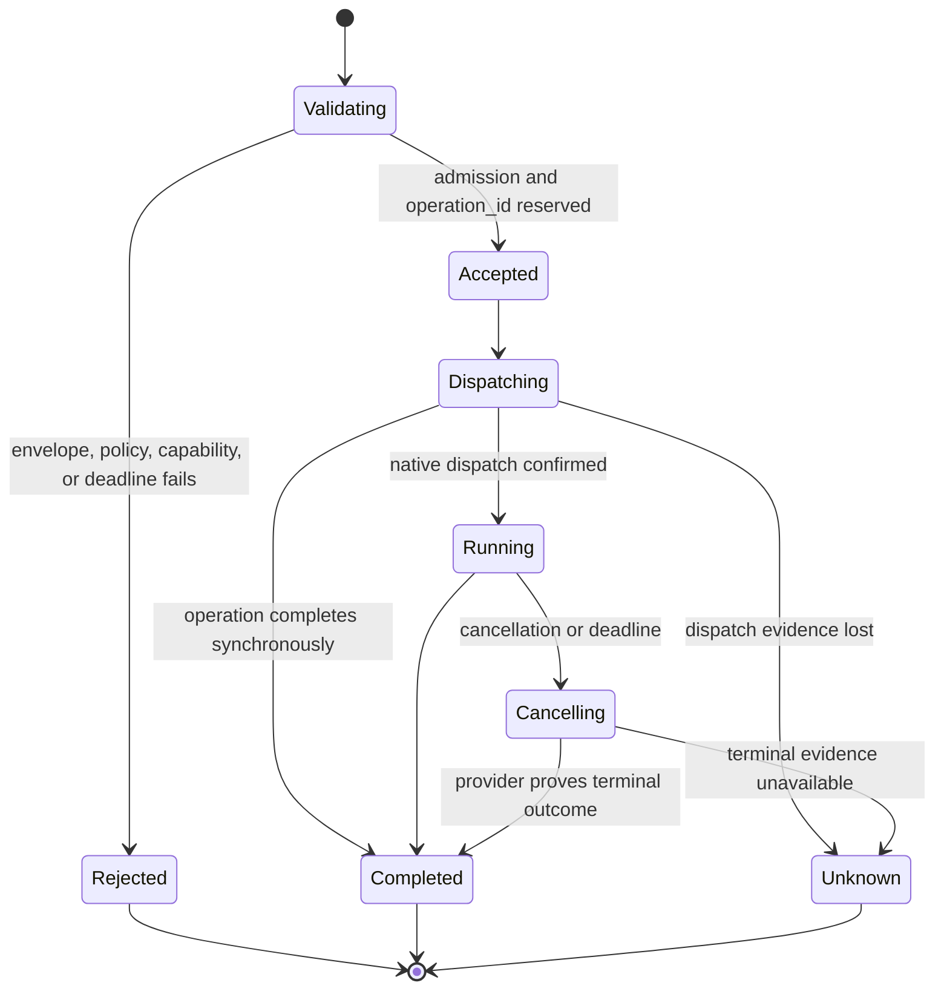

# Environment Interaction Protocol

## Design Position

The Environment Interaction Protocol (EIP) is the transport-neutral wire contract between an authenticated Environment client and `agent-envd`. EIP uses JSON-RPC 2.0 envelopes, one versioned method catalog, bounded JSON values, typed errors, opaque handles, and explicit side-effect evidence.

EIP is a semantic Environment protocol, not a remote syscall interface. Operations such as canonical path resolution, bounded search, patch validation, command-tree control, retained-output reads, and local-port observation execute beside the native resources. Client-side validation improves errors but never replaces envd enforcement.

## Boundaries

| Concern                                                                   | Owner                                                                                  | Relationship                                             |
| ------------------------------------------------------------------------- | -------------------------------------------------------------------------------------- | -------------------------------------------------------- |
| JSON-RPC method names, params, results, errors, and version negotiation   | EIP                                                                                    | Identical across every transport                         |
| Canonical IDL and generated Rust/Python realization                       | [Protocol Source, Client, and Generation](08-protocol-source-client-and-generation.md) | Must encode this protocol without semantic drift         |
| Framing, API-key verification, connection liveness, and session carrier   | [Transports and Sessions](03-transports-and-sessions.md)                               | Establishes authenticated context before method dispatch |
| Multi-Environment routing and Harness tool policy                         | Harness                                                                                | Selects a binding and maps provider-neutral calls to EIP |
| Native canonicalization, process control, receipts, and resource evidence | `agent-envd`                                                                           | Executes an accepted EIP operation                       |
| Provider provisioning and durable Agent completion                        | Host                                                                                   | Outside EIP                                              |

Transport headers, WebSocket upgrade fields, stdio pipes, and HTTP session selectors never appear in ordinary EIP params. Conversely, changing transport cannot change a method name, successful result, side-effect classification, or retry rule.

## Wire Envelope

Every application message is one UTF-8 JSON object conforming to JSON-RPC 2.0. EIP does not support JSON-RPC batch arrays. A request has a string or integer `id`; a notification omits `id`; a response has exactly one of `result` or `error`.

```json
{
  "jsonrpc": "2.0",
  "id": "req-42",
  "method": "shell.exec",
  "params": {
    "context": {
      "operation_id": "op-01J...",
      "deadline": "2026-08-20T10:40:00Z",
      "idempotency_key": null,
      "invocation_grant": null
    },
    "request": {
      "command": {
        "kind": "argv",
        "executable": "git",
        "arguments": ["status", "--short"]
      },
      "cwd": {"mount_id": "workspace", "path": "/repo"},
      "output_policy": {
        "max_inline_bytes": 16384,
        "max_output_bytes": 1048576,
        "overflow": "retain"
      }
    }
  }
}
```

JSON text, nesting depth, collection lengths, identifiers, paths, argument arrays, environment maps, and every encoded byte field are bounded before domain validation. Binary content uses unpadded base64 in a typed byte field; it is never placed in an ambiguous JSON string. Numbers that represent byte counts, offsets, generations, or durations are non-negative integers within the documented range.

Unknown top-level JSON-RPC fields are ignored only when JSON-RPC permits that behavior and they do not use a reserved `eip_` prefix. Unknown fields inside typed EIP params or results fail validation unless the selected protocol revision explicitly marks that object as additive. This keeps authority-bearing requests fail closed.

## Initialization

`initialize` is the first EIP request on a stdio or WebSocket connection and the request that creates an HTTP logical session. No other method is accepted before it.

The following schema is serialized EIP JSON:

```python
class EIPClientInfo(BaseModel):
    name: str
    version: str


class InitializeParams(BaseModel):
    supported_protocol_versions: tuple[str, ...]
    client: EIPClientInfo
    expected_environment_id: str
    required_capabilities: tuple[str, ...] = ()
    optional_capabilities: tuple[str, ...] = ()


class EIPServerInfo(BaseModel):
    name: Literal["agent-envd"]
    version: str


class EIPLimits(BaseModel):
    max_request_bytes: int
    max_response_bytes: int
    max_concurrent_operations: int
    max_processes: int
    max_operation_duration_ms: int
    max_inline_output_bytes: int
    max_output_bytes: int
    max_retained_bytes: int
    max_retained_objects: int
    max_retention_ttl_ms: int
    receipt_ttl_ms: int


class EnvironmentDescriptor(BaseModel):
    environment_id: str
    generation: int
    capabilities: tuple[str, ...]
    mounts: tuple[MountDescriptor, ...]
    shell_profiles: tuple[ShellProfileDescriptor, ...]
    limits: EIPLimits
    isolation: IsolationPosture


class InitializeResult(BaseModel):
    protocol_version: str
    server: EIPServerInfo
    descriptor: EnvironmentDescriptor
```

Protocol versions use `<major>.<minor>`. The server selects the highest mutually supported minor within a mutually supported major. `expected_environment_id` is mandatory and is compared before a session becomes initialized; a mismatch fails without publishing a usable descriptor. A directly launched adapter learns the value from trusted provider lifecycle state or the validated readiness record, not from model input.

A required capability absent from the effective descriptor fails initialization. Optional capabilities are negotiation hints; the result's descriptor is authoritative observed support. Neither list grants capability or widens daemon policy.

The descriptor contains no API key, transport session value, invocation grant, native path, provider lifecycle credential, protected path, helper location, or model-visible authority. Mount and shell descriptors use logical IDs. Limits are hard observed ceilings that a request can only narrow.

Initialization itself has no `EIPCallContext`, cannot cause a native resource mutation, and is never retried inside an existing connection or HTTP logical session. Reinitialization requires a new transport session.

## Common Operation Context

Every method other than `initialize`, transport health, and server notification carries this serialized context:

```python
class InvocationGrantRef(BaseModel):
    grant_id: str
    audience: str
    claims_digest: str
    expires_at: datetime


class EIPCallContext(BaseModel):
    operation_id: str
    deadline: datetime | None = None
    idempotency_key: str | None = None
    invocation_grant: InvocationGrantRef | None = None
```

`operation_id` is a client-generated, bounded, unpredictable correlation value unique within the authenticated session. It lets cancellation target an accepted operation before its original response arrives. It is not a replay key, process handle, receipt, or credential.

`deadline` is an absolute UTC deadline. Envd narrows it with method and daemon hard ceilings. Expiry before dispatch returns a pre-dispatch timeout. Expiry after dispatch triggers method-specific cancellation and reconciliation; it does not prove the side effect absent.

`idempotency_key` is allowed only on methods whose catalog declares idempotency-key support. It is scoped to authenticated principal, Environment identity and generation, method, and canonical semantic request digest. Reusing a key with different params returns `idempotency_conflict`. A matching completed record can replay the same bounded result or receipt. A matching in-progress record attaches only when the method declares safe coalescing; otherwise it returns `operation_in_progress`.

`invocation_grant` is a reference to a Host-issued, audience-bound grant defined by the Harness [authorization and grants](../agent-harness/07-tool-execution.md#authorization-and-grants) boundary. It remains distinct from transport authentication. Envd verifies it through trusted binding configuration when a method or policy requires one. The reference cannot assert a principal, mount, path, capability, or Environment identity that exceeds the authenticated session ceiling.

### Method idempotency classes

| Class                    | Methods                                                                                                                                                           | Contract                                                                                                                                                                    |
| ------------------------ | ----------------------------------------------------------------------------------------------------------------------------------------------------------------- | --------------------------------------------------------------------------------------------------------------------------------------------------------------------------- |
| Read-only retry          | `environment.describe`, `resource.resolve`, file reads, `process.inspect`, `process.read_output`, `process.wait`, port observations, `output.read`, `receipt.get` | No native mutation; retries still obey revision, snapshot, cursor, generation, and deadline semantics                                                                       |
| Provider-key replay      | File mutations, `shell.exec`, `process.start`, `process.write_stdin`, `process.signal`, `process.retain`, `output.retain`, `state.restore`                        | Accept an optional idempotency key and retain one semantic request/result or in-progress record for a finite advertised window                                              |
| State-idempotent control | `operation.cancel`, `process.close_stdin`, `process.kill`, `process.release`, `output.release`                                                                    | Repeating the same target action under the same authority converges while a bounded live record or tombstone remains; a key is optional and never widens tombstone lifetime |
| Session terminal         | `session.close`                                                                                                                                                   | Applying close again cannot reopen the session; after transport/session removal the client reconciles owned resources through a fresh session rather than replaying close   |
| State export             | `state.export`                                                                                                                                                    | Read-only observation that includes only explicitly selected leases and can differ as expiry advances                                                                       |

Provider-key methods can execute without a key unless their owning method requires one, but then a lost response has no automatic replay guarantee. A client includes a key before the first dispatch whenever it may need safe mutation retry. Envd never retrofits a key after an ambiguous attempt.

## Capability and Method Catalog

A method is callable only when its capability appears in the initialized descriptor and current daemon policy permits it. The initial catalog is:

| Capability             | Methods                                                                                                                                                                      | Owning semantics                                                     |
| ---------------------- | ---------------------------------------------------------------------------------------------------------------------------------------------------------------------------- | -------------------------------------------------------------------- |
| `environment.describe` | `environment.describe`                                                                                                                                                       | Refresh descriptor, generation, limits, and posture                  |
| `environment.state`    | `state.export`, `state.restore`                                                                                                                                              | [Resource Operations](04-resource-operations.md)                     |
| `resource.resolve`     | `resource.resolve`                                                                                                                                                           | [Resource Operations](04-resource-operations.md)                     |
| `file.read`            | `file.stat`, `file.read`, `file.list`, `file.search`                                                                                                                         | [Resource Operations](04-resource-operations.md)                     |
| `file.write`           | `file.write`, `file.mkdir`, `file.patch`, `file.copy`, `file.move`, `file.remove`                                                                                            | [Resource Operations](04-resource-operations.md)                     |
| `shell.exec`           | `shell.exec`                                                                                                                                                                 | [Command and Process Execution](05-command-and-process-execution.md) |
| `process.manage`       | `process.start`, `process.inspect`, `process.read_output`, `process.write_stdin`, `process.close_stdin`, `process.signal`, `process.wait`, `process.kill`, `process.release` | [Command and Process Execution](05-command-and-process-execution.md) |
| `process.retain`       | `process.retain`                                                                                                                                                             | [Command and Process Execution](05-command-and-process-execution.md) |
| `port.observe`         | `port.inspect`, `port.wait`                                                                                                                                                  | [Resource Operations](04-resource-operations.md)                     |
| `output.read`          | `output.read`, `output.release`                                                                                                                                              | [Output Retention](06-output-retention.md)                           |
| `output.retain`        | `output.retain`                                                                                                                                                              | [Output Retention](06-output-retention.md)                           |
| `operation.cancel`     | `operation.cancel`                                                                                                                                                           | This document                                                        |
| `receipt.read`         | `receipt.get`                                                                                                                                                                | This document                                                        |
| `session.close`        | `session.close`                                                                                                                                                              | [Transports and Sessions](03-transports-and-sessions.md)             |

Methods not listed in the selected protocol version return standard JSON-RPC `method_not_found`. A known method whose capability is absent returns EIP `unsupported`; this distinction lets a client detect protocol incompatibility separately from current provider posture.

The method catalog contains no provider provisioning, container lifecycle, daemon shutdown, API-key rotation, arbitrary host networking, native PID lookup, unrestricted path open, or shell-evaluated administrative method.

## Descriptor Refresh

`environment.describe` returns the current `EnvironmentDescriptor`. It can report a newer generation, a narrower capability set, or unavailable posture. It does not mutate the session's generation snapshot or authorize existing handles under a new generation.

When the returned generation differs from the one selected at initialization, the session becomes generation-stale and all resource handles, cursors, leases, and state references are stale. That session admits only `environment.describe`, `receipt.get` for retained evidence, and `session.close`; every new resource operation returns `stale_generation`. The client creates a fresh initialized session. Base EIP does not restore stale-generation state; the owning backend or Host explicitly migrates or drops it before any new restore attempt. Envd never rewrites a handle to the new generation.

The core utility method shapes are serialized EIP JSON:

```python
class EnvironmentDescribeParams(BaseModel):
    context: EIPCallContext


class EnvironmentDescribeResult(BaseModel):
    descriptor: EnvironmentDescriptor


class OperationCancelParams(BaseModel):
    context: EIPCallContext
    target_operation_id: str


class OperationCancelResult(BaseModel):
    status: Literal[
        "not_found",
        "already_terminal",
        "cancellation_requested",
        "not_cancellable",
    ]
```

## Opaque Selectors

The following wire values are bounded opaque strings:

```python
class ProcessHandle(RootModel[str]): ...
class OutputReference(RootModel[str]): ...
class OutputCursor(RootModel[str]): ...
class ProcessLeaseRef(RootModel[str]): ...
class OutputLeaseRef(RootModel[str]): ...
class ReceiptRef(RootModel[str]): ...
class StateRef(RootModel[str]): ...
```

Their private records bind at least:

- Environment identity and generation;
- authenticated principal and configured authority partition;
- object kind and creating operation;
- current lifecycle state and expiry;
- any mount, process, output, or request-shape facts required for safe follow-up.

A selector reveals no native PID, path, file descriptor, provider ID, storage key, or secret. Possessing it is insufficient: every use repeats session authentication, capability, ownership, and current-policy checks. Process, output, cursor, lease, and state selectors additionally require the exact current generation. A `ReceiptRef` remains bound to its originating generation but can be read from a newer initialized generation under the same Environment identity and authority partition while retained, because it grants no native resource access and exists specifically for reconciliation. A failed ownership check returns `not_found_or_denied` without confirming that another principal's object exists.

## Operation Acceptance, Cancellation, and Completion



Acceptance reserves `operation_id` and admission capacity. It is process-local unless a method's receipt or idempotency contract says otherwise. JSON-RPC response delivery is independent of native completion evidence.

`operation.cancel` has params `{context, target_operation_id}`. It requests cancellation of an accepted operation in the same authenticated authority partition. The result reports one of:

- `not_found`: no matching accepted operation is visible;
- `already_terminal`: terminal provider evidence already exists;
- `cancellation_requested`: the owning resource manager accepted the request;
- `not_cancellable`: the method or current stage cannot be safely interrupted.

A successful cancellation request is not terminal proof. The original operation or later receipt reconciliation reports `cancelled`, `completed`, `timed_out`, or `unknown_outcome`. Closing a connection is equivalent only to a best-effort cancellation request for session-owned non-retained work; it is never itself evidence of cancellation.

## Receipts and Side-effect Evidence

A mutating operation can return a bounded receipt alongside its method result:

```python
class OperationReceipt(BaseModel):
    receipt_ref: ReceiptRef
    operation_id: str
    method: str
    environment_id: str
    generation: int
    request_digest: str
    stage: Literal[
        "accepted",
        "dispatched",
        "exec_confirmed",
        "completed",
        "unknown",
    ]
    outcome: Literal[
        "succeeded",
        "failed",
        "cancelled",
        "timed_out",
        "unknown",
    ] | None
    observed_at: datetime


class ReceiptGetParams(BaseModel):
    context: EIPCallContext
    receipt_ref: ReceiptRef


class ReceiptGetResult(BaseModel):
    receipt: OperationReceipt
```

A receipt records only facts directly observed by envd. `accepted` proves no native dispatch. `dispatched` proves the receiver crossed its native dispatch boundary but not whether the mutation completed. `exec_confirmed` is specific to a command whose requested executable passed the exec handshake. `completed` has a terminal outcome. `unknown` preserves ambiguity.

`receipt.get` re-reads a receipt visible to the same authenticated authority partition. It can return retained evidence from an older generation of the same Environment identity but never retargets or authorizes that generation's resource. Receipt retention is finite and advertised. Missing or expired receipt evidence is not converted into failure. Receipts are observations, not Host durable completion, business transaction commits, provider billing records, or credentials.

## Error Contract

A JSON-RPC method error has this bounded `error.data` schema:

```python
type RetryHint = Literal[
    "never",
    "same_request",
    "after_refresh",
    "after_capacity",
    "after_authority_change",
    "reconcile_first",
]

type DispatchStage = Literal[
    "pre_dispatch",
    "dispatching",
    "dispatched",
    "completed",
    "unknown",
]


class EIPErrorData(BaseModel):
    error_type: str
    retry_hint: RetryHint
    dispatch_stage: DispatchStage
    operation_id: str | None = None
    environment_id: str | None = None
    generation: int | None = None
    capability: str | None = None
    field: str | None = None
    handle_kind: str | None = None
    produced_bytes: int | None = None
    captured_bytes: int | None = None
    dropped_bytes: int | None = None
    emitted_items: int | None = None
    dropped_items: int | None = None
    process_status: ProcessStatus | None = None
    receipt: OperationReceipt | None = None
    safe_detail: str | None = None
```

Stable error codes are:

| JSON-RPC code | `error_type`                 | Meaning                                                                                        |
| ------------: | ---------------------------- | ---------------------------------------------------------------------------------------------- |
|      `-32700` | `parse_error`                | Invalid JSON before an EIP envelope exists                                                     |
|      `-32600` | `invalid_request`            | Invalid JSON-RPC envelope or forbidden batch                                                   |
|      `-32601` | `method_not_found`           | Method is absent from the selected protocol version                                            |
|      `-32602` | `invalid_params`             | Typed params fail validation                                                                   |
|      `-32603` | `internal_error`             | Bounded unexpected server fault with no safe narrower class                                    |
|      `-32001` | `not_initialized`            | Method used before successful initialization                                                   |
|      `-32002` | `already_initialized`        | Initialization repeated in one session                                                         |
|      `-32003` | `protocol_incompatible`      | No version or required-capability agreement                                                    |
|      `-32010` | `denied`                     | Authenticated principal or invocation policy denies the action                                 |
|      `-32011` | `not_found_or_denied`        | Object is absent or intentionally indistinguishable from another principal's object            |
|      `-32012` | `unsupported`                | Known method or option is unavailable under current capability or policy                       |
|      `-32020` | `stale_generation`           | Request or selector belongs to another generation                                              |
|      `-32021` | `invalid_handle`             | Handle kind, state, or request shape is invalid                                                |
|      `-32022` | `retention_gap`              | Requested output or retained state is no longer available                                      |
|      `-32030` | `busy`                       | Bounded admission has no capacity                                                              |
|      `-32031` | `quota_exceeded`             | A finite resource quota cannot reserve capacity                                                |
|      `-32032` | `output_limit_exceeded`      | Effective `OutputPolicy` selected fail-on-overflow                                             |
|      `-32040` | `timeout`                    | Deadline expired with a known timeout outcome                                                  |
|      `-32041` | `cancelled`                  | Provider proves cancellation before successful completion                                      |
|      `-32042` | `unknown_outcome`            | A possible side effect cannot be classified safely                                             |
|      `-32043` | `operation_in_progress`      | Matching operation or idempotency record is still active and cannot coalesce                   |
|      `-32044` | `idempotency_conflict`       | Key was reused for another semantic request                                                    |
|      `-32050` | `provider_unavailable`       | Native or provider resource is not currently usable                                            |
|      `-32051` | `execution_isolation_failed` | Required per-command containment or pre-exec identity policy could not be established          |
|      `-32052` | `cleanup_failed`             | Native resource reached a terminal command state but required cleanup could not be established |
|      `-32053` | `command_start_failed`       | The selected executable could not be executed after transactional preparation                  |
|      `-32060` | `conflict`                   | Compare-and-swap, topology, lease, or resource-state precondition failed                       |
|      `-32061` | `invalid_state`              | Saved backend state is malformed, incompatible, or cannot be restored atomically               |

Transport authentication failures occur before JSON-RPC dispatch and therefore use transport-native status or connection close rather than fabricating an EIP error. Once a valid request is parsed in an initialized session, a method failure uses JSON-RPC even on HTTP.

The optional byte/item counts and `process_status` carry only bounded producer and command-state evidence for failures such as output overflow; they never carry output content or a native process identifier. `safe_detail` is optional, bounded, and stable only for human diagnosis. Clients branch on code and `error_type`, not message text. Errors exclude credentials, authorization headers, grants, command environments, full command text, native private paths, file content, output content, isolation profiles, and other principals' identifiers.

## Retry and Unknown Outcomes

Reads can be retried only when the method's snapshot and cursor semantics permit it. Mutations can be retried when one of these is true:

- the error proves `dispatch_stage="pre_dispatch"`;
- the same idempotency key and semantic request are supported and retained;
- a receipt or resource read reconciles the prior operation to a terminal fact that makes retry safe.

A timeout, cancellation race, dropped HTTP response, WebSocket close, or stdio EOF after possible dispatch produces `unknown_outcome` unless envd has stronger evidence. A client never automatically switches transport or provider and repeats an ambiguous mutation.

## Notifications

WebSocket and stdio can carry optional JSON-RPC notifications after negotiation. Initial notification names are:

- `environment.changed`, indicating that descriptor or generation observation should be refreshed;
- `process.changed`, indicating that a visible process record may have new status or output;
- `output.available`, indicating that a cursor may advance;
- `session.expiring`, indicating impending session expiry.

Notifications are bounded hints. They can be coalesced, delayed, or lost and never carry authority, full output, or a terminal Host fact. Clients reconcile with `environment.describe`, `process.inspect`, `process.wait`, or `output.read`. HTTP remains semantically complete without server push.

Client-to-server JSON-RPC notifications are not accepted for mutations, cancellation, release, or session close because those actions require a correlated result. Unknown notifications are ignored only when their namespace was negotiated as optional.

## Compatibility and Versioning

EIP protocol version is independent of daemon package, provider profile, readiness schema, and Harness package version.

Within one protocol major version:

- adding an optional result field is compatible when old clients can ignore it safely;
- adding a capability-gated method or enum value is compatible only when receivers do not treat unknown values as an existing behavior;
- adding an optional request field is compatible only in a negotiated newer minor, with an explicit non-widening default; a client that negotiated an older minor omits the field rather than relying on that server to ignore it;
- method names, existing field meaning, error meaning, default side-effect behavior, idempotency scope, cursor semantics, and generation fencing remain stable.

Removing a field, changing an existing default, widening authority, making an incomplete result appear complete, changing retry or cancellation meaning, or changing a selector's scope requires a new major version. Clients fail explicitly when no compatible major exists or a required capability is absent.

Common conformance fixtures run the generated Python client against the Rust daemon with identical request/result/error cases over stdio, HTTP, and WebSocket. Descriptor, generated-code, and golden-wire drift gates are owned by [Protocol Source, Client, and Generation](08-protocol-source-client-and-generation.md). Transport tests add framing, authentication, reconnect, concurrency, liveness, and size cases but cannot redefine protocol behavior.

## Invariants

01. Every application message contains exactly one JSON-RPC envelope; EIP batch requests are invalid.
02. `initialize` is the first and only initialization request in a session and verifies expected Environment identity before method admission.
03. Transport identity and session state never come from EIP params.
04. Every non-initialization method carries one bounded `EIPCallContext` with a session-unique operation ID.
05. A method executes only when present in the selected protocol and enabled by the observed capability and current policy.
06. Opaque selectors grant no authority and are revalidated against principal, Environment identity, kind, state, and expiry; native resource selectors also require current generation, while a retained receipt can report only its immutable originating-generation evidence.
07. Cancellation is a request; only provider evidence establishes a terminal cancellation outcome.
08. A receipt states only the envd stage and outcome it directly observed and never implies Host durable completion.
09. Errors preserve pre-dispatch, dispatched, completed, and unknown distinctions and never expose secrets or another principal's object existence.
10. Automatic mutation retry requires proven non-dispatch, retained idempotency, or reconciliation evidence.
11. Notifications are lossy hints; every semantic fact remains readable through an ordinary method.
12. Transport choice cannot change method, error, output, side-effect, idempotency, or compatibility semantics.
