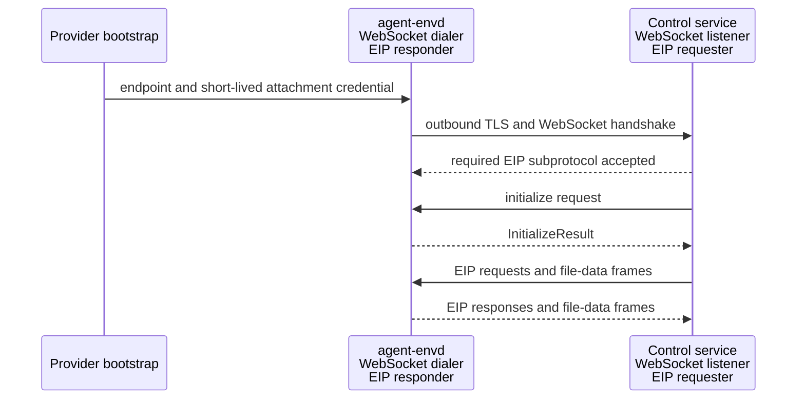
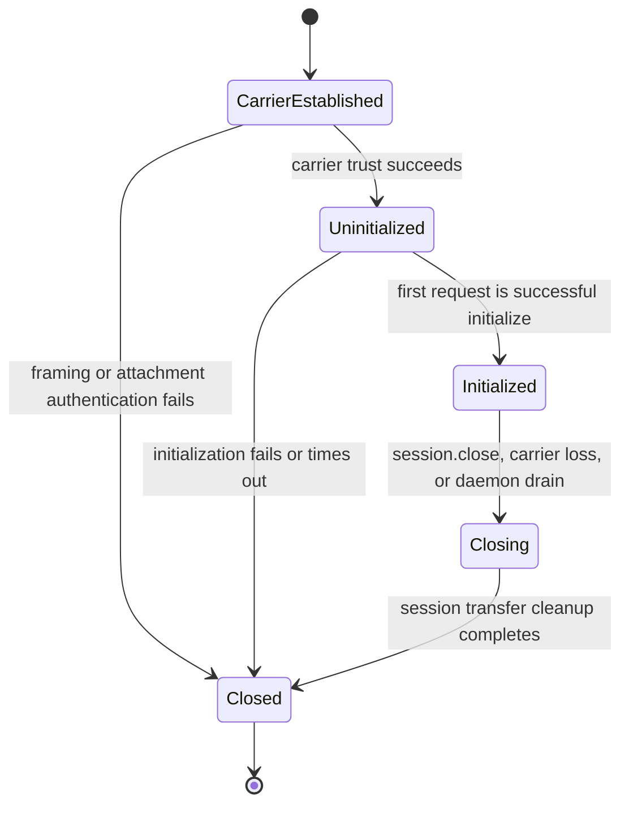

# Transports and Sessions

## Design Position

EIP has two carrier profiles:

- trusted stdio for a provider that launches `agent-envd` and owns its private pipes;
- outbound reverse WebSocket for a provider that needs a reconnectable network path and can expose a control-service endpoint that envd dials.

Both profiles carry the same JSON-RPC control messages and fixed binary file-data frames. They establish peer context, framing, bounds, backpressure, session lifetime, and liveness; they never add methods or change operation, transfer, commit, receipt, or retry semantics.

The reverse-WebSocket direction does not reverse protocol roles. The control service is always the EIP requester/client. Envd is always the EIP responder/server. Envd initiates the TCP/TLS/WebSocket carrier because the controlled Environment need not accept inbound connections.

Envd exposes no inbound HTTP, WebSocket, health, readiness, download, or upload listener. HTTP control and separate GET/PUT file-data routes are not EIP carrier profiles.

## Boundaries

| Concern                                                                                     | Owner                                                                          | Relationship                                        |
| ------------------------------------------------------------------------------------------- | ------------------------------------------------------------------------------ | --------------------------------------------------- |
| Endpoint, attachment credential, and Environment lifecycle bootstrap                        | Host provider adapter                                                          | Supplies trusted outbound connection configuration  |
| Daemon startup, local readiness, reconnect policy, and fatal attachment state               | [Daemon Lifecycle and Configuration](01-daemon-lifecycle-and-configuration.md) | Prepares the carrier without granting EIP authority |
| Stdio framing, reverse-WebSocket messages, attachment authentication, and protocol sessions | This document                                                                  | Carries EIP control and file data                   |
| Initialization, methods, operation replay, transfers, results, and errors                   | [EIP Protocol](02-eip-protocol.md)                                             | Identical on both profiles                          |
| Method authorization and native enforcement                                                 | `agent-envd` resource owners                                                   | Repeated after carrier authentication               |
| Control-service user or tenant authorization                                                | Host or product control plane                                                  | Never inferred by envd from an EIP parameter        |

The attachment credential authorizes one envd instance to connect to its trusted control-service binding. It is not a business credential, product-user identity, model-visible value, EIP selector, or substitute for daemon-side Environment identity, generation, mount, method, and resource checks.

## Protocol Roles and Carrier Direction



Carrier establishment and EIP message direction are independent:

- envd opens, reconnects, and closes the outbound network connection;
- the control service sends every EIP request, including the first `initialize` request;
- envd sends correlated EIP responses;
- binary frame direction follows the typed file reader or writer, not the WebSocket dialer;
- neither peer sends JSON-RPC notifications or server-initiated EIP requests in EIP 1.0.

This fixed role model keeps generated requester stubs on the control-service side and generated responder dispatch on the daemon side for both stdio and reverse WebSocket.

## Session Model

Each accepted stdio carrier and each successfully upgraded reverse-WebSocket connection creates one fresh uninitialized EIP session.



An initialized session binds:

- the trusted carrier peer;
- the selected EIP protocol version;
- the expected Environment identity and observed daemon generation;
- the descriptor's exact `available_methods`, configured mounts, root mount, limits, and isolation posture;
- bounded request correlation and session-owned transfer state.

A session is not a Harness run, tenant, principal, generation lease, or resource-authority partition. It does not own accepted operations, process records, receipts, or retained output. It owns only file readers, writers that have not handed their candidate to a commit operation, binary attachments, and bounded transfer terminal state.

Carrier loss destroys the session and all session-owned transfers. Generation-owned operations, handoff-complete commits, processes, receipts, and retained output remain under their owning daemon records. A later reverse-WebSocket connection always initializes a new session; it never resumes the prior WebSocket, request correlation table, reader, writer, or binary stream.

`session.close` atomically stops later session admission before cleaning session-owned transfers. A concurrently admitted `file.commit_writer` either completes its candidate handoff first and becomes operation-owned, or loses to session closing and remains cleanup-owned by the session. Session close does not cancel operations, close process stdin, terminate processes, or release retained output.

## Shared Carrier Rules

Both profiles enforce:

- one complete UTF-8 JSON-RPC object per control message, with no batch arrays or notifications;
- one response for each admitted control request unless the carrier fails;
- independent JSON-RPC IDs and bounded out-of-order responses for concurrent requests;
- binary file data only after a successful typed reader or writer open;
- one direction, session, transfer handle, and attachment per binary stream;
- exact contiguous stream offsets starting at zero for the attachment;
- finite control, binary frame, nesting, string, collection, queue, transfer, and in-flight bounds before unbounded allocation;
- bounded fair scheduling so control, cancellation, reset, close, and unrelated transfers continue to make progress;
- no implicit carrier fallback or replay after a possibly dispatched operation.

A carrier can stop reading when admission or memory capacity is exhausted. Its per-transfer and aggregate queues apply backpressure to the producer rather than accumulating frames. Parsed requests, response waiters, and late-response correlation state are independently bounded. Abandoning a sent request cannot retain caller admission forever: the client either keeps only a separately bounded late-response tombstone or terminates the unhealthy carrier before admitting work that cannot be correlated safely.

Carrier liveness and EIP operation timeout are separate. A liveness failure tears down the session but does not classify an accepted operation as cancelled or failed. `EIPCallContext.timeout_ms` is interpreted by the daemon after request admission using a monotonic clock. File transfer timeout is separately selected at open.

## Binary Data-Frame Profile

Stdio bodies and reverse-WebSocket binary messages carry one fixed network-byte-order EIP data frame:

| Field               | Width | Contract                                                                                 |
| ------------------- | ----: | ---------------------------------------------------------------------------------------- |
| magic               |     4 | ASCII `EIPD`                                                                             |
| profile version     |     1 | `1`                                                                                      |
| frame kind          |     1 | `1=ATTACH`, `2=ATTACHED`, `3=CHUNK`, `4=END`, `5=END_ACK`, `6=RESET`                     |
| terminal status     |     2 | Zero except on `RESET`: protocol, denied, expired, source, limit, cancelled, or internal |
| handle byte length  |     2 | Positive and within the EIP selector bound                                               |
| reserved            |     2 | Zero                                                                                     |
| stream offset       |     8 | Bytes preceding a chunk, or accepted/terminal byte count                                 |
| payload byte length |     4 | Raw chunk length; zero for every non-`CHUNK` frame                                       |

The 24-byte header is followed by the UTF-8 handle and raw payload. The complete frame is at most `max_transfer_frame_bytes`. Attach and attached offsets are zero. Gaps, duplicates, reordering, wrong direction, wrong session, a second attachment, data after terminal, malformed lengths, or oversize reset that transfer. A `RESET` offset reports the next expected or accepted byte.

### Reader lifecycle

A reader uses:

```text
client ATTACH
server ATTACHED
server CHUNK*
server END
client file.close_reader
```

`END` proves only clean producer termination at the terminal byte count. The client does not send `END_ACK` for a reader. Successful `file.close_reader` is the sole semantic consumer-acceptance action and returns the daemon's produced-byte count and SHA-256 digest. The high-level client calls it only after the public consumer has drained every queued chunk and its local count and digest agree. Early abandonment, cancellation, or carrier failure sends `RESET` when the carrier remains usable and never calls successful close. A prefetched `END` is not consumer acceptance.

### Writer lifecycle

A writer uses:

```text
client ATTACH
server ATTACHED
client CHUNK*
client END
server END_ACK
client file.commit_writer or file.abort_writer
```

Writer `END_ACK` confirms that envd accepted and sealed the complete uploaded stream at the terminal offset. It does not publish the destination. Only `file.commit_writer` can hand off candidate ownership and perform the target mutation.

When a client sends `RESET` for a live session-owned transfer, envd performs cleanup and returns at most one bounded `RESET` acknowledgement. The client consumes it through a bounded retired-handle record and never echoes it. Envd-initiated reset is already terminal. A reset received after writer ownership has handed off to commit cannot demote or cancel that operation.

EIP major 1 selects data-frame profile version 1 after initialization. An incompatible layout requires another EIP major. Later features can reuse the physical frame only with a typed handle, direction, lifecycle, and negotiated EIP contract; the frame does not create a generic byte-stream authority.

## Trusted Stdio Profile

Stdio is the direct parent-process profile. Each control or data frame uses Language Server Protocol-style outer framing:

```text
Content-Length: <decimal byte length>\r\n
Content-Type: application/json; charset=utf-8\r\n
\r\n
<exact UTF-8 JSON control bytes>
```

or:

```text
Content-Length: <decimal byte length>\r\n
Content-Type: application/vnd.converge.eip-data\r\n
\r\n
<one EIP binary data frame>
```

`Content-Length` is mandatory, decimal, non-negative, and checked before body allocation. `Content-Type` is mandatory for binary data and, when present for control, identifies UTF-8 JSON. Header count, line length, and aggregate header bytes are bounded while reading; a parser never reads an unbounded line and checks it afterward. Repeated, malformed, or conflicting framing headers fail the carrier.

Stdin carries requester-to-envd control and data frames. Stdout carries envd-to-requester control and data frames. A fair scheduler never splits an outer frame. Stderr carries structured daemon logs and never protocol frames. Command stdout and stderr remain retained-output data and never appear on daemon stdout.

Stdio has no bearer credential. Its trust boundary requires the provider to create private pipes, launch the expected executable with trusted configuration, validate child ownership, and prevent another principal from replacing or attaching to the descriptors. The first request is `initialize`. Parent stdin EOF is carrier loss and normally also triggers daemon shutdown because the parent owns this daemon lifecycle. EOF is never successful transfer EOF or evidence that an operation was not dispatched.

## Outbound Reverse-WebSocket Profile

### Trusted bootstrap

The provider supplies envd with:

- one normalized `wss://` endpoint with no fragment or embedded credential;
- the expected EIP WebSocket subprotocol family;
- a short-lived attachment Bearer credential or a trusted refresh source;
- TLS trust configuration limited to ordinary platform roots or explicit operator trust roots;
- finite connection, initialization, liveness, and reconnect bounds.

The attachment credential is secret bootstrap input. It is never accepted in a URL, query, cookie, subprotocol, EIP message, command environment, readiness record, log, trace, or error. A provider can refresh it without changing the daemon generation because refresh changes carrier attachment authority, not EIP resource identity.

### TLS and upgrade

Envd dials the endpoint with ordinary certificate-chain and hostname validation. It does not disable verification, follow redirects, silently downgrade from `wss` to `ws`, accept a mismatched host, or use caller-controlled forwarding headers as trust evidence.

The upgrade request includes:

```http
Authorization: Bearer <short-lived attachment credential>
Sec-WebSocket-Protocol: eip.v1
```

The control service must select exactly the offered supported `eip.v<major>` value. Missing or different subprotocol, redirect, invalid TLS, malformed upgrade, or an unexpected extension fails the connection before EIP initialization. Per-message compression is disabled unless a later accepted profile defines bounded decompression explicitly.

The Bearer credential authenticates the envd attachment to the control service. The control service independently resolves that credential to the expected Environment binding before accepting the upgrade. It never forwards browser or product-user credentials as the envd attachment token.

### Initialization and multiplexing

After upgrade, the control service's first application message is one text message containing `initialize`. Envd admits no other request or binary frame before initialization succeeds. A second pre-initialization message, a non-`initialize` first request, invalid JSON, a batch, notification, binary message, or initialization timeout closes the connection. When a valid request ID is available, envd may first return the bounded typed initialization error.

After initialization:

- one text message contains one complete JSON-RPC request or response;
- one binary message contains one complete EIP data frame;
- WebSocket fragmentation is allowed only within the configured aggregate message ceiling;
- text and binary messages can interleave while per-transfer ordering remains exact;
- WebSocket ping/pong provides carrier liveness and has no EIP completion meaning.

The control service can multiplex bounded control requests and transfers on one connection. Envd can return control responses out of order by JSON-RPC ID. Neither peer relies on TCP connection affinity beyond that one WebSocket session.

### Reconnect and fatal attachment states

Every carrier failure closes that session. Envd reconnects only by creating a new TLS/WebSocket connection and waiting for a fresh `initialize` request. It never automatically replays an EIP request, resumes a transfer, or treats the new connection as the old session.

Recoverable connection failures use bounded exponential backoff with full jitter and a configured cap. Backoff state is bounded and reset only after a connection remains initialized for the configured stability interval; a flapping endpoint cannot create a tight reconnect loop.

Before or after an authentication failure, envd asks the trusted bootstrap source for a fresh attachment credential when refresh is supported. The following failures are generation-fatal rather than endlessly retried:

- invalid TLS chain or hostname;
- unsupported or missing mandatory subprotocol;
- invalid endpoint policy or redirect;
- attachment authorization failure when no credential refresh is available;
- refresh failure that the provider classifies as non-recoverable;
- repeated protocol incompatibility proving the configured peers cannot initialize.

A generation-fatal attachment failure stops carrier admission, triggers bounded daemon drain, and exits nonzero with a non-secret failure class. Transient DNS, connect, remote-unavailable, or liveness failures remain reconnectable within provider lifecycle policy.

## Readiness

Daemon-local readiness and initialized-carrier readiness are distinct:

- **local readiness** means configuration, generation-private stores, mounts, execution backend, and required isolation probe succeeded and the reverse-WebSocket connector can start;
- **carrier readiness** means one current WebSocket is authenticated, upgraded with the required subprotocol, and initialized for the configured Environment and generation.

Envd never binds a health endpoint. The provider observes process state and typed connector state through its trusted launch/control channel. A consumer must not dispatch EIP work until carrier readiness is established. Loss of carrier readiness does not make local daemon state, processes, or accepted operation evidence disappear.

## Control-Service and Browser Boundary

The reverse-WebSocket listener belongs to a trusted control service, not to browser JavaScript. That service owns product-user authentication, tenant and Environment routing, endpoint admission, credential issuance, and any browser-facing file or terminal policy. It keeps attachment credentials, EIP operation IDs, process handles, output references, and file transfer handles server-side unless another accepted product contract safely projects a logical reference.

Origin checks are not an envd concern because envd is the non-browser WebSocket client. The control service applies its own browser and HTTP security policy at its external boundary. EIP does not accept product user, tenant, run, mount, or authority claims from ordinary request parameters as a substitute for trusted provider routing.

## Failure Semantics

| Failure boundary                                                 | Observable result                                                 | Dispatch meaning                                             |
| ---------------------------------------------------------------- | ----------------------------------------------------------------- | ------------------------------------------------------------ |
| Stdio framing or WebSocket upgrade fails                         | Carrier failure; no initialized session                           | No EIP method dispatched on that carrier                     |
| Attachment authentication fails                                  | Upgrade rejected; refresh or generation-fatal handling            | No EIP method dispatched                                     |
| Initialization identity, version, or required-method check fails | Typed error when correlatable, then close                         | No resource method dispatched                                |
| Message exceeds a carrier ceiling                                | Framing failure or WebSocket close                                | No method dispatched when rejected before envelope admission |
| Carrier loss before operation acceptance                         | Transport failure with proven pre-dispatch evidence               | Same operation may be retried                                |
| Carrier loss after possible acceptance                           | Transport failure and potentially unknown outcome                 | Reconcile by operation ID before mutation retry              |
| Binary reset or premature carrier EOF                            | Transfer fails; reader is unaccepted or pre-handoff writer aborts | No reader success or target commit implied                   |
| Ping/pong or liveness failure                                    | Current session closes                                            | Generation-owned resources remain                            |
| Nonrefreshable authorization or invalid TLS/subprotocol          | Daemon generation drains and exits nonzero                        | No insecure retry or downgrade                               |

## Compatibility

Transport compatibility is bound to the selected EIP version:

- EIP major 1 selects data-frame profile version 1 and reverse-WebSocket subprotocol `eip.v1`;
- changing stdio outer framing, first-message initialization, binary frame layout, requester/responder roles, reader acceptance, or attachment credential location is incompatible;
- adding another carrier profile does not change existing EIP method semantics;
- changing the control service from listener/requester to responder, or making envd accept inbound connections, is an architecture change rather than a deployment option;
- additive WebSocket response headers are compatible only when clients can ignore them safely and trust semantics remain unchanged.

A provider selects stdio or reverse WebSocket before session establishment. It cannot fall back to another profile and replay an operation whose dispatch is ambiguous.

## Invariants

01. Trusted stdio and outbound reverse WebSocket carry one EIP contract; carrier choice never changes method or side-effect semantics.
02. Envd is always the EIP responder; the control service is always the requester even though envd initiates the reverse-WebSocket carrier.
03. Envd exposes no inbound network listener, HTTP control/data routes, or health endpoints.
04. Every reverse-WebSocket connection uses `wss`, ordinary certificate and hostname validation, no redirects, a short-lived Bearer attachment credential, and exactly one supported `eip.v<major>` subprotocol.
05. The requester's first application message is `initialize`, and every successful connection creates a fresh EIP session.
06. Carrier loss removes only session-owned transfers; generation-owned operations, processes, receipts, and retained output survive reconnect within the same daemon generation.
07. Reconnect never automatically replays a request or resumes a file transfer.
08. Every transfer has one session, direction, attachment, exact offset sequence, finite bounds, and typed completion.
09. Reader acceptance occurs only through successful `file.close_reader`; readers do not use `END_ACK`, while writers retain `END_ACK` before commit.
10. Stdio stdout contains only framed EIP traffic and stderr contains only logs.
11. Invalid TLS/subprotocol and nonrefreshable authorization are fatal to the daemon generation; transient connectivity uses capped exponential backoff with full jitter.
12. Attachment credentials and EIP selectors never enter URLs, EIP payloads, browser state, command environments, readiness, or normal observability.
13. Closing a carrier never proves cancellation, non-dispatch, successful file EOF, or mutation failure.
