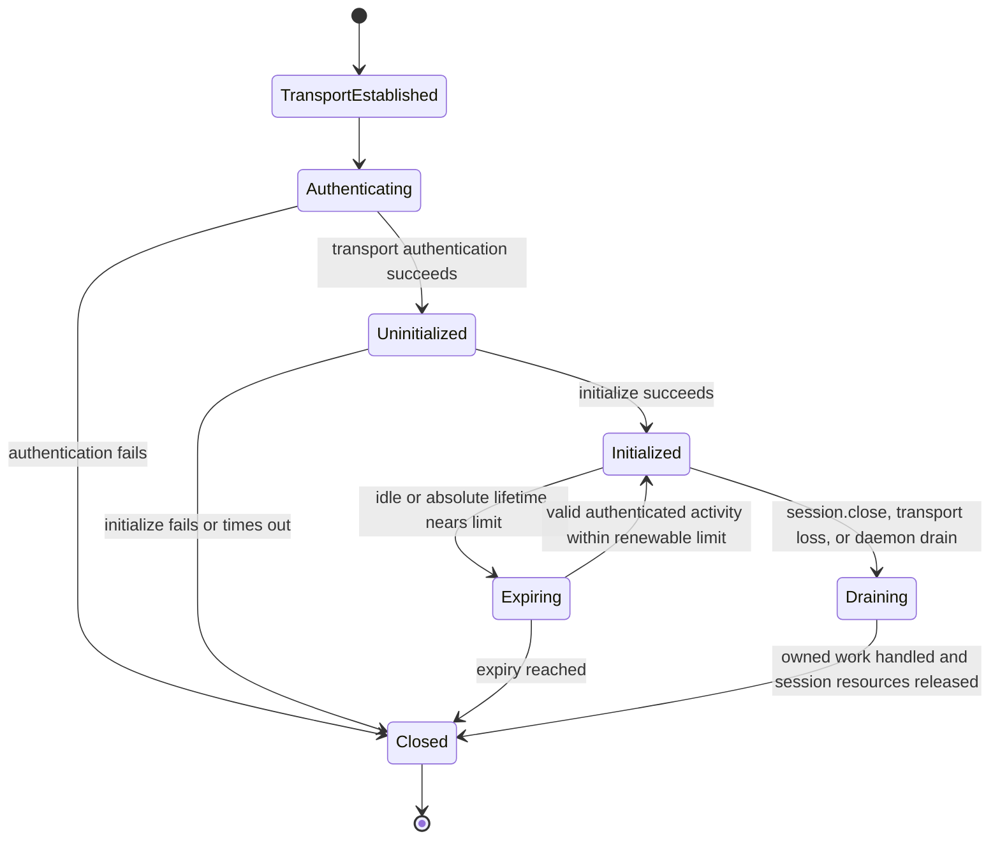

# Transports and Sessions

## Design Position

Stdio, HTTP, and WebSocket are framing and authenticated-session profiles over the same EIP JSON-RPC contract. A transport establishes peer context, message boundaries, size limits, session lifetime, and liveness. It cannot add provider-specific method envelopes or change operation semantics.

Network profiles are authenticated with one envd-specific API key supplied to the daemon through `AGENT_ENVD_API_KEY`. The key is transport bootstrap authority, not a model-visible argument, EIP field, business credential, provider lifecycle credential, or invocation grant.

## Boundaries

| Concern                                                                     | Owner                                                                          | Relationship                                                 |
| --------------------------------------------------------------------------- | ------------------------------------------------------------------------------ | ------------------------------------------------------------ |
| Listener bind and API-key bootstrap                                         | [Daemon Lifecycle and Configuration](01-daemon-lifecycle-and-configuration.md) | Completes before network admission                           |
| HTTP headers, WebSocket upgrade, stdio framing, and logical session carrier | This document                                                                  | Authenticates and frames EIP                                 |
| Initialization params, methods, results, and errors                         | [EIP Protocol](02-eip-protocol.md)                                             | Identical on every transport                                 |
| Provider routing and optional TLS/tunnel                                    | Host provider adapter                                                          | Supplies a protected route without injecting caller identity |
| Method authorization and native enforcement                                 | `agent-envd` resource owners                                                   | Repeated after transport authentication                      |

A transport session authenticates access to the daemon's configured Environment ceiling. The single network key maps to one daemon-configured logical transport principal; the secret bytes or their digest are never used as object identity, so an operator key rotation does not silently retag retained ownership. It does not grant every operation: capabilities, current daemon policy, method params, generation, ownership, quotas, and any required invocation grant still apply.

## Session Model



An initialized EIP session binds:

- authenticated transport principal;
- selected EIP protocol version;
- Environment identity and generation observed at initialization;
- effective capabilities and hard limits;
- authority partition and object ownership scope;
- session idle and absolute expiry;
- accepted operation IDs and session-owned resources.

It does not bind a Harness run as durable authority. One single-key network listener represents one trusted authority partition and cannot isolate mutually untrusted tenants or workloads from each other. A Host requiring that separation uses distinct envd instances, keys, state/retention roots, and provider bindings. Within one partition, a provider adapter can dedicate a session to one run or use invocation grants and a trusted binding layer to narrow operations further. Envd never accepts `run_id`, tenant, actor, principal, mount ceiling, or capability claims from a caller-controlled header or ordinary method param as a replacement for trusted session context.

Session IDs and connection IDs are correlation selectors rather than bearer credentials. HTTP always re-authenticates the API key. WebSocket authenticates the upgrade and ties the session to that one connection. Stdio ties the session to the parent-created pipes.

## Shared Transport Rules

All profiles enforce:

- one complete UTF-8 JSON-RPC object per framed application message;
- no JSON-RPC batch arrays;
- finite message, nesting, string, collection, decompression, and in-flight request limits before full allocation;
- independent JSON-RPC IDs for multiplexed requests;
- out-of-order responses when operations execute concurrently;
- one response for each request unless the transport fails;
- no application mutation in an uncorrelated client notification;
- no secrets in URLs, query strings, cookies, subprotocol values, WebSocket frames, readiness, or EIP params;
- no implicit fallback to another transport after a possibly dispatched mutation.

A transport can stop reading when admission or memory limits are reached. Backpressure must bound server memory; it must not cause envd to accumulate unbounded parsed requests or outbound notifications.

## Stdio Profile

### Framing

Stdio is the direct parent-process profile. Each JSON-RPC object uses Language Server Protocol-style content-length framing:

```text
Content-Length: <decimal byte length>\r\n
Content-Type: application/json; charset=utf-8\r\n
\r\n
<exact UTF-8 JSON bytes>
```

`Content-Length` is mandatory, decimal, non-negative, canonical, and within the configured request or response ceiling. `Content-Type` is optional on input; when present it must identify UTF-8 JSON. Unknown headers are rejected if repeated, oversized, malformed, or security-sensitive. Header and body reads have finite deadlines during startup and drain.

Stdin carries client-to-server frames. Stdout carries server-to-client responses and negotiated notifications only. Stderr carries structured daemon logs and never protocol frames. Command stdout and stderr are data inside EIP results or retained output, never daemon stdout.

### Trust and lifecycle

Stdio has no API-key header. Authentication relies on the parent creating private pipes, launching the expected executable under trusted configuration, validating child ownership, and preventing another local principal from replacing or attaching to those descriptors. If this assumption is not valid, the provider uses an authenticated network profile or another protected channel.

The first request is `initialize`. EOF before initialization closes without a session. Parent stdin EOF after initialization begins session drain and best-effort cancellation of session-owned work. EOF is not proof that a mutation was cancelled. A stdio-mode daemon has one connection and one protocol session and exits after bounded cleanup.

Because no fresh client can reattach after that process exits, its descriptor omits `process.retain` and `output.retain`. This is a capability/lifecycle restriction, not a different definition of either lease method; any reconnectable profile that advertises those capabilities uses the owning common lease contracts.

## HTTP Profile

### Endpoint and request shape

Envd binds its own configured listener and serves EIP at:

```http
POST /rpc HTTP/1.1
Authorization: Bearer <AGENT_ENVD_API_KEY value>
Content-Type: application/json
Accept: application/json
EIP-Session: <session selector, except initialize>
Content-Length: <bounded length>
```

The request body is exactly one EIP JSON-RPC request. Query parameters, fragments, form encoding, multipart bodies, cookies, bearer values in URLs, and alternate authentication headers are rejected. Redirects are never emitted for `/rpc`.

The client sends `Authorization` on `initialize` and every later request. Envd parses the standard Bearer scheme strictly, rejects duplicate or folded authorization headers, verifies the API key in constant time before parsing an ordinary body, and never accepts proxy-injected identity as a substitute.

`initialize` omits `EIP-Session`. A successful response contains a newly created opaque selector:

```http
HTTP/1.1 200 OK
Content-Type: application/json
EIP-Session: <opaque selector>
Cache-Control: no-store
```

Every later request supplies both the same API key and `EIP-Session`. The selector chooses negotiated protocol and session-owned state but is not sufficient without successful API-key authentication. It is bound to the authenticated principal, Environment identity and generation, selected protocol, expiry, authority partition, and safe backend routing state. It is never stored in Harness state or model data and is excluded from normal logs to avoid unnecessary correlation leakage.

HTTP logical sessions are independent of TCP connections, HTTP keep-alive, connection pools, source ports, trusted reverse proxies, and backend connection reuse. A client can send concurrent requests for one session over multiple TCP connections. Envd serializes only operations whose domain invariants require it.

### HTTP status and JSON-RPC errors

HTTP status represents failure before a valid EIP exchange:

| Status | Meaning                                                                                  |
| -----: | ---------------------------------------------------------------------------------------- |
|  `200` | A valid JSON-RPC response, including a JSON-RPC method error                             |
|  `400` | Malformed HTTP request or body that cannot form a JSON-RPC envelope                      |
|  `401` | Missing or invalid Bearer API key; includes no diagnostic distinction                    |
|  `404` | Unknown route                                                                            |
|  `405` | Wrong method for a known route                                                           |
|  `409` | Missing, expired, mismatched, or draining `EIP-Session` before method dispatch           |
|  `413` | Body exceeds the transport ceiling                                                       |
|  `415` | Unsupported content type or encoding                                                     |
|  `429` | Transport-level parse/admission capacity unavailable before an EIP operation is accepted |
|  `503` | Daemon is not ready or is draining before EIP dispatch                                   |

Once envd parses a valid JSON-RPC request in an initialized session, method validation, authorization, quota, timeout, cancellation, provider, and isolation failures return HTTP `200` with the typed JSON-RPC error. This preserves one error contract across transports.

Responses set `Cache-Control: no-store`; intermediaries must not cache, transform, compress without configured bounds, retry, or replay `POST /rpc`. A trusted gateway preserves `Authorization`, `EIP-Session`, content length, and response headers end to end and strips caller-provided internal routing headers.

### HTTP retries

A dropped HTTP response does not reveal whether envd dispatched the method. Standard HTTP client middleware must not automatically retry EIP `POST` requests. The EIP client uses operation receipts, method idempotency, or proven pre-dispatch status before retrying. A new TCP connection does not require new initialization, while an expired logical session does.

## WebSocket Profile

### Upgrade handshake

WebSocket uses the same envd-owned network listener and exact route:

```http
GET /rpc/ws HTTP/1.1
Host: <configured endpoint>
Authorization: Bearer <AGENT_ENVD_API_KEY value>
Upgrade: websocket
Connection: Upgrade
Sec-WebSocket-Version: 13
Sec-WebSocket-Key: <standard random handshake value>
Sec-WebSocket-Protocol: eip.v1
```

`eip.v1` selects the EIP major protocol family and WebSocket framing profile. Minor-version and capability negotiation still occurs in the first `initialize` request. A client offers only subprotocols it supports; the server selects exactly one supported `eip.v<major>` value and returns it in the `101 Switching Protocols` response. No API key, tenant, Environment identity, session token, or provider name is encoded in the subprotocol.

Envd verifies the Bearer API key before accepting the upgrade. Failed authentication returns the same non-distinguishing HTTP `401` as the HTTP profile and never creates a WebSocket. Missing or unsupported subprotocol returns HTTP `426` or `400` without upgrade. The route does not accept API keys from query parameters, cookies, WebSocket messages, or an application-level authentication frame.

Browser-originated WebSockets are not a default client surface. An upgrade with an `Origin` header is rejected unless the exact normalized origin appears in trusted `allowed_origins` configuration. Absence of `Origin` is valid for non-browser provider adapters. An origin allowlist never replaces API-key authentication.

WebSocket extension negotiation is disabled by default. In particular, envd does not accept `permessage-deflate` unless a trusted deployment explicitly enables bounded decompression and the resulting profile remains within request and memory ceilings.

### Application initialization handshake

After the standard HTTP upgrade succeeds:

1. The server creates an authenticated but uninitialized connection with a finite initialization deadline.
2. The client's first application message is one text message containing an EIP `initialize` request; ordinary WebSocket fragmentation can carry that message within the configured aggregate ceiling.
3. The server verifies expected Environment identity, negotiates the protocol minor and capabilities, and sends the `InitializeResult` in one text frame.
4. Only after that result is sent does the connection become an initialized EIP session and admit other requests.

No custom cryptographic challenge is added on top of the standard authenticated WebSocket upgrade and protected transport. The API key authenticates the upgrade; the mandatory first-frame `initialize` binds EIP identity, version, generation, and capabilities. Adding a home-grown nonce protocol would not protect plaintext transport or a stolen bearer key and would create another compatibility surface.

A non-`initialize` first message, another request received before initialization completes, a binary application message, invalid JSON, forbidden batch, or initialization timeout fails application initialization and closes the connection. Before close, the server can send a bounded JSON-RPC initialization error only when a valid request ID and envelope exist. An `initialize` request received after the session is already initialized returns `already_initialized` under the ordinary EIP error contract; it never renegotiates the live session.

### Frames, multiplexing, and liveness

Each EIP request, response, or notification occupies exactly one complete WebSocket text message. Fragmentation at the WebSocket protocol layer is allowed only within the configured aggregate message ceiling; envd reassembles with bounded memory before JSON parsing. Binary messages are unsupported. Multiple JSON objects in one message are invalid.

After initialization, requests can be multiplexed and responses can arrive out of order by JSON-RPC ID. Server notifications share the same stream. Control ping and pong frames provide transport liveness and carry no EIP data, authority, or completion meaning. Envd closes an unresponsive connection after bounded missed-liveness intervals.

Standard close behavior is:

|   Code | Use                                                          |
| -----: | ------------------------------------------------------------ |
| `1000` | Normal `session.close` or orderly daemon drain               |
| `1001` | Daemon shutdown or endpoint relocation                       |
| `1002` | WebSocket or EIP framing protocol violation                  |
| `1008` | Initialization/session policy violation after upgrade        |
| `1009` | Message exceeds size ceiling                                 |
| `1011` | Bounded unexpected server failure requiring connection close |

A close reason is bounded and contains no secrets or request content. WebSocket close initiates session drain but does not prove cancellation or native non-dispatch.

## Session Close and Resource Lifetime

`session.close` uses these serialized EIP shapes:

```python
class SessionCloseParams(BaseModel):
    context: EIPCallContext


class SessionCloseResult(BaseModel):
    operations_cancellation_requested: int
    processes_termination_requested: int
    output_objects_released: int
    leased_processes_preserved: int
    leased_output_objects_preserved: int
```

It atomically marks the session draining, refuses later operations, and returns that bounded summary of session-owned active operations, processes, and retained objects that were released, cancellation-requested, or preserved by explicit lease.

Default ownership rules are:

- accepted foreground operations are cancellation-requested on session loss;
- unleased background processes are terminated on session close;
- session-owned retained output and cursors are released;
- finite process or output leases can survive one client session but remain scoped to the same Environment generation and authority partition;
- daemon shutdown terminates even leased processes and invalidates all session carriers.

`session.close` completion proves only that envd applied these ownership transitions. Individual operations can still require receipt or process reconciliation when cancellation races execution.

HTTP session expiry follows the same drain path. WebSocket transport loss and stdio EOF trigger it implicitly. A client reconnects by creating a new session and reinitializing; it never resumes a WebSocket object or stdio stream itself. Explicitly leased provider objects can then be reattached through their owning methods under fresh authentication and generation checks.

## Authentication and Secret Handling

The API key authenticates only the envd endpoint. It is distinct from:

- provider lifecycle credentials held by the Host adapter;
- Host-issued invocation grants referenced by EIP operations;
- business or model-provider credentials optionally projected into a particular command;
- HTTP `EIP-Session` selectors;
- opaque process, output, receipt, and state selectors.

Envd and trusted proxies redact `Authorization` completely. The key is absent from access logs, panic reports, telemetry, request mirrors, state, readiness, errors, and child environments. Authentication failure uses one response shape and does not reveal whether a key was absent, malformed, expired, or incorrect.

The process environment is a practical bootstrap secret carrier, not a claim that all environment variables are generally safe. The operator protects the daemon process environment and service definition, and envd removes its secret as early as the platform permits after loading it into protected memory. On platforms with a stable facility, envd also marks the secret-bearing daemon non-dumpable or otherwise denies same-user process-memory inspection. Crash dumps, debugger authority, root inspection, and service-manager environment access remain within the operator trust boundary.

A deployment using `AGENT_ENVD_EXECUTION_ISOLATION=disabled` must ensure that payloads cannot inspect envd memory, its original process environment, service configuration, or a trusted proxy's headers. Typical enforcement uses a distinct non-privileged payload identity, outer PID/process isolation, protected `/proc`, and no debugger capability. Running untrusted payloads with the same unrestricted process-inspection or root authority as envd collapses API-key authentication and is not a valid outer-sandbox security boundary.

## Failure Semantics

| Failure boundary                                   | Observable result                                          | Dispatch meaning                          |
| -------------------------------------------------- | ---------------------------------------------------------- | ----------------------------------------- |
| API-key or WebSocket upgrade failure               | HTTP status; no EIP session                                | No EIP method dispatched                  |
| Stdio framing or HTTP body invalid before envelope | Transport error or JSON-RPC parse error where correlatable | No EIP method dispatched                  |
| Initialization identity/version/capability failure | JSON-RPC error, then no usable session                     | No resource method dispatched             |
| HTTP session missing or expired                    | HTTP `409` before body dispatch                            | No EIP method dispatched for that request |
| Message too large                                  | HTTP `413`, WebSocket `1009`, or stdio framing failure     | No EIP method dispatched                  |
| Connection loss before envd accepts operation      | Transport failure with proven pre-dispatch stage           | Retry can follow method policy            |
| Connection loss after possible acceptance          | Transport failure and potentially unknown outcome          | Reconcile before mutating retry           |
| Ping/pong or idle expiry                           | Session drain                                              | Not proof of native cancellation          |
| Server notification loss                           | No method failure                                          | Client reads authoritative state          |

## Compatibility

Transport profile compatibility is separate from EIP minor negotiation:

- stdio framing changes require an explicit framing-profile revision;
- HTTP route, header meaning, and status mapping remain stable within the profile;
- WebSocket `eip.v<major>` identifies the EIP major framing family;
- additive HTTP response headers are compatible when clients can ignore them;
- changing API-key location, permitting query authentication, changing first-frame rules, or turning a session selector into a bearer credential is incompatible.

A provider adapter declares supported transport profiles and chooses one before initialization. It can reconnect with another profile only by creating a fresh session. It never falls back and replays an operation whose dispatch outcome is ambiguous.

## Invariants

01. All transports carry one EIP protocol; transport choice never changes method or side-effect semantics.
02. HTTP and WebSocket authenticate `Authorization: Bearer` against `AGENT_ENVD_API_KEY`; neither accepts secrets from URLs, cookies, subprotocols, or EIP messages.
03. Every HTTP request re-authenticates the API key and later requests also present a non-bearer `EIP-Session` selector.
04. HTTP sessions are independent of TCP connection affinity and permit bounded concurrent requests.
05. A WebSocket upgrade selects exactly one `eip.v<major>` subprotocol, and its first application message is `initialize`.
06. Browser origins are denied by default and an allowlisted origin never replaces API-key authentication.
07. Stdio stdout contains only framed EIP traffic and stderr contains only logs.
08. Batch requests, binary WebSocket application messages, and unbounded decompression are unsupported.
09. Connection close initiates drain but never proves cancellation, non-dispatch, or mutation failure.
10. Session loss releases unleased resources; only explicit finite leases can survive into a fresh authenticated session of the same Environment generation and authority partition.
11. API keys, authorization headers, and session correlation values never enter model content, Harness state, EIP params, child environments, or normal logs.
12. Transport-level retries never repeat a possibly dispatched mutation without EIP idempotency or reconciliation evidence.
