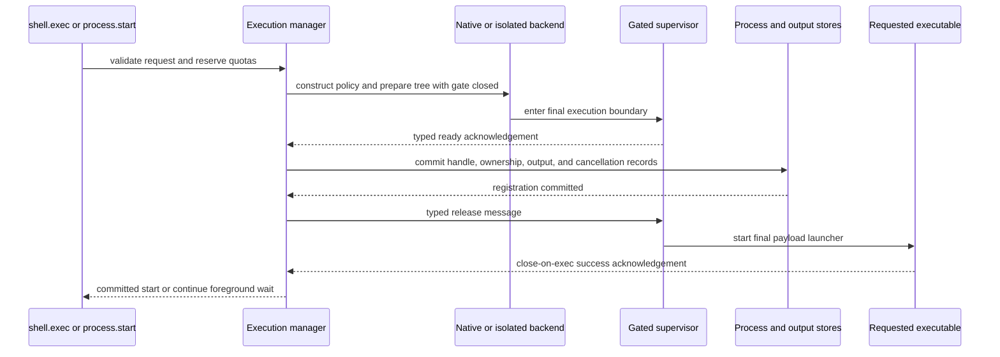

# Command and Process Execution

## Design Position

`agent-envd` owns one command execution manager for both foreground `shell.exec` and background `process.start`. It is the sole native owner of every command tree, applies one structured command and environment contract, crosses one transactional start gate, and reports initial-command status separately from whole-tree cleanup.

A background process record is an EIP-visible projection over manager-owned native state. It does not create a second PID registry or lifecycle owner. Native PIDs, process groups, sandbox helpers, namespace supervisors, and file descriptors remain private implementation facts behind opaque handles.

## Boundaries

| Concern                                                                | Owner                                            | Relationship                                                                      |
| ---------------------------------------------------------------------- | ------------------------------------------------ | --------------------------------------------------------------------------------- |
| Model-facing tool and Harness authorization                            | Harness                                          | Produces a selected binding, effective constraints, and optional invocation grant |
| Command schema, process lifecycle, handle methods, status, and cleanup | This document                                    | Stable EIP behavior                                                               |
| Per-command filesystem and network containment                         | [Execution Isolation](07-execution-isolation.md) | Required native backend or explicit outer-sandbox delegation                      |
| Output capture, references, cursors, and quotas                        | [Output Retention](06-output-retention.md)       | Applies while stdout and stderr are read                                          |
| Provider ingress for a listening process                               | Provider adapter                                 | Separate from starting or observing the process                                   |
| Durable Agent attempt and completion                                   | Host                                             | Never owned by process exit or envd receipt                                       |

Command permission is the intersection of authenticated session authority, current invocation policy, configured shell and executable policy, selected mounts, Environment generation, process and resource quotas, and execution-isolation posture.

## Command Model

The following schemas are serialized EIP JSON:

```python
class ArgvCommand(BaseModel):
    kind: Literal["argv"]
    executable: str
    arguments: tuple[str, ...] = ()


class ShellCommand(BaseModel):
    kind: Literal["shell"]
    profile_id: str
    script: str
    login: bool = False


type CommandSpec = ArgvCommand | ShellCommand


class CommandEnvironment(BaseModel):
    set: dict[str, str] = Field(default_factory=dict)
    unset: tuple[str, ...] = ()


class CommandLimits(BaseModel):
    wall_time_ms: int | None = None
    stdin_bytes: int | None = None
    process_count: int | None = None
    memory_bytes: int | None = None
    cpu_time_ms: int | None = None


class CommandRequest(BaseModel):
    command: CommandSpec
    cwd: EIPPath
    environment: CommandEnvironment = CommandEnvironment()
    network: Literal["configured", "deny"] = "configured"
    limits: CommandLimits = CommandLimits()
    initial_stdin: EncodedBytes | None = None
    keep_stdin_open: bool = False
    output_policy: OutputPolicy
```

Every string, argument count, script byte length, environment entry, initial stdin body, and requested limit is bounded. NUL is invalid in executable, arguments, script, environment names and values, and paths.

### Structured argv

`kind="argv"` executes exactly one executable with the supplied argument vector. Envd never concatenates or reparses the values through a shell. `executable` is either a bare name with no separator or a relative path resolved from the canonical `cwd` inside that same mount. Native absolute executable paths are invalid EIP input. A bare name resolves only through daemon-owned fixed executable search roots; a relative path receives mount canonicalization, executable-source policy, and symlink containment. Neither form uses an ambient daemon `PATH` or a request-controlled search directory.

### Explicit shell profiles

`kind="shell"` selects a trusted configured profile. Operator configuration uses this conceptual, non-EIP shape:

```python
class TrustedShellProfile(BaseModel):
    profile_id: str
    native_executable: str
    fixed_arguments: tuple[str, ...]
    safe_base_environment: dict[str, str]
    executable_search_roots: tuple[str, ...]
    max_script_bytes: int
    allow_login_mode: bool = False
```

Native executable and search roots are canonical trusted paths validated before readiness. Request data cannot replace or prepend them. The EIP descriptor exposes only:

```python
class ShellProfileDescriptor(BaseModel):
    profile_id: str
    display_name: str
    supports_login_mode: bool
    max_script_bytes: int
```

The trusted profile owns the absolute shell executable, fixed invocation arguments, permitted script and login modes, safe base environment, and executable search roots. `login=true` is accepted only when that profile explicitly permits it; no request can supply login-wrapper arguments. EIP does not accept a native shell path or arbitrary wrapper arguments. The script is passed as one data argument or descriptor according to the profile; it is never interpolated into an additional shell command constructed by envd.

A descriptor reports only logical profile information, not native helper paths or host configuration. Unsupported profile selection fails before execution preparation.

### Working directory

`cwd` selects one configured mount and is canonicalized under [Resource Operations](04-resource-operations.md). It must be an existing directory allowed for command execution. Read-only mounts can be working directories but remain read-only inside required isolation. A valid cwd does not by itself grant access to any other host path.

### Environment construction

The final payload environment is built from explicit layers:

1. start empty;
2. add the trusted profile's minimal safe base values;
3. add trusted per-binding credential or compatibility projection, if separately authorized;
4. apply validated request `set` values and `unset` names within their allowed namespace;
5. force daemon-owned `PATH` from the selected trusted search roots and force `HOME`, `TMPDIR`, `TMP`, and `TEMP` to private execution roots;
6. remove every daemon bootstrap secret, transport value, internal launcher variable, dynamic-loader variable not explicitly allowed by policy, and inherited descriptor reference.

The daemon process environment is never inherited wholesale. `AGENT_ENVD_*` names and all internal control/carrier names are reserved and cannot be set or unset through EIP. Request values affect only the final payload; they are not installed on bubblewrap, `sandbox-exec`, the trusted supervisor, or another pre-isolation helper.

Business credentials projected for a particular command remain distinct from `AGENT_ENVD_API_KEY`. Projection requires current policy, audience, lifetime, and redaction controls; ambient host credentials are never a fallback. Long-running credential rotation belongs to an explicit broker or mounted provider facility rather than hidden daemon-environment inheritance.

### Network and resource limits

`network="configured"` uses the daemon's configured command network posture. `network="deny"` can only narrow that posture and is honored only when the active required-isolation backend can enforce it. A command can never widen daemon-wide `deny` to host networking. In `disabled` isolation mode, per-command `deny` is unsupported because envd cannot claim enforcement from native spawn alone.

Every requested `CommandLimits` value narrows finite daemon, binding, and isolation-backend ceilings. A missing field uses the effective upstream ceiling, not infinity. The descriptor advertises which CPU, memory, and process-count limits the backend can enforce. Unsupported requested limits fail before dispatch; envd does not present wall-clock cancellation or outer-container policy as a portable CPU or memory guarantee.

Wall time, process admission, stdin bytes, stdout/stderr output, retained objects, and daemon-owned process count are always bounded even when a platform lacks portable CPU or memory enforcement.

## Process Identity and State

```python
type ProcessPhase = Literal[
    "starting",
    "running",
    "exited",
    "signaled",
    "timed_out",
    "cancelled",
    "failed",
]

type CleanupOutcome = Literal[
    "pending",
    "complete",
    "residual_confined",
    "failed",
]

type TerminationReason = Literal[
    "exit",
    "signal",
    "timeout",
    "cancelled",
    "output_limit",
    "backend_lost",
]


class ProcessStatus(BaseModel):
    phase: ProcessPhase
    termination_reason: TerminationReason | None
    exit_code: int | None
    signal: Literal["interrupt", "terminate", "kill"] | None
    started_at: datetime | None
    ended_at: datetime | None
    cleanup: CleanupOutcome


class ProcessStreamSnapshot(BaseModel):
    stream: Literal["stdout", "stderr"]
    capture: OutputCapture


class ProcessOutputSnapshot(BaseModel):
    stdout: ProcessStreamSnapshot
    stderr: ProcessStreamSnapshot


class ProcessInfo(BaseModel):
    handle: ProcessHandle
    environment_id: str
    generation: int
    status: ProcessStatus
    stdin_open: bool
    output: ProcessOutputSnapshot
    lease: ProcessLeaseRef | None
```

`starting` is internal until `process.start` can return a committed handle; a client normally first observes `running` or an already terminal phase. `exit_code` belongs to the initial requested executable, never a supervisor or sandbox wrapper. A normal Unix signal is mapped only to the supported semantic signal names; raw host signal numbers are not a portable EIP contract.

Initial-command terminal state and command-tree cleanup are independent. `phase="exited"` with `cleanup="pending"` means the requested executable ended while descendants or supervisor cleanup remain. `cleanup="complete"` proves the backend's whole-tree teardown contract. `residual_confined` is allowed only for a required isolation backend that can prove residual descendants remain under the original confinement but cannot prove they all exited. It is never returned by disabled native execution.

`failed` with `termination_reason="output_limit"` means a background producer crossed a fail-on-overflow threshold after `process.start` had already returned and envd terminated the tree under that process's stored policy. `failed` with `termination_reason="backend_lost"` means envd lost trustworthy supervision after dispatch. Neither case carries a fabricated exit code or signal. Cleanup, output counts, and receipt evidence determine which later facts are known.

## One Transactional Start Pipeline

Every command uses the same prepare/commit/release sequence:



The requested executable cannot run while policy is built, the sandbox is entered, quotas are only provisional, or stores are uncommitted. The supervisor reaches its ready gate only after the final Seatbelt/bubblewrap/native execution boundary and child environment preconditions are in place.

The internal launch plan travels through a bounded inherited descriptor using a typed, versioned encoding. Command data and request environment never travel through launcher environment variables or a string command protocol. Control messages are typed and length-bounded. All non-stdio descriptors close unless they are explicit short-lived gate, exec-acknowledgement, output, or stable policy descriptors. Internal protocol details are not EIP, but these properties are part of the security and no-unregistered-execution contract.

After store commit, envd releases the gate. A close-on-exec acknowledgement distinguishes successful execution of the requested executable from a payload-launcher setup or `exec` failure. `process.start` returns a handle only after exec success is established. `shell.exec` continues waiting under the same committed record.

A failure before store commit closes the gate, kills and reaps the prepared tree, releases every provisional quota, and returns a pre-dispatch or isolation error. A failure after commit but before exec success rolls back the public handle and cleans the tree. Failure to establish required containment or final payload identity returns `execution_isolation_failed`; failure to execute the selected requested executable returns `command_start_failed` with bounded receipt evidence. Envd never retries the payload through a less restrictive backend.

## Foreground Execution

`shell.exec` returns only after the initial command reaches a terminal state and tree cleanup reaches a terminal cleanup outcome, unless provider evidence is lost.

```python
class ShellExecParams(BaseModel):
    context: EIPCallContext
    request: CommandRequest


class ShellExecResult(BaseModel):
    status: ProcessStatus
    output: ProcessOutputSnapshot
    receipt: OperationReceipt
```

The foreground record is not exposed as a reusable `ProcessHandle`. It still uses the same internal manager, output store, cancellation path, and cleanup semantics as a background process.

A wall-time deadline requests termination of the full command tree, closes stdin, continues bounded output drain, and waits for cleanup within a finite grace. A proven timeout returns `phase="timed_out"` and `termination_reason="timeout"`. If backend evidence is lost during that sequence, envd returns `unknown_outcome` with the strongest receipt and retained output metadata it has.

Cancellation follows the same tree-wide path. Output overflow does not block pipe draining: envd retains, truncates, or discards bytes according to [EIP `OutputPolicy`](06-output-retention.md) while continuing to drain boundedly until terminal cleanup.

## Background Process Lifecycle

### Start and inspect

`process.start` uses these serialized shapes:

```python
class ProcessStartParams(BaseModel):
    context: EIPCallContext
    request: CommandRequest


class ProcessStartResult(BaseModel):
    process: ProcessInfo
    receipt: OperationReceipt
```

The returned process is `running` or already terminal, its executable has passed the exec acknowledgement, and its handle is registered atomically with output and ownership state. An EIP timeout before that commit returns no handle. A timeout after possible commit reconciles the operation ID or receipt before the client can safely repeat start.

All follow-up methods use these serialized shapes:

```python
class ProcessInspectParams(BaseModel):
    context: EIPCallContext
    handle: ProcessHandle


class ProcessInspectResult(BaseModel):
    process: ProcessInfo


class ProcessReadOutputParams(BaseModel):
    context: EIPCallContext
    handle: ProcessHandle
    stdout_cursor: OutputCursor | None = None
    stderr_cursor: OutputCursor | None = None
    wait_ms: int = 0
    output_policy: OutputPolicy


class ProcessStreamRead(BaseModel):
    chunks: tuple[OutputSegment, ...]
    next_cursor: OutputCursor | None
    capture: OutputCapture


class ProcessReadOutputResult(BaseModel):
    process: ProcessInfo
    stdout: ProcessStreamRead
    stderr: ProcessStreamRead


class ProcessWriteStdinParams(BaseModel):
    context: EIPCallContext
    handle: ProcessHandle
    data: EncodedBytes
    close_after_write: bool = False


class ProcessWriteStdinResult(BaseModel):
    accepted_bytes: int
    stdin_open: bool
    receipt: OperationReceipt


class ProcessCloseStdinParams(BaseModel):
    context: EIPCallContext
    handle: ProcessHandle


class ProcessCloseStdinResult(BaseModel):
    stdin_open: Literal[False]
    receipt: OperationReceipt


class ProcessSignalParams(BaseModel):
    context: EIPCallContext
    handle: ProcessHandle
    signal: Literal["interrupt", "terminate"]


class ProcessSignalResult(BaseModel):
    accepted: bool
    process: ProcessInfo
    receipt: OperationReceipt


class ProcessWaitParams(BaseModel):
    context: EIPCallContext
    handle: ProcessHandle
    condition: Literal["initial_terminal", "tree_cleaned"]


class ProcessWaitResult(BaseModel):
    process: ProcessInfo


class ProcessKillParams(BaseModel):
    context: EIPCallContext
    handle: ProcessHandle


class ProcessKillResult(BaseModel):
    process: ProcessInfo
    receipt: OperationReceipt


class ProcessRetainParams(BaseModel):
    context: EIPCallContext
    handle: ProcessHandle
    requested_expires_at: datetime


class ProcessRetainResult(BaseModel):
    lease: ProcessLeaseRef
    expires_at: datetime
    receipt: OperationReceipt


class ProcessReleaseParams(BaseModel):
    context: EIPCallContext
    handle: ProcessHandle


class ProcessReleaseResult(BaseModel):
    released: bool
    receipt: OperationReceipt
```

`process.inspect` returns the latest typed snapshot without draining output or changing lifetime. Polling and WebSocket notifications observe the same record.

### Output reads

`process.read_output` accepts a handle, independent stdout and stderr cursor positions, a wait duration bounded by the EIP deadline, and an `OutputPolicy`. It returns stream-tagged chunks, next cursors, per-stream captured/dropped counts, completeness, process status, and any retention floor. Reads are non-draining: one reader cannot consume data needed by another. Cursor and gap semantics are owned by [Output Retention](06-output-retention.md).

### Stdin

`process.write_stdin` accepts one bounded encoded byte chunk and an optional `close_after_write`. Writes are serialized per process, apply backpressure, and either report the accepted byte count or a typed closed/busy failure. A partial native write is reported explicitly and never automatically repeats the remainder under the same method unless the response proves its accepted count.

`process.close_stdin` is idempotent and makes later writes fail. Session close, process termination, timeout, cancellation, and kill also close stdin. `keep_stdin_open=false` closes it after `initial_stdin` is delivered.

### Signal, kill, and wait

`process.signal` accepts only `interrupt` or `terminate`. The backend targets the owned command tree according to platform capability and returns whether a live target accepted the request; it does not expose arbitrary numeric signals or another process.

`process.kill` requests the backend's strongest force-cleanup behavior and waits within the supplied deadline for a terminal cleanup outcome. A successful request is not misreported as a particular initial-command signal unless the backend observed it.

`process.wait` waits for one of two explicit conditions:

- `initial_terminal`: the requested executable has a terminal `ProcessPhase`;
- `tree_cleaned`: the initial command is terminal and `cleanup` is no longer pending.

It returns the current `ProcessInfo` on satisfaction or a typed timeout without changing the process. Transport connection close is not a wait result.

### Release

`process.release` removes a terminal, fully cleaned, unleased record and its session-owned output references. Releasing an active process is a conflict; the client first cancels or kills it. Release is idempotent for a handle already released by the same authority while its tombstone remains, then becomes `not_found_or_denied` after bounded tombstone expiry.

## Process Leases and Reattachment

Processes are session-owned by default. Session close or loss terminates an unleased active process. A provider that permits background work across Harness runs exposes process retention under an explicit capability and finite quota.

`process.retain` accepts a live handle and requested expiry. Envd narrows expiry to configured maximum lifetime, reserves retained-process capacity, and returns a `ProcessLeaseRef`. The lease binds principal, Environment identity and generation, process handle, command policy snapshot, and expiry. It grants no authority by possession and cannot survive daemon shutdown.

A leased process:

- remains manager-owned after its creating EIP session closes;
- retains bounded output and process quotas for its complete lease lifetime;
- is included in `state.export` only when explicitly selected by the state owner;
- can be reattached from a fresh authenticated session through `state.restore` or direct handle validation under the same authority partition;
- is terminated when the lease expires, policy revocation requires it, its mount is revoked, or daemon drain begins.

Lease renewal is another `process.retain` decision under current policy and cannot exceed the hard absolute lifetime. Disconnect never renews a lease. A stale generation or changed authority invalidates reattachment but does not transfer the process to another caller.

## Concurrency and Ownership

The execution manager uses async admission and event-driven child/output observation so waiting for one process does not block unrelated EIP work. This is an observable scalability requirement, not a public class API. Blocking OS waits or reads are isolated from the protocol event loop.

Per-daemon, per-principal, and per-session active-process and start-admission limits apply before preparation. A process start reserves process count, output budget, supervisor capacity, and any isolation resources atomically. Failure releases all reservations.

Operations on one handle obey a defined order:

- stdin writes serialize with stdin close;
- signal and kill serialize with terminal transition;
- status observation and output reads can proceed concurrently from immutable snapshots;
- release waits for no active operation lease on the record;
- session close and daemon shutdown use the same owner, rather than racing a second cleanup registry.

A native process discovered outside this manager cannot be adopted through EIP. Envd never controls by caller-supplied PID.

## Descendants and Cleanup

Every descendant inherits the selected execution boundary. The command tree remains owned until cleanup reaches a terminal outcome even after the initial executable exits.

Linux required isolation uses a PID namespace and envd-owned namespace supervisor that acts as PID 1, reaps descendants, forwards supported semantic signals, and tears down the namespace. A descendant cannot survive by changing process group or session inside that namespace.

macOS required isolation uses inherited Seatbelt plus tracked process-group and descendant cleanup. Since macOS has no PID namespace equivalent, full descendant exit can be unprovable; `residual_confined` preserves that distinction. Disabled native execution uses tracked group cleanup but cannot call an unobserved residual confined.

The supervisor's own exit status never replaces the initial command's status. Backend loss produces `termination_reason="backend_lost"`, strongest available cleanup, and safe unknown-outcome evidence.

## Failure Semantics

| Failure stage                                                                 | Result                                                        | Payload or side-effect meaning                                         |
| ----------------------------------------------------------------------------- | ------------------------------------------------------------- | ---------------------------------------------------------------------- |
| Schema, cwd, executable, profile, environment, authority, or quota validation | Typed pre-dispatch error                                      | No payload started                                                     |
| Isolation policy or backend preparation fails before ready                    | `execution_isolation_failed`                                  | Gate remains closed; no payload started                                |
| Store registration fails                                                      | Pre-dispatch failure                                          | Prepared tree killed and reaped; no payload started                    |
| Gate release, final identity, or requested exec fails                         | `execution_isolation_failed` or `command_start_failed`        | Public handle rolled back; requested executable not reported started   |
| Response lost after exec confirmation                                         | Potential `unknown_outcome`                                   | Reconcile operation ID, receipt, or process handle before retry        |
| Initial command exits nonzero                                                 | Successful EIP method with typed exit status                  | Command failure is not protocol failure                                |
| Filesystem/network policy denies child action                                 | Normal child stderr and exit behavior                         | Never triggers unsandboxed retry                                       |
| Deadline or cancellation proves tree termination                              | Timed-out or cancelled typed status                           | Output remains bounded and cleanup is explicit                         |
| Background output crosses fail threshold after start returned                 | Tree termination and `failed` status with `output_limit`      | Original start remains successful; later process state reports failure |
| Backend supervision lost                                                      | `backend_lost`, cleanup attempt, and possible unknown outcome | No fabricated exit status                                              |
| Initial command terminal but tree cleanup fails                               | `cleanup_failed` or status with `cleanup="failed"`            | Host cannot assume descendants are gone                                |
| Lease expires                                                                 | Envd terminates tree and expires handle/reference             | Fresh session cannot revive it                                         |

## Compatibility

Command schema changes, profile IDs, process phases, termination reasons, cleanup outcomes, and signal meanings are EIP compatibility facts. Additive status fields are safe only when old clients do not infer terminal cleanup from their absence. Changing when `process.start` publishes a handle, conflating wrapper and payload status, allowing active release, or weakening session-loss cleanup requires an incompatible protocol revision.

Backends can advertise narrower resource-limit support, but foreground and background lifecycle, transactional start, opaque ownership, output bounds, and cleanup distinctions remain common conformance requirements.

## Trade-offs

### One manager and transaction

Registering a prepared tree before payload release adds a supervisor handshake and start latency. It prevents an unregistered command from running when policy setup, process-store insertion, output registration, or response construction fails.

### Structured argv plus explicit shells

Structured argv avoids accidental shell parsing. Explicit shell profiles preserve normal development workflows without allowing request data to choose an arbitrary native shell or wrapper.

### Opaque handles over PIDs

Opaque handles require envd follow-up methods and generation checks. They prevent cross-principal PID guessing, wrapper/PID confusion, and silent retargeting after restart.

### Finite leases over detached processes

Explicit leases add retention state and quotas. They make cross-run background work recoverable without allowing arbitrary daemonized children or pretending a saved handle survives daemon loss.

## Invariants

01. One execution manager is the sole native owner of every foreground and background command tree.
02. `shell.exec` and `process.start` share one validation, reservation, isolation, registration, gate-release, and exec-acknowledgement pipeline.
03. No requested executable runs before the final boundary is ready and its process/output/ownership records are committed.
04. Command values are structured data and never interpolated into another shell command; shell text uses an explicit trusted profile.
05. The daemon environment, API key, transport state, and internal control variables never reach sandbox helpers or payloads.
06. Every requested limit narrows finite upstream limits; unsupported enforcement fails explicitly.
07. `process.start` returns no handle until requested-executable exec success is established.
08. Initial-command status, wrapper status, tree cleanup, and Host completion remain separate facts.
09. Process operations accept only opaque handles and repeat generation, ownership, capability, and policy checks.
10. Output reads are non-draining and bounded, and output overflow never blocks native pipe draining.
11. Session loss terminates unleased processes; only explicit finite leases can preserve a process across sessions, and no lease survives daemon shutdown.
12. A failed or unavailable isolation backend never triggers native fallback.
13. Cleanup uncertainty is explicit: only `complete` proves full teardown, and `residual_confined` is valid solely under an active required-isolation boundary.
