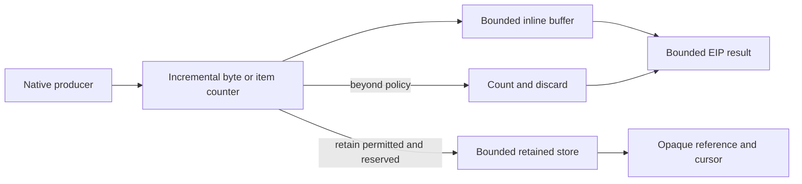

# Output Policy and Retention

## Design Position

Every envd output producer applies a finite EIP `OutputPolicy` while bytes or structured items are produced. The policy determines what can remain inline, whether overflow fails, truncates, or uses a daemon-owned retained reference, and the maximum bytes that can be captured for one operation. Independent daemon, principal, session, and object quotas bound aggregate retained storage and object count.

The Harness owns [`ToolOutputPolicy`](../agent-harness/07-tool-execution.md#tool-metadata) as a model-result policy. Envd does not deserialize Harness tool metadata, tool identity, or Pydantic objects. The EIP adapter maps the already effective Harness decision into the protocol-native `OutputPolicy`; envd understands and enforces that narrower provider contract at the producer.

## Boundaries

| Concern                                                                   | Owner                                             | Relationship                                             |
| ------------------------------------------------------------------------- | ------------------------------------------------- | -------------------------------------------------------- |
| Tool-level inline/total policy, overflow selection, and managed redaction | Harness `ToolOutputPolicy` and result-safety path | Computes a model-result ceiling before provider dispatch |
| Protocol-native per-operation output policy and result disposition        | This document                                     | Sent in output-producing EIP methods                     |
| Daemon and session aggregate retained quotas                              | `agent-envd`                                      | Non-disableable hard ceilings                            |
| Native output production and stream identity                              | File, command, process, list, or search owner     | Supplies bytes/items incrementally                       |
| Host artifact storage or durable checkpoint                               | Host                                              | Not implied by an envd retained object                   |

EIP output policy grants no filesystem, process, or content authority. Redaction remains a Harness concern because envd does not know model-facing tool semantics or all secret classes. Envd still removes its own transport and bootstrap secrets before production and never writes them into retained output itself.

## EIP `OutputPolicy`

This schema is serialized EIP JSON:

```python
type OutputOverflow = Literal["fail", "truncate", "retain"]


class OutputPolicy(BaseModel):
    max_inline_bytes: int
    max_output_bytes: int
    overflow: OutputOverflow
```

Both values are positive and finite, and `max_inline_bytes <= max_output_bytes`. `max_inline_bytes` is the largest complete output that can remain directly in one EIP result. `max_output_bytes` is the largest amount the operation can capture in a retained representation when `overflow="retain"`; it is not permission to construct an equally large JSON response.

The effective policy is the fieldwise narrowest compatible result of:

```text
envd hard method and response ceilings
∩ daemon-global runtime ceilings
∩ authenticated principal and session ceilings
∩ Environment binding/provider ceilings
∩ Host runtime ceilings carried by the trusted adapter
∩ Harness ToolOutputPolicy after tool-level policy
∩ per-request EIP OutputPolicy
```

No layer can widen an upstream ceiling. If two layers select different overflow behavior, the adapter or envd chooses the behavior that retains no more authority or bytes: `fail` remains fail when required by an upstream layer; `truncate` cannot be upgraded to retention; `retain` is available only when every required layer permits a retained sink. The EIP request normally carries the already intersected Host/Harness choice, while envd intersects it again with provider hard limits.

### Harness translation

For a managed Environment tool, translation is:

| Harness `ToolOutputPolicy`         | EIP `OutputPolicy`                                                                                           |
| ---------------------------------- | ------------------------------------------------------------------------------------------------------------ |
| `max_inline_bytes`                 | Same or narrower value                                                                                       |
| `max_output_bytes`                 | Same or narrower value                                                                                       |
| `overflow="fail"`                  | `overflow="fail"`                                                                                            |
| `overflow="truncate"`              | `overflow="truncate"`                                                                                        |
| `overflow="environment_reference"` | `overflow="retain"` when the selected binding supports finite retained output; otherwise explicit `truncate` |
| `redact`                           | Not serialized; the Harness applies its managed redaction pass to the bounded result and preview             |

The adapter never copies `HarnessToolMetadata`, `tool_id`, effects, credentials, or arbitrary metadata into EIP. It also does not expose the raw EIP selector as bearer-like model text: it wraps the selector as a binding-scoped logical Environment reference, and every model-facing follow-up read crosses the same Harness authorization, size, and redaction path. This preserves output-safety semantics without coupling envd to Pydantic AI.

## Encoded Bytes and Dispositions

Binary data uses this serialized shape:

```python
class EncodedBytes(BaseModel):
    encoding: Literal["base64"]
    data: str


class OutputSegment(BaseModel):
    start_offset: int
    data: EncodedBytes


class OutputPreview(BaseModel):
    segments: tuple[OutputSegment, ...]
    represented_bytes: int


type OutputKind = Literal[
    "empty", "inline", "retained", "truncated"
]


class OutputCapture(BaseModel):
    kind: OutputKind
    producer_complete: bool
    content_complete: bool
    produced_bytes: int
    captured_bytes: int
    dropped_bytes: int
    inline: EncodedBytes | None = None
    preview: OutputPreview | None = None
    reference: OutputReference | None = None
    cursor: OutputCursor | None = None
    available_start: int
    available_end: int
    expires_at: datetime | None = None
```

Counts refer to raw producer bytes before base64 and JSON framing. `produced_bytes` is the number observed at the snapshot boundary; it can grow for a live process. `captured_bytes` is currently readable inline or through the reference. `dropped_bytes` counts known bytes that will never be readable through this object.

`producer_complete` means the requested source range, traversal, or process stream has reached a terminal producer boundary. `content_complete` means every byte in that logical output through the producer boundary remains available. A live process normally has both fields false even when no byte has been dropped. A terminal operation with dropped bytes has `producer_complete=true` and `content_complete=false`.

`available_start` and `available_end` define the half-open logical offset interval currently addressable by the cursor. A retained ring or quota policy can advance the floor; any missing interval is explicit. `inline` is present only when the complete bounded output fits inline. A preview is a bounded set of offset-labelled head and/or tail segments and never pretends those segments are contiguous when a middle gap exists.

An empty producer uses `kind="empty"`, zero counts, and no reference. `kind="truncated"` means no retained object can provide every omitted byte. `kind="retained"` means a reference exists; it can still have `content_complete=false` if output exceeded `max_output_bytes` or an explicitly reported retention floor advanced.

Structured methods such as list and search use the parallel shape:

```python
class StructuredOutputDisposition(BaseModel):
    producer_complete: bool
    content_complete: bool
    emitted_items: int
    dropped_items: int | None
    encoded_bytes: int
    cursor: OutputCursor | None
    expires_at: datetime | None
```

Structured producers stop only at complete item boundaries, count canonical EIP JSON encoding toward byte ceilings, and never emit a partial item as valid data. When more items remain, `retain` can reserve and return a quota-charged continuation cursor, `truncate` returns no continuation and reports an incomplete result, and `fail` returns `output_limit_exceeded`. `dropped_items=None` means traversal stopped before the number of unvisited items could be known. A cursor does not make an unstable traversal a snapshot; the owning method defines revision or invalidation semantics.

## Overflow Behavior

### Inline success

When the complete output is no larger than `max_inline_bytes` and the final JSON response fits the daemon response ceiling, envd returns `kind="inline"`, complete bytes, and no retained object. Response framing overhead is separately reserved, so a policy equal to the response hard limit is narrowed enough to fit a valid envelope.

### `fail`

When output crosses `max_inline_bytes`, envd:

1. stops the producer when the operation is safely stoppable;
2. for a running command, requests tree termination because a successful complete result can no longer satisfy the selected policy;
3. continues bounded pipe drain and native cleanup so the producer cannot deadlock;
4. if the initiating EIP operation is still active, returns `output_limit_exceeded` with `dispatch_stage`, captured/dropped counts, command status where known, and a side-effect receipt when applicable;
5. if `process.start` already returned, records the later background-process failure as `phase="failed"` and `termination_reason="output_limit"`, while `process.inspect` and `process.wait` expose the bounded output counts and cleanup outcome.

The already successful `process.start` response is never rewritten. Failure does not roll back file reads already observed or command side effects that occurred before termination. A mutating operation therefore can fail its result policy while its receipt reports dispatched or completed effects. Clients reconcile before retry.

`fail` creates no general retained output object. A bounded safe preview can appear in error data only when content policy permits it; by default the error contains counts and references to side-effect evidence, not output content.

### `truncate`

Envd retains at most a bounded preview no larger than `max_inline_bytes`, discards remaining producer bytes while continuing safe execution and drain, and returns `kind="truncated"` with explicit counts and completeness. It creates no output reference.

For a streaming process, counts are snapshots and can increase. The configured per-process output ceiling determines when later bytes are dropped. A terminal process never changes a previously reported gap into complete content.

### `retain`

Envd first atomically reserves the required retained-object records plus storage capacity. It streams output into private retained storage up to `max_output_bytes`, returns only a bounded preview inline, and supplies scoped references and cursors for the output streams that exist. If total produced output exceeds the per-operation capture ceiling, later or policy-selected bytes are dropped and the offset/gap fields report the exact available region or segments.

If aggregate quota cannot reserve a safe retained sink before overflow, envd falls back to explicit bounded truncation. It does not buffer while hoping for quota, evict another live object, exceed a ceiling, or silently return an incomplete inline value as complete. A Host policy that requires failure rather than this safe fallback selects `overflow="fail"` before dispatch.

## Producer-side Enforcement

Output safety begins before full materialization:



Command stdout and stderr are drained concurrently. File reads use bounded chunks. Directory and search producers encode complete bounded items incrementally. Cross-mount copy streams from source to destination without routing full content through a JSON result. No default implementation can call an unbounded “read all” API and apply the EIP policy afterward.

A producer can keep a bounded head/tail preview using fixed buffers. Retained storage records stream identity and logical offsets. For command output, stdout and stderr have independent offset domains and cursors while sharing the operation's total captured-byte and object quotas; interleaving timestamps are observations and not a deterministic total order unless a method explicitly provides a merged stream.

The output reader itself is subject to another `OutputPolicy`. Reading a large retained object never forces an equally large response; the client advances a cursor through bounded chunks.

## Aggregate Retention Quotas

Per-operation limits do not prevent many small objects from exhausting a daemon. Envd enforces finite ceilings at all configured scopes:

| Scope                             | Purpose                                                                        |
| --------------------------------- | ------------------------------------------------------------------------------ |
| Daemon global                     | Bounds total disk/memory and object metadata across all sessions               |
| Authenticated authority partition | Prevents one principal or provider binding from consuming all global retention |
| Session                           | Bounds unleased run/session output                                             |
| Process or operation              | Applies `max_output_bytes`, cursor count, and method-specific retention        |
| Explicit lease                    | Reserves capacity for the complete requested continuation lifetime             |

Quota accounts cover retained file bytes, command output, structured-result pages, cursors, previews stored outside the response, process output, and equivalent daemon-owned objects. Metadata overhead has its own bounded accounting and cannot be made unbounded with zero-byte objects.

Reservation is atomic and precedes object creation or growth. Streaming growth reserves in bounded increments before writing. Failure keeps the prior valid object unchanged and applies the selected overflow behavior. Envd never oversubscribes, evicts an unexpired object to satisfy another request, or counts sparse file logical size as free.

Release, expiry, failed creation rollback, session close, process cleanup, and daemon drain return quota exactly once through the single retention owner. Quota accounting is reconstructed and validated before readiness when retained state survives a restart; ambiguity causes a new generation or startup failure rather than undercounting.

## References and Cursors

An `OutputReference` is opaque and bound to Environment identity and generation, authenticated authority, producer kind, original operation and request shape, retained object, expiry, and any process lease. It is not a native path or bearer credential.

An `OutputCursor` additionally binds a stream or structured traversal and a logical next offset. Cursors are non-draining: advancing one cursor does not consume bytes for another reader. Envd can limit cursor count and expire idle cursors independently from the underlying object.

`output.read` uses:

```python
class OutputReadParams(BaseModel):
    context: EIPCallContext
    reference: OutputReference
    cursor: OutputCursor | None = None
    start_offset: int | None = None
    output_policy: OutputPolicy


class OutputReadResult(BaseModel):
    chunks: tuple[OutputSegment, ...]
    next_cursor: OutputCursor | None
    capture: OutputCapture
```

Exactly one of `cursor` or `start_offset` is present; an initial sequential read uses `start_offset=0`. The result contains only contiguous chunks actually available. When the requested offset is below `available_start`, inside a known gap, beyond an expired object, or otherwise lost, envd returns `retention_gap` with safe available-floor/ceiling and terminal metadata. It never skips the gap and marks the result complete.

`output.retain` makes an already retained object eligible for an explicit continuation state export:

```python
class OutputRetainParams(BaseModel):
    context: EIPCallContext
    reference: OutputReference | None = None
    cursor: OutputCursor | None = None
    requested_expires_at: datetime


class OutputRetainResult(BaseModel):
    lease: OutputLeaseRef
    expires_at: datetime
```

Exactly one of `reference` or `cursor` is present. Envd narrows expiry to current policy, reserves the object's bytes and metadata for the complete lease duration, and binds the lease to the same authority, Environment generation, and object. Calling it on inline-only output, truncated output without a retainable selector, or a released/stale selector fails. A cursor lease preserves its bounded traversal or stream position and any underlying retained object it requires. Renewal repeats current authorization and never exceeds the configured absolute lifetime.

`output.release` uses these serialized shapes:

```python
class OutputReleaseParams(BaseModel):
    context: EIPCallContext
    reference: OutputReference | None = None
    cursor: OutputCursor | None = None


class OutputReleaseResult(BaseModel):
    released: bool
    receipt: OperationReceipt
```

Exactly one of `reference` or `cursor` is present. Releasing a reference invalidates that reference, its lease, and dependent cursors. Releasing one independent cursor leaves the underlying retained object and other cursors valid. Both forms free their exact quota once and are idempotent while a bounded same-owner tombstone remains. They cannot release another principal's object. Releasing process output does not kill the process; subsequent bytes are drained and counted as dropped under that process's active policy, and envd does not create an implicit replacement object.

## Expiry and Leases

Every retained object and cursor has finite idle and absolute expiry. The server returns `expires_at`; client activity can refresh idle expiry only within the configured absolute maximum and current policy. Expiry is enforced even if no cleanup request arrives.

Session-owned objects expire or release on session close. To retain output across a Harness continuation boundary, the provider explicitly obtains a finite retention lease before `state.export`. The lease:

- remains charged against daemon, authority-partition, and lease quotas for its full lifetime;
- binds the same Environment identity, generation, object, and authority;
- does not make the reference a credential;
- can be narrowed or revoked by current policy;
- cannot survive daemon shutdown unless restart recovery proves the same retained object and generation;
- is revalidated through fresh EIP authentication during `state.restore`.

Checkpointing a reference without a valid lease is invalid. The caller instead stores a bounded incomplete inline value or rejects resumability. Host state durability does not extend provider object retention.

## Storage and Security

Retained data lives in a private envd-owned root outside ordinary EIP mounts and command filesystem grants. Required execution isolation treats the retention root as protected and does not expose it to payloads. File names are random internal identities, permissions are restrictive, and path lookup never uses caller strings directly.

At-rest encryption is deployment policy. If retained output can contain sensitive business data, the provider selects an encrypted state volume or an encrypted retained-object adapter. EIP references reveal neither path nor storage key. Generic Host storage of EIP state applies its own encryption and retention but does not copy retained bytes unless explicitly exported as an artifact through another contract.

Normal logs, metrics, traces, errors, and receipts contain byte counts and outcome classes, not output content. Output content reaches only the authenticated result/reference path and then remains subject to Harness redaction and content policy.

## Failure Semantics

| Failure                                                | Result                                                                                       | Guarantee                                               |
| ------------------------------------------------------ | -------------------------------------------------------------------------------------------- | ------------------------------------------------------- |
| Invalid or widening policy                             | `invalid_params` before dispatch                                                             | No producer starts for that request                     |
| Inline response would exceed hard frame limit          | Effective inline limit narrows or selected overflow applies                                  | Frame remains bounded                                   |
| Fail-on-overflow threshold crossed                     | `output_limit_exceeded`, producer stop/command termination request, and side-effect evidence | No unbounded buffer; prior effects not hidden           |
| Truncate threshold crossed                             | Explicit incomplete capture with dropped counts                                              | Producer can complete while excess is drained/discarded |
| Retain reservation unavailable                         | Explicit truncation, or fail when upstream selected fail                                     | No oversubscription or live-object eviction             |
| Retained object reaches `max_output_bytes`             | Further bytes dropped with explicit offsets/counts                                           | Object remains bounded                                  |
| Cursor below retention floor or inside gap             | `retention_gap`                                                                              | No false continuity or completeness                     |
| Reference expired, released, lost, or generation-stale | `retention_gap`, `invalid_handle`, or `stale_generation`                                     | No silent retargeting                                   |
| Storage write fails after producer dispatch            | Bounded provider/output failure with receipt and known captured counts                       | Mutation outcome remains separately classified          |
| Release/expiry cleanup fails                           | Quota remains conservatively charged and daemon reports cleanup fault                        | No quota undercount                                     |

## Compatibility

`OutputPolicy` field meaning, overflow behavior, byte-count domain, completeness, offset semantics, reference scope, and gap behavior are protocol compatibility facts. Changing `retain` to imply unbounded storage, treating a preview as complete, changing raw-byte counts to encoded-byte counts, or making cursors draining requires an incompatible EIP revision.

Harness translation is tested independently from EIP wire fixtures. Cross-transport conformance verifies identical output policy, base64, preview, reference, quota, cursor, release, expiry, and error behavior.

## Trade-offs

### Explicit references over large transport responses

References and cursors add lifecycle and storage accounting. They keep HTTP, WebSocket, stdio, Harness memory, and model results bounded and allow recovery without making one transport special.

### Provider enforcement plus Harness redaction

Two layers perform different work: envd bounds raw production; the Harness validates/redacts the already bounded model-facing result. Combining them would either require envd to understand tool metadata or allow unbounded data to cross the provider boundary first.

### Aggregate reservation over best-effort caching

Atomic quota reservation can truncate an operation even when disk has incidental free space. It prevents one caller from evicting another valid reference and makes resource behavior predictable under load.

## Invariants

01. Every output-producing EIP method requires a finite valid `OutputPolicy` or uses a finite method default no wider than the binding ceiling.
02. Envd applies output bounds while consuming the producer, never after unbounded materialization.
03. Harness `ToolOutputPolicy` maps to EIP policy without serializing Harness metadata or redaction configuration.
04. Inline output contains a complete value only when every byte fits both inline and response ceilings.
05. Fail, truncate, and retain overflow behaviors are explicit and never silently substitute an unbounded or falsely complete result.
06. Command pipes continue bounded drain or tree termination after overflow so output backpressure cannot deadlock the daemon.
07. Per-operation limits and finite aggregate byte/object quotas both apply, with reservation before storage.
08. A live unexpired retained object is never evicted to satisfy another allocation.
09. References and cursors are non-authoritative, generation-scoped, finite-lived, and non-draining.
10. Every retention gap, dropped byte, expired object, and incomplete producer is reported rather than hidden.
11. Cross-run retention requires an explicit finite lease that remains charged and is reauthorized under a fresh session.
12. Retained bytes, previews, and secret-bearing output never enter normal logs, metrics, receipts, or errors.
