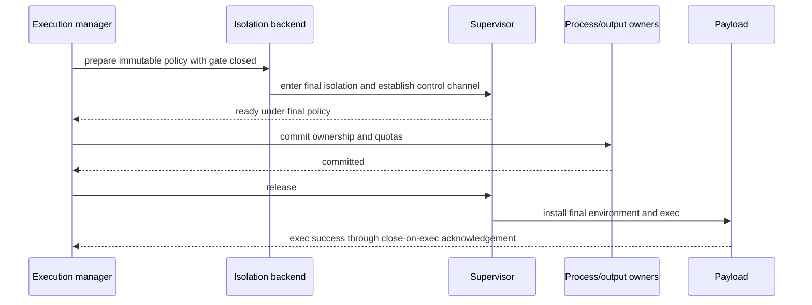

# Execution Isolation

## Design Position

Every `shell.exec` and `process.start` command is untrusted local code. By default, envd places each command tree inside a required operating-system isolation backend before the requested executable starts:

- Linux uses bubblewrap namespaces;
- macOS uses Seatbelt;
- Windows uses an AppContainer or equivalent restricted capability token plus capability-specific filesystem and network ACL projection, and a non-breakaway Job Object for complete process-tree ownership and cleanup.

Linux, macOS, and Windows are all required targets with platform-native containment and truthful cleanup semantics.

A deployment that already places envd inside a container, VM, remote sandbox, or equivalent boundary can explicitly configure `disabled`. That delegates child containment to the outer Host while preserving command validation, configured-mount authorization, transactional spawn, environment filtering, process ownership, output bounds, quotas, signaling, and cleanup.

There is no `auto`, `best_effort`, or probe-driven fallback. Required isolation either passes its production probe for the active platform and policy or envd fails before carrier admission.

## Boundaries

| Concern                                                                                   | Owner                                                                          | Relationship                                             |
| ----------------------------------------------------------------------------------------- | ------------------------------------------------------------------------------ | -------------------------------------------------------- |
| Outer container, VM, remote sandbox, identity, and teardown                               | Host provider                                                                  | Can be the explicit containment owner in `disabled` mode |
| Required/disabled selection, runtime roots, network ceiling, and trusted payload identity | [Daemon Lifecycle and Configuration](01-daemon-lifecycle-and-configuration.md) | Immutable trusted bootstrap                              |
| Configured mount authority and file-operation policy                                      | [Resource Operations](04-resource-operations.md)                               | Supplies only operator-approved roots                    |
| Per-command policy, platform backend, probe, posture, and cleanup guarantee               | This document                                                                  | Establishes child containment before exec                |
| Command schema, transactional start, process state, and semantic controls                 | [Command and Process Execution](05-command-and-process-execution.md)           | Uses one backend-neutral execution object                |

Required isolation protects host resources outside configured command grants from payload code running under envd's ordinary OS authority. It is not a kernel-hard hostile multi-tenant boundary and does not claim resistance to kernel, bubblewrap, Seatbelt, AppContainer, or privileged Host compromise.

The isolation layer does not provision a container or VM, isolate envd file methods from envd itself, make Harness plugins untrusted, provide domain-name egress policy, or accept a profile, native root, helper, token, SID, entitlement, disable flag, or network widening from EIP.

## Configuration Contract

| Environment variable                         | Values                       | Default    | Meaning                                                                       |
| -------------------------------------------- | ---------------------------- | ---------- | ----------------------------------------------------------------------------- |
| `AGENT_ENVD_EXECUTION_ISOLATION`             | `required`, `disabled`       | `required` | Enables fail-closed envd-native isolation or delegates containment explicitly |
| `AGENT_ENVD_EXECUTION_NETWORK`               | `host`, `deny`               | `host`     | Maximum IP-network posture in required mode                                   |
| `AGENT_ENVD_EXECUTION_EXTRA_READ_ONLY_PATHS` | JSON array of absolute paths | `[]`       | Adds operator-trusted executable/runtime roots                                |
| `AGENT_ENVD_EXECUTION_UID`                   | Positive decimal OS user ID  | Unset      | Optional Linux final-payload identity; requires paired GID                    |
| `AGENT_ENVD_EXECUTION_GID`                   | Positive decimal OS group ID | Unset      | Optional Linux final-payload primary group                                    |

The valid matrix is:

| Isolation  | Network | Extra read-only roots | Result                                                                               |
| ---------- | ------- | --------------------- | ------------------------------------------------------------------------------------ |
| `required` | `host`  | Empty or valid        | Required containment with host-visible IP networking; a request can narrow to `deny` |
| `required` | `deny`  | Empty or valid        | Required containment with IP networking denied                                       |
| `disabled` | `host`  | Empty                 | Explicit outer-Host containment                                                      |
| `disabled` | `deny`  | Any                   | Invalid because native spawn alone cannot prove network denial                       |
| `disabled` | `host`  | Non-empty             | Invalid because envd cannot enforce those roots as read-only without a backend       |

Unknown values and every unlisted combination fail startup. Container detection, root/admin identity, CI, debug mode, transport choice, executable location, and failed probing never select `disabled`.

Linux payload UID/GID values are paired trusted configuration. Envd verifies authority, clears supplementary groups, establishes the final real/effective/saved IDs, proves root cannot be regained, and applies no-new-privileges before exec. The fields are invalid on macOS and Windows and are never sourced from request environment values.

All isolation configuration is immutable for one daemon generation. A request can narrow configured `host` to `deny` only when the active backend's production probe proves that per-command posture.

## Policy Snapshot and Backend Contract

One isolation manager is created before local readiness. It owns immutable backend identity, protected roots, configured mounts, curated runtime roots, execution home and temporary roots, network ceiling, trusted payload identity, and production-probe evidence.

Each command captures one policy snapshot containing:

- Environment identity and generation;
- canonical configured `cwd` mount and its read/write/execute ceiling;
- a typed executable selected by trusted name roots or an authorized `EIPPath`;
- curated runtime and explicit extra read-only roots;
- fresh generation-private execution home and temporary roots;
- protected-path identities;
- effective `host` or `deny` network posture;
- final payload identity and rebuilt environment;
- wall-time, output, process, and backend resource limits.

The backend returns one backend-neutral execution object to the sole command execution manager. Callers use semantic status, interrupt, terminate, force cleanup, initial-command wait, and tree-cleanup wait. They never assume that a host child PID is the requested executable, the complete tree, or the signaling target.

A later mount or provider change does not mutate an existing command snapshot. Revoking a root used by a live command requires the backend's cleanup contract to reach a terminal result before revocation is acknowledged. Selectors from an old generation are never retargeted.

## Filesystem Authority

Required isolation starts deny-by-default and exposes only:

| Root class                                                                               | Payload access                                                                                                   |
| ---------------------------------------------------------------------------------------- | ---------------------------------------------------------------------------------------------------------------- |
| Command `cwd` configured mount                                                           | Full selected mount, bounded by configured read/write and command policy                                         |
| Private execution home                                                                   | Read-write; distinct from host or daemon home                                                                    |
| Private execution temporary root                                                         | Read-write; forced through temporary-directory environment variables                                             |
| Curated platform runtime                                                                 | Read and execute only as required for supported shells, loaders, tools, certificates, locale, and account lookup |
| Explicit extra root                                                                      | Read and execute only after trusted startup validation                                                           |
| Minimal devices and inherited stdio                                                      | Platform-specific minimum                                                                                        |
| Daemon config, carrier, runtime control, retained output, helpers, logs, and credentials | Denied                                                                                                           |
| Host home, unrelated workspaces, sockets, credentials, and every other root              | Denied                                                                                                           |

An operator that intentionally needs whole-filesystem breadth configures an ordinary trusted mount such as `/` on POSIX or explicit volume roots on Windows. The session cannot switch envd into a special server-filesystem mode. Even a broad configured mount does not expose protected envd control paths to a required-isolation payload; startup and per-command policy must be able to subtract or deny them truthfully.

Runtime roots are reviewed paths, not ambient `PATH`. User-managed toolchains require explicit extra read-only roots. Required isolation does not expose SSH agents, container-engine sockets, D-Bus endpoints, Keychain configuration, cloud credentials, daemon carrier state, or unrelated IPC merely for compatibility.

### Protected paths and overlap

Protected paths include daemon configuration and secrets, attachment/bootstrap material, generation runtime control, retained-output spool, staging ownership metadata, logs, installed helpers, execution policy data, and probe sentinels. Protected denial has precedence over configured grants.

Every configured root is canonicalized, checked for prohibited overlap, opened or otherwise fixed using the strongest platform capability available, and kept stable by the provider during bootstrap. Ancestor/descendant roots with conflicting policy are invalid. Exact generation-private execution-home and temporary children are deliberate exceptions to their protected parent.

A broad mount is accepted in required mode only when the active backend can enforce protected-path subtraction. If the production probe cannot prove that subtraction, startup fails; envd never exposes a protected subtree or silently changes to disabled execution.

The path checks establish configured authority, not portable compare-and-swap against another actor with native write access. Commands and external native writers can change authorized content concurrently. File mutation integrity remains limited to held objects and transfer evidence as defined by [Resource Operations](04-resource-operations.md).

## Child Environment and Launch Integrity

Envd separates launcher and payload environments:

- bubblewrap, `sandbox-exec`, Windows launch helpers, the supervisor, and policy constructors receive only a minimal daemon-owned environment;
- the typed command plan and final payload environment travel through a bounded private inherited channel;
- request values are installed only after the final sandbox/token, release gate, payload identity, and no-new-privileges posture are active;
- internal handles and descriptors have fixed purpose, bounded framing, and close-on-exec or non-inheritable behavior;
- every unrelated descriptor or Windows handle is closed before requested executable entry.

Arguments remain structured values. Paths become backend parameters or held authorities and are never interpolated into shell text, a Seatbelt profile, an ACL command line, or a helper script. Helpers resolve from verified trusted locations, never the workspace or payload `PATH`.

The final payload environment is rebuilt by the command owner. `HOME` and temporary values point to private generation roots. Daemon attachment credentials, `AGENT_ENVD_*` control values, runtime paths, dynamic-loader injection values, ambient service credentials, internal handle names, and carrier state are absent.

## Transactional Spawn

Every platform backend participates in one prepare/commit/release transaction:



No requested executable or request-influenced launcher runs before final isolation and owner commit. A precommit failure leaves the gate closed and forces bounded helper cleanup. Confirmed pre-exec failure removes unpublished state. Loss of evidence after gate release retains conservative ownership and produces `unknown_outcome`; it never retries under a weaker backend.

The supervisor protocol reports final-policy readiness, release acceptance, payload-launcher readiness, requested-executable exec success or setup failure, initial-command terminal status, backend loss, and cleanup outcome. Frames are typed and length-checked before buffer growth. A wrapper's exit never replaces requested-command status.

## Linux Bubblewrap Backend

Linux required mode uses a verified non-setuid bubblewrap release component. Envd never searches `PATH`, uses a setuid helper, or falls back after host policy denies user namespaces.

For each command the backend creates:

- fresh user and mount namespaces;
- an empty synthetic root populated only by approved projections;
- a PID namespace with private `/proc` and an envd-owned PID 1 supervisor;
- isolated IPC and UTS namespaces;
- minimal `/dev`;
- a new session, dropped capabilities, and no-new-privileges;
- a fresh network namespace with no host routes when effective policy is `deny`.

The supervisor reaps descendants, preserves initial-executable status, maps semantic signals, and destroys residual descendants. A descendant cannot evade cleanup by creating another process group or session inside the PID namespace. Force cleanup destroys the namespace from the outer manager.

Required Linux availability means the installed helper, linkage, kernel, LSM, unprivileged user namespaces, mount behavior, protected-path subtraction, PID lifecycle, and selected network posture passed the production probe.

## macOS Seatbelt Backend

macOS required mode uses `/usr/bin/sandbox-exec` with a generated `deny default` Seatbelt profile. Canonical paths are passed as profile parameters rather than interpolated into profile source. Descendants inherit the restriction.

The profile grants only reviewed process execution, selected configured/runtime roots, private home/temp, minimal devices, narrow platform IPC, and the effective IP-network posture. It denies unrelated paths, Unix sockets, Mach services, IOKit clients, preferences, and IPC by default. A reviewed versioned Mach-service allowlist avoids blanket Keychain or `securityd` access. The claim is limited to deny-by-default filesystem and reviewed service grants rather than absolute Keychain isolation across every macOS release.

Under `host`, required IP socket and DNS/trust operations are granted while filesystem policy remains. Under `deny`, IP networking grants are omitted while only narrow local platform IPC remains.

The supervisor tracks the initial process group and observable descendants. macOS has no PID namespace, so complete exit can be unprovable after a descendant escapes observation. Such a descendant remains under inherited Seatbelt policy and yields `cleanup="residual_confined"`; loss of confinement evidence yields cleanup failure.

Seatbelt's public launch surface is deprecated. Each supported macOS release must pass the production probe. Removal or semantic breakage fails required startup; envd does not silently substitute an unreviewed sandbox.

## Windows AppContainer and Job Backend

Windows required mode combines two independent mechanisms:

1. **AppContainer or equivalent restricted capability token** establishes the payload security principal and default-deny capability boundary. Capability-specific filesystem and network grants define what that principal can access.
2. **Job Object ownership** establishes the complete process-tree lifecycle. Every payload process enters one non-breakaway job before it can execute; kill-on-job-close and active-process controls provide bounded whole-tree cleanup.

A Job Object alone is not a sandbox. It cannot replace the AppContainer/restricted-token and ACL projection that enforces filesystem and network containment. Conversely, an AppContainer token alone does not prove complete descendant cleanup.

### Capability and ACL projection

For each command, envd creates a command-unique, generation-owned AppContainer package/capability SID or an equivalent restricted identity. No two live commands share that authority principal, even when their current projections are equal; adding an ACE for a later command therefore cannot widen an already-running command's token. Envd constructs the identity and an explicit capability plan from the immutable command snapshot:

- the selected configured mount receives only the required read/execute or read/write rights;
- curated runtime and extra roots receive read/execute rights only;
- private home and temporary roots receive read/write rights;
- protected and unrelated paths receive no grant;
- named-pipe, registry, COM, device, and other capabilities are absent unless the backend contract explicitly requires and probes a narrow grant;
- `host` receives the reviewed network capabilities needed for ordinary outer-Environment IP networking;
- `deny` receives no IP-network capability.

ACL projection is capability-specific and least-authority. Envd does not grant the broad daemon user, Users group, Everyone, or an ambient package identity to make a command work. It applies grants through native security APIs, not shell commands, and records every ACL mutation it owns. Existing ACLs that already grant another principal are outside envd's exclusivity claim, but they do not widen the AppContainer token unless that token or one of its enabled capabilities is included.

A projection must not leave durable command authority after the command tree and generation end. Every ACE, projection root/alias, profile, package SID, and capability SID has one command owner. After job-empty evidence, envd removes only that owner's tagged ACEs, restores preserved descriptors, deletes command-private projections and profiles, and then returns their capacity. Concurrent commands' entries are never coalesced or removed. Failed restoration, profile deletion, or identity cleanup remains conservatively owned and charged, enters bounded retry/fault handling, and reports cleanup failure when authority removal cannot be proven. Envd never destructively rewrites an operator's complete ACL or treats a failed rollback as success.

A configured root is available for Windows command execution only when the filesystem supports the required security descriptor and no-follow/reparse behavior. A root whose ACL cannot be projected without widening authority is rejected before payload release. Protected-path subtraction and reparse-point containment must pass the production probe.

### Job and process controls

The backend creates the Job Object before payload release, disables child breakaway, assigns the gated initial process before it can execute request code, and retains the job handle in the execution owner. Descendants inherit job membership. Completion-port or equivalent native notifications drive process accounting without polling an untrusted PID list.

`interrupt` and `terminate` are advertised only when the backend has distinct, tested semantic mechanisms for the selected process kind. Unsupported semantic signals return `unsupported`; they are never silently mapped to force kill. `process.kill` closes or terminates the owned job and waits for job-empty evidence. `cleanup="complete"` under this backend means the job reported no remaining members; its descriptor reports `cleanup_guarantee="job_complete"`.

The production probe proves token identity, filesystem read/write grants and denials, protected-path/reparse containment, network posture, inherited restriction, non-breakaway descendants, status preservation, semantic signals that are advertised, and job-wide cleanup. Merely creating an AppContainer profile or Job Object is insufficient.

## Disabled Mode

In `disabled` mode envd still validates configured mounts, cwd, typed executable, command schema, environment, limits, and process ownership. Those path checks are admission-time authority checks, not proof that the child cannot access other resources visible to its outer OS identity.

The payload can access every path, process, device, IPC endpoint, and network resource made visible by its outer container, VM, sandbox, or native account. The outer Host must also prevent payload access to envd memory, bootstrap credentials, service configuration, carrier state, retained output, and control channels. Running untrusted payloads with the same unrestricted process-inspection, debugger, administrator/root, or control-channel authority as envd is not a valid outer boundary.

Envd uses the strongest ordinary native process target available, including Job Objects on Windows where configured, but does not claim child filesystem or network containment. The descriptor reports backend `outer_host`, all containment booleans false, and cleanup guarantee `outer_host`. Complete outer teardown remains provider evidence, not an envd inference.

## Network Policy

| Effective policy | Linux required                              | macOS required            | Windows required                           | Disabled                   |
| ---------------- | ------------------------------------------- | ------------------------- | ------------------------------------------ | -------------------------- |
| `host`           | Host IP namespace remains visible           | Reviewed IP socket grants | Reviewed AppContainer network capabilities | Outer Host owns networking |
| `deny`           | Fresh network namespace with no host routes | IP socket grants omitted  | No IP-network capability                   | Unsupported                |

`host` means unrestricted IP networking visible from the outer Environment, including localhost, LAN, metadata endpoints, inbound binds, downloads, and exfiltration of readable data. It is compatibility, not egress filtering. Neither posture defines domain, URL, port-destination, proxy, or metadata-only rules.

## Production Probe and Readiness

Required mode runs the installed backend, policy builder, supervisor, payload launcher, and cleanup path before local readiness and before stdio initialization or reverse-WebSocket connection admission.

The bounded platform probe proves:

- helper/system API selection and integrity;
- configured mount read/write behavior and read-only denial;
- protected and random host sentinel denial, including subtraction from a broad configured mount;
- symlink or reparse-point containment;
- private home and temporary roots;
- child environment and inherited descriptor/handle hygiene;
- descendant restriction after fork/spawn and exec;
- requested-executable status preservation;
- advertised signal semantics;
- whole-tree cleanup at the reported guarantee;
- configured and per-command network posture;
- platform-specific namespace, Seatbelt, AppContainer/ACL, and Job evidence.

A timeout, helper mismatch, unsupported kernel/OS/filesystem, LSM denial, profile failure, ACL restoration failure, network discrepancy, or cleanup discrepancy fails startup. Disabled mode runs no sandbox conformance probe, emits one structured startup warning, and reports false inner containment.

## Descriptor Posture

The serialized descriptor posture is:

```python
class IsolationPosture(BaseModel):
    mode: Literal["required", "disabled"]
    backend: Literal[
        "linux_bubblewrap",
        "macos_seatbelt",
        "windows_appcontainer",
        "outer_host",
    ]
    filesystem_containment: bool
    process_containment: bool
    network_containment: bool
    network_policy: Literal["host", "deny"]
    cleanup_guarantee: Literal[
        "namespace_complete",
        "residual_confined_possible",
        "job_complete",
        "outer_host",
    ]
```

True fields in required mode mean the production probe passed for this generation. `network_containment` is true only for daemon-wide `deny` and does not imply that a configured `host` posture can narrow one command. Exact optional request truth is separate in `EnvironmentDescriptor.execution_features`: process-count, memory-byte, CPU-time, per-command-deny, interrupt, and terminate booleans become true only after the active production path proves those semantics. `process.signal` is available exactly when one advertised signal action is true; other command methods remain independently available when optional limits are false.

The descriptor reveals no helper path, profile source, SID, ACL, protected root, sentinel, host identity, or outer-provider claim.

## Failure Semantics

| Failure                                                                      | Outcome                                                            |
| ---------------------------------------------------------------------------- | ------------------------------------------------------------------ |
| Invalid isolation/network/path/identity configuration                        | Startup fails before readiness                                     |
| Required backend unsupported or production probe fails                       | Startup fails; no fallback                                         |
| Per-command policy, token, namespace, profile, ACL, or root projection fails | `execution_isolation_failed` before payload release                |
| Supervisor is not ready under final policy                                   | Prepared tree is cleaned; no payload starts                        |
| Owner-store commit fails                                                     | Gate remains closed; prepared tree is cleaned                      |
| Gate, identity, token, or no-new-privileges setup fails                      | Public start rolls back with `execution_isolation_failed`          |
| Requested executable cannot execute                                          | Public start rolls back with `command_start_failed`                |
| Child access is denied                                                       | Ordinary child stderr/exit behavior; never unsandboxed retry       |
| Backend evidence is lost after exec                                          | Strongest cleanup plus `backend_lost` and unknown-outcome evidence |
| Linux namespace cleanup fails                                                | `cleanup_failed`; completeness not claimed                         |
| macOS descendants remain provably Seatbelt-confined but unobservable         | `residual_confined`                                                |
| Windows Job Object cannot prove empty or ACL cleanup is uncertain            | `cleanup_failed`; job/authority cleanup not claimed                |
| Disabled native target cannot prove cleanup                                  | `cleanup_failed`; never `residual_confined`                        |

Diagnostics identify platform and bounded failure class but exclude command text, environment, credential, profile source, SID, ACL contents, helper path, denied path, file content, and sensitive host structure.

## Compatibility and Conformance

A backend is compatible only when it preserves required/disabled fail-closed selection, configured-mount and protected-path semantics, transactional no-unregistered-execution, requested-executable acknowledgement and status, semantic process controls, cleanup outcomes, child-environment hygiene, descriptor posture, and production probing.

Changing backend internals is compatible behind those facts. Weakening deny-by-default roots, silently falling back, reporting complete cleanup without evidence, mapping unsupported signals to kill, treating a Job Object as filesystem containment, or making profiles/capabilities request-selectable is incompatible.

Conformance includes native tests on every published OS/architecture, failure injection around transactional boundaries, descendant inheritance and cleanup, root overlap and link/reparse behavior, credential/handle inheritance, host/deny networking, common toolchain compatibility, and disabled posture. Cross-compilation does not substitute for native Windows, macOS, or Linux runtime evidence.

## Trade-offs

### Native isolation across three operating systems

Three native backends increase implementation and release-matrix cost. They preserve local toolchains and low startup overhead while giving direct-machine deployments a real fail-closed boundary. Providers that require hostile multi-tenancy still use an outer VM or equivalent sandbox.

### Windows capability projection plus Job ownership

AppContainer/ACL projection adds lifecycle-sensitive ACL work, and Job Objects add a separate process owner. Keeping both is necessary: capability projection owns resource containment; the job owns descendants and cleanup. Collapsing them would overstate one mechanism's guarantees.

### Fail closed instead of compatibility fallback

Required mode can make envd unavailable when user namespaces, Seatbelt, AppContainer, ACL projection, or Job semantics are unavailable. Explicit `disabled` lets a trusted outer provider own containment without silently turning a platform regression into unrestricted execution.

## Invariants

01. Every command uses one immutable isolation policy snapshot before transactional preparation.
02. Required isolation is the default on Linux, macOS, and Windows, probes before carrier admission, and never falls back.
03. Disabled mode is explicit and delegates only child containment; all other envd controls remain active.
04. EIP callers cannot select isolation mode, backend, helper, profile, AppContainer identity, ACL, native root, payload identity, or wider network policy.
05. Required filesystem authority contains only the configured command mount, private execution roots, curated runtime, explicit read-only roots, minimal devices, and stdio, with protected-path denial taking precedence.
06. Request values reach only the final payload after isolation and identity setup; daemon credentials and carrier state never reach helpers or payloads.
07. No requested executable runs before final backend readiness and process/output ownership commit.
08. Linux uses verified non-setuid bubblewrap with mount/user/PID/IPC/UTS isolation, private `/proc`, PID 1 supervision, and optional network namespace.
09. macOS uses parameterized deny-default Seatbelt and reports its no-PID-namespace cleanup limitation honestly.
10. Windows required mode combines AppContainer/restricted capabilities and capability-specific ACL/network projection for containment with a non-breakaway Job Object for complete process-tree ownership.
11. A Windows Job Object alone is never reported as filesystem or network isolation, and unsupported signal semantics are never mapped silently to kill.
12. Network `host` is unrestricted outer-Environment IP compatibility; `deny` removes IP authority through the active backend; neither is domain policy.
13. Only backend evidence can report complete cleanup, and only macOS required isolation can report a residual as still confined without proving exit.
14. Envd posture reports only its own inner layer and never infers outer container, VM, or provider strength.
