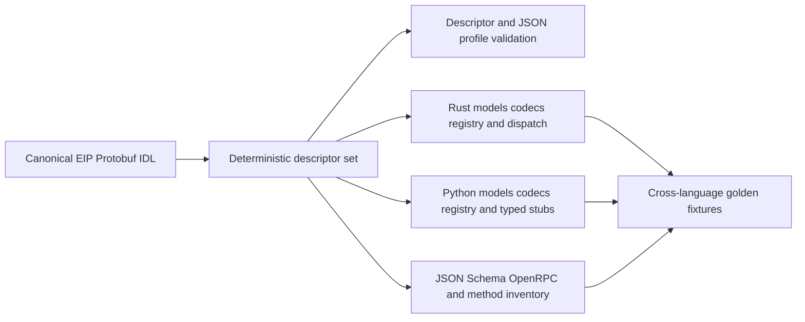
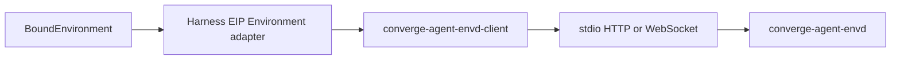

# Protocol Source, Client, and Generation

## Design Position

EIP has one language-neutral protocol source that generates the daemon wire surface and the Python client surface. The canonical source uses Protobuf service and message IDL with EIP-specific method options, while JSON-RPC 2.0 remains the observable envelope over stdio, HTTP, and WebSocket. Protobuf is an IDL and generation input; EIP does not use gRPC as a mandatory transport and does not put binary protobuf messages inside JSON-RPC.

The dedicated `converge-agent-envd-client` Python package contains the generated EIP models, method metadata, codecs, typed client stubs, and a small handwritten transport/session runtime. It has no Harness, provider, product, or daemon-process authority. The Harness directly owns the adapter from its provider-neutral Environment protocols to this client; there is no separate EIP Environment adapter package.

The client and `converge-agent-envd` daemon belong to one agent-envd release group. Their package version is release identity, while the negotiated EIP `<major>.<minor>` version remains the independent wire-compatibility identity defined by [EIP Protocol](02-eip-protocol.md).

## Boundaries

| Concern                                                                 | Owner                                  | Relationship                                                   |
| ----------------------------------------------------------------------- | -------------------------------------- | -------------------------------------------------------------- |
| Method semantics, fields, errors, compatibility, and transport behavior | `spec/agent-envd/`                     | Normative observable contract                                  |
| Canonical service/message IDL and EIP method options                    | `proto/agent-envd/`                    | Machine-readable realization of the accepted EIP contract      |
| Descriptor validation and deterministic language generation             | Repository generation tooling          | Produces all language-local wire types and method surfaces     |
| Rust server models, codecs, method registry, and dispatch surface       | Generated agent-envd crate modules     | Used behind daemon transport and resource owners               |
| Python models, codecs, method registry, and typed client stubs          | `converge-agent-envd-client`           | Transport-neutral client contract                              |
| JSON-RPC framing, authentication carrier, sessions, and liveness        | Handwritten client and daemon runtimes | Implements [transport profiles](03-transports-and-sessions.md) |
| Provider-neutral Environment adaptation and Harness result mapping      | `converge-agent-harness`               | Directly maps Harness protocols to the generated client        |
| Provider provisioning and trusted endpoint/bootstrap values             | Host provider adapter                  | Constructs a fresh EIP-backed `EnvironmentRunBinding`          |
| Product routing, durable execution, and provider lifecycle persistence  | Host                                   | Never generated from EIP IDL                                   |

The normative Markdown specification owns meaning. The canonical IDL must encode that accepted meaning exactly and is the source from which code is generated. A mismatch between specification, IDL, generated code, or golden wire fixtures fails validation; an implementation cannot select whichever copy is convenient.

## Repository and Package Shape

The stable source and output ownership is:

| Path or distribution                                                              | Content                                                                                                               |
| --------------------------------------------------------------------------------- | --------------------------------------------------------------------------------------------------------------------- |
| `proto/agent-envd/eip/v1/*.proto`                                                 | Canonical Protobuf service, messages, custom options, package identity, and reserved field numbers/names              |
| `crates/agent-envd/protocol/eip/v1/descriptor.pb`                                 | Checked deterministic descriptor set consumed by the crate build without requiring Protobuf tooling                   |
| `proto/agent-envd/eip/v1/artifacts/{methods,schema,openrpc,generated-files}.json` | Checked method inventory, JSON Schema, OpenRPC view, descriptor digest, and complete generated-file manifest          |
| `packages/agent-envd-client/converge_agent_envd_client/eip/v1/`                   | Checked generated Pydantic models, JSON codecs, method registry, protocol identity, and typed async request stubs     |
| `crates/agent-envd/build_support/` and Cargo `OUT_DIR`                            | Descriptor-driven Rust generator and its generated serde models, method registry, handler trait, and dispatch surface |
| `crates/agent-envd/protocol/eip/v1/testdata/`                                     | Shared hand-curated canonical JSON values consumed by Python and Rust conformance tests                               |
| `spec/agent-envd/`                                                                | Normative architecture, protocol, transport, resource, output, isolation, and generation contracts                    |
| `packages/agent-harness/converge_agent_harness/`                                  | Direct-local Environment implementations plus the EIP adapter that consumes `converge-agent-envd-client`              |

`converge-agent-envd-client` is a Python workspace member for repository development and validation, but it belongs to the agent-envd release group rather than the Foundation Python release group. A Foundation release can depend on a compatible published client range but does not version or republish that package.

The client package is lower-level than the Harness. It imports no Pydantic AI Agent type, `AgentContext`, `BoundEnvironment`, `ToolOutputPolicy`, provider SDK, or Host lifecycle model. The Harness adapter imports the client and translates between generated EIP values and Harness-owned provider-neutral values such as Environment descriptors, logical references, errors, receipts, and effective output policy.

## Canonical IDL Profile

Every canonical IDL file uses the Protobuf package `converge.agent_envd.eip.v1`. Each request-response method is one Protobuf service method with named request and result messages. EIP-specific method options declare at least:

- exact JSON-RPC method name;
- capability key;
- idempotency class and whether an idempotency key is allowed or required;
- request/response versus server-notification behavior;
- protocol major and first minor in which the method exists;
- owning error set or error family when narrower than the common EIP set.

The IDL uses stable package namespaces and field numbers. Removed fields reserve both number and name. Presence-sensitive scalars use explicit presence; mutually exclusive payload alternatives use a real discriminated union; dynamic maps are limited to fields whose keys are intentionally open. Secrets, native paths, PIDs, process objects, transport headers, and provider lifecycle values are absent from the IDL unless an owning EIP contract explicitly makes a bounded representation observable.

The EIP JSON profile, not a language runtime's defaults, controls JSON-RPC `params`, `result`, notification `params`, and typed `error.data`:

- wire field names are `snake_case`;
- absent optional values are omitted by generated senders; `null` is accepted only where the selected EIP schema explicitly permits it;
- a bare repeated or map field with no non-empty constraint treats absence and an empty collection as the same wire value and is canonically omitted when empty; a presence-sensitive collection uses an explicit wrapper or presence field instead;
- integer, timestamp, base64, enum/string taxonomy, discriminated-union, and unknown-field behavior match the owning EIP schema and golden fixtures exactly;
- generated request decoders reject unknown or duplicate authority-bearing fields unless the negotiated minor explicitly defines them;
- generated response decoders can ignore only additive fields allowed by the selected minor-version compatibility rules;
- binary values remain the explicit EIP `EncodedBytes` JSON shape rather than an implementation-dependent Python or Rust byte serialization;
- JSON-RPC envelopes remain JSON and never contain an encoded protobuf blob.

If standard ProtoJSON behavior differs from the accepted EIP JSON shape, the generator emits the required profile codec. A library upgrade cannot silently change field casing, 64-bit number representation, base64 form, default emission, unknown-field handling, or union decoding.

## Descriptor-Driven Generation

Generation consumes a deterministic Protobuf descriptor set including interpreted EIP custom options. No generator parses `.proto` source text with regular expressions or maintains a second hand-authored method list.

The generator produces:

- protocol identity and supported-version constants;
- Pydantic-based Python and serde-based Rust request, result, notification, common-envelope, selector, and typed-error models;
- exact JSON profile encoders and decoders;
- one method metadata registry derived from service descriptors;
- typed Python client methods for every request-response EIP method;
- typed Rust dispatch entries or traits for every daemon method;
- notification decode/dispatch metadata;
- JSON Schema and OpenRPC views for inspection and non-generated tooling;
- a normalized method inventory and complete generated-file manifest.

Shared golden request, result, notification, and error values are hand-curated wire evidence rather than generator output. Python and Rust consume the same checked fixture file so a renderer cannot redefine its own expected JSON independently.

Generated files carry a stable generated marker and are never manually edited. Python generated source is checked into the client project so source distributions, code review, and downstream type checking do not require a compiler toolchain. Rust source is generated deterministically into Cargo `OUT_DIR` from the checked descriptor during build and is never checked in as another editable copy. CI and release generation creates a candidate descriptor, Python surface, and inspection artifacts outside the repository and compares the complete manifest and bytes without first rewriting the checkout. Cargo independently regenerates the Rust surface from the checked descriptor, embeds the same digest, and rejects an invalid descriptor during build.

The Protobuf compiler, plugins, and generator dependencies are locked development/build tools. Generated runtime models use Pydantic in Python and serde in Rust, so the client does not depend on a Protobuf compiler or runtime. In particular, compiler packages such as `grpcio-tools` never enter the published client's dependencies.

## Generated and Handwritten Client Boundary

Generation owns repetitive protocol facts. The Python package generates every typed method stub from descriptor metadata; it does not keep a parallel manually written `file_read`, `process_wait`, or equivalent list that can drift from the daemon.

The handwritten client runtime owns behavior that IDL cannot safely decide:

- JSON-RPC ID allocation, response correlation, bounded in-flight multiplexing, and cancellation plumbing;
- stdio content-length framing;
- HTTP `Authorization` and `EIP-Session` handling;
- WebSocket upgrade configuration, required subprotocol, first-message initialization, frames, ping/pong, and close mapping;
- transport and message size enforcement before generated payload decode;
- initialization state, selected protocol minor, descriptor refresh, session expiry, and generation-stale fencing;
- deadline-to-transport timeout narrowing without treating a transport timeout as operation failure;
- receipt/idempotency reconciliation surfaces without automatic ambiguous mutation retry;
- secret redaction and lifecycle cleanup.

A common async transport protocol presents framed EIP messages to the generated client core. Stdio, HTTP, and WebSocket implementations satisfy that protocol without changing generated method signatures or EIP result/error meaning. The client never falls back to another transport and repeats a possibly dispatched mutation.

Convenience helpers can compose ordinary typed methods for cursor iteration, output reads, and explicit reconciliation. They preserve every bound, expiry, gap, cancellation, and unknown-outcome fact and never emulate an unsupported daemon capability through a wider local operation.

## Harness Integration

The Harness package directly provides its EIP Environment backend beside its direct-local backend:

The adapter owns:

- conversion from trusted Host endpoint/bootstrap configuration into a client session factory;
- initialization during binding entry and mapping of the EIP descriptor into the provider-neutral Harness descriptor;
- logical path, command, process, port, state, receipt, selector, and error translation;
- mapping the effective Harness `ToolOutputPolicy` decision into EIP `OutputPolicy`;
- wrapping raw EIP selectors as binding- and generation-scoped logical references before model exposure;
- provider-neutral readiness, cancellation, state export/restore, and binding cleanup behavior;
- preserving dispatch certainty and unknown outcome while normalizing safe Harness error categories.

It does not reimplement JSON-RPC, API-key handling, HTTP session headers, WebSocket handshake, stdio framing, generated payload validation, or method constants. Conversely, the client package does not know Harness virtual paths, Agent Identity, topology, model-facing references, managed redaction, or Tool metadata.

A Host provider adapter still owns Docker, E2B, remote, or local-daemon provisioning and supplies a fresh trusted connection configuration through `EnvironmentRunBinding`. Putting the EIP adapter in Harness does not move provider lifecycle or credentials into Harness and does not make envd mandatory for direct-local Environments.

## Compatibility and Release

EIP compatibility is negotiated by protocol major/minor and capability, not inferred from Python or Rust package versions. The generated client can communicate with any daemon whose negotiated protocol and required capabilities are compatible, subject to explicit package-supported version ranges.

The agent-envd release workflow uses one canonical `X.Y.Z` release identity to:

1. regenerate and verify all protocol artifacts from the canonical descriptor;
2. run Python/Rust golden, negative, cross-language, and transport conformance tests;
3. build `converge-agent-envd-client`, the `converge-agent-envd` crate/binaries, and the sandbox image from the same source and descriptor digest;
4. publish only artifacts whose embedded package version, supported protocol range, and descriptor digest match the release inputs.

All reversible builds and validations complete before any registry publication. Package registries are not transactionally atomic, so a retried release verifies an existing artifact against the exact source-built bytes and identity before skipping it; a mismatch fails closed. A client-package publish failure never causes the workflow to publish an unverified daemon image as if the release set were complete.

A protocol-only compatible addition can ship in a later package release without changing EIP major. Breaking wire meaning requires a new EIP major even if package semantic-version policy also uses a major release. The package version and EIP version never substitute for each other.

## Validation

The protocol gate includes:

- deterministic descriptor and generated-output drift checks that do not rewrite the checked tree;
- descriptor-profile checks for the fixed package, interpreted custom options, and valid union/selector shapes;
- method-option uniqueness and complete generated registry/stub/dispatch coverage for every method;
- hand-curated canonical JSON fixtures spanning request, result, error, selector, union, binary, and notification shapes;
- strict invalid fixtures for unknown authority fields, duplicate fields, malformed selectors, bounds, unions, and forbidden batches;
- shared canonical values independently decoded and encoded by both Python and Rust;
- generated Python client against the actual Rust daemon over stdio, HTTP, and WebSocket;
- authentication, HTTP session, WebSocket initialization, reconnect, cancellation, idempotency, receipt, cursor, and unknown-outcome cases;
- regeneration in a clean checkout with no diff.

Transport conformance extends the same method fixtures; it does not fork payload expectations. A generated model round trip alone is insufficient because it can reproduce the same generator bug on both sides without proving the intended JSON wire bytes.

## Trade-offs

### Shared IDL and generated surface

A custom descriptor-driven generator adds maintenance and requires disciplined compatibility lint. It removes hand-maintained cross-language model and method duplication and makes daemon/client drift mechanically visible.

### Dedicated client package and direct Harness adapter

A separate low-level client gives non-Harness consumers a reusable EIP connection without forcing them to import Pydantic AI. Keeping the provider-neutral adapter in Harness avoids a second thin integration package, at the cost of making the Harness release depend on a compatible client package.

### Co-released client and daemon

One release group makes source, generated descriptor, conformance fixtures, and native artifacts auditable as one unit. Protocol negotiation still permits independent deployment and rolling compatibility; co-release does not require exact package-version equality at connection time.

## Invariants

01. One canonical Protobuf descriptor defines every generated EIP method and payload surface; no language keeps a second editable method list.
02. EIP remains JSON-RPC JSON over stdio, HTTP, and WebSocket; Protobuf is IDL, not a mandatory transport or binary payload wrapper.
03. Generated codecs implement the accepted EIP JSON profile exactly and never inherit a language runtime's incompatible defaults silently.
04. Request decoding fails closed for unknown authority-bearing input; response evolution follows the negotiated EIP minor compatibility rules.
05. Python typed method stubs and Rust dispatch entries are generated for every descriptor method and fail drift checks together.
06. Transport, authentication, session, retry, and cleanup behavior remains handwritten, bounded, and shared beneath generated method stubs.
07. Compiler and generator tools are locked build dependencies rather than accidental client runtime dependencies.
08. `converge-agent-envd-client` imports no Harness or Host lifecycle type and grants no provider authority.
09. The Harness directly owns EIP-to-Environment adaptation and does not reimplement wire models, method constants, or transport handshakes.
10. The client and daemon share the agent-envd release group and descriptor digest, while package version and EIP version remain independent identities.
11. Shared hand-curated golden wire values, focused structural negative fixtures, and actual cross-language daemon/client tests are required in addition to generated-model round trips.
12. Direct-local Harness Environments remain first-class and do not depend on starting envd.
