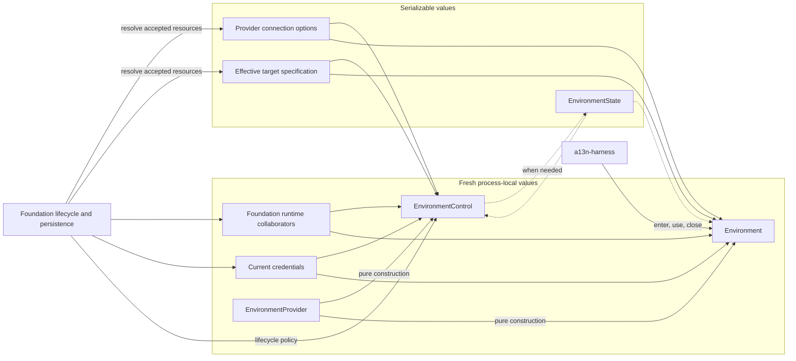
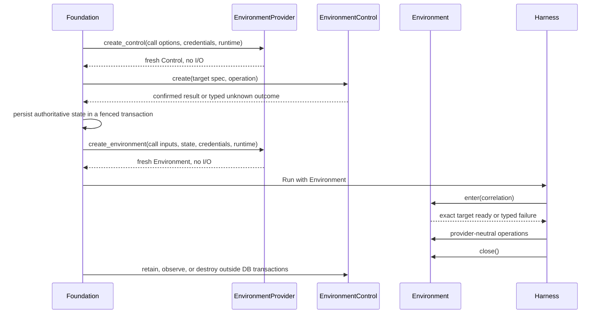
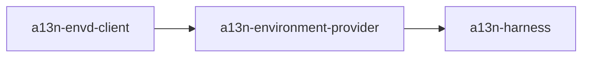

# Environment Provider Architecture

## Design Position

`a13n-environment-provider` is the shared contract and built-in implementation
package for provider-backed execution Environments. It separates inert provider
selection, backing-target lifecycle control, optional portable target state, and
process-local data-plane access.

The package has four core concepts:

1. `EnvironmentProvider` is the inert trusted plugin and pure factory for one
   namespaced provider key.
2. `EnvironmentControl` is a fresh Provider client held by Foundation's trusted
   lifecycle path for target creation, observation, readiness, retention, and
   destruction.
3. `EnvironmentState` is an optional provider-owned portable semantic reference and
   compatibility envelope for a target that needs one.
4. `Environment` is a fresh process-local data-plane adapter for one exact ready
   target.

Foundation selects and authorizes its own Provider connection and Environment
configuration, resolves them into Provider call inputs, constructs Controls and
Environments, persists current optional state, and owns lifecycle policy. Harness
receives only already constructed Environments and never obtains Control authority.

## Architecture

Foundation owns the durable distinction between a Provider connection and an
Environment revision or inline configuration. The shared package does not model
either resource. At its call boundary it receives only Provider-owned connection
options and an effective target specification derived from those accepted resources.
State, when present, identifies the resulting exact target; a stateless attached
Provider selects its target completely from the validated target specification.

## Boundaries

| Concern                                         | Owner                                               |
| ----------------------------------------------- | --------------------------------------------------- |
| Namespaced Provider key and capabilities        | `EnvironmentProvider` implementation                |
| Provider discovery and trusted selection        | Package catalog and Foundation authorization        |
| Provider-specific call-option schemas           | Provider implementation                             |
| Connections, revisions, and normalized config   | Foundation                                          |
| Credentials and fresh runtime collaborators     | Foundation                                          |
| Lifecycle client construction                   | `EnvironmentProvider`, without external I/O         |
| Create, attach, observe, ready, retain, destroy | `EnvironmentControl`, under Foundation policy       |
| Optional portable target state                  | `EnvironmentState`; Provider owns its payload codec |
| Data-plane adapter construction                 | `EnvironmentProvider`, without external I/O         |
| File, shell, process, output, and port I/O      | Entered `Environment`                               |
| Process-local data-plane cleanup                | `Environment.close()`                               |
| Durable state, target records, and Run binding  | Foundation                                          |
| Multi-mount routing and Agent-facing policy     | Harness                                             |

The package does not own Foundation Provider connections, Environment resources or
revisions, inline configuration schemas, target records, database access, Harness
state aggregation, mount names, model-facing tools, Agent identity schemas, Thread
relationships, queues, leases, tenant authorization, user APIs, retention windows,
or orphan policy.

## Managed Target Flow

For a Foundation-managed target:

1. Foundation resolves one authorized Provider connection and desired Environment
   configuration into Provider-owned connection options and an effective target
   specification.
2. The Provider validates those call inputs without external I/O.
3. Foundation supplies fresh credentials and runtime collaborators.
4. The Provider constructs a fresh `EnvironmentControl` without external I/O.
5. Under durable Foundation intent, the Control creates or reconciles one target and
   returns validated `EnvironmentState`.
6. Foundation persists that state before admitting data-plane use.
7. For each independent Run, the Provider constructs a fresh `Environment` for the
   exact managed state without external I/O.
8. Harness enters, uses, snapshots, and closes the Environment; entry and close do
   not change backing-target lifecycle.
9. Separately, Foundation constructs Controls to observe, retain, or destroy the
   target according to its durable policy.

## Attached Target Flow

An attached target specification names a target that Foundation does not own. The Provider
may normalize the supplied reference to `EnvironmentState` when later access needs a
portable Provider reference; Direct Local and Local Envd instead remain stateless
because their validated target specification already selects the exact workspace.
Control may observe an attached target or monotonically extend its lifetime when the
Provider and Foundation policy permit. Control must not create, start, resume, replace,
pause, stop, or destroy an attached target. Environment entry fails when the exact
target is not already ready.

## State Position

Managed create produces `EnvironmentState`; attached-reference normalization may
produce it when the Provider needs a portable selector beyond the validated target
specification. Later lifecycle operations and data-plane Environment construction
receive `EnvironmentState | None` explicitly. A Provider validates that the target
specification plus optional state selects exactly one target. State is a semantic soft reference
rather than an existence proof. A Provider can embed an exact container or sandbox
ID, immutable artifact identity, configuration fingerprint, and non-secret recovery
correlation needed to validate the target.

Control is the only common API that can produce changed optional state after
lifecycle mutation. Environment receives fixed `EnvironmentState | None` for one
process-local use. Its synchronous `dump_state()` exposes a detached copy of that
same optional value for portable observation. Direct Local and Local Envd return
`None`; that value neither mutates Foundation authority nor permits Environment entry
to replace the target. Foundation always prefers its own current target record over a
portable Harness copy.

## Operation Backends

The package owns provider-neutral contracts for:

- target observations, lifecycle receipts, and outcome certainty;
- canonical paths and bounded file operations;
- foreground commands and provider process handles;
- retained stdout/stderr access;
- readiness requirements and provider ports;
- optional portable target state and typed errors; and
- process-local data-plane close.

Direct Local implements data-plane operations over the embedding operating system.
Local Envd, Docker, and E2B use `agent-envd` and EIP after provider-specific target
preparation. Harness adds mount names, access ceilings, routing, stale-incarnation
fencing, aggregate projection, and model Toolsets.

## Dependency and Release Direction

`a13n-environment-provider` depends on `a13n-envd-client` and exposes Provider-side
lifecycle I/O, Direct Local/EIP operation contracts, and built-ins. `a13n-harness`
depends on the Provider package. The Provider package never imports Harness or
Foundation persistence, tenancy, resource, or policy models.

## Security Position

- Provider discovery grants no authority. Foundation allowlists keys and supplies
  trusted runtime collaborators.
- Configuration and any present state carry no credentials, clients, sessions,
  bearer URLs, process handles, or mutable authority objects.
- State, when present, is a selector, not authorization. Every operation revalidates
  configuration compatibility and exact target evidence, plus provider key and codec
  version for stateful Providers.
- Connection-bound credentials remain only in one fresh Control or Environment
  runtime collaborator and are released on close.
- Provider denial narrows Harness policy; Harness permission never bypasses provider
  enforcement.
- Direct Local is an explicit embedding trust choice and does not claim native
  sandbox isolation.
- Public errors and observations redact provider-native secrets and unnecessary Foundation
  identifiers.

## Stable Principles

01. `EnvironmentProvider` is the single shared plugin and pure factory.
02. Provider discovery, validation, Control construction, and Environment construction
    perform no external I/O.
03. `EnvironmentControl` performs target lifecycle I/O for Foundation but owns no
    database access or durable state machine.
04. Every independent Run receives fresh Environment instances for one exact target.
05. Environment entry never creates, starts, resumes, replaces, stops, or destroys a
    backing target.
06. Environment close and context exit are always non-destructive.
07. State is optional; Direct Local and Local Envd produce none, while a present state
    is never a live object, credential, lease, ownership proof, or existence proof.
08. Harness owns multi-mount routing, not Provider discovery or backing-target
    lifecycle.
09. Foundation owns current optional state, association, retention, destruction, and
    orphan repair.
10. Cancellation or transport failure never proves that a provider mutation did not
    occur.
