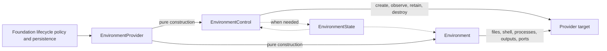

# Environment Provider Specifications

## Overview

This directory defines `agent-environment-provider`, distributed as
`a13n-environment-provider`. It owns the shared Provider catalog, Provider-owned call
option and target-state codecs, the provider-side lifecycle I/O boundary, fresh
process-local data-plane adapters, and the built-in Direct Local, Local Envd, Docker,
and E2B providers.

The core model is:

`EnvironmentProvider` is the single trusted plugin and factory. It constructs a
short-lived `EnvironmentControl` held only by Foundation's trusted lifecycle path and
a fresh single-use `Environment` for data-plane access to one exact ready target.
Neither construction path performs external I/O.

The package performs no durable storage and owns no Foundation Provider connection,
Environment resource or revision, inline configuration schema, Agent loop,
model-facing Toolset, Thread relationship, retention policy, Run binding, or product
API. Foundation owns those resources and policies and persists the latest
`EnvironmentState` when the Provider needs independent durable target continuity.

## Document Catalog

| Document                                                                               | Owns                                                                                                             |
| -------------------------------------------------------------------------------------- | ---------------------------------------------------------------------------------------------------------------- |
| [00-overview.md](00-overview.md)                                                       | Package position, architecture, boundaries, end-to-end flows, dependency direction, and stable principles        |
| [01-provider-specs-and-catalog.md](01-provider-specs-and-catalog.md)                   | Provider call options, capabilities, pure factories, catalog, discovery, authorization, and evolution            |
| [02-resource-management-and-attachments.md](02-resource-management-and-attachments.md) | `EnvironmentState`, `EnvironmentControl`, `Environment`, lifecycle/data-plane separation, failures, and security |
| [03-built-in-providers.md](03-built-in-providers.md)                                   | Direct Local, Local Envd, Docker, and E2B configuration, control, target state, and runtime behavior             |

## Reading Paths

### Manage a backing target

Read `00`, `01`, and `02`, then the chosen built-in section in `03`. Foundation
compiles accepted configuration into one effective Provider target specification,
while optional `EnvironmentState` is the Provider-owned portable reference and
compatibility evidence when a concrete target needs an independent selector. Direct
Local and Local Envd need none. Foundation supplies lifecycle policy and durable
authority.

### Integrate the Harness

Read `00` and `02`, then
[Harness Environment Integration](../agent-harness/08-environment-integration.md).
Foundation or another embedding application prepares an exact ready target and
constructs a fresh `Environment` before
each independent Harness Run. Harness receives no Provider, Control, credential, or
target-lifecycle authority.

### Implement a provider

Read `01` and `02`. A third-party Provider registers one namespaced key, validates
versioned Provider-owned call options and effective target specifications, declares
exact capabilities, constructs Controls and Environments without I/O, owns its
optional target-state codec, and implements provider-neutral control and data-plane
results.

## Authority Rules

- Foundation authorizes Provider selection, supplies current credentials and runtime
  collaborators, persists current optional state, and chooses creation, retention,
  destruction, and orphan-reconciliation policy.
- `EnvironmentProvider` is the only shared provider plugin and constructs both
  `EnvironmentControl` and `Environment` without external I/O.
- `EnvironmentControl` is held only by Foundation's trusted lifecycle path, performs
  external backing-target lifecycle calls, and owns no database access, durable state
  machine, or Foundation policy.
- `Environment` owns one exact target's process-local operation implementation; its
  entry and close cannot change backing-target lifecycle.
- `EnvironmentState`, when produced, is portable provider data, not a credential,
  live client, durable lease, ownership proof, or existence proof. Direct Local and
  Local Envd produce none.
- Harness never discovers Providers, constructs Controls, resolves credentials, or
  invokes backing-target lifecycle operations.
- Provider availability, state, and call-input validity never authorize an Agent
  operation; Foundation and Environment operation policy still apply.

## Specification Conventions

- Provider keys use a namespaced lowercase form such as `a13n.docker`.
- Provider-owned call-option and any present state versions are explicit and
  independently owned. Foundation separately versions its own resources and
  revisions.
- Serializable values contain canonical JSON only; live collaborators and
  credentials remain process-local.
- Cancellation never proves that an external operation did not occur.
- Public errors expose stable bounded codes and safe fields rather than
  provider-native exceptions or sensitive identifiers.
