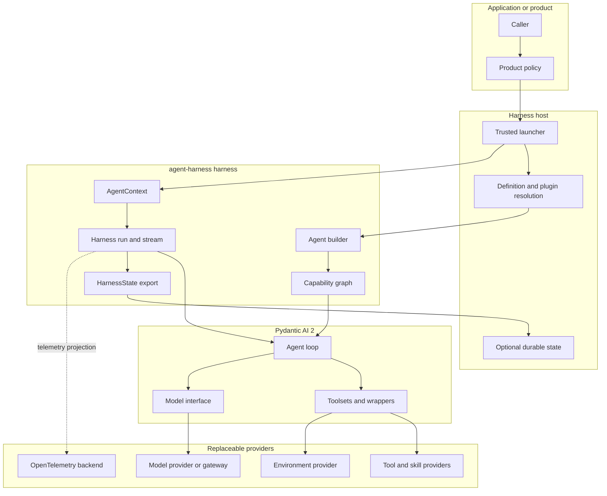
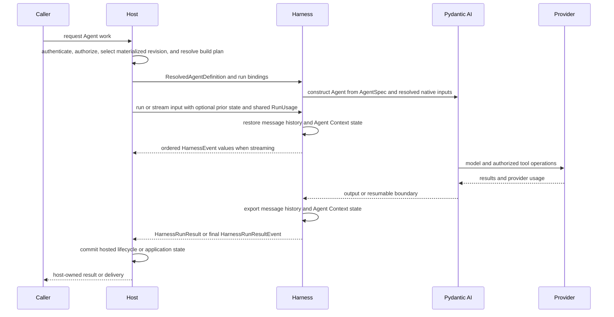
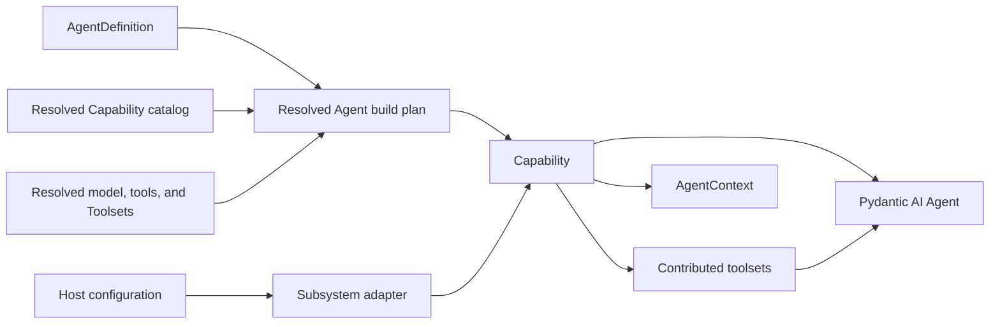

# Harness Architecture Overview

## Definition

The Harness is the reusable process-local execution layer that turns a durable or code-first Agent definition and trusted run bindings into model, tool, Environment, event, state, and Pydantic usage activity.

`agent-harness` implements this layer on Pydantic AI 2. It can run directly inside an application or behind a hosted execution adapter. The same Agent semantics apply in both modes.

## Design Position

The Harness is a cohesive layer over Pydantic AI public primitives. Every reusable Agent plugin and lifecycle component is an `AbstractCapability[AgentContext]`. Capabilities contribute instructions, model behavior, Toolsets, lifecycle behavior, state, and host integrations; trusted native Pydantic models, tools, and Toolsets can also enter the process-local resolved build plan without becoming another plugin model. The Harness contributes a canonical materialized `AgentDefinition`, trusted `AgentContext`, identity-bound dynamically composable multi-Environment access, typed client-side external-tool deferral, semantic Environment-ready input production, resumable State-backed inline delegation over immutable built children, normalized events, and terminal snapshots of native Pydantic `RunUsage`.

Embedded applications and hosted execution workers call the same build and run interfaces. Durability differences remain in the host.

## Boundary

The harness does not define:

- public hosted HTTP APIs;
- hosted lifecycle or queue state;
- distributed scheduling, execution leasing, or worker takeover;
- product authentication, organization membership, or business authorization;
- billing, credit, invoices, or subscription policy;
- a Sandbox implementation, skill registry, model gateway, telemetry backend, or secret manager;
- a second Agent loop or generic callback system beside Pydantic AI Capability hooks and the semantic input-factory seam.

## System Architecture

The trusted launcher may be an embedded application or a hosted execution worker. It establishes identity and host ports before model-controlled work begins.

## Major Components

| Component                | Responsibility                                                                                                                                                               | Explicit boundary                                                                                               |
| ------------------------ | ---------------------------------------------------------------------------------------------------------------------------------------------------------------------------- | --------------------------------------------------------------------------------------------------------------- |
| Agent builder            | Consume one Host-resolved `ResolvedAgentDefinition`, or materialize the code-first convenience, and construct a Pydantic AI Agent.                                           | Host materializes Presets and resolves versions, artifacts, providers, and trusted native components.           |
| Capability graph         | Compose every Agent component, including instructions, models, tools, lifecycle behavior, context processing, state storage integration, and cross-cutting wrappers.         | Uses Pydantic AI composition semantics.                                                                         |
| `AgentContext`           | Carry trusted run bindings, the multi-Environment facade, and Capability-namespaced state.                                                                                   | Capability-specific interaction uses Pydantic AI run-bound capabilities; provider collaborators remain private. |
| Run facade               | Coordinate one process-local Pydantic AI execution through `run()` or single-consumer `HarnessRunStream`.                                                                    | Is not a host-owned durable execution, attempt, event broker, or lease.                                         |
| State coordinator        | Export and restore `HarnessState` as `message_history` plus all Capability-owned `AgentContextState`, including Environment and delegation.                                  | Host owns durable snapshots and checkpoint selection.                                                           |
| Tool invocation pipeline | Preserve native Pydantic Toolsets and apply Identity, authorization, credentials, retry, and result safety when Harness metadata opts a function tool into managed dispatch. | Unannotated in-process tools remain trusted plugin code; provider-side policy remains authoritative.            |
| Client-tool boundary     | Map typed default or permitted per-run schemas to native `ExternalToolset` and deferred values.                                                                              | External executor and Host own side effects, durability, authenticated delivery, and feedback.                  |
| Environment adapter      | Present identity-bound file, shell, process, and port operations with atomic live multi-binding topology.                                                                    | Host owns topology selection; provider owns native state and enforcement.                                       |
| Delegation coordinator   | Expose immutable built children and provide State-backed blocking inline execution with fresh narrowed authority and lineage.                                                | Async child scheduling, durable lifecycle, and delivery belong to a Host Capability and Host services.          |
| Event and result output  | Emit typed process-local events, attributed response-usage observations, and live plus terminal Pydantic `RunUsage`, with normal-path custom pricing and explicit coverage.  | Delivery, durable per-response records, cross-run aggregation, billing, and payment belong to the Host.         |

## End-to-End Execution Flow

## Completion Boundaries

The following boundaries are independent:

| Boundary                        | Meaning                                                                                                                                                                           | Authority                       |
| ------------------------------- | --------------------------------------------------------------------------------------------------------------------------------------------------------------------------------- | ------------------------------- |
| Pydantic run completion         | The process-local Agent loop produced an output or raised a terminal error.                                                                                                       | Pydantic AI and harness adapter |
| Harness result and state export | The process-local adapter finalized output, a `RunUsage` snapshot, and optional continuation state.                                                                               | Harness                         |
| Harness stream completion       | Run-scoped teardown succeeded and the consumer received the final result event, or early exit completed quiet cleanup; teardown failure raises with any primary outcome retained. | Harness and stream consumer     |
| Host completion                 | An embedded application or hosted service committed durable state, delivery, or lifecycle.                                                                                        | Host and downstream owners      |

A harness terminal result says nothing about completion of a host-owned durable execution, external delivery, webhook, or telemetry export. Those facts are committed by their owning layers.

## Extension Taxonomy

| Extension type      | Selected by                                        | Produces                                                                                 | Trust boundary                                      |
| ------------------- | -------------------------------------------------- | ---------------------------------------------------------------------------------------- | --------------------------------------------------- |
| Capability plugin   | Materialized Agent definition and selected catalog | Pydantic Capabilities with optional Toolset and state contributions                      | Trusted in-process code                             |
| Native build input  | Host resolver or embedded application              | Pydantic model, tool, or Toolset object in `ResolvedAgentDefinition`                     | Trusted process-local object                        |
| Host capability     | Host configuration                                 | Checkpointing, Environment, policy, credentials, telemetry, or another Agent integration | Operator or protocol trust boundary                 |
| Remote provider     | Host or capability configuration                   | Protocol-backed operations                                                               | Authenticated protocol and provider policy boundary |
| Product integration | Application                                        | Inputs, actor references, policy decisions, delivery                                     | Outside harness core                                |

## Stable Design Principles

01. Pydantic AI is the Agent-loop authority; the harness extends public primitives rather than duplicating them.
02. The harness wraps upstream primitives where one stable abstraction unifies embedded hosting, hosted execution, and third-party extension.
03. One-to-one wrappers without additional harness semantics are avoided.
04. A resolved definition remains fixed for the lifetime of an executable Agent and its runs; only variability explicitly declared by that definition, such as a permitted whole-run external client-tool replacement, can enter a run binding.
05. Trusted identity enters through the host and is propagated by the harness; model-controlled data cannot establish authority.
06. Capabilities are the reusable Agent plugin and lifecycle model; native Pydantic model, tool, and Toolset values remain explicit trusted build inputs, while capabilities retain narrow provider collaborators.
07. Metadata-aware function tools use one managed wrapper path; native Pydantic tools remain usable without inferred Harness guarantees, while client tools remain native external deferrals.
08. Environment routing, live topology selection, and Environment authorization are separate steps.
09. Process-local state, host durable state, live event delivery, telemetry, and billing are separate facts.
10. Stateful capabilities own versioned state segments and explicit incompatible-state behavior.
11. Complete child declarations and immutable built collections are execution-mode neutral; the Harness owns blocking State-backed inline delegation, while Host Capabilities own asynchronous child lifecycle and delivery.
12. Provider failures are normalized without hiding retry safety, side effects, or uncertainty.
13. Optional integrations do not expand the base dependency set or change core semantics.
14. Public harness contracts avoid Pydantic AI private graph APIs and internal package layout.

## Trade-offs

### Thin harness over a parallel framework

Using Pydantic AI directly keeps the harness small and aligned with upstream model, capability, toolset, output, and streaming evolution. The cost is that upstream public API changes become a compatibility concern. A narrow adapter and compatibility tests are preferred over duplicating the Agent loop.

### Stable harness facade over raw upstream exposure

`AgentDefinition`, `ResolvedAgentDefinition`, code-first materialization, `HarnessRunStream`, `HarnessRunResult`, `HarnessState`, `HarnessEvent`, `BoundEnvironment`, and metadata-aware tool dispatch form a cohesive public surface across host modes. They add maintenance cost and require explicit mapping to Pydantic AI, but prevent every product and plugin from inventing its own effective configuration, Identity, state, event, and Environment conventions.

### Process-local state over durable orchestration

The harness exports resumable state but does not own a durable execution identity, lease, queue, or recovery worker. This avoids duplicating host orchestration and keeps embedded usage simple. A host that needs crash recovery must persist state and decide when a new process-local run resumes it.

### Trusted Python plugins over in-process isolation

The first plugin boundary assumes operator-installed Python code is trusted. This preserves the ordinary Pydantic AI programming model and avoids an early remote-plugin framework. Untrusted or separately governed extensions use a tool or Environment provider protocol.

### Typed core context over a generic service container

A small typed execution context makes identity and Environment access explicit. It is less dynamically extensible than a dictionary service locator, but prevents capabilities from coupling to undocumented host objects.

### Narrow adapters over a universal provider framework

Environment and other shared integrations use subsystem-specific adapters. The harness does not define one generic provider lifecycle for models, storage, identity, telemetry, and product services. This produces fewer reusable abstractions, but keeps each security and failure boundary explicit.

## Specification Ownership

The catalog in [README.md](README.md) identifies the single owning document for each detailed contract. This overview defines only cross-document architecture and completion boundaries.
