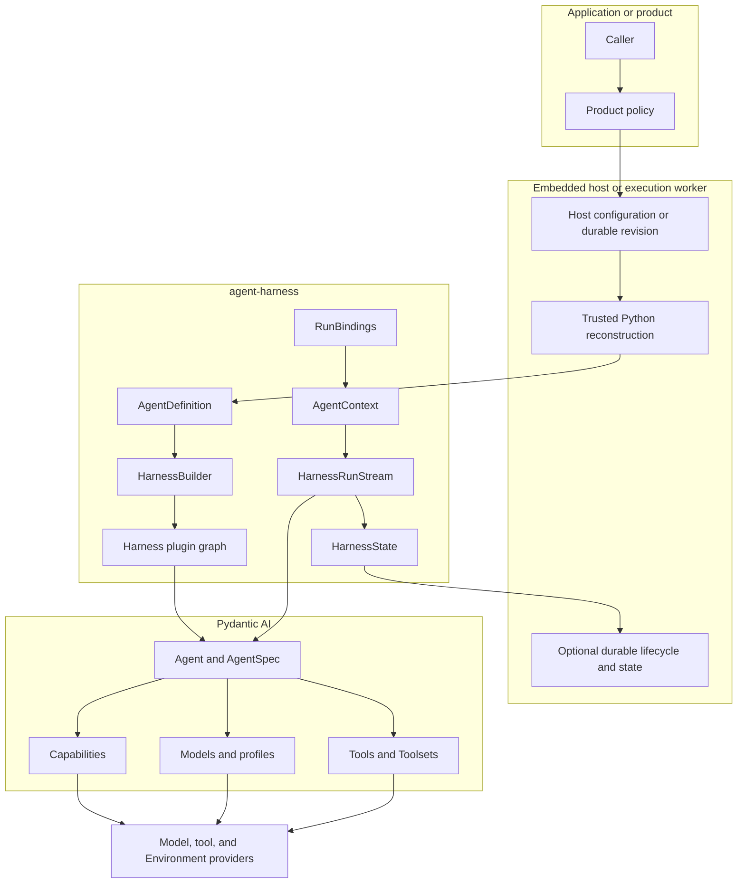
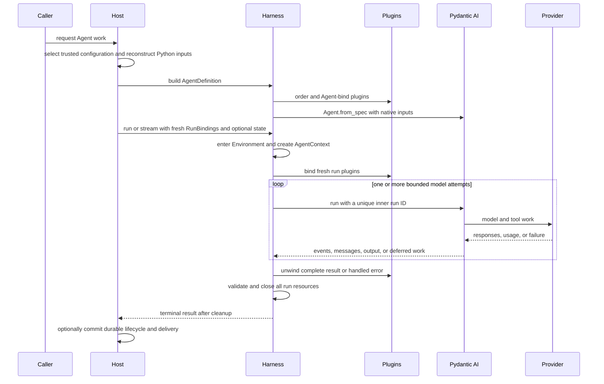

# Harness Architecture Overview

## Definition

`agent-harness` is the reusable process-local execution layer that composes native Pydantic AI configuration and trusted Python extensions into a reusable Agent, then runs it with fresh Identity, Environment, model, and Capability bindings.

Embedded applications and hosted workers use the same code-first API. A Host may persist its own definition and execution records, but the Harness defines no Agent-definition wire format or durable lifecycle.

## Design Position

Pydantic AI owns the Agent loop, Models, profiles, Toolsets, Capabilities, messages, deferred values, outputs, and usage. The Harness adds:

- immutable process-local `AgentDefinition` composition;
- trusted ordered plugins around semantic input, events, errors, and the complete result;
- one typed `AgentContext` per logical run;
- fresh `RunBindings` for Identity, Environment, model resolution, and run Capabilities;
- detached `HarnessState` containing messages and Capability namespaces;
- a single-consumer event/result stream with deterministic cleanup;
- narrow Model self-healing and bounded recovery from interrupted model execution.

It does not add a second Agent loop, Model/profile system, Toolset hierarchy, Capability registry, serialized compiler/catalog, plugin package manager, or durable workflow engine.

## Architecture

The trusted Host reconstructs Python objects from its own configuration and dependency locks. The Harness validates their process-local composition but does not serialize or attest their origin.

## Major Components

| Component           | Responsibility                                                                                                             | Explicit boundary                                          |
| ------------------- | -------------------------------------------------------------------------------------------------------------------------- | ---------------------------------------------------------- |
| `AgentDefinition`   | Hold native `AgentSpec`, output, Model, tools, Toolsets, Capabilities, plugins, child definitions, and recovery policy     | Process-local Python value only                            |
| `HarnessBuilder`    | Bind Agent plugins, add the thin model resolver and mandatory inert invocation boundary, and call `Agent.from_spec()` once | Performs no I/O, discovery, or Host materialization        |
| Plugin graph        | Deterministic ordering, fresh run binding, outer middleware, and Capability contribution                                   | Trusted code; Pydantic owns inner hooks                    |
| `RunBindings`       | Carry fresh Agent instance, Environment, optional model binding, run Capabilities, and metadata                            | No durable state or generic service locator                |
| `AgentContext`      | Share run Identity, Environment, state, plugins, child collection, model binding, and metadata                             | One context per logical Harness run                        |
| `HarnessRunStream`  | Lazy single-consumer events, cancellation, state export, model attempts, results, and cleanup                              | Not a Host durable Attempt, queue, replay stream, or lease |
| `HarnessState`      | Detached Pydantic messages plus JSON Capability namespaces                                                                 | Host chooses persistence and checkpoint selection          |
| Invocation boundary | Mandatory inert outer wrapper; managed behavior activates only for metadata-aware function tools and fresh policy          | Native unannotated tools remain trusted Pydantic behavior  |

## End-to-End Flow

## Recovery Ownership

| Recovery kind                          | Owner                                      |
| -------------------------------------- | ------------------------------------------ |
| Provider-suspended continuation        | Pydantic AI                                |
| Transport retry                        | Provider/client and Pydantic `RetryConfig` |
| Exact provider-history repair          | `SelfHealingModel`                         |
| Interrupted model semantic attempts    | `HarnessRunStream`                         |
| Worker crash, durable replay, delivery | Host                                       |

A Harness semantic retry remains inside one logical run and shares context, Environment, plugins, state, and usage. A Host retry creates a fresh Harness run and fresh bindings.

## Completion Boundaries

| Boundary                  | Meaning                                                        | Authority                   |
| ------------------------- | -------------------------------------------------------------- | --------------------------- |
| Inner Pydantic attempt    | One Agent loop ended or was interrupted                        | Pydantic AI                 |
| Logical Harness result    | Plugins produced a structurally valid terminal candidate       | Harness                     |
| Harness terminal delivery | All run-scoped cleanup succeeded and the result event was sent | Harness and stream consumer |
| Durable completion        | Host committed its lifecycle transition                        | Host                        |
| External delivery         | Product or connector committed delivery                        | Downstream owner            |

These facts are independent. A result candidate retained by `RunCleanupError` is not a clean Harness terminal delivery, and a Harness terminal result is not a Host durable commit.

## Extension Taxonomy

| Extension                    | Selection                                            | Trust boundary                       |
| ---------------------------- | ---------------------------------------------------- | ------------------------------------ |
| Harness plugin               | Concrete object in `AgentDefinition.plugins`         | Trusted in-process Python            |
| Pydantic Capability          | `AgentSpec`, definition, plugin, or run contribution | Pydantic lifecycle plus caller trust |
| Native Model/tool/Toolset    | Concrete `AgentDefinition` field                     | Trusted in-process object            |
| Run-scoped model resolver    | Fresh `ModelRunBinding`                              | Host/provider policy                 |
| Environment/provider adapter | Fresh `EnvironmentRunBinding` or feature protocol    | Provider enforcement                 |

A hosted system can maintain stable configuration and artifact locks for these values, but those are Host contracts. No extension registration is globally activated by importing the Harness.

## Stable Principles

01. Pydantic AI remains the Agent-loop authority.
02. Agent construction is code-first and process-local.
03. Hosted schemas and revisions belong to the Host, not the Harness package.
04. Trusted plugins own outer middleware; Capabilities own behavior inside the Agent loop.
05. One logical run has one context, Environment, plugin graph, state coordinator, usage accumulator, and public run ID.
06. Internal model attempts have unique Pydantic run IDs and a bounded total budget.
07. State is detached continuation data, never restored authority.
08. Plugin state transformation is trusted composition, not provenance-policed data flow.
09. Cancellation, usage limits, output retry exhaustion, tool failure, and deferred/HITL boundaries stop semantic recovery.
10. Provider and external side-effect uncertainty is never rewritten as exactly-once success or rollback.
11. Terminal delivery occurs only after cleanup.
12. Host durability, event projection, external delivery, usage accounting, billing, and payment remain separate facts.

## Trade-offs

### Native Python Composition vs. a Universal Definition Format

Native objects preserve Pydantic AI's full type and extension model. Hosts must own explicit schemas and reconstruction adapters, but the Harness avoids a lossy compiler and duplicate package system.

### Narrow Recovery vs. Workflow Replay

The Harness repairs exact Model-history problems and interrupted Model execution. Durable replay and side-effect reconciliation stay with owners that have the required evidence.

## Specification Ownership

The [Harness specification catalog](README.md) identifies the detail owner for each contract. This overview owns only architecture, recovery layering, and completion boundaries.
