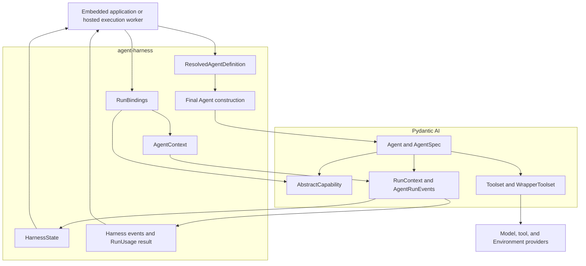
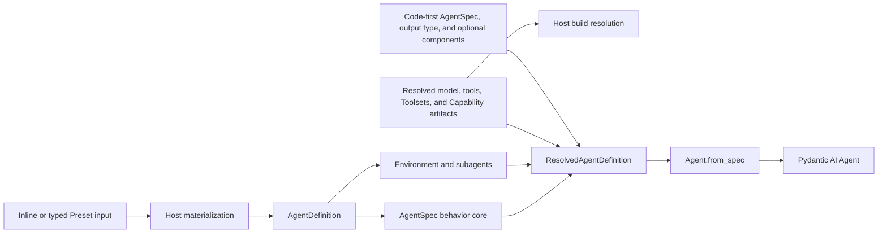
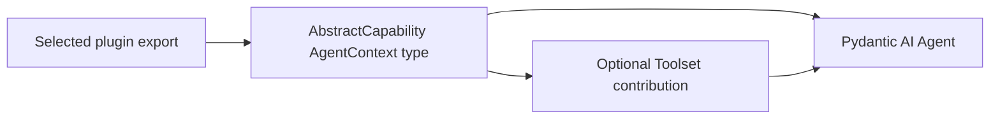
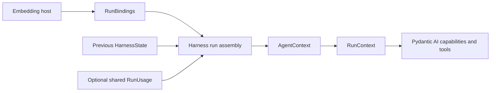
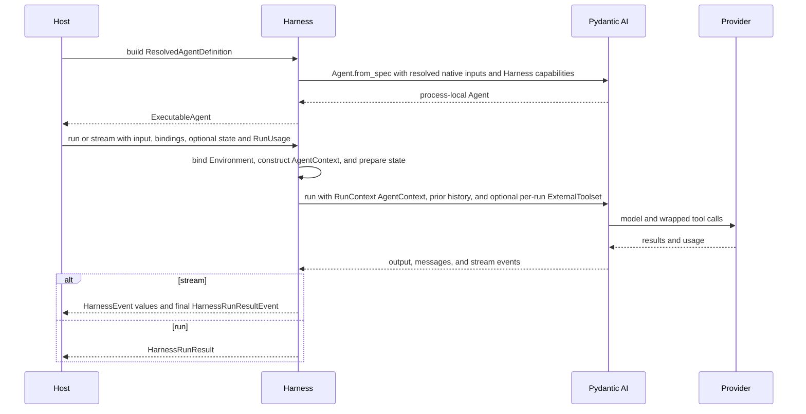

# Pydantic AI Foundation

## Design Position

`agent-harness` is a harness built on Pydantic AI 2. Pydantic AI remains the process-local Agent runtime; the harness adds a cohesive Agent component, context, state, and hosting boundary shared by embedded applications and hosted execution.

The Harness uses public Pydantic AI contracts and does not introduce a second Agent loop, generic hook lifecycle, Toolset hierarchy, model abstraction, profile system, or output system. It keeps request intent in `ModelSettings`, model/provider/adapter compatibility in the resolved native `Model.profile`, and remaining Agent or run behavior in Capabilities. It adds one semantic input-factory seam before Pydantic run creation because Environment-backed prompt materialization cannot be expressed as a node hook after the prompt already exists.

## Upstream Primitives

| Pydantic AI primitive              | Role in the harness                                                                   |
| ---------------------------------- | ------------------------------------------------------------------------------------- |
| `Agent`                            | Model, tool, output, retry, and validation loop                                       |
| `AgentSpec`                        | Declarative base for model, instructions, settings, capabilities, retries, and output |
| `AbstractCapability[AgentContext]` | Reusable behavior and lifecycle composition                                           |
| `CombinedCapability`               | Capability aggregation and middleware order                                           |
| `CapabilityOrdering`               | Ordering and dependency constraints                                                   |
| `Toolset` / `CombinedToolset`      | Tool discovery and dispatch                                                           |
| `WrapperToolset`                   | Cross-cutting function-tool invocation behavior                                       |
| `ExternalToolset`                  | Per-run client-side schemas that defer execution outside the Agent process            |
| `DeferredToolRequests` / results   | Distinct external-call and approval stop-and-resume values                            |
| `RunContext[AgentContext]`         | Pydantic run metadata plus the harness-owned typed dependency                         |
| `AgentRunEvents`                   | Lazy event handle, live usage/messages, native cancellation, result, and cleanup      |
| `Model` and `ModelProfile`         | Native model resolution plus provider/model/adapter compatibility and rendering       |
| `ModelSettings`                    | Default and per-request model intent and tuning                                       |
| Pydantic output contracts          | Provider-neutral structured output                                                    |
| Pydantic stream events             | Source events normalized by the harness event adapter                                 |

`Hooks` remains useful for application-local behavior. Reusable Harness features use `AbstractCapability[AgentContext]` because it carries configuration, Toolsets, ordering, run binding, and state ownership more cleanly. No Harness Capability uses `Any` or an alternate dependency type.

## Harness Additions

The harness adds behavior that Pydantic AI deliberately leaves to the application:

- host-issued Agent Identity and child-instance lineage;
- identity-bound Environment access;
- one process-local build path from a `ResolvedAgentDefinition` or code-first `AgentSpec` input;
- `AgentContext` as the typed run dependency and state-saving center;
- a state envelope for Pydantic message history and Capability-namespaced Agent Context state, including multi-Environment and delegation continuation;
- normalized process-local events and terminal snapshots of native Pydantic `RunUsage`;
- subagent declarations that can choose inline or host-managed execution;
- a typed facade over `AgentRunEvents` for normalized events and results, native enqueue and cancellation wrappers, cooperative safe pause, and run-local capability state;
- a narrow `ClientToolRunBinding` that can replace external client-tool schemas only when the materialized Client Tools Capability permits it.

These additions are expressed as typed Pydantic dependencies, Capabilities, tool wrappers, and small host protocols. Authority-neutral provider clients and collaborators for residual public-hook transformation or recovery can be retained by reentrant build Capabilities; stable compatibility facts remain in the resolved native Model profile. Policy evaluators, credential resolvers, model resolution that needs current Identity, and hosted-delegation adapters enter only through fresh run Capabilities; none is collected into a service locator.

## Definition Mapping

`AgentDefinition` is the complete materialized logical Agent definition. It composes an upstream `AgentSpec` behavior core with Harness definition identity, Environment requirements, and complete child declarations. The hosted control plane materializes typed Presets and commits immutable revisions before execution; the Harness does not evaluate Presets or merge global Model and Tool configuration bags.

The execution Host resolves logical model references into authority-neutral locked integration descriptors, along with trusted native tools and Toolsets, custom Capability types, and reentrant non-model-selecting build Capabilities that carry no current-run authority, in one `ResolvedAgentDefinition`. Only an attested credential-free Model can be present at build time. A normal hosted Model is constructed later by the one locked run Capability after fresh authority exists; that native object carries its effective `ModelProfile` and adapter behavior or resolution fails closed without ambient inference. `build_code()` creates the same plan from a native `AgentSpec`, explicit Python output type, and one optional process-local component bundle. Both paths call `Agent.from_spec()` only after Host resolution, with `deps_type=AgentContext` and the resolved native inputs. A hosted node that retains its logical model ID passes the public `defer_model_check=True` flag and is not entered through `Agent.__aenter__()` outside a run; otherwise upstream could infer the ID before the fresh resolver is bound. Model-loop fields retain their upstream representation without serializing Python type objects or inventing an `AgentSpec.model_profile` field.

The Host owns definition revisions, dependency locks, plugin artifacts, provider selection, and rollout. The Harness consumes the process-local plan without importing those durable lifecycle types.

## Capability Mapping

A plugin exports an ordinary Pydantic AI Capability type. The capability can contribute instructions, model behavior, native tools, and Toolsets. Pydantic AI ordering determines construction and lifecycle behavior.

Checkpointing, Environment integration, authorization, memory, observability, and other Agent-affecting components use the same capability model. A capability can retain a narrow provider collaborator without turning that collaborator into another Agent component lifecycle.

Stateful capabilities use the namespaced state held by `AgentContext`. Stateless capabilities need no harness-specific base class.

Identity binding and a metadata-aware dispatcher are outer behavior around assembled function Toolsets. Tool definitions carrying `HarnessToolMetadata` enter the managed authorization, credential, retry, and result path. Unannotated native Pydantic function tools keep native dispatch under the trusted-plugin boundary rather than receiving inferred security semantics. Client-side schemas remain upstream external tools: Pydantic defers them without invoking the function dispatcher, and a later run supplies native external-call results.

## Execution Context Mapping

`RunBindings` is the host-facing bundle of Agent instance, a single-use `EnvironmentRunBinding`, optional referenced-content resolver, optional typed client-tool replacement, and run-specific Capabilities. The Harness allocates the run ID, binds and enters that Environment value to obtain a multi-binding `BoundEnvironment`, then combines it with run metadata, an internal `HarnessEventEmitter`, and optional restored state to create `AgentContext`, the dependency object visible through Pydantic AI `RunContext[AgentContext]`. After Environment restore, an optional `RunInputFactory` materializes the prompt before the native run starts. The Harness resolves any permitted client-tool replacement to native per-run `ExternalToolset` values; it exposes no generic per-run executable Toolset injection. Optional shared `RunUsage` and native `UsageLimits` remain direct run arguments, matching Pydantic AI rather than becoming host bindings.

`AgentContext` owns mutable capability-namespaced state. Capability-specific run interaction uses Pydantic AI's public `RunContext.capabilities` collection; enqueue and cancellation from inside a run use `RunContext.enqueue()` and `RunContext.cancel()` directly. The Harness does not maintain a second capability registry, control object, or lifecycle.

Capability-specific policy, credential, and provider collaborators stay with the capability that owns their behavior. The canonical fields are defined in [`04-capability-model.md`](04-capability-model.md) and [`14-public-api-and-packaging.md`](14-public-api-and-packaging.md).

The Pydantic run ID and tool-call ID remain the process-local correlation identities. Host execution, request, and lease references stay opaque host metadata.

## Run Flow

A resume is another Pydantic run built from a compatible resolved definition, prior message history, capability state, and any exact frozen client-tool surface needed by a pending external call. Durable attempt identity, client-call result authority, and checkpoint ownership remain with the host.

## Boundary with the Host

| Concern                                                    | Host                                          | Harness and Pydantic AI                                       |
| ---------------------------------------------------------- | --------------------------------------------- | ------------------------------------------------------------- |
| Caller authentication                                      | Owns                                          | Consumes verified actor reference                             |
| Agent Identity and policy                                  | Issues and evaluates                          | Propagates and invokes adapters                               |
| Definition source, Presets, revision, and artifact pinning | Owns                                          | Consumes materialized definition and process-local build plan |
| Process-local Agent loop                                   | Delegates                                     | Owns                                                          |
| Durable acceptance and recovery                            | Owns                                          | Exports and imports state                                     |
| Client-side external execution and feedback                | Authenticates, fences, or executes externally | Produces and consumes native deferred values                  |
| Environment provisioning                                   | Owns or delegates to provider                 | Uses `BoundEnvironment`                                       |
| Events and usage retention                                 | Owns                                          | Produces events and usage snapshots                           |
| Host durable completion                                    | Owns                                          | Returns a process-local result only                           |

## Compatibility

Pydantic AI compatibility is based on its latest public behavior: Capability ordering, Toolset wrapping, model profiles and request preparation, model events, output validation, message history, usage pricing, and run semantics. The repository advances its lock to the latest stable Pydantic AI release as normal maintenance and does not promise a broad older-minor compatibility band. During coordinated upstream contribution, the lock may temporarily select an exact unreleased upstream commit until that behavior is released. Every lock change runs the complete compatibility suite, and the Harness avoids private graph methods, internal node types, and adapter monkey-patching.

When a required provider/model compatibility fact or adapter seam is missing, the preferred fix is an upstream Pydantic AI contribution. A temporary Harness Capability is acceptable only when the behavior is genuinely Agent- or Host-specific, or while an upstream public seam is unavailable and the repair can be expressed safely through existing public Capability hooks. It must be narrowly scoped and removable; it does not create a private compatibility fork.

The compatibility suite specifically covers deferred hosted logical-model construction and executable entry without ambient inference, followed by run-bound return-or-raise resolution under fresh dependencies; native `ModelProfile` resolution and adapter narrowing, unified thinking-setting preparation and provider-specific thinking-part round trips; lazy `AgentRunEvents` creation and pre-start cancellation; native multimodal `Sequence[UserContent]`; concurrent `for_run()` binding versus ordered `before_run()` hooks; pending state acceptance before model work; normal custom model-cost override, calculator decline and failure fallback, explicit coverage for interrupted or hook-short-circuited responses, usage-bearing `SkipModelRequest`, exclusion of enqueued synthetic responses, stable inline-child usage observations, and shared inline accumulation; public per-node checkpoint views; provider-suspended continuation without appending its empty request placeholder and with an exact Host-owned target pin; refusal to checkpoint an incomplete parent tool batch; metadata-aware `WrapperToolset` dispatch, duplicate managed identity, and dynamic strict-profile checks; per-run `ExternalToolset` deferral, exact external-call result correlation, and separation from approvals; single-use Environment binding and topology notices that leave static instructions and schemas unchanged; and terminal result delivery only after successful run teardown.

Capability state compatibility is independent from Pydantic AI package compatibility. Each stateful capability owns the version of its entry in `HarnessState`.

## Trade-offs

### Direct dependency

Using Pydantic AI directly gives the harness upstream improvements and a familiar ecosystem. It increases sensitivity to upstream changes, which is handled through a narrow public-API dependency and compatibility tests rather than a forked runtime.

### `AgentSpec` composition

Composition adds one `agent` nesting level to YAML and JSON. It avoids copying upstream fields or overriding Pydantic AI's Capability-aware schema generation. The nested document passes to `Agent.from_spec` together with explicit Host-resolved native build inputs rather than pretending that the upstream spec is the complete Host configuration.

### AgentContext-owned state

Namespaced state on `AgentContext` gives capabilities one saving and restore path without a parallel lifecycle. The common context is broader than isolated per-capability objects, so access remains namespace-scoped and codecs remain capability-owned.

### Host-owned durability

The harness stays useful as a library because it does not require a database or scheduler. Recovery guarantees therefore come from the embedding host, not from `agent-harness` alone.
