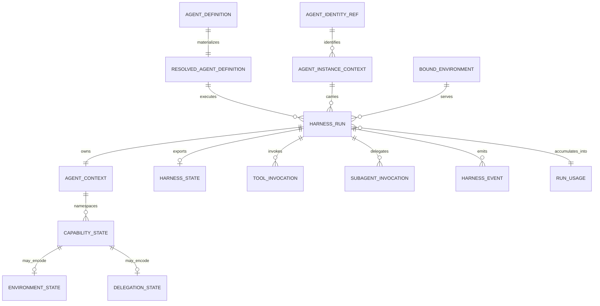
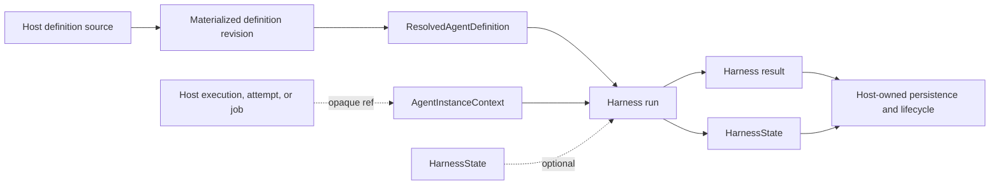

# Harness Domain Model

## Design Position

The harness domain describes one process-local Pydantic AI execution, the Agent instance that performs it, and the state and observations produced by it. Durable definitions, executions, attempts, leases, queues, and recovery remain host domains.



## Ownership

| Concept                   | Meaning                                                                                                                                            | Owning document                                                          |
| ------------------------- | -------------------------------------------------------------------------------------------------------------------------------------------------- | ------------------------------------------------------------------------ |
| `AgentDefinition`         | Complete materialized logical Agent definition containing an upstream `AgentSpec`, Environment requirements, and child definitions.                | [Agent Definition and Build](03-agent-definition-and-build.md)           |
| `ResolvedAgentDefinition` | Immutable process-local build plan containing the definition plus resolved model, tool, Toolset, Capability, output, child, and provenance inputs. | [Agent Definition and Build](03-agent-definition-and-build.md)           |
| `AgentIdentityRef`        | Stable workload identity supplied by the trusted host.                                                                                             | This document                                                            |
| `AgentInstanceContext`    | Root or child instance, actor, lineage, and opaque host correlation.                                                                               | This document                                                            |
| `AgentContext`            | Typed Pydantic AI dependency, multi-Environment holder, and Capability-namespaced run-state center.                                                | [Capability and Agent Context Model](04-capability-model.md)             |
| Harness run               | One process-local Pydantic AI execution.                                                                                                           | [Execution Context and Lifecycle](06-execution-context-and-lifecycle.md) |
| `HarnessRunStream`        | Single-consumer event, terminal-result, and live-control facade for a streamed harness run.                                                        | [Public API and Packaging](14-public-api-and-packaging.md)               |
| `HarnessState`            | Minimal continuation state exported for a later run.                                                                                               | [Harness State and Resume](10-snapshot-and-resume.md)                    |
| `ToolInvocation`          | One normalized call through the common Pydantic tool wrapper path.                                                                                 | [Tool Execution](07-tool-execution.md)                                   |
| `SubagentInvocation`      | One inline or host-dispatched child call.                                                                                                          | [Delegation and Subagents](11-delegation-and-subagents.md)               |
| `BoundEnvironment`        | Identity-bound facade over host-selected Environment bindings.                                                                                     | [Environment Integration](08-environment-integration.md)                 |
| `HarnessEvent`            | Typed observation of one run.                                                                                                                      | [Events, Observability, and Usage](12-events-observability-and-usage.md) |
| Pydantic `RunUsage`       | Live usage accumulator, optionally shared by an inline execution tree and copied into each result.                                                 | [Events, Observability, and Usage](12-events-observability-and-usage.md) |

## Agent Identity

```python
class AgentIdentityRef(BaseModel):
    issuer: str
    subject: str
```

The identity is stable across Agent definition revisions. It names the workload principal but does not carry policy or credentials.

```python
class AgentInstanceContext(BaseModel):
    identity: AgentIdentityRef
    agent_instance_id: str
    parent_agent_instance_id: str | None
    delegation_id: str | None
    actor: ActorRef | None
    host_refs: Mapping[str, str]
```

`actor` records who triggered the work. `host_refs` contains opaque host correlation such as an execution, request, or job reference. Neither field grants authority.

A root execution starts with a new Agent instance. An inline child receives another instance ID and explicit parent lineage. A later run can preserve the same instance context when the host treats it as a continuation.

## Process-local and Host-owned State



The harness sees host versions and execution entities only through resolved content or opaque references. A process-local result does not commit a host-owned durable execution, and exported state does not identify the authoritative durable checkpoint.

## Version Boundaries

| Version                  | Meaning                                                                    | Owner                     |
| ------------------------ | -------------------------------------------------------------------------- | ------------------------- |
| `HarnessState` version   | Continuation envelope shape                                                | Harness                   |
| capability state version | One capability's serialized entry                                          | Capability implementation |
| Environment generation   | Validity of provider handles and cursors                                   | Environment provider      |
| host definition revision | Immutable materialized definition, Preset provenance, and dependency locks | Host                      |
| identity policy version  | Authorization ceiling and revocation semantics                             | Host policy provider      |

The versions stay independent because a model configuration update, a capability state migration, an Environment restart, and a policy revocation have unrelated effects.

## Boundaries

- `AgentDefinition` is the canonical materialized logical definition and embeds Pydantic AI configuration without translating or replacing its model-loop fields.
- Host Presets produce immutable `AgentDefinition` snapshots before execution; they are not process-local inheritance or run state.
- `ResolvedAgentDefinition` adds process-local native model, tool, Toolset, Capability, output, child, and provenance values without becoming a durable format.
- A harness run is process-local and has no durable attempt or lease semantics; `HarnessRunStream` adds no durability or event replay.
- `AgentContext` is the single mutable state center for one run; capabilities use namespaced entries rather than independent state stores.
- `HarnessState` contains Pydantic `message_history` and the complete recoverable `AgentContextState`, including versioned Environment and delegation entries, but no host lifecycle or live provider objects.
- Agent Identity enters from the host and remains distinct from actor, run, host execution, Environment, and OS user identities.
- Events and terminal `RunUsage` snapshots leave the harness as observations; hosts decide persistence, cross-run aggregation, and cost policy.

## Trade-offs

### Small shared model

Keeping only Identity and cross-document relationships here avoids a central mega-schema. Readers follow owning documents for details, while consistency depends on maintaining stable names and links.

### Opaque host references

Opaque references preserve reuse across embedded and hosted execution. The harness cannot inspect host lifecycle directly, which is intentional because lifecycle authority stays with the host adapter.

### Stable identity, transient runs

A stable workload identity supports policy and credentials across definition revisions. Treating each Pydantic execution as a new run keeps resume simple and avoids duplicating Host attempt semantics.
