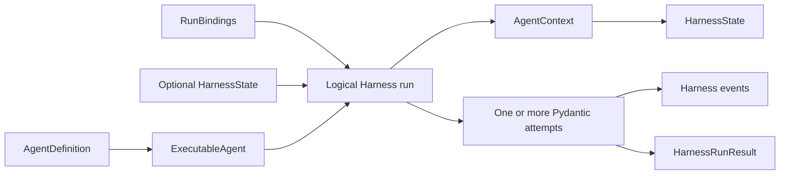

# Harness Domain Model

## Design Position

The Harness domain contains process-local Agent construction, one logical execution, its trusted bindings, events, usage observations, results, and portable continuation state. Durable definitions, executions, worker Attempts, leases, queues, and delivery remain Host domains.



## Ownership

| Concept              | Meaning                                                                              | Owner                                                                      |
| -------------------- | ------------------------------------------------------------------------------------ | -------------------------------------------------------------------------- |
| `AgentDefinition`    | Immutable process-local native build inputs                                          | [Agent Definition and Build](03-agent-definition-and-build.md)             |
| `ExecutableAgent`    | Reusable built Pydantic Agent plus Agent-bound plugins                               | [Public API](14-public-api-and-packaging.md)                               |
| `RunBindings`        | Fresh trusted Agent instance, Environment, model binding, Capabilities, and metadata | [Execution Context](06-execution-context-and-lifecycle.md)                 |
| `AgentContext`       | One logical run's shared Pydantic dependency                                         | [Capability Model](04-capability-model.md)                                 |
| `BoundPluginContext` | Immutable index of fresh plugins used by one logical run                             | [Plugin System](05-plugin-system.md)                                       |
| Logical Harness run  | One outer context/plugin/Environment/usage scope with one public `run_id`            | [Execution Context](06-execution-context-and-lifecycle.md)                 |
| Pydantic attempt     | One inner `Agent.run_stream_events()` invocation with a unique upstream run ID       | Pydantic AI and [Execution Context](06-execution-context-and-lifecycle.md) |
| `HarnessState`       | Detached messages plus Capability namespaces                                         | [State and Resume](10-snapshot-and-resume.md)                              |
| `HarnessRunResult`   | Immutable process-local terminal outcome                                             | [Public API](14-public-api-and-packaging.md)                               |
| `BoundEnvironment`   | Identity-bound provider facade entered for one logical run                           | [Environment Integration](08-environment-integration.md)                   |
| Pydantic `RunUsage`  | Live accumulator shared across all inner attempts of the logical run                 | Pydantic AI                                                                |

## Identity

```python
class AgentIdentityRef(BaseModel):
    issuer: str
    subject: str


class AgentInstanceRef(BaseModel):
    identity: AgentIdentityRef
    agent_instance_id: str


class AgentInstanceContext(BaseModel):
    identity: AgentIdentityRef
    agent_instance_id: str
    parent_agent_instance_id: str | None
    delegation_id: str | None
    actor: ActorRef | None
    host_refs: Mapping[str, str]
```

The trusted Host supplies `AgentInstanceContext`. Identity names the workload principal but contains no credential or policy decision. Actor, lineage, and Host references are correlation and policy inputs; model content cannot replace them.

A Host can preserve one Agent instance across a durable continuation while every logical Harness run receives a fresh context and bindings. A new root or child receives another instance ID under Host policy.

## Execution Identities

The platform distinguishes:

| Identity               | Lifetime and owner                                               |
| ---------------------- | ---------------------------------------------------------------- |
| Agent definition ID    | Logical process-local correlation; Host may map its own revision |
| Agent instance ID      | Stable workload instance selected by the Host                    |
| Harness run ID         | One logical process-local invocation                             |
| Pydantic inner run ID  | One semantic attempt inside the logical run                      |
| Host Execution/Attempt | Durable work and worker generation outside the Harness           |
| Tool call ID           | Pydantic call correlation                                        |

No identifier grants authority by itself.

## Process-local and Durable State

A Host revision reconstructs a process-local `AgentDefinition`; it is not itself a Harness value. A Host Execution selects an executable, fresh `RunBindings`, optional input, and optional prior `HarnessState`. The Harness result and state become durable only if the Host commits them.

One logical Harness run can use several inner Pydantic run IDs during bounded model recovery. This does not change the Host Attempt, Harness run ID, context, Environment, plugins, state coordinator, or usage accumulator.

## Version Boundaries

| Version                       | Owner                |
| ----------------------------- | -------------------- |
| Harness state envelope        | Harness              |
| Capability state entry        | Owning Capability    |
| Pydantic message codec        | Pydantic AI          |
| Environment provider state    | Environment provider |
| Host definition revision      | Host                 |
| Host durable lifecycle schema | Host                 |

These versions evolve independently.

## Invariants

1. `AgentDefinition` is process-local and code-first.
2. A logical Harness run has one public run ID and may have several unique inner Pydantic run IDs.
3. `AgentContext` is fresh per logical run and shared only by that run's internal attempts.
4. `HarnessState` restores data, not authority or live resources.
5. Trusted plugins may intentionally transform complete result state; the Harness does not infer provenance.
6. A process-local terminal result does not commit a Host Execution or external delivery.
7. Events and usage snapshots are observations until their owning Host subsystem persists them.

## Trade-offs

### Small Shared Model

This document owns identities and cross-contract relationships only. Detailed schemas and failure rules stay in their owning documents.

### Stable Workload Identity, Transient Runs

Stable Agent identity supports policy and credentials across continuation, while fresh process-local runs avoid duplicating durable Host Attempt semantics.
