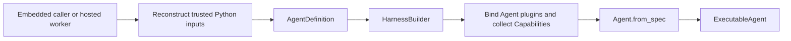
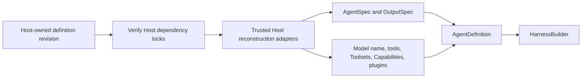

# Agent Definition and Build

## Design Position

`AgentDefinition` is the immutable process-local input used to build one reusable Harness executable. It is a Python composition boundary, not a durable document or wire format. It combines the native Pydantic AI `AgentSpec` and `OutputSpec` with trusted native models, tools, Toolsets, Capabilities, Harness plugins, and named complete child definitions.

The Harness does not compile, serialize, reload, or discover Agent definitions. A hosted system owns its own serializable definition and dependency-lock schemas, then reconstructs the trusted Python objects required by `AgentDefinition` inside the execution process. Python objects never pass through a hosted API or durable record.



Preset materialization, provider configuration, artifact installation, revision locking, and rollout remain Host concerns. The Harness owns only process-local validation and construction.

## AgentDefinition

```python
@dataclass(frozen=True, slots=True)
class AgentDefinition[OutputT]:
    agent: AgentSpec
    output_type: OutputSpec[OutputT]
    definition_id: str = <process-local UUID>
    model: Model | KnownModelName | str | None = None
    tools: tuple[
        Tool[AgentContext] | ToolFuncEither[AgentContext, ...], ...
    ] = ()
    toolsets: tuple[AgentToolset[AgentContext], ...] = ()
    capabilities: tuple[AbstractCapability[AgentContext], ...] = ()
    plugins: tuple[AbstractHarnessPlugin, ...] = ()
    subagents: tuple[SubagentDefinition, ...] = ()
    self_healing: bool = True
    model_recovery: ModelRecoveryPolicy = ModelRecoveryPolicy()
```

| Field            | Meaning                                                                                                    |
| ---------------- | ---------------------------------------------------------------------------------------------------------- |
| `agent`          | Native Pydantic AI declarative Agent configuration                                                         |
| `output_type`    | Native process-local Pydantic output contract                                                              |
| `definition_id`  | Non-blank logical correlation value; it grants no authority                                                |
| `model`          | Optional native Model or model name overriding the `AgentSpec` selection                                   |
| `tools`          | Trusted native Pydantic function-tool inputs                                                               |
| `toolsets`       | Trusted native Pydantic Toolsets                                                                           |
| `capabilities`   | Explicit Agent-bound Pydantic Capabilities                                                                 |
| `plugins`        | Trusted code-first Harness middleware instances                                                            |
| `subagents`      | Named complete process-local child definitions and authored edge ceilings                                  |
| `self_healing`   | Enables narrow one-shot provider-history repairs on each resolved native Model                             |
| `model_recovery` | Optional bounded semantic attempt policy for recoverable model interruption inside one logical Harness run |

Construction deep-copies `AgentSpec` and freezes the collection fields as tuples. Child names are unique within one parent. The finite acyclic child graph and its exact `SubagentDefinition` contract are owned by [Delegation and Subagents](11-delegation-and-subagents.md#child-definitions-and-built-collection). The Harness does not require every trusted Python object to be serializable, hashable, deeply immutable, or reconstructible from metadata. Reentrancy remains the responsibility of native objects and Agent-bound extensions whose instances are shared by concurrent runs.

`AgentSpec` remains the owner of instructions, request settings, output retry behavior, declarative built-in Capability specs, and its own model selection. Its optional `output_schema` must be absent: `AgentDefinition.output_type` is the sole business-output contract and the Harness never lets Pydantic's `from_spec()` default-value behavior replace it. `OutputSpec`, native Model profiles, tools, Toolsets, and explicit Capability instances retain their upstream Pydantic AI semantics. The Harness does not mirror those types in a second schema.

## Build API

```python
class HarnessBuilder:
    def build[OutputT](
        self,
        definition: AgentDefinition[OutputT],
    ) -> ExecutableAgent[OutputT]: ...

    def build_code[OutputT](
        self,
        agent: AgentSpec,
        *,
        output_type: OutputSpec[OutputT],
        definition_id: str | None = None,
        model: Model | KnownModelName | str | None = None,
        tools: Sequence[
            Tool[AgentContext] | ToolFuncEither[AgentContext, ...]
        ] = (),
        toolsets: Sequence[AgentToolset[AgentContext]] = (),
        capabilities: Sequence[
            AbstractCapability[AgentContext]
        ] = (),
        plugins: Sequence[AbstractHarnessPlugin] = (),
        subagents: Sequence[SubagentDefinition] = (),
        self_healing: bool = True,
        model_recovery: ModelRecoveryPolicy | None = None,
    ) -> ExecutableAgent[OutputT]: ...
```

Both methods are synchronous because construction performs no I/O. `build_code()` creates an `AgentDefinition` and delegates to `build()`; it is not a second construction path.

The build flow is:

1. Validate the finite child graph and unique names, recursively build children before their parent, and freeze one immediate-child `SubagentCollection`.
2. Validate and deterministically order the supplied plugin instances.
3. Call each plugin's `for_agent()` and validate stable concrete type, ID, and ordering.
4. Collect the Agent-bound plugins' ordinary Pydantic `AbstractCapability[AgentContext]` contributions.
5. Install one thin `ResolveModelId` Capability and one inert-by-default outer invocation-boundary Capability for every Agent.
6. Wrap a concrete build-time Model in `SelfHealingModel` when self-healing is enabled.
7. Call `Agent.from_spec()` once with `deps_type=AgentContext`, the copied `AgentSpec`, the selected model, native tools and Toolsets, explicit Capabilities, and plugin contributions.
8. Build the business-output validator and return an `ExecutableAgent` owning the immutable child collection.

`defer_model_check=True` is always used so a logical string can reach the run-scoped resolver after fresh `RunBindings` exist. The resolver delegates to native Pydantic inference when the run has no `ModelRunBinding`; this is ordinary embedded behavior, not a second settings or registry system. The exact resolution and recovery contract is owned by [Input, Model, and Output Boundaries](16-input-model-and-output.md).

The builder does not accept a class registry, extension export, compiler, catalog, manifest, serialized plugin spec, resolved-component envelope, or Host lifecycle object. Trusted code constructs the concrete Python values directly.

## Executable Ownership

An `ExecutableAgent` owns:

- the copied process-local `AgentDefinition`;
- the one constructed Pydantic AI `Agent`;
- the ordered Agent-bound plugin tuple;
- the output validator;
- its immutable immediate-child `SubagentCollection`.

The ordinary zero value for child topology is the canonical empty collection. Child construction and delegation semantics are owned by [Delegation and Subagents](11-delegation-and-subagents.md); they do not introduce a serialized Harness definition layer.

Every invocation creates a fresh `AgentContext`, fresh run-bound plugin replacements, and fresh run bindings. The executable can serve concurrent runs only when its native Model, tools, Toolsets, Agent-bound Capabilities, and Agent-bound plugins satisfy their upstream or documented reentrancy contracts.

`close()` is idempotent and prevents future invocations. Per-run resources belong to each `HarnessRunStream`; construction does not invent another provider lifecycle.

## Host Reconstruction

A hosted worker reconstructs the process-local definition from its own immutable revision and installed trusted adapters:



The Host may use typed Presets, plugin configuration, provider integration revisions, or artifact locks, but those are Host contracts. It is free to change their serialized representation without changing the Harness API as long as reconstruction produces the same accepted process-local values. The Harness neither verifies a Host artifact digest nor derives Python import paths from untrusted definition data.

Fresh current-run authority does not belong in `AgentDefinition`. Identity, the Environment aggregate, run-scoped model resolution, policy, credentials, and other invocation collaborators enter through `RunBindings` or their narrowly owning fresh Pydantic Capabilities. `AgentDefinition` deliberately has no `environment`, provider selector, desired topology, or `environment.operations` field. Environment consumers declare and enforce scoped readiness at the operation or owning feature boundary; the optional `EnvironmentToolsCapability` configures only model projection.

## Failure Semantics

| Failure                                                                  | Outcome                                                                                        |
| ------------------------------------------------------------------------ | ---------------------------------------------------------------------------------------------- |
| Blank `definition_id`                                                    | `DefinitionError(code="definition_id_invalid")`                                                |
| Invalid, duplicate, or cyclic child topology                             | `DefinitionError` before the affected parent executable is returned                            |
| Invalid plugin type, ID, ordering, or replacement                        | Plugin construction fails before an executable is returned                                     |
| Invalid plugin Capability contribution                                   | Build fails before Pydantic Agent construction                                                 |
| `AgentSpec.output_schema` is present                                     | `DefinitionError(code="output_contract_conflict")` before Pydantic construction                |
| Business output directly or transitively includes `DeferredToolRequests` | `DefinitionError(code="output_contract_reserved")` before Pydantic construction                |
| Invalid `AgentSpec`, model, tool, Toolset, or output                     | `DefinitionError(code="agent_build_failed")` with the original exception retained as the cause |
| Host revision or artifact cannot be reconstructed                        | Host failure before calling the Harness                                                        |
| Run-scoped model cannot be resolved                                      | Typed run failure owned by the model boundary                                                  |

Errors do not serialize arbitrary Python object representations, credentials, or private installation paths.

## Boundaries

| Concern                                                 | Owner                                                                    |
| ------------------------------------------------------- | ------------------------------------------------------------------------ |
| Native `AgentSpec`, Model, profile, Toolset, Capability | Pydantic AI                                                              |
| Process-local `AgentDefinition` and executable build    | This specification                                                       |
| Plugin ordering, Agent/run binding, and middleware      | [Harness Plugin System](05-plugin-system.md)                             |
| Run bindings, execution, results, and cleanup           | [Execution Context and Lifecycle](06-execution-context-and-lifecycle.md) |
| Hosted schemas, Presets, immutable revisions, and locks | Host                                                                     |
| Durable execution, checkpoint selection, and delivery   | Host                                                                     |

## Trade-offs

### Code-first Python Composition vs. a Harness Wire Language

Code-first composition preserves native Pydantic objects and keeps construction direct. A hosted system must own explicit reconstruction adapters and cannot treat arbitrary Python objects as durable data. This is preferable to a second compiler, class registry, or lossy universal schema.

### One `Agent.from_spec()` Path vs. Constructor Mirroring

Using one authoritative upstream construction call avoids field-by-field translation. The Harness must track compatible public Pydantic AI behavior, but it does not maintain a parallel Agent language.
