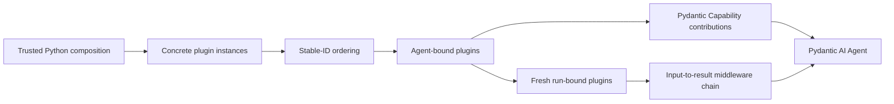

# Harness Plugin System

## Design Position

A Harness plugin is trusted, code-first Python middleware around the complete process-local Harness run. It can transform semantic input, observe or transform stream events, short-circuit execution, replace a complete result candidate, and contribute ordinary Pydantic AI `AbstractCapability[AgentContext]` instances at Agent construction.

Plugins are concrete Python objects supplied in `AgentDefinition.plugins`. The Harness defines no plugin document format, `PluginSpec`, compiler, extension export, class registry, package discovery protocol, or runtime catalog. A Host that wants durable plugin configuration owns that schema and reconstructs trusted plugin objects before calling the Harness.

Pydantic Capabilities remain the extension point inside the Agent loop. Harness plugins exist only for the wider semantic-input-to-complete-result boundary.



## Plugin Contract

```python
@dataclass(frozen=True, slots=True)
class PluginOrdering:
    position: Literal["outermost", "innermost"] | None = None
    wraps: tuple[str, ...] = ()
    wrapped_by: tuple[str, ...] = ()
    requires: tuple[str, ...] = ()


class AbstractHarnessPlugin(ABC):
    @property
    def plugin_id(self) -> str: ...

    def get_ordering(self) -> PluginOrdering: ...

    def for_agent(self) -> AbstractHarnessPlugin: ...

    async def for_run(
        self,
        context: AgentContext,
    ) -> AbstractHarnessPlugin: ...

    def get_capabilities(
        self,
    ) -> Sequence[AbstractCapability[AgentContext]]: ...

    def wrap_run(
        self,
        exchange: PluginRunExchange,
        call_next: PluginRunNext[Any],
    ) -> PluginRunResponse[Any]: ...
```

A stable non-blank `plugin_id` identifies one configured middleware instance. It is an ordering and lookup key, not authority. Several instances of the same concrete plugin type are allowed when their IDs differ.

`for_agent()` returns the reentrant instance owned by the executable. `for_run()` returns the instance used by one invocation. An immutable reentrant plugin may return itself; mutable or scoped behavior returns a fresh replacement. Each replacement must preserve the exact concrete type, ID, and effective ordering of its source. This prevents a run from changing the built graph while allowing normal internal state binding.

## Ordering

The Harness orders plugins once at build time:

1. Validate every value as `AbstractHarnessPlugin` and require unique non-blank IDs.
2. Validate `wraps`, `wrapped_by`, and `requires` references against the complete configured set.
3. Add outermost and innermost tier edges.
4. Add explicit wrapper edges; `requires` asserts presence without adding an edge.
5. Perform a stable topological sort using definition order as the tie-breaker.
6. Reject self references, unknown references, contradictions, and cycles.
7. Call `for_agent()` in final outer-to-inner order and validate every replacement.

Plugin ordering is independent from Pydantic `CapabilityOrdering`. Capability contributions enter Pydantic's ordinary composition and are ordered by Pydantic AI.

## Capability Contribution

Each Agent-bound plugin may contribute zero or more ordinary `AbstractCapability[AgentContext]` instances. The Harness validates the values and appends them after explicit `AgentDefinition.capabilities`, preserving outer-to-inner plugin order and per-plugin contribution order.

A contributed Capability that needs its run-bound plugin stores only the stable `plugin_id`. During its own Pydantic run binding it resolves the plugin through:

```python
ctx.deps.plugins.require(plugin_id, ExpectedPluginType)
```

It must not retain a mutable Agent-bound plugin prototype for concurrent use. Direct native models, tools, and Toolsets remain explicit `AgentDefinition` inputs rather than hidden middleware products.

## Run Binding and BoundPluginContext

For each invocation the Harness creates one empty `BoundPluginContext`, places it on the fresh `AgentContext`, and sequentially calls plugin `for_run(context)` in final outer-to-inner order. Reads are unavailable during this phase, so no plugin can observe a partial mixture of Agent- and run-bound instances. After all replacements pass validation, the Harness atomically freezes the index.

```python
class BoundPluginContext:
    @property
    def ordered(self) -> tuple[AbstractHarnessPlugin, ...]: ...

    def get(
        self,
        plugin_id: str,
    ) -> AbstractHarnessPlugin | None: ...

    def require[PluginT: AbstractHarnessPlugin](
        self,
        plugin_id: str,
        expected_type: type[PluginT],
    ) -> PluginT: ...
```

Lookup checks both stable ID and expected public type. The context is not a service locator and contains no credentials, provider registry, cleanup callbacks, durable state, or stream control.

## Middleware Contract

```python
@dataclass(frozen=True, slots=True)
class PluginRunExchange:
    input: SemanticRunInput
    context: AgentContext

    def with_input(
        self,
        value: SemanticRunInput,
    ) -> PluginRunExchange: ...

    async def export_current_state(self) -> HarnessState: ...


class PluginRunNext[OutputT]:
    def __call__(
        self,
        exchange: PluginRunExchange,
    ) -> PluginRunResponse[OutputT]: ...


class PluginRunResponse[OutputT](
    AsyncIterator[HarnessEvent | HarnessRunResult[OutputT]]
):
    async def aclose(self) -> None: ...
```

`PluginRunNext` is one-shot. A plugin may call it at most once or short-circuit by returning its own response. `PluginRunResponse` has one consumer and an idempotent `aclose()`.

Input flows outer-to-inner. Events and the complete result candidate flow inner-to-outer. A plugin may:

- replace semantic input while preserving the trusted `AgentContext`;
- map or suppress non-terminal events;
- short-circuit before the Pydantic Agent starts;
- translate an explicitly handled error;
- replace the complete `HarnessRunResult` candidate.

Already emitted events cannot be retracted. The Harness retains run correlation, output typing, message suffix, and result-combination validation at every response boundary and before public terminal delivery.

## Trusted Result and State Composition

Plugins are trusted in-process code. A plugin may intentionally transfer, replace, remove, or synthesize a well-formed `HarnessState` as part of a complete result replacement. The Harness validates the result's public structure and state schema, but it does not prove where state bytes came from, require identity with the inner candidate, require use of `export_current_state()`, or require `state.message_history` to equal `result.all_messages()`.

`exchange.export_current_state()` is the convenience for obtaining the Harness-owned latest complete live boundary. It is not a provenance token or mandatory authorization path. A plugin that composes state directly owns the semantic correctness of that transfer under the trusted-plugin boundary.

`AgentContextState` remains the typed convenience for Capability-owned namespaces during normal execution. The Harness does not add cryptographic fingerprints, candidate allowlists, state-origin registries, or malicious-plugin defenses around trusted Python code.

## Input Placement

Plugin middleware starts after the run Environment is entered, the optional `RunInputFactory` has completed, semantic input is normalized, and fresh run plugins are bound. It runs before the inner Pydantic Agent invocation.

A plugin can inspect the actual semantic input and use trusted collaborators or `AgentContext.environment`. It cannot replace the `AgentContext`, Agent Identity, or entered Environment. The current code-first input contract is owned by [Input, Model, and Output Boundaries](16-input-model-and-output.md).

## Result and Cleanup Placement

The inner path yields ordinary Harness events followed by one result candidate. Each response boundary validates a candidate before an outer plugin can observe it, so a later outer failure retains the nearest valid inner outcome.

On normal completion, the Harness closes registered plugin responses from inner to outer and then closes remaining run resources before publishing `HarnessRunResultEvent`. Cleanup occurs in the task that entered the async scopes. External cancellation remains pending across cleanup even if cleanup code suppresses an injected `CancelledError`.

If middleware or cleanup fails after a valid candidate exists, `RunCleanupError.outcome` retains that nearest immutable candidate and no terminal event is published. If no candidate exists, the original error propagates after cleanup.

## State and Continuation

Plugins have no separate generic durable state system. A plugin may:

- contribute a Capability that uses a stable `AgentContextState` namespace;
- transform the complete `HarnessState` at the trusted result boundary;
- keep durable provider or Host state outside the Harness.

Run-bound plugin objects disappear at teardown. Process-local mutable state is never resumed by object identity.

## Trust Boundary

Imported plugin code executes with Harness process authority. Type checks, stable ordering, and result validation protect composition mistakes; they do not sandbox Python. A plugin can access process resources directly and can intentionally violate higher-level policy unless the deployment isolates that process.

Untrusted or separately governed behavior belongs behind a tool, Environment, model, or other feature-specific protocol. The Harness defines no universal remote-plugin RPC layer.

## Failure Semantics

| Failure                                            | Outcome                                                                    |
| -------------------------------------------------- | -------------------------------------------------------------------------- |
| Invalid plugin value, blank/duplicate ID           | Build fails                                                                |
| Unknown ordering reference or cycle                | Build fails deterministically                                              |
| Agent/run replacement changes type, ID, or order   | Build or run setup fails                                                   |
| Invalid Capability contribution                    | Build fails                                                                |
| Reused continuation or response iterator           | `PluginError`                                                              |
| Replaced trusted context or invalid semantic input | Inner path fails before Pydantic work                                      |
| Invalid event or result candidate                  | `PluginError`; nearest earlier valid candidate is retained when one exists |
| Middleware or cleanup failure after a candidate    | `RunCleanupError` retains the candidate and withholds terminal delivery    |

## Boundaries

| Concern                                         | Owner                                  |
| ----------------------------------------------- | -------------------------------------- |
| Concrete plugin construction and configuration  | Trusted embedding code or Host adapter |
| Ordering, binding, middleware, and validation   | Harness                                |
| Agent-loop hooks and Capability lifecycle       | Pydantic AI                            |
| Durable plugin configuration and artifact locks | Host                                   |
| Durable completion and checkpoint selection     | Host                                   |

## Trade-offs

### Trusted Code-first Plugins vs. a Serialized Extension Framework

Direct Python composition is simple, lossless, and aligned with Pydantic AI. Hosts must reconstruct plugins from their own trusted configuration and cannot treat plugin objects as wire data.

### Complete-result Freedom vs. Provenance Enforcement

Trusted plugins can implement caching, state migration, handoff, and policy transformations without artificial state-origin restrictions. This means state semantics are part of the plugin's trusted contract rather than something the Harness can prove structurally.
