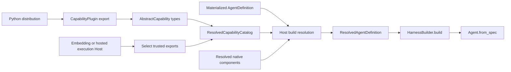
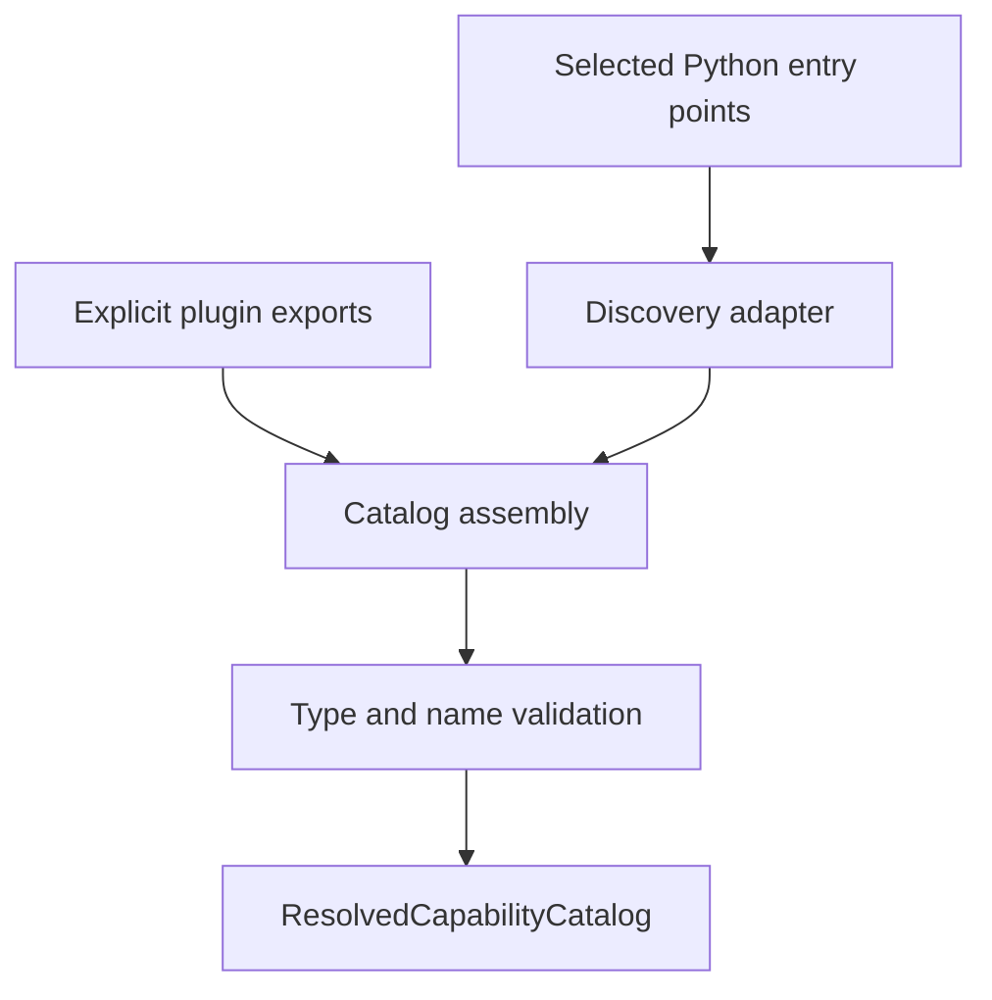
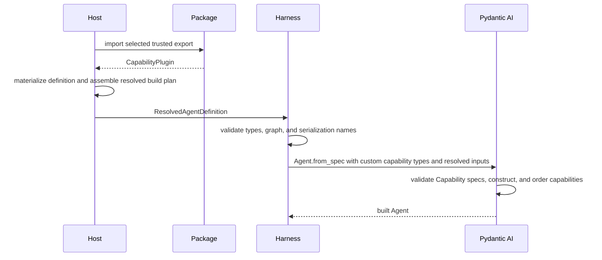

# Capability Plugin System

## Design Position

A Harness plugin is a trusted Python distribution that contributes Pydantic AI `AbstractCapability[AgentContext]` types. The Capability is the reusable executable extension point; the plugin layer only makes types discoverable and selectable. Trusted native model, tool, and Toolset objects can also enter a process-local `ResolvedAgentDefinition`, but they are Host build inputs rather than another plugin export or lifecycle.



The plugin system adds no lifecycle callbacks, tool interface, configuration dictionary, state store, dependency solver, remote execution protocol, or package manager.

## Plugin Export

```python
@dataclass(frozen=True)
class CapabilityPlugin:
    plugin_id: str
    capability_types: tuple[
        type[AbstractCapability[AgentContext]],
        ...,
    ]
```

`plugin_id` identifies the export for diagnostics and host selection. Distribution name, version, wheel digest, signature, installation source, and rollout policy remain host metadata.

One distribution can export several Capabilities with the same dependency and trust footprint. A Capability that needs several coordinated behaviors can return a Toolset, implement several hooks, or compose ordinary Pydantic AI Capabilities.

## Resolved Catalog

```python
@dataclass(frozen=True)
class ResolvedCapabilityCatalog:
    plugins: tuple[CapabilityPlugin, ...]

    def capability_types(
        self,
    ) -> tuple[type[AbstractCapability[AgentContext]], ...]: ...
```

Catalog assembly validates:

- every exported object is an `AbstractCapability[AgentContext]` type;
- `get_serialization_name()` returns a non-empty unique name;
- duplicate plugin IDs and serialization names fail deterministically;
- types excluded from spec construction are not advertised to `Agent.from_spec`.

Pydantic AI owns Capability IDs on configured instances, ordering, required dependencies, deferred loading, and construction schemas. The catalog does not repeat that metadata.

## Discovery

The base API accepts explicit `CapabilityPlugin` values. A packaging adapter can read a standard Python entry-point group and turn selected entries into the same values.



Discovery has no working-directory scan, arbitrary module path from Agent input, network fetch, automatic package installation, or import of every installed entry point. The host selects permitted distributions before importing exports.

A host may resolve a registry key into an installed and verified distribution. That resolution ends before the Harness catalog is assembled.

## Declarative Configuration

Agent-authored configuration uses Pydantic AI `CapabilitySpec` directly:

```yaml
capabilities:
  - SkillCapability:
      id: project-skills
      sources:
        - file:///workspace/.agents/skills
  - CompactionCapability:
      id: compact
      target_tokens: 32000
```

The Host copies the selected `catalog.capability_types()` into `ResolvedAgentComponents.capability_types`. `HarnessBuilder.build()` ultimately passes that exact tuple to `Agent.from_spec(..., custom_capability_types=definition.components.capability_types)`, which resolves each serialization name and calls the Capability type's public `from_spec` contract. For the nested `AgentSpec` and `CapabilitySpec` values, Pydantic AI and the owning Capability type are the schema and construction authority.

That authority does not extend to the complete hosted authoring system. The Harness owns `AgentDefinition` fields, while the Host owns typed Preset inputs, immutable definition revisions, artifact locks, provider references, and their field-local errors. The Host validates and materializes those values before producing the process-local build plan; `Agent.from_spec()` neither parses Host Presets nor serves as the error model for secret, package, provider, or policy resolution.

Capability configuration contains portable behavior settings and typed secret or provider references, never resolved credential material. A reentrant build Capability can retain an authority-neutral provider client or collaborator for residual public-hook behavior, but it cannot retain or select a current run's Identity, policy decision, credential material or resolver, grant, or other authority. The Host resolves those run-specific bindings through `RunBindings.capabilities`. Non-secret model request settings remain in `AgentSpec.model_settings`; stable model/provider/adapter compatibility facts remain in the native Model's effective `ModelProfile`; raw request headers and credentials stay run-bound; and tool implementation settings stay with the Capability or Toolset that owns them rather than entering global extensible `ModelConfig` or `ToolConfig` bags.

## Host-constructed Capabilities

Host-constructed Capabilities have two distinct lifetimes. Reentrant behavior and unbound provider integrations shared by every run can enter `ResolvedAgentComponents.capabilities`. Any integration that carries or selects current-run authority enters only through `RunBindings`.

```python
components = ResolvedAgentComponents(
    capabilities=(stream_recovery,),
)

bindings = RunBindings(
    instance=instance,
    environment=environment_binding,
    capabilities=(
        checkpointing,
        invocation_policy,
        credentials,
        telemetry,
    ),
)
```

A build Capability can retain a thread-safe authority-neutral provider client or other collaborator whose mere possession grants no run authority. Stable compatibility/profile construction is owned by the Host's locked model integration and the native Model it returns; any model-specific Capability behavior here is residual dynamic transformation or recovery through public hooks rather than a duplicate profile. A build Capability cannot use ambient credentials or defer tenant, policy, or credential selection through a captured service. It is reentrant and derives isolated Agent- or run-bound copies through ordinary Pydantic lifecycle methods.

The one reserved model integration receives current-run Identity, policy, credentials, and any continuation route pin through its fresh run Capability. That Capability and the run Capabilities for checkpointing, invocation policy, credential brokerage, inline child binding, Host-owned asynchronous child submission, telemetry correlation, and other execution-scoped integrations enter through `RunBindings.capabilities`. In hosted execution, ordinary Agent, build, and run Capability artifacts may not contribute `get_model()`, `resolve_model_id()`, or selected-Model replacement; all routing stays inside the exact locked integration. Embedded code-first applications retain native Pydantic model-contribution semantics under their own trust boundary. `EnvironmentRunBinding` is a separate explicit `RunBindings` port because Harness preparation must enter it before the Pydantic run and an input factory. The Harness constructs the one run `EnvironmentCapability` over the entered facade and installs the fixed invocation dispatcher; Host code supplies neither core implementation. Run Capabilities derive isolated instances through `for_run()`, acquire scoped resources through `wrap_run()` or Toolset context managers, and cannot leak authority into sibling runs.

An Agent definition can configure model-visible behavior but cannot select a privileged Host implementation or bypass its locked model integration merely by naming a serialization type. The Host decides which declarative Capability types are available, which reentrant build instances enter the resolved plan, and which authority-bearing instances enter each run.

## Stateful Plugins

A stateful Capability uses its configured Capability ID as the `AgentContextState` namespace and defines a Pydantic state model plus version. Plugin discovery does not declare statefulness or duplicate the codec.

The Capability validates imported state before acting and replaces its entry with a fully validated value. Package upgrades that change continuation semantics provide an explicit state migration or select a new immutable definition revision and compatible process-local build plan.

## Trust Boundary

Imported Python code runs with Harness process authority. Type validation and Pydantic schemas do not sandbox it.

The harness supports trusted in-process plugins. Isolation is provided by a small trusted Capability adapter that calls an external service through a feature-specific protocol. The core does not define a universal brokered-plugin RPC protocol.

Plugin tools still use Pydantic dispatch. Metadata-aware calls cross the Identity-bound managed authorization path, while unannotated native tools and direct Python I/O remain part of the trusted plugin process boundary. Operations routed through `BoundEnvironment` always remain subject to its binding and provider enforcement.

## Load Flow



Catalog refresh affects later builds. A built `ExecutableAgent` retains its Capability types and Agent-bound resources until closed.

## Failure Semantics

| Failure                                                         | Result                                                             |
| --------------------------------------------------------------- | ------------------------------------------------------------------ |
| Selected distribution is unavailable or untrusted               | Host stops before catalog assembly                                 |
| Export contains an invalid type                                 | Catalog assembly fails                                             |
| Serialization name conflicts                                    | Catalog assembly reports both exports and fails                    |
| Capability is absent from the catalog                           | Pydantic Agent spec validation fails                               |
| Capability configuration is invalid                             | The owning Capability schema reports the error                     |
| Host Preset, artifact, provider, or secret reference is invalid | Host materialization or resolution fails before Agent construction |
| Capability construction or cleanup fails                        | Agent build or run fails with bounded cleanup                      |

## Package Layout

The base `converge-agent-harness` distribution contains Harness definitions, build and run APIs, `AgentContext`, state, Identity, core authorization, events, native Pydantic usage exposure, and plugin discovery.

Optional distributions group Capabilities by dependency and trust footprint:

- Environment providers and sandbox bindings;
- model providers and compatibility policies;
- filesystem, shell, web, MCP, and document tools;
- skills and registry adapters;
- media processing and storage;
- sandboxed code execution and programmatic tool orchestration;
- telemetry exporters such as Langfuse;
- hosted service integrations.

Importing the base package performs no plugin scan, provider initialization, credential lookup, network access, or global instrumentation.

## Boundaries

| Concern                                                                                                           | Owner                                    |
| ----------------------------------------------------------------------------------------------------------------- | ---------------------------------------- |
| Capability construction and lifecycle                                                                             | Pydantic AI                              |
| Explicit export and catalog validation                                                                            | Harness                                  |
| Distribution version, artifact verification, installation, and rollout                                            | Host                                     |
| Capability configuration and state codec                                                                          | Capability type                          |
| Preset, definition revision, provider reference, and artifact lock schemas                                        | Host                                     |
| Process-local resolved model, native tool, Toolset, custom Capability type, and reentrant build-Capability inputs | Host resolver and Harness build contract |
| Identity, Environment, policy, credential, checkpoint, telemetry, and other run authority                         | Host `RunBindings` and owning providers  |
| Definition revision and plugin artifact selection                                                                 | Host                                     |

## Trade-offs

### Native Capability Types vs. Plugin Framework

Native types make the Pydantic AI ecosystem directly usable and eliminate adapters. Plugin packages depend on the supported Pydantic AI 2 public API.

### Explicit Selection vs. Automatic Availability

Explicit host selection makes code loading and privilege visible. It requires a small amount of host wiring compared with importing every discoverable package automatically.

### Trusted In-process Code vs. Universal Isolation

Plugin execution stays in process and uses the ordinary Pydantic AI model. Features requiring isolation use their own broker Capability instead of imposing a generic RPC model on every plugin.
