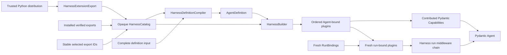
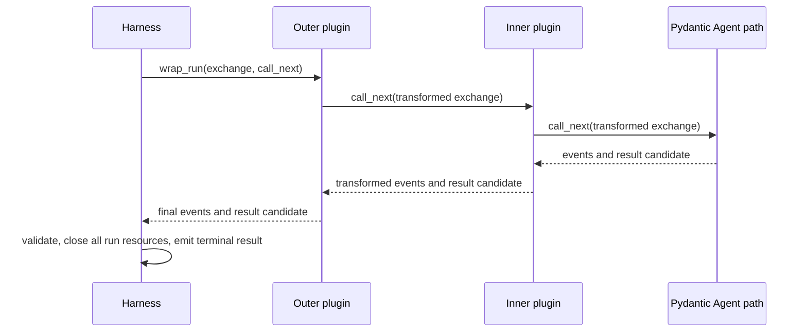

# Harness Plugin System

## Design Position

A Harness plugin is a trusted first-class component that can wrap the complete process-local Harness run and contribute zero or more native Pydantic AI `AbstractCapability[AgentContext]` instances to the Agent build. It is not merely a distribution wrapper around a Capability and does not disappear after making a contribution. Pydantic Capabilities remain the extension point inside the Agent loop; Harness plugins own behavior at the input-to-result boundary that begins after run preparation and ends before public terminal delivery.



The Host installs and verifies artifacts and selects stable export IDs. It does not assemble plugin or Capability class tuples, inspect classes to generate schemas, construct configured plugins, or resolve definition references to Python objects. Harness-owned catalog assembly retains those classes behind an opaque `HarnessCatalog`; the Harness definition compiler uses that catalog for schema and validation, while the builder uses the same catalog for plugin construction and the internal `custom_capability_types` argument. The Host can read the catalog's serializable manifest and compilation result to lock exact export IDs without receiving the live class maps.

The system adds no package manager, remote-plugin RPC protocol, generic mutable context bag, durable plugin-state namespace, second Capability-spec parser, or second per-node hook framework. Untrusted or separately governed behavior stays behind a feature-specific tool or provider protocol. Model-, node-, tool-, and request-level middleware remains native Pydantic Capability behavior.

## Definition, Export, and Catalog

`AgentDefinition.plugins` is an ordered tuple of typed `PluginSpec` values outside the nested native Pydantic `AgentSpec`. The concrete plugin package owns its spec schema and construction.

```python
type PluginId = Annotated[
    str,
    Field(min_length=1, pattern=r".*\S.*"),
]


class PluginSpec(BaseModel):
    model_config = ConfigDict(frozen=True, extra="forbid")

    type: str
    id: PluginId


class PluginFactory(Protocol):
    def __call__(
        self,
        spec: PluginSpec,
    ) -> AbstractHarnessPlugin: ...


@dataclass(frozen=True)
class HarnessPluginRegistration:
    spec_type: type[PluginSpec]
    plugin_type: type[AbstractHarnessPlugin]
    factory: PluginFactory | None = None


@dataclass(frozen=True)
class HarnessRunCapabilityRegistration:
    name: str
    capability_id: str
    capability_type: type[AbstractCapability[AgentContext]]


@dataclass(frozen=True)
class HarnessExtensionExport:
    export_id: str
    plugins: tuple[HarnessPluginRegistration, ...] = ()
    capability_types: tuple[
        type[AbstractCapability[AgentContext]], ...
    ] = ()
    run_capabilities: tuple[
        HarnessRunCapabilityRegistration, ...
    ] = ()


class HarnessRunCapabilityManifest(BaseModel):
    name: str
    capability_id: str


class HarnessExportManifest(BaseModel):
    export_id: str
    plugin_names: tuple[str, ...] = ()
    capability_names: tuple[str, ...] = ()
    run_capabilities: tuple[HarnessRunCapabilityManifest, ...] = ()


class HarnessCatalogManifest(BaseModel):
    runtime_compatibility_id: str
    exports: tuple[HarnessExportManifest, ...] = ()


class HarnessCatalog:
    @classmethod
    def from_exports(
        cls,
        exports: Sequence[HarnessExtensionExport],
    ) -> Self: ...

    def select(self, export_ids: Sequence[str]) -> Self: ...

    @property
    def manifest(self) -> HarnessCatalogManifest: ...

    def definition_compiler(self) -> HarnessDefinitionCompiler: ...

    def validate_run_capability(
        self,
        role_name: str,
        capability: AbstractCapability[AgentContext],
    ) -> None: ...
```

These are conceptual Python contracts. `PluginSpec` is durable Agent-definition data: each concrete spec narrows `type` to the plugin's literal serialization name, retains the explicit stable `id`, and adds its own typed fields directly rather than an untyped `config` bag. The catalog associates that concrete spec type with one implementation type and optional factory. `from_spec` receives the matching concrete spec, and every configured, Agent-bound, and run-bound instance keeps `plugin_id == spec.id`.

```yaml
plugins:
  - type: memory
    id: primary-memory
    provider_ref: memory/default
    max_items: 8
```

The definition stores portable behavior configuration and typed logical references, never a Python import path, distribution location, live client, credential, or current-run authority.

`HarnessExtensionExport` is the class-bearing extension-author and process-bootstrap surface. One trusted distribution can expose multiple exports, and one export can register plugin spec/implementation pairs, declarative Pydantic Capability types, named Host-bound run Capability roles, or any combination. `export_id` is stable selection and diagnostic identity; distribution name, version, wheel digest, signature, installation source, artifact lock, and rollout remain Host metadata. With no custom factory, the Harness calls `plugin_type.from_spec()`. A factory can capture a typed authority-neutral provider collaborator, but the Harness still invokes it and validates its output. A factory cannot retain current-run Identity, credentials, policy decisions, or another live authority.

`HarnessCatalog` is the selected live process object. It internally maps plugin serialization names, declarative Capability serialization names, and named run Capability roles to Python classes and factories, but deliberately exposes no `plugin_types()`, `capability_types`, run-role types, or registration map to the Host. `HarnessCatalogManifest` is its JSON-safe projection. Each run-role projection contains only the stable role name and fixed Capability ID; the concrete type remains catalog-internal. `validate_run_capability()` is an opaque yes-or-raise check that requires the named role's exact registered concrete type and fixed ID without returning that type. It does not construct, bind, activate, or retain the Capability.

`runtime_compatibility_id` is a Harness-issued opaque identity for the definition compiler/codec, Pydantic built-in Capability registry, and schema-to-build semantics; it remains unchanged only across releases that accept the same durable documents with compatible observable construction behavior. The export entries let a control plane map durable names to stable export IDs and let a worker prove that it reconstructed the expected selected exports. The manifest is not executable and cannot be passed to `Agent.from_spec()`. A Host binds the manifest's export IDs to its own immutable artifact revisions and digests. A common image can generate schemas directly through the compiler; split processes can transport a generated schema and manifest, while every worker still reconstructs and verifies the live catalog from the locked installed artifacts.

Catalog assembly validates all of the following before schema generation or Agent build:

- the runtime compatibility ID is non-empty, and catalog projection or selection preserves it exactly;
- export IDs are non-empty and unique;
- every plugin spec type is a concrete `PluginSpec` subtype whose literal `type` agrees with the registered implementation serialization name;
- every plugin implementation is an `AbstractHarnessPlugin` subtype and every optional factory belongs to exactly one registration;
- plugin serialization names are non-empty and unique across the selected exports;
- declarative Capability values are concrete `AbstractCapability[AgentContext]` types with valid non-empty Pydantic serialization names;
- declarative Capability names are unique in the complete selected Pydantic registry, including built-ins; an extension cannot silently override another selected implementation;
- run Capability registration names and fixed IDs are non-empty and unique across the selected catalog, their values are concrete `AbstractCapability[AgentContext]` types, and they remain outside the declarative Capability registry and definition schema.

One concrete Capability type may realize several roles only through distinct names and fixed IDs; one instance can satisfy at most one selected role. Catalog and run validation use the complete `(name, concrete type, capability_id)` identity rather than inferring a role from type alone. Run setup also rejects a required role ID that collides with a core, configured, build, plugin-contributed, unrelated run, or second required Capability. For every class-free role name required by `RunBindings`, the catalog-bound executable calls `validate_run_capability()` on the fresh input before Pydantic binding. A mandatory core Capability repeats the same opaque check against the fixed-ID value in finalized `RunContext.capabilities` as the first ordered `before_run()` step, after all sibling replacements and before model or tool work.

Construction additionally verifies that the factory or `from_spec()` returns the registered concrete implementation with `get_serialization_name() == spec.type` and `plugin_id == spec.id`. Unknown exports, unknown plugin or Capability names, duplicate IDs, and type or factory mismatches fail closed. Selection makes a definition constructible; it never activates a plugin absent from the exact definition.

`HarnessCatalog.from_exports()` supports explicit embedded/bootstrap composition. A packaging adapter can resolve a standard Python entry-point group and select exports by stable ID, but discovery never scans a working directory, imports arbitrary module paths from Agent input, fetches packages, installs code, or automatically activates every installed entry point. Foundation Service gives this Harness-owned loader selected export IDs and treats the returned catalog as opaque; it never calls `from_exports()` with class-bearing values in business code.

## Plugin Contract

The public contract intentionally borrows the proven Pydantic Capability lifecycle and ordering vocabulary while governing a different boundary.

```python
type PluginPosition = Literal["outermost", "innermost"]


@dataclass(frozen=True)
class PluginOrdering:
    position: PluginPosition | None = None
    wraps: Sequence[PluginId] = ()
    wrapped_by: Sequence[PluginId] = ()
    requires: Sequence[PluginId] = ()


class AbstractHarnessPlugin(ABC):
    @classmethod
    def get_serialization_name(cls) -> str: ...

    @classmethod
    def from_spec(cls, spec: PluginSpec) -> Self: ...

    @property
    def plugin_id(self) -> str: ...

    def get_ordering(self) -> PluginOrdering: ...

    def for_agent(self) -> Self: ...

    async def for_run(
        self,
        context: AgentContext,
    ) -> Self: ...

    def get_capabilities(
        self,
    ) -> Sequence[AbstractCapability[AgentContext]]: ...

    async def wrap_run(
        self,
        exchange: PluginRunExchange,
        call_next: PluginRunNext,
    ) -> PluginRunResponse: ...


@dataclass(frozen=True)
class PluginRunExchange:
    input: SemanticRunInput
    context: AgentContext

    async def export_current_state(self) -> HarnessState: ...


type PluginRunItem = HarnessEvent | HarnessRunResult


class PluginRunResponse(Protocol, AsyncIterator[PluginRunItem]):
    async def aclose(self) -> None: ...
```

`PluginRunNext` is a single-call async protocol from one exchange to one `PluginRunResponse`. `PluginRunResponse` is an async iterator of non-terminal Harness events followed by one internal result candidate, with an idempotent `aclose()` method. It never yields the public terminal result event. On every exit path, the Harness first cancels, closes, and drains the innermost `AgentRunEvents` and Pydantic resources when that inner path exists; it then closes entered plugin responses from inner to outer, followed by the Environment and remaining outer resources. This one order applies to normal completion, short-circuit, early consumer exit, cancellation, inner error, transform error, and final-validation failure. Typed helpers construct context parts, events, and valid result combinations without exposing the internal `HarnessRunScope`, event sink, cleanup stack, or Pydantic handle. `exchange.export_current_state()` uses the Harness-owned current complete message view with `AgentContext.export_state()`. Before the inner Agent starts, that view preserves imported history and pending entries while excluding unconsumed semantic input; during execution it uses only the latest complete boundary, never partial stream or tool-batch state.

`for_agent()` returns the reentrant instance owned by one built executable. `for_run()` returns a fresh run-bound replacement whenever the plugin has mutable or scoped run state. The Harness never shares a mutable run-bound plugin between concurrent runs. An immutable plugin may return itself only when its implementation is reentrant and carries no current-run authority.

`PluginOrdering` follows middleware semantics but deliberately does not reuse Pydantic's class-or-instance `CapabilityRef`. Every plugin relation names one exact stable `plugin_id`, because a durable definition can contain several instances of the same plugin type and both `for_agent()` and `for_run()` can replace Python objects. A concrete plugin can derive these relations from its typed spec fields, but no relation is a Python import path or object identity.

The Harness compiles the plugin graph in this order:

1. In definition order, resolve each `PluginSpec.type` through the catalog and construct one configured plugin prototype with the registration factory or `from_spec()`.
2. Verify the concrete registration, serialization name, and stable non-blank plugin ID, and reject duplicate IDs.
3. Read each prototype's `PluginOrdering`. Reject an empty, unknown, or self reference in `wraps`, `wrapped_by`, or `requires`; `requires` asserts presence and creates no ordering edge.
4. Add tier edges so every `outermost` plugin precedes every non-outermost plugin and every `innermost` plugin follows every non-innermost plugin. Add `wraps` edges from wrapper to wrapped plugin and `wrapped_by` edges in the opposite direction.
5. Perform a stable topological sort, using original definition order whenever more than one node is ready. Contradictory tiers or relations and every cycle fail rather than being ignored or resolved by priority.
6. In final outer-to-inner order, call `for_agent()`. Each returned Agent-bound replacement must preserve its registered implementation type, serialization name, plugin ID, and effective ordering. The Harness then freezes this graph and asks each Agent-bound plugin for its Capability contributions in that same order.

This graph is separate from Pydantic's Capability graph. Plugin IDs never become Capability refs; Capability classes, instances, IDs, `CapabilityOrdering`, and final stable ordering remain upstream concerns. The only cross-graph edge is data flow: the ordered Agent-bound plugins contribute Capability instances to the later Pydantic Agent build.

For each run the Harness creates the one `AgentContext` with the current executable's immutable immediate-child collection, calls plugin `for_run(context)` sequentially in the frozen outer-to-inner graph order, verifies that replacements preserve the built type, serialization name, ID, and ordering, and freezes `context.plugins` before middleware or Pydantic Capability behavior begins. The same `AgentContext` then reaches plugin middleware, plugin-contributed Capabilities, Toolsets, and ordinary Agent code. A replacement cannot add, remove, reorder, or change the type identity of a definition plugin.

## Capability Contribution

An Agent-bound plugin can contribute zero or more ordinary `AbstractCapability[AgentContext]` instances to final Agent construction. The plugin remains in the frozen outer graph; contribution does not convert it into a Capability or remove its middleware. The Harness preserves plugin/export provenance for diagnostics, verifies every contributed value and duplicate explicit Capability ID, and appends contributions in final plugin order and per-plugin declaration order to the explicit Capability sequence supplied to Pydantic.

The only open-ended user-authored Capability selection point is `AgentDefinition.agent.capabilities`, whose names come only from built-ins and `HarnessExtensionExport.capability_types`. Named `run_capabilities` are Host-binding roles used to validate fresh instances such as a model integration or Host submission adapter; they are deliberately absent from the definition schema and are never forwarded in `custom_capability_types`. A run binding explicitly names each role required for that invocation, while the actual typed instance remains in its ordinary Capability tuple. Naming a role validates an input; it never constructs or activates model-visible behavior. A `PluginSpec` owns typed plugin configuration and does not embed an arbitrary generic `CapabilitySpec` or reopen the Pydantic capability registry. Plugin code can construct implementation-known Capability instances from its typed fields, while an extension that wants users to select arbitrary Capability types registers those types in `HarnessExtensionExport.capability_types` and uses the native `agent.capabilities` path. This keeps nested Capability parsing inside Pydantic's `CapabilitySpecContext` rather than duplicating it in the Harness plugin compiler.

The Harness calls `Agent.from_spec()` only after all Agent-bound plugins and contributions are ready. It passes the nested native `AgentSpec`, the catalog-internal custom Capability types, and one explicit `capabilities=` sequence containing mandatory core, Host build, and plugin-contributed instances. Pydantic constructs the Capability specs in authored `AgentSpec.capabilities` order, appends the explicit core/build/plugin instance sequence, runs Capability `for_agent()`, and applies `CapabilityOrdering` across the complete set; the resulting stable topological order uses that merged order only as its unconstrained tiebreaker. The Harness neither pre-sorts that set nor translates plugin ordering into Capability ordering.

A plugin that contributes several stateful or externally referenced Capabilities gives them deterministic explicit IDs unique within that plugin's contribution namespace; the Harness rejects collisions across the complete Agent. The Harness does not impose a delimiter or reinterpret the IDs. A contributed Capability that needs its owning plugin follows this binding pattern:

1. the Agent-bound Capability records the stable `plugin_id`, not the mutable plugin object;
2. in its own `for_run()`, it resolves `ctx.deps.plugins.require(plugin_id, ExpectedPluginType)`;
3. it can return a run-bound Capability replacement holding that exact run-bound plugin.

Capturing an Agent-bound plugin prototype inside a Capability and using it directly during concurrent runs is invalid. The lookup ensures that middleware and contributed Capabilities observe the same run-bound object.

A plugin-contributed Capability that implements child presentation does not need a second plugin factory or build-context argument. It reads exact built topology from `ctx.deps.subagents` during `for_run()` or later hooks. Any current Host scheduling, submission, credential, or policy authority enters through a separate fresh run Capability that owns any typed collaborator; the Agent-bound plugin and contributed Capability do not capture it. A model-visible Host-specific child surface is still selected by the materialized plugin or Capability configuration and locked export closure rather than appearing only through a run binding.

Plugin-contributed Capabilities do not bypass other build rules. In hosted execution they cannot compete with the locked model integration, introduce undeclared native tools, retain current-run credentials, or silently change behavior absent from the materialized definition and locked export closure. A plugin can contribute a Capability-owned Toolset when the definition and export closure select that behavior. Direct native model, tool, and Toolset values remain explicit `ResolvedAgentComponents` inputs rather than plugin middleware products.

## BoundPluginContext

Every `AgentContext` contains the current run's immutable plugin index:

```python
class BoundPluginContext:
    @property
    def ordered(self) -> tuple[AbstractHarnessPlugin, ...]: ...

    def get(
        self,
        plugin_id: str,
    ) -> AbstractHarnessPlugin | None: ...

    def require[PluginT: AbstractHarnessPlugin](
        self,
        plugin_id: str,
        expected_type: type[PluginT],
    ) -> PluginT: ...
```

Lookup requires both the stable ID and expected type. An ID is not authority, and a type-only search cannot choose among several configured instances. Cross-plugin collaboration uses the same typed lookup plus explicit ordering or `requires` declarations after run binding completes. The chain invokes each layer in deterministic nesting order. A plugin owns synchronization only for concurrency it deliberately creates or exposes through contributed Capabilities or Toolsets.

The run-local `BoundPluginContext` has two Harness-owned states: `binding` and `frozen`. During `binding`, all public reads (`ordered`, `get`, and `require`) fail with `PluginError(code="plugins_not_bound")`; no plugin can observe an empty, partial, or prototype/replacement-mixed graph. Plugin `for_run(context)` therefore uses the other shared `AgentContext` fields and does not perform peer lookup. After every ordered replacement succeeds, the Harness atomically freezes the complete index. Middleware and plugin-contributed Capabilities can then use typed lookup. The `AgentContext.plugins` property refers to this one stable object and is not reassignable by plugin or Capability code.

`BoundPluginContext` is not a mutable `dict[str, Any]` and does not contain provider registries, credentials, cleanup callbacks, stream controls, or durable state. Plugin-specific collaborators remain typed constructor inputs, typed Capabilities, or narrow provider protocols. `ContextVar` is not a correctness, selection, or authority mechanism; it may carry only observability correlation such as a run ID or trace span.

The middleware chain, cleanup stack, stream state, input cursor, event sink, controls, and current result candidate belong to an internal per-run `HarnessRunScope` owned by `HarnessRunStream`. They are not fields on `AgentContext`. `scope.context.plugins` and the middleware chain always refer to the same ordered bound instances.

## Run Middleware

`wrap_run(exchange, call_next)` is the expressive Harness plugin primitive. It has HTTP-style nesting around the canonical stream path: declaration order is outer-to-inner, input flows toward `call_next`, and result or error processing unwinds in reverse order.



The exchange exposes the canonical semantic input, current `AgentContext`, and typed helpers for event and result construction. The response represents an ordered stream of ordinary Harness events plus one eventual `HarnessRunResult` candidate; it is not the public terminal event. The exact iterator plumbing remains an implementation detail, but these observable rules are fixed:

- an outer plugin sees input before inner plugins and sees inner events, results, and errors on unwind;
- a plugin can transform input, add bounded `ContextInputPart` values, map or suppress non-terminal events, replace the complete result candidate, or translate an explicitly handled error;
- a plugin can short-circuit by not invoking `call_next` and producing a typed event/result response;
- a plugin invokes `call_next` at most once for one exchange;
- already emitted events cannot be retracted, so a later result replacement does not rewrite prior observations;
- the Harness retains final structural validation and public terminal-event authority.

Convenience APIs such as `transform_input`, `transform_event`, `transform_result`, and `on_error` can be implemented on top of `wrap_run`; they are not independent callback registries and do not create additional ordering rules.

A trusted plugin may replace the complete `HarnessRunResult`, including status, output, deferred values, state, usage, and safe failure. The replacement's `state`, when present, must be either the inner candidate's immutable state or a fresh snapshot returned by `exchange.export_current_state()`; arbitrary replacement of Capability entry bytes is rejected. A plugin changes recoverable state through the owning contributed Capability's typed state API and then requests a fresh exchange export. A short-circuit export uses the same pre-start semantics as `HarnessRunStream.export_state()`: restored non-Environment Capability entries remain pending and value-preserved rather than being reported as accepted. The final value must pass result-combination, Harness-state-envelope, message-codec, correlation, and size validation. A plugin cannot forge Identity, widen Environment or provider authority, mutate a committed Host fact, or make already emitted events disappear. A short-circuit result remains a process-local candidate and acquires no Host durability.

## Input Placement

Plugin input middleware runs after all of the following:

1. the single-use `EnvironmentRunBinding` is bound and entered;
2. compatible Environment state is restored;
3. the optional `RunInputFactory` has executed exactly once;
4. immediate and factory-produced values are normalized into the canonical semantic input.

It runs before `ContentRefInputPart` resolution, native Pydantic `UserContent` mapping, deferred-result mapping, and lazy Pydantic run creation. A plugin can therefore inspect the actual semantic user request, perform query-dependent retrieval through its typed collaborators or current Environment, modify the ordered parts, and append a bounded `ContextInputPart` while preserving explicit provenance and classification.

Input middleware cannot replace `AgentInstanceContext`, policy, credentials, Environment bindings, or any other authority with model-authored or retrieved data. Content reference authorization still runs on the final transformed input. Invalid placement, unknown provenance, disallowed references, or an empty transformed input fail under the normal input contract.

Live `HarnessRunStream.enqueue()` is not retroactively inserted into the initial middleware chain. It uses the live-input mapping and content policy owned by the input contract. A plugin that needs per-model-request or enqueued-message behavior uses a contributed Pydantic Capability and its native hooks.

## Result, Error, and Cleanup Placement

The inner Pydantic path produces a `HarnessRunResult` candidate. Result middleware sees that candidate before any public `HarnessRunResultEvent`. The Harness then revalidates the final candidate, closes the middleware responses and every run-scoped resource, and only after successful teardown publishes the terminal event or returns from `run()`.

If plugin middleware or cleanup fails after an inner candidate exists, the Harness raises `RunCleanupError` with that immutable candidate and bounded cleanup uncertainty; it emits no terminal success event. If failure occurs before a candidate exists, all entered resources still close and the original typed or trusted-code failure propagates according to the run error contract. An `on_error` convenience may translate only an error it explicitly handles and must produce a structurally valid candidate.

A plugin acquires run-scoped resources while its `PluginRunResponse` is entered or iterated and releases them through `aclose()` or an equivalent iterator `finally` path. `wrap_run()` itself does not acquire a resource whose lifetime extends beyond returning the response. That cleanup participates in the same reverse-order async resource stack as Pydantic run resources, contributed Capabilities and Toolsets, model streams, temporary provider leases, and the Environment binding; `for_run()` does not create a second unscoped cleanup lifecycle. Context exit remains idempotent after normal terminal delivery or a cleanup failure.

## State and Continuation

A Harness plugin has no generic durable state namespace. Run-bound plugin instances are process-local and disappear at teardown. Continuation data belongs to one of these explicit owners:

- a plugin-contributed Capability entry in `AgentContextState`, keyed by that Capability's stable ID and codec;
- a Host or provider record outside `HarnessState`;
- Pydantic message history when the value is model conversation state.

This rule prevents the middleware layer from becoming a second state system. A plugin that owns resumable behavior contributes a Capability with typed, versioned state and performs the same import validation and migration as any other stateful Capability.

## Child Agents

A child Agent never inherits a live parent plugin instance, `BoundPluginContext`, middleware chain, cleanup stack, or mutable run state. Each exact child `AgentDefinition` carries its own plugin specs. The recursive build uses the builder's same selected opaque catalog and the Host's graph-wide export locks; its executable owns a separately constructed Agent-bound plugin graph, and every child run receives fresh bound replacements.

Parent and child plugin packages can share immutable configuration and authority-neutral provider pools when their definitions select them. They cannot share live run-bound plugin state. Inline and Host-managed asynchronous children follow the same rule; each child gets fresh `RunBindings` and its own Harness run scope.

## Trust and Discovery Boundary

Imported plugin code runs with Harness process authority. Typed specs, ordering checks, result validation, and state codecs do not sandbox arbitrary Python. Direct filesystem, network, subprocess, or native-tool activity performed by a plugin remains trusted in-process behavior. Operations routed through `BoundEnvironment` and metadata-aware managed tools still undergo their owning Identity and provider enforcement.

Strict isolation uses a small trusted plugin or Capability adapter that calls an external feature-specific service. The core defines no universal remote-plugin protocol.

Importing `converge-agent-harness` performs no plugin scan, provider initialization, credential lookup, network access, or global instrumentation. Catalog selection or refresh affects only compilers and builders created from the new opaque catalog; an existing `ExecutableAgent` retains its exact Agent-bound plugin graph and contributed Capabilities until closed.

## Failure Semantics

| Failure                                                                     | Result                                                                      |
| --------------------------------------------------------------------------- | --------------------------------------------------------------------------- |
| Selected distribution or export is unavailable, unverified, or incompatible | Host selection or Harness catalog assembly stops before compilation         |
| Export contains an invalid class, registration, or duplicate name           | Catalog assembly fails deterministically                                    |
| Runtime compatibility ID or selected export manifest mismatches             | Definition load or build fails before any extension constructor runs        |
| Definition names a plugin or Capability absent from the selected catalog    | Definition compilation or Agent build fails with an owning scoped error     |
| Plugin spec or `from_spec` construction is invalid                          | Owning plugin schema or construction reports the error                      |
| Plugin ID is blank or duplicates, requirement is absent, or ordering cycles | Compilation or build fails before an executable becomes visible             |
| `for_agent` or Capability contribution fails                                | Build fails and the incomplete executable graph is discarded                |
| `for_run` changes identity/type or fails                                    | Run setup fails before plugin or model work                                 |
| Required run role input or finalized replacement mismatches name/type/ID    | Run setup fails before model or tool work                                   |
| Plugin produces invalid input or event before a candidate exists            | Harness validation rejects the value and the original error propagates      |
| Plugin returns an invalid replacement after a valid candidate               | `RunCleanupError` retains the last valid candidate; no terminal event emits |
| Middleware or cleanup fails after a result candidate exists                 | `RunCleanupError` retains the last valid candidate and withholds delivery   |

Errors expose safe plugin, export, and definition identifiers. They do not expose credentials, private artifact paths, arbitrary object representations, or installation metadata.

## Boundaries

| Concern                                                                                                                                         | Owner                                        |
| ----------------------------------------------------------------------------------------------------------------------------------------------- | -------------------------------------------- |
| Plugin spec codec, behavior, typed collaborators, and contributed Capability state                                                              | Concrete plugin package and Capability types |
| Catalog and Host run-role validation, plugin construction, graph ordering, run binding, middleware composition, and final structural validation | Harness                                      |
| Pydantic Capability lifecycle and per-node/model/tool hooks                                                                                     | Pydantic AI                                  |
| Distribution verification, installation, artifact/export lock, stable export-ID selection, and rollout                                          | Host                                         |
| Immutable definition revision and exact graph-wide extension export closure                                                                     | Host                                         |
| Identity, Environment, policy, credentials, and other current-run authority                                                                     | Fresh `RunBindings` and owning providers     |
| Durable execution, checkpoint selection, and result commit                                                                                      | Host                                         |

## Trade-offs

### First-class Boundary Middleware vs. Capability-only Plugins

A Harness middleware layer can transform semantic input and the complete result without forcing those concerns into a model-request hook. It adds one explicit lifecycle outside Pydantic AI, so inner model, node, and tool behavior stays exclusively on native Capabilities rather than being duplicated.

### Typed Shared Plugin Context vs. Generic Data Bag

Stable ID-and-type lookup lets contributed Capabilities and peer plugins reach the same run-bound object. It requires explicit dependencies and plugin-owned synchronization, but avoids undocumented shared mutable state.

### Trusted In-process Code vs. Universal Isolation

In-process construction and middleware preserve ordinary Python and Pydantic composition. Deployments that cannot trust a plugin must put the behavior behind a protocol boundary rather than expecting schemas or ordering checks to sandbox it.
