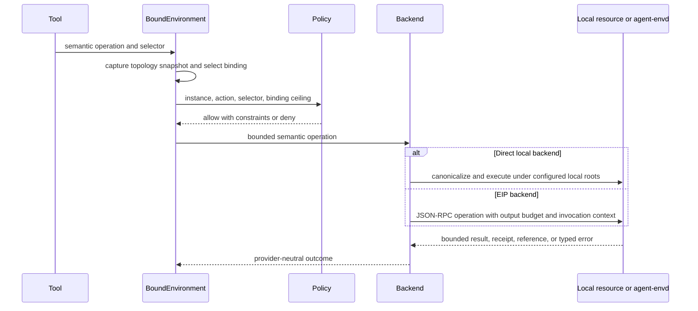

# Environment Integration

## Design Position

The host composes provider resources and an initial `EnvironmentTopologyRequest` into a single-use `EnvironmentRunBinding`. During stream entry, the Harness binds it to the new run ID and trusted Agent instance, enters its async resource scope, and publishes one stable multi-binding `BoundEnvironment` through `AgentContext`. The public `EnvironmentCapability` integrates that exact facade with Pydantic lifecycle, state, model context, and topology notices; it does not retain another Environment list.

Environment operations are provider-neutral. `LocalFileOperator` and `LocalShell` are first-class direct implementations for an embedding process that intentionally grants local roots and commands. `agent-envd` and its EIP adapters are equally first-class backends for sandboxed, container, E2B, remote, or otherwise daemon-governed resources. Local execution is never forced through a daemon, and using a direct local backend makes no sandbox claim.

`BoundEnvironment.files` is a stable virtual filesystem facade that can route across direct-local and EIP-backed bindings. A host-retained `EnvironmentTopologyController` paired with the run binding atomically publishes immutable routing snapshots while the run remains active, without replacing `AgentContext.environment`, rebuilding the Agent, or changing its cacheable instruction prefix.

The host selects bindings. The harness performs binding selection, lexical validation, and Agent policy checks. The provider owns canonical resources, Environment generation, handles, cursors, process trees, native isolation, and side-effect evidence.

## Boundary

| Concern                                                                                                              | Owner                                               |
| -------------------------------------------------------------------------------------------------------------------- | --------------------------------------------------- |
| Available Environment bindings                                                                                       | Host                                                |
| Process-local multi-Environment facade, virtual filesystem routing, live topology observation, and state aggregation | Harness                                             |
| Agent Identity and lineage                                                                                           | `AgentContext`                                      |
| Direct local path and process enforcement                                                                            | `LocalFileOperator`, `LocalShell`, and embedding OS |
| EIP canonical resources, generations, handles, cursors, and retained output                                          | `agent-envd`                                        |
| EIP connection initialization, negotiation, methods, payloads, errors, and transport semantics                       | [agent-envd and EIP](../agent-envd/00-overview.md)  |
| Vendor provision, attach, suspend, and destroy lifecycle                                                             | Host provider adapter                               |
| Native isolation and outer resource enforcement                                                                      | Selected local or sandbox provider                  |

Provider denial always narrows a harness allow decision. Binding IDs, paths, handles, and cursors are selectors, not bearer credentials.

The base Harness imports neither an `agent-envd` transport nor Docker, E2B, or another vendor SDK. Backend packages implement the provider-neutral file, shell, process, port, and state protocols. The local package supplies direct implementations; an EIP package maps the same semantic surface to `agent-envd`. A sandbox provider adapter provisions or attaches its environment and establishes the daemon connection before producing an EIP-backed run binding. Provider lifecycle credentials remain on the Host side; transport credentials and trusted binding context stay inside the binding and backend. Neither appears in `EnvironmentDescriptor`, model-facing operations, or saved Environment state.

For an EIP-backed binding, stdio, HTTP, and WebSocket are interchangeable transport profiles for one EIP method and payload contract, not separate Environment implementations. Transport selection is fixed for one entered connection. Reconnect or fallback initializes a fresh connection and revalidates Environment identity, generation, capabilities, and authority; it never retargets an opaque handle or silently retries an ambiguous mutation. Direct-local bindings have no transport negotiation. The EIP protocol and failure rules are defined by [agent-envd and EIP](../agent-envd/00-overview.md).

## Binding and Facade

```python
class EnvironmentBindingRequest(BaseModel):
    model_config = ConfigDict(frozen=True)

    binding_id: str
    alias: str
    provider_ref: EnvironmentProviderRef
    permission_ceiling: EnvironmentPermissionSet
    default_working_directory: str | None


class EnvironmentTopologyRequest(BaseModel):
    model_config = ConfigDict(frozen=True)

    topology_version: int
    bindings: tuple[EnvironmentBindingRequest, ...]
    default_binding_id: str | None


class EnvironmentBinding(BaseModel):
    model_config = ConfigDict(frozen=True)

    binding_id: str
    alias: str
    provider_ref: EnvironmentProviderRef
    descriptor: EnvironmentDescriptor
    permission_ceiling: EnvironmentPermissionSet
    default_working_directory: str | None


class EnvironmentTopology(BaseModel):
    model_config = ConfigDict(frozen=True)

    topology_version: int
    bindings: tuple[EnvironmentBinding, ...]
    default_binding_id: str | None


class BoundEnvironment(Protocol):
    @property
    def topology(self) -> EnvironmentTopology: ...

    @property
    def files(self) -> VirtualFileOperator: ...

    @property
    def shell(self) -> BoundShellOperations: ...

    @property
    def processes(self) -> BoundProcessOperations: ...

    @property
    def ports(self) -> BoundPortOperations: ...

    async def describe(self, binding_id: str) -> EnvironmentDescriptor: ...
    async def export_state(self) -> EnvironmentState: ...
    async def restore_state(self, state: EnvironmentState) -> None: ...


class EnvironmentRunBinding(Protocol):
    @property
    def controller(self) -> "EnvironmentTopologyController": ...

    def bind(
        self,
        *,
        run_id: str,
        instance: AgentInstanceContext,
    ) -> AbstractAsyncContextManager[BoundEnvironment]: ...


class EnvironmentTopologyChange(BaseModel):
    model_config = ConfigDict(frozen=True)

    previous_version: int
    current_version: int
    added_aliases: tuple[str, ...]
    removed_aliases: tuple[str, ...]
    refreshed_aliases: tuple[str, ...]
    notice_status: Literal["enqueued", "terminal_before_enqueue"]
    enqueue_id: str | None


class EnvironmentTopologyController(Protocol):
    async def apply(
        self,
        request: EnvironmentTopologyRequest,
    ) -> EnvironmentTopologyChange: ...
```

`EnvironmentBindingRequest` and `EnvironmentTopologyRequest` are trusted desired inputs, not observed provider state. Their `provider_ref` selects an already authorized provider resource factory or connection setup and contains no vendor credential, lifecycle reattachment record, or `EnvironmentDescriptor`. The Host provider adapter consumes any lifecycle record before constructing the run binding or request. All request and published snapshot types are frozen value objects; nested provider references, descriptors, permission sets, limits, and mappings used by routing or authority are likewise frozen or normalized to immutable tuples and read-only mappings. `frozen=True` alone is not treated as deep immutability.

`EnvironmentRunBinding` is trusted host input and is single-use for one Harness stream. Its `bind()` method verifies the supplied instance, creates the run-local routing coordinator, prepares and enters the requested backend resources, obtains each backend descriptor, intersects requested permission ceilings with observed capabilities and provider policy, and only then publishes `EnvironmentBinding` values through the facade. Run assembly validates that the published surface satisfies `AgentDefinition.environment.operations` before model or tool work. EIP initialization is part of entering an EIP backend; direct-local entry validates configured roots, command policy, and local resource bounds without starting a daemon. Failed entry closes every provider already opened; normal exit closes providers after operation leases drain. Rebinding the same object, using a controller paired with another binding, or presenting provider state for another instance fails before model work. Policy and invocation-grant collaborators are captured by the trusted binding or its providers rather than accepted from model-facing operations.

`BoundEnvironment` is always a multi-Environment aggregate. Zero bindings form the no-operation case and one binding is the ordinary simple case; tools and Capabilities never switch between separate single- and multi-Environment context types. `EnvironmentDescriptor` is a provider-neutral observed value published only after backend entry or refresh; EIP initialization is one way to obtain it. Provider clients, lifecycle records, and credentials are absent from desired and published public bindings.

The host creates and retains the run binding and its `EnvironmentTopologyController`; neither mutation handle is placed on `AgentContext` or exposed as an Agent tool. The controller is inactive before the Pydantic run starts, becomes active through the Environment Capability's run observer, and becomes permanently closed when the binding's context exits. The controller and entered `BoundEnvironment` are paired handles over the same run-local routing coordinator. The five `BoundEnvironment` facade members and the run binding's paired `controller` are read-only Protocol properties with no replacement setter. `BoundEnvironment.topology` is an immutable current snapshot backed by the coordinator's private normalized values, not caller-owned objects. Each `EnvironmentBinding`, its permission ceiling, and its observed provider generation are recursively immutable within one snapshot. A topology replacement creates another snapshot rather than mutating values already selected by an operation.

## Model-facing Routing

`binding_id` is the stable host and state key. `alias` is the bounded model-facing selector and is unique within one topology. Aliases are non-empty single path segments and cannot be `.` or `..`. Tool schemas accept an alias as an ordinary string instead of enumerating the current aliases, so live topology does not change tool schemas or the cacheable model prefix.

The standard filesystem projection follows one deterministic mapping:

- the default binding's provider root is projected at `/workspace`;
- each non-default binding's provider root is projected at `/environment/{alias}`;
- a relative path selects the default binding and resolves from its binding-local `default_working_directory`, or from its provider root when no default directory is configured;
- `/workspace` and its descendants select the default binding and translate the remaining suffix to a binding-local absolute path;
- `/environment/{alias}` and its descendants select that non-default binding and translate the remaining suffix in the same way;
- an absolute path outside these virtual roots fails rather than falling back;
- a topology without a default rejects `/workspace` and relative paths.

The projection gives each binding one Harness-visible root. Provider-internal mounts beneath that root remain described and enforced by the provider; the Harness does not invent another public mount selector. A shell operation can select an alias explicitly. Its working directory must be absent, binding-relative, or inside that binding's virtual root; an alias and absolute working directory that select different bindings are rejected. The Harness resolves the model-facing alias or virtual path to an internal `EnvironmentPath(binding_id, path)` before policy and provider dispatch. Providers never receive alias text as authority.

An already published binding that later becomes unavailable can retain its last trusted descriptor plus an observed unavailable status in bounded diagnostic context, but it is not a routing target. A newly requested binding is not published when initialization cannot establish trustworthy identity and capabilities. A removed alias never silently routes to a newly added binding with another `binding_id`; opaque process handles continue to carry their original binding and generation.

## Environment State

Harness Environment continuation exposes backend-local state rather than provider lifecycle resources. A versioned, opaque adapter lifecycle record for an optional local daemon, Docker container, E2B environment, or another vendor resource belongs to Host launch/attempt continuation and is consumed before a fresh `EnvironmentRunBinding` is constructed. It never enters `EnvironmentState`.

After the selected backend is entered, it can expose narrower recoverable state. An EIP backend can use `agent-envd` resource registries, browser sessions, process registries, cursor positions, or filesystem snapshots; a direct-local backend normally has no recoverable entry unless it explicitly defines one. Those implementation names do not enter the Harness contract.

```python
class EnvironmentBindingState(BaseModel):
    provider_type: str
    state_version: str
    observed_generation: int | None = None
    data: JsonValue


class EnvironmentState(BaseModel):
    observed_topology_version: int
    bindings: dict[str, EnvironmentBindingState] = Field(default_factory=dict)
```

The map key is the stable `binding_id` selected by the host. `observed_topology_version` records the snapshot against which state collection was linearized; it is diagnostic and does not recreate that topology. `EnvironmentState` does not create bindings or restore topology. On import, Harness preparation uses the Environment Capability's versioned state codec to match entries to freshly selected bindings, check provider type and state version, and call `BoundEnvironment.restore_state()` before the input factory and Pydantic run. The later run-bound Capability does not repeat that restore. A current binding without saved state starts fresh. A saved binding removed by current host policy is ignored and reported as a diagnostic; it cannot recreate access. Reusing the same binding ID with an incompatible provider type or state version fails import unless the host explicitly migrates or drops that entry.

Only bindings with backend-local recoverable data create entries. State can describe an EIP daemon-local resumable session, a direct backend's explicitly portable state, a provider-owned workspace snapshot, cursor, or opaque reference to an object reachable through the already selected Environment. It cannot identify, provision, resume, or authorize the vendor Environment itself and cannot contain credentials, live Python objects, provider clients, authorization decisions, or raw bearer handles. A restored reference grants no access: the current binding, generation, Identity, and provider policy are checked again on first use.

The Environment Capability stores the aggregate as its versioned entry in `AgentContext.state`. `await AgentContext.export_state(message_history)` refreshes that entry from `BoundEnvironment` and stores it with every other Agent Context state entry and Pydantic message history in `HarnessState`. A Host that persists the complete Harness state has opaque storage custody: it applies generic encryption, size bounds, retention, and deletion, while each backend's state codec exclusively owns its data schema, version validation, interpretation, and migration. Host lifecycle records remain a separate launch/attempt envelope and do not require a second Harness Environment-state export path.

The aggregate itself owns routing and state collection but has no hidden top-level resource registry. Recoverable data belongs to explicit bindings, so exporting the aggregate necessarily covers every stateful child binding. State export and topology replacement are linearized: one export observes one complete topology version and never a mixture of old and new binding sets.

## Dynamic Topology

`EnvironmentTopologyController.apply()` accepts only a complete `EnvironmentTopologyRequest` whose version is greater than the current published topology version. It first defensively copies and recursively normalizes the request into private immutable values, then validates unique aliases and binding IDs, a valid default, generated virtual-root disjointness, provider compatibility, requested permission ceilings, the Agent definition's required operation families, and lifecycle safety before changing routing. It prepares and enters newly requested backend resources, performs EIP initialization only where applicable, obtains trustworthy descriptors, intersects effective ceilings, and only then atomically publishes a complete `EnvironmentTopology` snapshot; failure leaves the old snapshot active and closes newly prepared resources. Dynamic apply is available only while the paired Pydantic run is active; before first iteration or after terminal commit it fails with `EnvironmentError(code="run_not_active")`, and after Environment teardown it fails with `EnvironmentError(code="environment_closed")`. The host selects the complete initial request before entering the stream and supplies a fresh request on a later run.

An operation captures one binding and generation from one topology snapshot before policy evaluation. In-flight operations finish against that captured binding while new operations use the new snapshot. Removed provider resources close only after their operation leases drain. An update that would invalidate an active background process, opaque handle, or provider invariant is rejected with `EnvironmentError(code="topology_in_use")`; a provider may retain a non-routable tombstone internally, but new model operations cannot select it.

A successful update returns an `EnvironmentTopologyChange` containing the previous and current versions plus bounded added, removed, and refreshed alias sets. The run-entered Environment Capability observes that publication, emits the matching Harness `context` extension event, coalesces unapplied topology changes, and uses native `RunContext.enqueue()` to add a trusted, bounded Environment-change notice at the user-content suffix for the next eligible model boundary. This is native steering, not a second Environment event queue. Active-run validation, topology publication, and terminal transition are linearized: terminal-before-publication rejects the update without change; publication-before-terminal commits the update, and a terminal race that then prevents notice delivery does not roll it back because no later Agent operation can use it. The context event and change receipt distinguish topology commit from model-notice delivery. No live command or rendered topology is retained for a later run.

Topology updates never rewrite Agent instructions, Toolset instructions, or tool schemas. Static instructions describe only stable routing syntax and operation semantics. The current topology, virtual-root summary, provider capabilities, and change notice are bounded dynamic context injected at the end of an ordinary user request or trusted topology-change notice. This placement preserves the stable system/tool prefix used for provider prompt caching while ensuring the Agent observes the topology that current operations will route against.

During outer stream input preparation, the Harness input adapter snapshots the current topology and appends the Environment Capability's trusted rendering with `user_suffix` placement whenever the selected input contains ordinary user content. Native string or `Sequence[UserContent]` input and hosted `RunInput` use the same renderer and ordering. A run with no ordinary user content does not manufacture a full repeated snapshot over tool-return-only or retry-only history. Instead, the Environment Capability's `before_run` hook uses native enqueue for one bounded startup notice only when a fresh no-input run needs initial routing context or when imported `observed_topology_version` differs from the current version. Provider-suspended continuation is excluded: history ending in `ModelResponse(state="suspended")` resumes unchanged, because inserting a new request before the provider continuation would alter its protocol semantics; fresh Environment context waits for a later ordinary turn, while current provider enforcement still governs any operation. A version mismatch notice describes the change and current selectors but grants no authority. The same-version resumed path adds nothing.

## Multi-Environment Routing

Every operation selects a binding by the deterministic alias, virtual-path, or default rules above. A multi-Environment run without a default rejects omission rather than guessing from paths, capabilities, or registration order.

```python
class EnvironmentPath(BaseModel):
    binding_id: str
    path: str
```

`path` is absolute within the selected provider root; it is never a host filesystem path. The harness validates selector shape, virtual-root membership, relative-path syntax, declared limits, and obvious traversal. It does not resolve provider-internal mounts, symlinks, provider aliases, case folding, or remote filesystem state.

Cross-Environment copy is an explicit source read followed by a destination write, with separate authorization and limits. It is not implicitly atomic.

## Route, Authorize, Execute



When central policy depends on a provider-canonical resource, the backend uses an explicit provider resolution operation before the final policy decision. The Harness never infers a canonical remote path from lexical text. EIP invocation context can carry the generic grant reference defined by the invocation-security boundary. Direct-local backends preserve the same policy inputs without inventing network tokens.

## File and Shell Surface

The public semantic protocols retain the useful SDK split:

- `FileOperator` is the provider-neutral async file contract;
- `LocalFileOperator` maps configured logical roots directly to host files with canonical containment and symlink-escape checks;
- `EIPFileOperator` maps the same contract to an EIP-backed binding;
- `VirtualFileOperator` is the stable mount-and-routing facade used by `BoundEnvironment.files`;
- `Shell` is the provider-neutral command and process contract;
- `LocalShell` and `EIPShell` are direct and daemon-backed first-class implementations.

`VirtualFileOperator` preserves longest-prefix virtual mount routing, read-only mounts, explicit backend availability, path-escape rejection, streaming cross-mount copy, and stable-instance topology replacement from the prior SDK. It deliberately drops native-absolute fallback, exposed mutable mount lists, and instruction rendering from the low-level operator. Mount snapshots are immutable; an operation captures one snapshot before routing. Empty, one-mount, and mixed local/remote configurations use the same type.

The facade exposes only operations negotiated by the descriptor and permitted by the binding ceiling. Unsupported operations stop before backend dispatch. File mutations express create, overwrite, append, or upsert semantics, optional compare-and-swap input, bounds, and provider idempotency identity. Reads, writes, search, copy, and result spill are chunked; a default implementation cannot collect an unbounded stream merely to emulate a streaming method. Cursors remain opaque and scoped to binding, generation, operation, request shape, and provider authorization.

Shell execution uses structured executable and argument arrays by default. Shell text selects an explicit shell profile. Working directory, timeout, output budgets, environment projection, and network request are explicit data. Direct and EIP shells use the same per-call and aggregate bounded retained-output semantics and never require the Harness to materialize complete stdout or stderr before applying limits. Direct-local spools use a private binding retention root with finite total bytes and object count, atomic reservation, explicit release/expiry, and cleanup on binding close. EIP backends negotiate and enforce the equivalent daemon-side retention budget.

Credential projection is disabled by default. A compatibility profile can project a short-lived audience-bound credential while retaining output and telemetry redaction. Ambient host credentials never become a fallback.

## Processes and Opaque Handles

```python
class BoundProcessHandle(BaseModel):
    binding_id: str
    handle: OpaqueProcessHandle
    observed_generation: int
```

Provider-side records retain Environment identity, native process identity, owner instance, originating invocation, process tree, and cleanup state. The harness does not mirror them into the handle.

Start, output read, stdin, signal, wait, kill, and release are separately authorized under the current execution context. The provider verifies the opaque handle, current generation, and ownership on every operation.

Background work outlives a run only through explicit Host and backend retention. A backend with external lifecycle first attaches or resumes its Environment and produces a fresh binding. Environment state may then carry an opaque backend-local object reference, but reattachment receives a fresh authorization decision. Generation change invalidates an incompatible reference; import never treats saved state as proof that the process still exists or remains authorized.

## Failure Surface

The Harness exposes a compact set of categories: invalid request, denied, unsupported, stale binding, invalid topology, topology in use, unavailable, timeout, unknown outcome, and provider failure. EIP method codes and provider diagnostics remain bounded extensions. Transport-specific framing and authentication failures are normalized without erasing whether a valid JSON-RPC method error was received.

Transport loss after a mutation is unknown unless `agent-envd` can replay the same idempotency identity or reconcile a receipt. Closing stdio, HTTP, or WebSocket is not proof of cancellation. The Harness does not translate ambiguity into success or blind retry; the detailed boundary belongs to [agent-envd and EIP](../agent-envd/00-overview.md#failure-and-side-effect-semantics).

## Trade-offs

- Explicit aliases and virtual mounts add routing metadata but prevent ambient cross-Environment selection.
- Atomic topology replacement keeps a live Agent usable as bindings change, at the cost of operation leases and explicit rejection when active handles make a change unsafe.
- Dynamic topology in user-content suffixes preserves the cacheable instruction prefix, while each affected user turn carries bounded current routing context.
- Provider canonicalization prevents the Harness from pretending to understand remote filesystem semantics.
- Opaque handles keep ownership authoritative at the provider, at the cost of provider-dependent reattachment.
- A stable facade gives capabilities one interface without reproducing EIP lifecycle or transport internals.
- Supporting direct-local and EIP-backed implementations adds two backend packages, but one provider-neutral semantic contract and shared virtual routing prevent their tool behavior from diverging. Local embedding stays lightweight while sandbox enforcement remains beside sandbox resources.
- Saving per-binding Environment state with Agent Context state makes continuation cohesive, at the cost of requiring each stateful provider to maintain a versioned codec.

## Invariants

01. Every operation selects one immutable binding and observed provider generation from one complete topology snapshot.
02. Topology replacement is atomic, monotonic, host-authorized, and never exposed as a model tool.
03. Live topology changes do not mutate static instructions or tool schemas; model notification uses native enqueue and user-suffix context.
04. `BoundEnvironment` closes over trusted Identity rather than accepting it from callers.
05. Harness validation is lexical; provider canonicalization and native enforcement remain authoritative.
06. Handles and cursors are opaque scoped values.
07. Every process-control action re-authorizes with the provider.
08. Mutating retry uses provider idempotency or reconciliation evidence.
09. Any adapter lifecycle record is consumed before binding construction; `EnvironmentState` restores only backend-local behavior into fresh, already reachable bindings and never restores authority or topology.
10. Desired topology requests contain no observed descriptor; only successful initialization publishes a new `EnvironmentBinding`, while later authenticated status observation can mark an existing binding unavailable.
11. `LocalFileOperator` and `LocalShell` are first-class direct backends; EIP-backed sandbox and remote backends are first-class peers, and neither is a compatibility fallback for the other.
12. `VirtualFileOperator` routes recursively immutable mount snapshots without native-path fallback; direct and EIP operations preserve one provider-neutral file and shell contract.
13. Direct and EIP retained outputs obey finite aggregate bytes and object counts in addition to per-call limits; allocation, release, expiry, and close cannot bypass those ceilings.
14. For EIP-backed bindings, stdio, HTTP, and WebSocket do not change method semantics.
