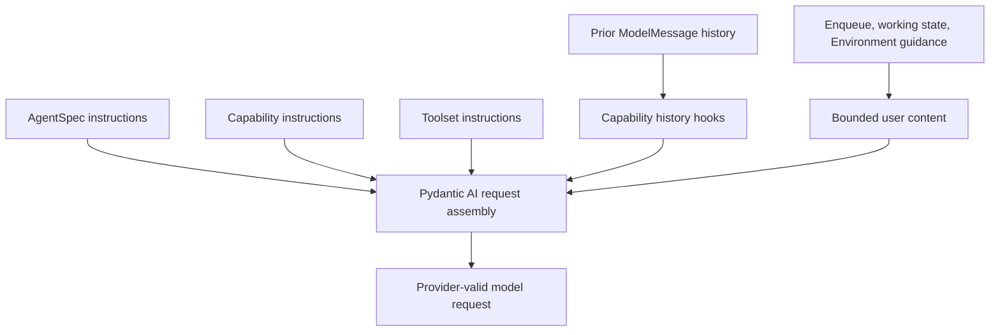
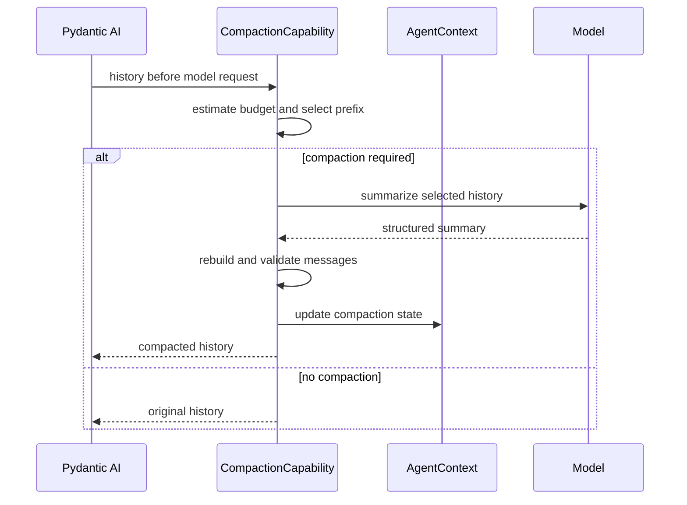

# Context, Working State, Compaction, and Memory

## Design Position

Model context is assembled by Pydantic AI from Agent instructions, Capability instructions, Toolset instructions, prior messages, ordinary user content, and Capability history/model-request hooks. The Harness defines no parallel prompt language. It standardizes only `ContextInputPart` placement at the user-content prefix or suffix so semantic input factories, Environment changes, and host input use one cache-conscious content seam.

Working state, compaction, memory, Environment context, skills, media normalization, and message injection are ordinary `AbstractCapability[AgentContext]` implementations. Each Capability owns its configuration, state, ordering, and failure behavior.

## Context Layers



| Layer                    | Owner                                                                           | Representation                                          |
| ------------------------ | ------------------------------------------------------------------------------- | ------------------------------------------------------- |
| Authored Agent behavior  | `AgentSpec`                                                                     | Pydantic instructions                                   |
| Feature guidance         | Owning Capability                                                               | Capability instructions                                 |
| Tool usage guidance      | Owning Toolset or Capability                                                    | Toolset or Capability instructions                      |
| Interaction continuation | Pydantic AI                                                                     | `ModelMessage` history                                  |
| Dynamic run context      | Owning Capability                                                               | User-content suffix or history/model-request hook       |
| Provider compatibility   | Native `ModelProfile` and adapter; scoped Capability only for residual behavior | Profile rendering or bounded public-hook transformation |

Instruction ordering follows Pydantic AI Capability composition. A Capability declares only the dependencies required for correctness through `CapabilityOrdering`.

## Request Preparation

The standard Capability set performs the following semantic work without creating a global stage API:

1. validate imported message structure and tool-call/result integrity without rewriting provider semantics;
2. apply handoff, accepted enqueue content, completed background work, and explicit file references;
3. compact history when the configured budget requires it;
4. resolve fresh Environment, working-state, memory, and skill guidance;
5. finalize media and verify tool-call/result integrity before provider dispatch.

The list defines expected ordering relationships for first-party Capabilities. Native model adapters and `ModelProfile` own ordinary provider reasoning, tool-argument, and history projection compatibility. Only while the latest upstream lacks a required public seam may an exact-model-integration-scoped Capability apply a tested public-hook repair; it carries typed configuration and an upstream-removal condition and never becomes a standard global normalization stage. Third-party Capabilities compose through Pydantic ordering constraints rather than registering a named stage.

Dynamic content is data under the trust level of its source. Retrieved text, file content, tool output, topology notice, or a skill document cannot establish Identity, policy, credentials, or Environment authority.

## Cache-stable Context Injection

Agent and Toolset instructions contain stable behavior: tool purpose, generic routing syntax, safety constraints, and provider-independent usage guidance. They do not enumerate current Environment aliases, mounted projects, directory trees, live processes, working-state values, or other run-specific data. A live value therefore cannot change `get_instructions()` output, tool schemas, or another cacheable prefix segment.

`ContextInputPart(placement="user_suffix")` is the standard semantic input for bounded fresh context. The input adapter appends it after the caller's ordinary text and media in the same user request. First-party Environment context uses this placement for the current topology and uses native enqueue to deliver a startup or coalesced live-change notice when no ordinary user content can carry required fresh routing context. Working state, file references, and similar Capabilities may use the same placement when their content is naturally associated with a user turn; content that transforms history for correctness remains in an owning Pydantic history Capability.

Context injection runs only on a request containing ordinary user content or a trusted semantic notice. It does not append the full Environment snapshot to tool-return-only or retry requests, which would destabilize provider caching and repeat unchanged content. A fresh no-input run can receive one startup snapshot, and a resumed run whose imported Environment topology version differs receives one bounded change notice through native enqueue; same-version continuation receives neither. Provider-suspended history is the exception: after the Host rebinds the exact pinned model target through the same locked integration, it resumes without a new notice so the provider continuation remains the history tail, and current context waits for a later ordinary turn. On a later user turn, the Capability resolves the latest snapshot rather than persisting rendered instructions in `HarnessState`.

An optional context Capability can be omitted or configured by its host. Core Environment routing context follows the Environment contract and becomes a no-op when no model-visible Environment binding is present. There is no global boolean that mutates unrelated Toolset instructions and no callback list for arbitrary prompt rewriting.

## Active Messages

Active history is the Pydantic AI `ModelMessage` sequence required to continue the Agent interaction. It is distinct from application conversation, display, audit, and analytics history.

Messages are appended only at complete semantic boundaries. Tool calls and results remain paired or use Pydantic deferred-tool semantics. Native model adapters produce provider-specific request projections and do not silently rewrite stored history. An owning Capability replaces history only for its actual Agent behavior, such as validated compaction, or under the narrow temporary integration-scoped repair rule above.

`HarnessState.message_history` uses the public Pydantic message codec. Imported metadata never restores Identity, approval, provider ownership, or Capability state.

## Working State Capability

Tasks, notes, and per-Agent TODOs form one optional Working State Capability because they share tools, dynamic guidance, and persistence behavior.

```python
class WorkingState(BaseModel):
    tasks: tuple[Task, ...] = ()
    notes: Mapping[str, str] = {}
    todos: tuple[TodoItem, ...] = ()
```

The Capability:

- contributes task, note, and TODO Toolsets selected by configuration;
- contributes bounded dynamic user context describing relevant state;
- stores `WorkingState` in its `AgentContextState` namespace;
- defines explicit parent/child sharing policy.

Tasks can be shared with inline children when coordination is configured. TODOs are private to one Agent instance by default. Notes can be copied or shared by policy; no mutable object reference crosses a hosted child boundary.

Working state assists the Agent. It is not a host workflow, scheduler, durable business task, or authorization source.

## Operational Context Capabilities

Small operational behaviors remain separate when their state and lifecycle differ:

| Capability          | Behavior                                                                                | State                                                                                                |
| ------------------- | --------------------------------------------------------------------------------------- | ---------------------------------------------------------------------------------------------------- |
| Enqueue/messaging   | Uses Pydantic enqueue to deliver accepted steering or follow-up input                   | Delivery acceptance stays with host; incorporated IDs only when needed for duplicate suppression     |
| Background process  | Adds completed Environment process output at the next request                           | Environment Capability state can retain a backend-local reference after any required Host attachment |
| File reference      | Tells the Agent which explicit files require inspection                                 | Bounded pending path list                                                                            |
| Environment context | Adds current routing/topology context at the user suffix and queues live change notices | Recomputed from `BoundEnvironment`                                                                   |
| Skill               | Supplies selected skill instructions and resources                                      | Loaded skill IDs when needed for continuation                                                        |
| Media               | Normalizes media count, size, format, and provider representation                       | No raw provider URL credential state                                                                 |

These Capabilities use native instructions, history/request hooks, native enqueue, or Toolsets. A global context-injection switch is unnecessary; a host enables, disables, or configures the owning Capability without rewriting other instruction sources.

## Compaction Capability

Compaction replaces an eligible history prefix with a smaller provider-valid message segment.

```python
class CompactionPolicy(BaseModel):
    trigger_tokens: int
    target_tokens: int
    preserve_recent_turns: int
    model: str | None = None
```



The Capability preserves:

- the current user intent and immediately preceding assistant references;
- unresolved or deferred tool work;
- provider-valid tool-call/result relationships;
- configured recent turns;
- provenance needed to distinguish summary content from new user input.

Transient Environment and working-state context is omitted from the summarized history prefix and resolved again after compaction. Media and large tool returns can be replaced by bounded descriptions according to provider policy.

The original history remains active until structured summary validation and message-integrity checks succeed. Compaction failure leaves history unchanged or stops the request according to the configured policy.

Compaction state contains only data not already represented by the compacted messages, such as a bounded prior-response reference or compaction counter. Model clients and callbacks remain process-local.

## Memory Capability

Long-term memory is an optional Capability backed by a narrow provider.

```python
class MemoryProvider(Protocol):
    async def recall(
        self,
        request: MemoryRecallRequest,
    ) -> Sequence[MemoryItem]: ...

    async def observe(
        self,
        observation: MemoryObservation,
    ) -> None: ...
```

The Capability derives memory scope from trusted Agent Identity and actor bindings, performs recall at configured request boundaries, and contributes bounded advisory content. It can observe pre-compaction history, a validated summary, or terminal messages.

Memory items retain source and scope metadata. They are untrusted context and cannot carry grants, credentials, delegation authority, or Environment handles.

Provider writes can be inline when required for consistency or emitted as host work. Durable extraction, consolidation, retention, and scheduling belong to the host or memory provider. No background memory task is allowed to outlive a process-local harness run without explicit host ownership.

## State Ownership

| State                                       | Owner                                                                |
| ------------------------------------------- | -------------------------------------------------------------------- |
| Active Pydantic messages                    | `HarnessState.message_history`                                       |
| Tasks, notes, TODOs                         | Working State Capability                                             |
| Loaded skills or discovered tools           | Owning discovery Capability                                          |
| Compaction-only metadata                    | Compaction Capability                                                |
| Long-term memory records                    | Memory provider                                                      |
| Recoverable multi-Environment state         | Environment Capability entry; native resources remain provider-owned |
| Host delivery, counters, and scheduler work | Host                                                                 |

## Resume and Delegation

A resumed run imports messages and Capability state, then resolves dynamic Environment, working-state, skill, and memory content again. Rendered Environment topology context is not restored as authority. The next ordinary user turn receives a fresh user-suffix snapshot; if execution continues without one and the topology version changed, a bounded startup change notice enters through native enqueue before the next model request. Fresh policy can remove access that existed in an earlier run.

A child run receives an explicit context seed and a fresh `AgentContext`. Parent messages or summaries transfer only when delegation policy selects them. Parent and child never share mutable message lists or `AgentContextState`.

## Failure Semantics

| Failure                                         | Result                                                                 |
| ----------------------------------------------- | ---------------------------------------------------------------------- |
| Imported messages are invalid                   | Run creation fails before provider work                                |
| Optional dynamic guidance is unavailable        | Owning Capability omits it and emits a diagnostic                      |
| Required guidance or memory fails               | Model step fails                                                       |
| Compaction output is invalid                    | Original history remains active                                        |
| Context exceeds the provider limit after policy | Model step fails with a bounded context error                          |
| Memory observation fails                        | Owning policy chooses run failure or host retry; history remains valid |

## Boundaries

| Concern                                        | Owner                               |
| ---------------------------------------------- | ----------------------------------- |
| Instruction and history composition            | Pydantic AI and owning Capabilities |
| Active messages and namespaced run state       | Harness                             |
| Long-term memory storage and consolidation     | Memory provider or host             |
| Application conversation and display history   | Host                                |
| Provider context limits and request acceptance | Model provider                      |

## Trade-offs

### Direct Pydantic Composition vs. Context Framework

Direct instructions, semantic user-content placement, native enqueue, and Capability hooks keep one ordering and lifecycle model. Cross-cutting context inspection is less centralized, so first-party Capabilities provide bounded events and state for diagnostics. Keeping run-specific topology out of `get_instructions()` preserves the provider-cache prefix at the cost of repeating a bounded snapshot on relevant user turns.

### One Working State Capability vs. Independent Managers

Tasks, notes, and TODOs share tools and persistence without turning `AgentContext` into a collection of managers. Their distinct parent/child sharing semantics remain explicit within the Capability.

### Host-owned Memory Work vs. Automatic Background Tasks

Host scheduling survives process loss and supports provider retries. Embedded applications that need only recall can use an in-process provider without installing a scheduler.
