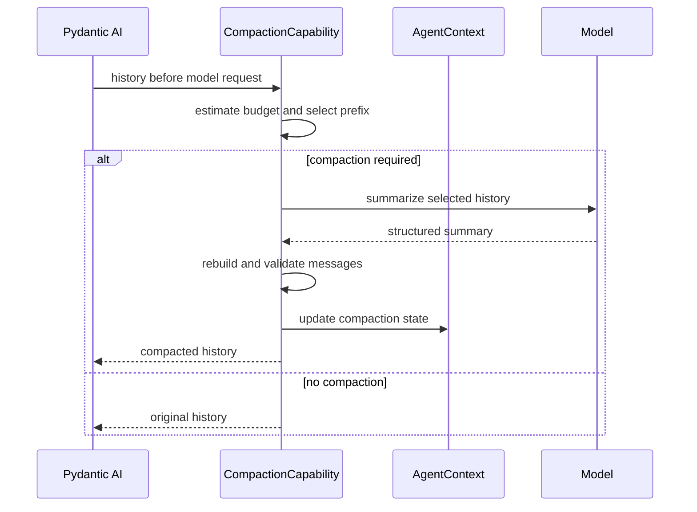

# Context, Working State, Compaction, and Memory

## Design Position

Model context is assembled by Pydantic AI from Agent instructions, Capability instructions, Toolset instructions, prior messages, ordinary user content, native enqueue input, and public Capability history/model-request hooks. The Harness defines no parallel prompt language or custom user-content part. Dynamic first-party context uses the public `before_model_request(ctx, ModelRequestContext)` boundary or `RunContext.enqueue()` according to whether it augments an eligible request or creates trusted follow-up input.

Working state, compaction, skills, media normalization, and behavior inside the Pydantic Agent loop are ordinary `AbstractCapability[AgentContext]` implementations. `EnvironmentToolsCapability` is the optional model projection of the fixed Harness Environment resource; it is not the resource owner. Query-dependent context retrieval that must inspect and modify the complete semantic run input can instead be a first-class Harness plugin, which may contribute Capabilities. Each plugin or Capability owns its typed configuration, ordering, and failure behavior; portable Environment state remains core-owned, ordinary feature state remains Capability-owned, and durable provider launch state remains Host-owned.

## Context Layers


| Layer                    | Owner                                                                           | Representation                                          |
| ------------------------ | ------------------------------------------------------------------------------- | ------------------------------------------------------- |
| Authored Agent behavior  | `AgentSpec`                                                                     | Pydantic instructions                                   |
| Feature guidance         | Owning Capability                                                               | Capability instructions                                 |
| Tool usage guidance      | Owning Toolset or Capability                                                    | Toolset or Capability instructions                      |
| Interaction continuation | Pydantic AI                                                                     | `ModelMessage` history                                  |
| Dynamic run context      | Owning Capability or Environment projection                                     | Public model-request hook or native enqueue input       |
| Provider compatibility   | Native `ModelProfile` and adapter; scoped Capability only for residual behavior | Profile rendering or bounded public-hook transformation |

Instruction ordering follows Pydantic AI Capability composition. A Capability declares only the dependencies required for correctness through `CapabilityOrdering`.

## Request Preparation

The standard Capability set performs the following semantic work without creating a global stage API:

1. validate imported message structure and tool-call/result integrity without rewriting provider semantics;
2. apply handoff, accepted enqueue content, completed background work, and explicit file references;
3. compact history when the configured budget requires it;
4. resolve current Environment projection, working-state, memory, and skill guidance;
5. finalize media and verify tool-call/result integrity before provider dispatch.

The list defines expected ordering relationships for first-party Capabilities. Native model adapters and `ModelProfile` own ordinary provider reasoning, tool-argument, and history projection compatibility. Only while the latest upstream lacks a required public seam may an exact-model-integration-scoped Capability apply a tested public-hook repair; it carries typed configuration and an upstream-removal condition and never becomes a standard global normalization stage. Third-party Capabilities compose through Pydantic ordering constraints rather than registering a named stage.

Dynamic content is data under the trust level of its source. Retrieved text, file content, tool output, topology notice, or a skill document cannot establish Identity, policy, credentials, or Environment authority.

## Cache-stable Context Injection

Model-facing data has three cache classes:

- build-static behavior, including tool purpose, generic routing syntax, safety constraints, and provider-independent usage guidance, remains in the stable instruction and tool prefix;
- run-frozen model surface, such as an Environment-backed skill catalog required for the first request, is materialized once by the owning Capability's `for_run()` after scoped readiness, deterministically ordered, and immutable for that Harness run;
- request-dynamic context, including current Environment aliases, mounts, availability, working state, background results, and topology changes, enters through native enqueue or an owning public history/model-request hook after the stable prefix.

A run-frozen Capability returns a replacement whose `get_instructions()` and tool discovery read only frozen in-memory values and perform no provider, filesystem, or registry I/O. Pydantic re-extracts that replacement's contributions before the first model request. A provider cache breakpoint can separate the build-static prefix from a run-frozen catalog when the provider supports one; readiness and deterministic ordering prevent placeholder-to-real or mid-run mutations but do not claim a cross-run cache hit when catalog bytes differ.

Request-dynamic data never mutates instructions or tool schemas. A Capability that intentionally supports hot reload observes an explicit dynamic revision and injects a bounded notice; it does not silently rescan and alter a cacheable prefix. Ordinary operation readiness stays inside the selected Environment operation and does not force unrelated model-surface preparation.

For an eligible request containing ordinary user content, `EnvironmentToolsCapability.before_model_request()` appends bounded current topology through `ModelRequestContext` after the caller's content without changing the stable instruction/tool prefix. When topology changes while an inner run can accept input, the Capability uses native `RunContext.enqueue()` for one coalesced trusted notice. Working state, file references, and similar Capabilities can use the same public request hook when their data belongs to a user turn; content that transforms history for correctness remains in an owning Pydantic history Capability.

Context injection runs only on a request containing ordinary user content or a trusted semantic notice. It does not append the full Environment snapshot to tool-return-only or output-retry requests, which would destabilize provider caching and repeat unchanged content. The Environment core exposes the successfully imported value only as `BoundEnvironment.restored_state_topology_version`; the optional projection reads that non-authoritative observation without owning an Environment state namespace.

Every new logical Harness run contributes one fresh bounded Environment snapshot at its first eligible ordinary model boundary, even when the restored and live topology version numbers match. A replacement Attempt can materialize different effective descriptors, permissions, availability, or provider generations under the same durable desired version, so cross-run version equality never suppresses current context. A fresh no-input run can create one trusted startup boundary for this snapshot. Within that entered run, unchanged same-version boundaries do not repeat it, and later topology changes produce bounded notices. Provider-suspended history is the exception: it resumes without inserting a request ahead of the suspended provider continuation. The first later ordinary turn receives the latest fresh live snapshot rather than persisted rendered instructions from `HarnessState`.

`EnvironmentToolsCapability` can be omitted or configured by its Host. Environment lifecycle, programmatic operations, and dynamic topology remain available without it; only model tools, rendered routing context, and notices disappear. With no model-visible binding its stable tool surface can report typed unavailability and later become usable after a Host mount. There is no global boolean that mutates unrelated Toolset instructions and no callback list for arbitrary prompt rewriting.

## Active Messages

Active history is the Pydantic AI `ModelMessage` sequence required to continue the Agent interaction. It is distinct from application conversation, display, audit, and analytics history.

Messages are appended only at complete semantic boundaries. Tool calls and results remain paired or use Pydantic deferred-tool semantics. Native model adapters produce provider-specific request projections and do not silently rewrite stored history. An owning Capability replaces history only for its actual Agent behavior, such as validated compaction, or under the narrow temporary integration-scoped repair rule above.

`HarnessState.message_history` uses the public Pydantic message codec. Imported metadata never restores Identity, approval, provider ownership, or Capability state.

## Working State Capability

Tasks, notes, and per-Agent TODOs form one optional Working State Capability because they share tool presentation, bounded dynamic guidance, and persistence ownership while retaining distinct child-sharing rules.

```python
class TaskState(BaseModel):
    model_config = ConfigDict(frozen=True)

    revision: int = 0
    next_task_sequence: int = 1
    tasks: Mapping[str, Task] = Field(default_factory=dict)


type TaskStateMode = Literal["local", "provider"]


class ProviderTaskCursor(BaseModel):
    model_config = ConfigDict(frozen=True)

    provider_type: str
    state_version: str
    observed_revision: int | None = None


class WorkingState(BaseModel):
    model_config = ConfigDict(frozen=True)

    task_mode: TaskStateMode = "local"
    tasks: TaskState | None = None
    provider_cursor: ProviderTaskCursor | None = None
    notes: Mapping[str, str] = Field(default_factory=dict)
    todos: tuple[TodoItem, ...] = ()


class TaskStateCell(Protocol):
    """Task view already bound to one trusted Agent instance."""

    async def snapshot(self) -> TaskState: ...
    async def create(self, request: CreateTask) -> Task: ...
    async def claim(
        self,
        task_id: str,
        expected_revision: int | None = None,
    ) -> Task: ...
    async def update(
        self,
        task_id: str,
        mutation: TaskMutation,
        expected_revision: int,
    ) -> Task: ...


type TaskStateRunCapabilitySource = Literal[
    "local_borrowed", "provider"
]


@dataclass(frozen=True)
class TaskStateRunCapability(AbstractCapability[AgentContext]):
    source: TaskStateRunCapabilitySource
    cell: TaskStateCell
```

`TaskState`, `ProviderTaskCursor`, and `WorkingState` are replacement values. Their owners defensively copy and recursively normalize task, note, dependency, and status data into immutable values and read-only mappings before publication or state entry replacement; `frozen=True` alone is not treated as deep immutability. A cell never returns a mutable view that can bypass its revision boundary.

The first-party model-facing task reference is `task-{N}`, where `N` is a positive base-10 sequence allocated atomically inside one task scope. The create tool does not accept a model-supplied ID. Local mode commits `next_task_sequence` with the new task in the same cell mutation and retains it as the allocator high-water mark; imported state requires a positive next value greater than every present canonical task sequence and never derives a lower value from the remaining map. Provider mode keeps the equivalent monotonic allocator in the authoritative Host scope transaction; its value never enters `ProviderTaskCursor` or Harness State. Shared children use the same allocator, while an isolated child uses its own scope. A reference is never reused after completion, removal, compaction, or stale-owner reconciliation.

`task-1` is therefore concise and stable within its task scope, not globally unique and not an authority token. Task dependencies and every model-facing claim or mutation use these same scope-local references. The identity-bound cell already selects the hidden local or provider scope before resolving one. Unknown or non-canonical references fail without scanning another scope, and public Host APIs that require global resource identity use their own opaque IDs rather than treating the model reference as one. Model context renders the root owner as a fixed safe label and a known child through that child's compact reference when available; it never exposes `AgentInstanceRef`, provider scope, operation ID, or receipt as owner presentation or mutation input.

The Capability:

- contributes task, note, and TODO Toolsets selected by configuration;
- contributes bounded dynamic user context describing relevant state;
- stores its owned `WorkingState` in one `AgentContextState` namespace;
- exposes a typed `TaskStateCell` for linearizable local or provider-backed task mutations;
- defines the explicit child task projection without sharing a whole context or State map.

The Working State Capability configuration fixes `task_mode` for the definition. `TaskStateRunCapability` is trusted fresh run input carried in `RunBindings.capabilities`; it is never built from model-authored configuration or restored from State. It contributes no independent model behavior. The definition-selected Working State Capability resolves exactly zero or one instance by stable Capability ID and expected public type before exposing provider-backed task tools. Its cell is already bound to the trusted Agent instance, so model tools call `claim()` and `update()` without supplying an owner or actor. The source distinguishes a Harness-borrowed local view from a Host provider view only so the owner can reject a mode mismatch.

`local` is the default. A root or parent Working State Capability owns complete `TaskState` and a process-local cell without requiring a run attachment. For a shared inline child, the parent Capability creates a child-identity-bound view over that same local cell and the Delegation Capability places a `TaskStateRunCapability(source="local_borrowed", cell=...)` in the child's final `RunBindings.capabilities`. An isolated local child receives no task attachment and owns its own local cell. A `local_borrowed` attachment is valid only for a child instance with explicit parent lineage: the Delegation Capability creates it for inline execution, while a process-local Host can create it for a Host-owned background child under that Host's lifetime and State rules. An independent root cannot select it.

In `provider` mode, `tasks` must be absent and every run requires one fresh Host-supplied `TaskStateRunCapability(source="provider")` whose API-backed cell is bound to that run's stable Agent instance. The trusted Host selects the provider scope according to the authored shared or isolated child policy, and that selection is authoritative for the run. A missing, duplicate, incompatible, source-mismatched, or mode-mismatched Capability, an imported local task map, or a cell that cannot serve the selected policy fails before task tools become available. The scope, provider client, credentials, Attempt fence, and authority stay behind the fresh cell and never enter `HarnessState`.

`provider_cursor` is optional bounded non-authoritative continuation metadata. It can identify the provider codec and last observed revision for diagnostics or compatibility, but it cannot select a scope, seed or overwrite provider data, establish task ownership, or satisfy a provider read. On resume, the fresh provider binding is authoritative and every task operation reads its current state. The owning Capability validates or discards a compatible cursor without treating it as a task snapshot.

Inline children use `DelegationContextPolicy.task_state="shared"` by default and receive an identity-bound view over the same local or provider-backed task store. A child view can list, create, claim, update, and complete tasks subject to current tool and Host policy. `claim(task_id)` resolves the compact reference only inside that bound task scope, derives the claimant from a stable non-authoritative `AgentInstanceRef` captured when the cell is bound, verifies dependencies and eligibility, advances a monotonic revision under the cell's linearization boundary, is idempotent for the same owner, and conflicts for another owner. General update and dependency mutation require the expected revision; task creation allocates the next compact reference under the same boundary, so concurrent children cannot duplicate IDs or silently overwrite one another.

The child does not serialize a second copy of borrowed task state into its private nested `HarnessState`. In `local` mode, the parent Working State entry remains the sole snapshot owner: before each successful cell mutation returns, the parent Capability replaces `WorkingState.tasks` with that mutation's immutable revised `TaskState` under the Agent Context state lock. In `provider` mode, the Host provider is the sole task-data authority and the parent entry keeps `tasks=None`; after a successful provider mutation it may replace only the bounded observed cursor. A later parent export copies the applicable local snapshot or non-authoritative cursor together with the Delegation Capability's child-private continuation snapshots without a generic export callback or second state registry. Notes and TODOs remain private to one Agent instance. No non-task Capability state, mutable whole `WorkingState`, `AgentContextState`, or `AgentContext` object crosses the inline child boundary.

A process-local Host can deliberately retain a local task cell for background children. A distributed Host selects `provider` mode and uses a durable task provider or service API with equivalent claim, mutation-idempotency, compare-and-swap, and stale-owner reconciliation semantics rather than sharing Python memory. If a provider mutation from an inline child outlives the enclosing parent checkpoint, the Host uses the mutation's trusted run provenance to reconcile that owner before replacement work proceeds; the Harness neither rolls it back nor lets a new child silently override it. Provider task data and lifecycle are not smuggled into a parent or child Harness snapshot.

Working state assists Agent coordination. Task owner and status values are not execution authority, a Host workflow, scheduler, durable business task, or policy grant.

## Operational Context Capabilities

Small operational behaviors remain separate when their state and lifecycle differ:

| Capability         | Behavior                                                              | State                                                                                                   |
| ------------------ | --------------------------------------------------------------------- | ------------------------------------------------------------------------------------------------------- |
| Enqueue/messaging  | Uses Pydantic enqueue to deliver accepted steering or follow-up input | Delivery acceptance stays with host; incorporated IDs only when needed for duplicate suppression        |
| Background process | Adds completed Environment process output at the next request         | Provider-defined portable reference only when supported; Host launch state still establishes attachment |
| File reference     | Tells the Agent which explicit files require inspection               | Bounded pending path list                                                                               |
| Environment tools  | Adds stable tools, current topology context, and live change notices  | Recomputed from `BoundEnvironment`; owns no continuation namespace                                      |
| Skill              | Supplies selected skill instructions and resources                    | Loaded skill IDs when needed for continuation                                                           |
| Media              | Normalizes media count, size, format, and provider representation     | No raw provider URL credential state                                                                    |

These Capabilities use native instructions, history/request hooks, native enqueue, or Toolsets. A global context-injection switch is unnecessary; a host enables, disables, or configures the owning Capability without rewriting other instruction sources.

## Compaction Capability

Compaction replaces an eligible history prefix with a smaller provider-valid message segment.

```python
class CompactionPolicy(BaseModel):
    trigger_tokens: int
    target_tokens: int
    preserve_recent_turns: int
    model: str | None = None
```



The Capability preserves:

- the current user intent and immediately preceding assistant references;
- unresolved or deferred tool work;
- provider-valid tool-call/result relationships;
- configured recent turns;
- provenance needed to distinguish summary content from new user input.

Transient Environment and working-state context is omitted from the summarized history prefix and resolved again after compaction. Media and large tool returns can be replaced by bounded descriptions according to provider policy.

The original history remains active until structured summary validation and message-integrity checks succeed. Compaction failure leaves history unchanged or stops the request according to the configured policy.

Compaction state contains only data not already represented by the compacted messages, such as a bounded prior-response reference or compaction counter. Model clients and callbacks remain process-local.

## Memory Integration

Long-term memory is an optional integration backed by a narrow provider. Its placement follows the boundary it needs rather than forcing retrieval, model tools, and observation into one lifecycle type.

```python
class MemoryProvider(Protocol):
    async def recall(
        self,
        request: MemoryRecallRequest,
    ) -> Sequence[MemoryItem]: ...

    async def observe(
        self,
        observation: MemoryObservation,
    ) -> None: ...
```

A query-dependent recall plugin derives memory scope from trusted Agent Identity and actor bindings, inspects the canonical semantic input after `RunInputFactory`, asks the provider for bounded relevant items, and appends provenance-preserving user content through the plugin's semantic-input boundary before content resolution. Its selected catalog registration can capture an authority-neutral `MemoryProvider` port; every provider call receives the trusted scope derived from the shared `AgentContext`, while the provider remains responsible for live policy and credentials. The factory itself carries no current-run authority. Its plugin-contributed Capability or Toolset can expose explicit model-directed memory search and update tools, request-level context behavior, or versioned continuation metadata. Result middleware or a Capability can observe validated output, pre-compaction history, a validated summary, or terminal messages according to the selected policy.

Memory items retain source and scope metadata. They are untrusted context and cannot carry grants, credentials, delegation authority, or Environment handles.

Provider writes can be inline when required for consistency or emitted as host work. A plugin result hook observes only a process-local result candidate and does not make the write durable by observation alone. Durable extraction, consolidation, retention, and scheduling belong to the host or memory provider. No background memory task is allowed to outlive a process-local harness run without explicit host ownership.

## State Ownership

| State                                       | Owner                                                                                             |
| ------------------------------------------- | ------------------------------------------------------------------------------------------------- |
| Active Pydantic messages                    | `HarnessState.message_history`                                                                    |
| Local task snapshot, notes, and TODOs       | Working State Capability; inline children can receive an explicit task view                       |
| Provider-backed task data and scope         | Host task provider; Working State exports only an optional observed cursor                        |
| Loaded skills or discovered tools           | Owning discovery Capability                                                                       |
| Compaction-only metadata                    | Compaction Capability                                                                             |
| Long-term memory records                    | Memory provider; plugin instances own no durable namespace                                        |
| Portable multi-Environment backend state    | Explicit `HarnessState.environment_state`; launch and native resources remain Host/provider-owned |
| Host delivery, counters, and scheduler work | Host                                                                                              |

## Resume and Delegation

A resumed run enters fresh Host-selected Environment bindings, restores only compatible portable Environment data, imports messages and Capability state, and then resolves working-state, skill, memory, and model-facing Environment content through fresh run-bound behavior. Rendered topology context is not restored as authority. The first eligible ordinary model boundary receives a fresh request-hook snapshot regardless of durable topology-version equality; if execution begins without ordinary input, one trusted startup boundary can carry it. A provider-suspended tail remains untouched until a later ordinary boundary. Fresh policy can remove access that existed in an earlier run.

A child run receives an explicit context seed and a fresh `AgentContext`. Parent messages or summaries transfer only when delegation policy selects them. The Delegation Capability stores each child's private `HarnessState`, including its independent message history, for later resume. Parent and child never share mutable message lists, a whole `AgentContextState`, or a whole `AgentContext`; only the Working State task cell can cross the inline state boundary.

## Failure Semantics

| Failure                                         | Result                                                                 |
| ----------------------------------------------- | ---------------------------------------------------------------------- |
| Imported messages are invalid                   | Run creation fails before provider work                                |
| Optional dynamic guidance is unavailable        | Owning Capability omits it and emits a diagnostic                      |
| Required guidance or memory fails               | Model step fails                                                       |
| Shared task binding is missing or incompatible  | Inline child dispatch fails before child model/tool work               |
| Task claim conflicts or uses a stale revision   | Typed conflict; the existing task owner and state remain unchanged     |
| Compaction output is invalid                    | Original history remains active                                        |
| Context exceeds the provider limit after policy | Model step fails with a bounded context error                          |
| Memory observation fails                        | Owning policy chooses run failure or host retry; history remains valid |

## Boundaries

| Concern                                             | Owner                                        |
| --------------------------------------------------- | -------------------------------------------- |
| Semantic-input memory recall and result observation | [Harness Plugin System](05-plugin-system.md) |
| Instruction and history composition                 | Pydantic AI and owning Capabilities          |
| Active messages and namespaced run state            | Harness                                      |
| Long-term memory storage and consolidation          | Memory provider or host                      |
| Application conversation and display history        | Host                                         |
| Provider context limits and request acceptance      | Model provider                               |

## Trade-offs

### Direct Pydantic Composition vs. Context Framework

Direct instructions, public model-request hooks, native enqueue, and Capability composition keep one ordering and lifecycle model. Cross-cutting context inspection is less centralized, so first-party Capabilities provide bounded events and observations for diagnostics. Keeping run-specific topology out of `get_instructions()` preserves the provider-cache prefix at the cost of repeating a bounded snapshot on relevant user turns.

### One Working State Capability vs. Independent Managers

Tasks, notes, and TODOs share tool presentation and one state owner without turning `AgentContext` into a collection of managers. A typed task cell supports atomic parent/child coordination, while notes, TODOs, messages, and unrelated Capability state remain isolated.

### Host-owned Memory Work vs. Automatic Background Tasks

Host scheduling survives process loss and supports provider retries. Embedded applications that need only recall can use an in-process provider without installing a scheduler.
