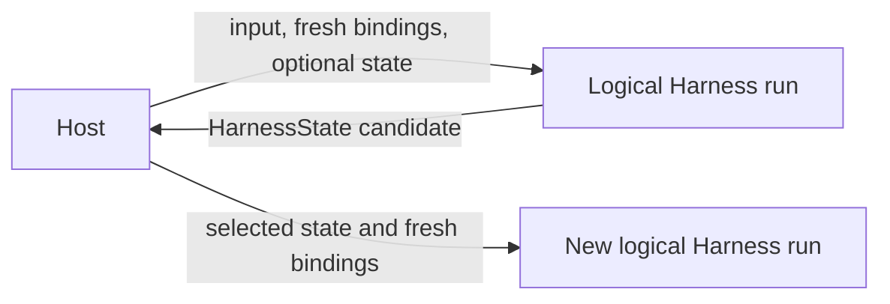

# Harness State and Resume

## Design Position

`HarnessState` is the complete portable continuation value understood by the process-local Harness. It contains only:

- detached public Pydantic AI message history;
- detached JSON state namespaced by stable Capability ID;
- optional portable Environment backend state under one explicit aggregate field.

It contains no executable definition, plugin object, model, Toolset, provider client, Environment binding, desired topology, provider launch state, current authority, usage ledger, event log, Host execution record, lease, queue, or delivery state. A Host may persist the value or embed it in a larger durable record, but the Harness does not choose or commit a durable checkpoint.

Resume creates a new logical Harness run with fresh `RunBindings`. State preserves conversation, explicitly stored Capability data, and provider-defined portable data for already authorized bindings; it never restores authority, topology, or a live Python resource.



## State Schema

```python
class CapabilityState(BaseModel):
    version: str
    data: JsonValue


class AgentContextStateSnapshot(BaseModel):
    entries: dict[str, CapabilityState]


class HarnessState(BaseModel):
    schema_version: Literal["1"] = "1"
    message_history: tuple[ModelMessage, ...] = ()
    agent_context_state: AgentContextStateSnapshot = (
        AgentContextStateSnapshot()
    )
    environment_state: EnvironmentState | None = None
```

`HarnessState` and its nested values are frozen detached envelopes. Pydantic message history is round-tripped through `ModelMessagesTypeAdapter`; Capability and Environment payload data are round-tripped through Pydantic `JsonValue`. Public accessors decode fresh copies, so mutable aliases do not cross the state boundary.

`schema_version` versions only the Harness envelope. `environment_state` is optional with a default of `None`, so an existing schema-version-1 value without that field remains valid. Each Capability entry has an independent non-blank version owned by that Capability's codec; each Environment binding entry has an independent provider-owned codec version. [Environment Integration](08-environment-integration.md#environment-state) owns its schema and authority boundary.

## AgentContextState

`AgentContextState` is the run-local mutable coordinator:

```python
class AgentContextState:
    async def read[T: BaseModel](
        self,
        capability_id: str,
        state_type: type[T],
        *,
        version: str,
    ) -> T | None: ...

    async def write(
        self,
        capability_id: str,
        value: BaseModel,
        *,
        version: str,
    ) -> None: ...

    async def snapshot(
        self,
    ) -> AgentContextStateSnapshot: ...
```

A read validates the requested namespace, exact entry version, and the owning Pydantic state model. A write atomically replaces one namespace with detached JSON. A snapshot atomically copies all namespaces.

The coordinator does not maintain a Capability registry and does not reject an entry merely because no active Capability reads it in the current run. Unknown or transferred namespaces remain opaque and survive snapshotting. This permits trusted plugin handoff, optional Capability removal and reintroduction, and Host-controlled state migration without a second global codec system. A Capability accepts a namespace only by reading it through its own expected ID, version, and model.

Namespace isolation is a composition convention backed by the typed API, not a sandbox against trusted Python. A trusted plugin or Capability can intentionally replace another entry or the complete `HarnessState`; the Harness does not enforce provenance or ownership allowlists.

## Export

`AgentContext.export_state(message_history)` combines a detached message sequence with the current `AgentContextState` snapshot and a fresh aggregate Environment export:

```python
async def export_state(
    self,
    message_history: Sequence[ModelMessage],
) -> HarnessState: ...
```

The method can await provider-defined portable Environment-state collection but performs no persistence side effect. It linearizes that collection with topology publication, so the Environment value identifies one complete observed topology version rather than a mixture of binding sets. The Environment aggregate enforces its captured entry-count, canonical per-binding and aggregate encoded-byte, and deadline limits before returning; timeout, cancellation, provider failure, invalid JSON, or oversize fails the complete export rather than silently dropping a binding. `HarnessRunStream.export_state()` selects the latest complete message view owned by the stream and delegates to this method.

State export does not require `HarnessState.message_history` to equal a result object's private message view. Normal inner execution produces aligned values, but trusted result middleware may intentionally transfer or replace state. Structural validity is enforced; semantic provenance is part of the trusted plugin contract. A plugin that replaces `environment_state` remains trusted code but cannot make the value authorize or construct a binding on resume.

## Complete Message Boundaries

The Harness stores only public Pydantic `ModelMessage` values. It never serializes partial stream deltas or private graph nodes.

| Time                               | Exported messages                                                              |
| ---------------------------------- | ------------------------------------------------------------------------------ |
| Before first inner attempt         | Imported message history                                                       |
| During model or tool work          | Latest complete public message view exposed by `AgentRunEvents`                |
| Between semantic recovery attempts | Normalized interrupted history used by the next attempt                        |
| At completion or deferred output   | `AgentRunResult.all_messages()`                                                |
| After normalized cancellation      | Complete messages supplied by `RunCancelled` or the latest observable boundary |

A new semantic continuation prompt is input to the next attempt, not retroactively inserted into an earlier completed message.

## Interrupted History Normalization

Recovery normalizes only a terminal message explicitly marked `state="interrupted"`.

If the tail is an interrupted `ModelResponse`, the Harness appends one `ModelRequest` containing failed `ToolReturnPart` values for tool calls that have no recorded result. If the tail is an interrupted `ModelRequest`, the Harness finds the preceding response and appends missing failed tool returns to that request. Existing `ToolReturnPart` and `RetryPromptPart` results remain authoritative and are not duplicated.

Each synthesized failed result says:

> No tool result was recorded because execution was interrupted. The operation may have partially or fully completed. Check the current state before deciding whether to retry it.

This transformation closes the public conversation shape. It does not claim that the external operation failed, did not execute, rolled back, or is safe to repeat.

No normalization occurs for ordinary complete history or for a provider-suspended response. Provider-suspended continuation remains native Pydantic behavior.

## Import and Resume

A new run receives `previous_state` separately from fresh `RunBindings`. Stream construction deep-copies the supplied state. Entry then:

1. binds and enters the new Environment from fresh Host authority, publishing its initial topology while the paired controller remains non-active;
2. restores a present `environment_state` only into compatible, already selected bindings;
3. activates the controller after successful restore or confirmation that no Environment state was supplied;
4. invokes the optional `RunInputFactory` against that entered Environment;
5. creates one `AgentContextState` initialized from the imported Capability snapshot;
6. creates the fresh `AgentContext` and plugin graph;
7. passes imported messages to the first Pydantic attempt;
8. lets each Capability read and validate only the namespaces it understands.

Environment restore finishes before controller activation and input production, never overlaps `apply()`, and never creates a binding, chooses topology, consumes Host launch state, or grants access. An unmatched saved binding is ignored with a bounded diagnostic; an incompatible selected binding fails according to the Environment codec contract. The Harness does not require every Capability entry to be consumed before model work. A stateful Capability that requires validation before its own behavior must perform that validation in its Pydantic lifecycle or before invoking the dependent operation.

Identity, policy, credentials, model resolution, Environment authority, topology, tool grants, provider sessions, and Host ownership always come from fresh trusted bindings. Message metadata, Capability state, and portable Environment state grant none of them.

Omitting new input is valid when the selected message history is sufficient for native Pydantic continuation. Supplying deferred tool results uses Pydantic AI's own input contract and the exact pending call or approval correlation owned by the integrating Host.

## Host Durable Envelope

A Host can store additional facts beside `HarnessState`:

```python
class HostExecutionState(BaseModel):
    harness: HarnessState
    definition_revision_ref: str
    launch: HostLaunchState
    pending_delivery: HostDeliveryState | None
```

This is an ownership illustration, not a Harness API. Definition selection, desired Environment topology, Attempt generation, artifact locks, provider provisioning and attachment, provider launch-state codecs, client-tool pending state, asynchronous child lifecycle, and delivery fencing remain Host-owned. `HostLaunchState` is separate from `HarnessState.environment_state`: the former makes a provider resource reachable, while the latter can restore only portable backend-local data after fresh reachability and authority already exist.

The Harness does not define or require a provider route pin. Provider-specific continuation facts that are not public Pydantic messages belong to the selected model integration or Host envelope, not to a generic Harness schema.

## External Effects

State export records observations; it does not make a side effect exactly once. An operation with no authoritative result remains unknown. Resume policy must inspect provider or Environment state before repeating a side-effecting action unless the provider offers a matching idempotency or reconciliation contract.

## Compatibility

Four compatibility axes remain independent:

| Axis                              | Owner                |
| --------------------------------- | -------------------- |
| Harness envelope version          | Harness              |
| Pydantic message codec            | Pydantic AI          |
| Capability entry version          | Owning Capability    |
| Environment binding-state version | Environment provider |

Invalid messages, unsupported envelope versions, blank namespace IDs or versions, and invalid Capability or Environment payloads fail without mutating the supplied value. A Host that changes process-local Agent composition or provider integration decides whether to retain, migrate, or remove incompatible opaque data before resume.

## Boundaries

| Concern                                            | Owner                          |
| -------------------------------------------------- | ------------------------------ |
| Envelope, detached encoding, and state coordinator | Harness                        |
| One Capability namespace and semantic migration    | Owning Capability              |
| Environment aggregate and per-binding codec        | Harness core and provider      |
| Trusted complete-state transformation              | Harness plugin or Host adapter |
| Durable selection, launch, retention, and fencing  | Host                           |
| External effect reconciliation                     | Provider and Host              |

## Trade-offs

### Opaque Namespace Preservation vs. Active-set Validation

Preserving unknown namespaces supports code-first composition, plugin handoff, and independent Capability evolution. The Harness cannot claim that every stored entry was produced or accepted by the current Agent; only the owning typed read establishes that fact.

### Portable Continuation vs. Durable Recovery

Messages, Capability JSON, and optional portable Environment JSON remain process-portable. Complete crash recovery still needs Host definition, desired topology, provider launch, pending-delivery, and reconciliation state outside the Harness.
