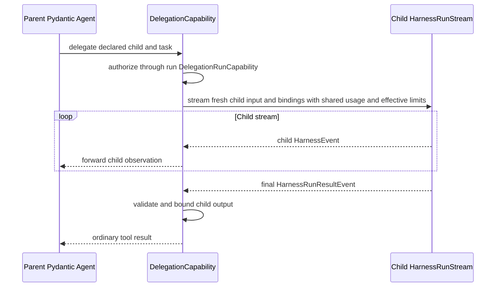
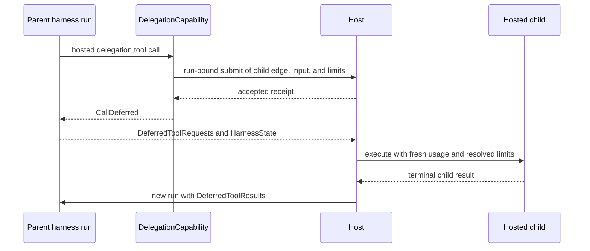

# Delegation and Subagents

## Design Position

Subagents are declared as child Agent definitions. `DelegationCapability` contributes the delegation Toolset and coordinates context transfer, while one fresh run-scoped `DelegationRunCapability` authorizes the resolved edge and supplies child authority. The child dispatches either inline through the same Harness API or to a host through Pydantic deferred-tool semantics.

There is no separate subagent Agent builder, graph loop, hook set, event queue, or Capability inheritance mechanism.

## SubagentDefinition

```python
class SubagentDefinition(BaseModel):
    name: str
    description: str
    agent: AgentDefinition
    execution: Literal["inline", "hosted", "either"] = "inline"
    context: DelegationContextPolicy = DelegationContextPolicy()
    usage_limits: UsageLimits | None = None
```

The materialized parent contains a unique finite set of named, complete child Agent definitions. Each child has its own model, instructions, output, and Capabilities, and its `AgentSpec.output_schema` is the delegation result contract. Repeating parent configuration through inheritance flags is avoided.

Before Harness build, the Host recursively resolves every child model, native tool and Toolset, permitted custom Capability type, reentrant build Capability instance, output type, and process-local provenance. It produces exactly one `ResolvedSubagentDefinition` for each authored edge, in authored order. The resolved declaration equals the parent's authored declaration, and the nested resolved definition's logical definition equals that declaration's `agent`; resolution cannot add, omit, replace, or mutate a child edge. The resolved value carries the opaque `source_ref` required for `hosted` and `either` execution; the logical `SubagentDefinition` does not contain a process-local or Host submission reference. The Harness validates these equalities and the finite resolved graph and builds inline-capable child executables before the parent, but performs no registry lookup, Preset materialization, artifact selection, or provider resolution.

Run-specific Identity, Environment, policy, credentials, and hosted-submission authority come from the current run's `DelegationRunCapability`; `DelegationCapability` supplies the declared edge, requested input/context transfer, and limit ceiling. None is embedded as authority in the child definition or immutable executable. `usage_limits` declares native Pydantic limits for executions through this parent-child edge, but it cannot widen a host or delegation policy.

Built-in child roles are ordinary resolved child definitions. Self-like delegation is represented by a finite host-materialized child definition whose delegation surface is removed or explicitly narrowed.

Host resolution rejects unavailable child revisions or artifacts and produces the complete recursive build plan. Harness build rejects duplicate names, any authored/resolved edge mismatch, an absent resolved `source_ref` for a hosted-capable edge, an output type that is not schema-equivalent to the child definition, incompatible delegation result schemas, and structural definition cycles. The Harness does not resolve registry keys or recursively dereference an opaque reference.

## Delegation Tool

The default Toolset exposes one `delegate` tool over the children visible to the current run. Small definitions can select separate named tools as a presentation option without changing dispatch semantics.

```python
class DelegateInput(BaseModel):
    subagent: str
    task: JsonValue
    execution: Literal["inline", "hosted"] | None = None
```

The model selects only a declared name, task, and permitted mode. The Capability resolves the child definition, validates the task and result boundary, and applies policy before any child work starts.

Tool discovery can hide rarely used children while preserving their stable names. Discovery does not grant invocation authority.

## Child Run Binding

```python
class DelegationContextPolicy(BaseModel):
    include_task: bool = True
    history: Literal["none", "summary", "selected"] = "none"
    share_working_state: bool = False


class DelegationRunCapability(AbstractCapability[AgentContext]):
    async def bind_inline(
        self,
        child: ResolvedSubagentDefinition,
        input: RunInput,
        usage_limits: UsageLimits,
    ) -> RunBindings: ...

    async def submit_hosted(
        self,
        child: ResolvedSubagentDefinition,
        input: RunInput,
        usage_limits: UsageLimits | None,
    ) -> HostedDelegationReceipt: ...
```

This is a conceptual public Capability contract, not a wire schema. It has one Harness-reserved Capability ID and can enter only through fresh `RunBindings.capabilities`. Run assembly recognizes it with an explicit type check and rejects duplicates before model or tool work. Omitting it is valid for an Agent that never delegates, but any delegation attempt fails closed before child dispatch. It cannot enter `ResolvedAgentComponents`, be created from model-authored `CapabilitySpec`, or be recovered from `HarnessState`.

The run Capability evaluates the exact resolved edge against the current parent `AgentContext.instance` and Host policy. For inline execution, `bind_inline()` returns a complete fresh `RunBindings`: a new `AgentInstanceContext` with parent/delegation lineage, a new single-use `EnvironmentRunBinding`, an independently selected optional `ClientToolRunBinding`, and narrowed run Capabilities. It cannot return the consumed parent binding, implicitly copy the parent's client-tool surface, or copy authority-bearing Capability instances. The child exposes client-side tools only when its own definition enables the Client Tools Capability and the Host deliberately selects a fresh attachment. The `DelegationCapability` creates bounded child input under `DelegationContextPolicy` and passes the stricter effective limits; the provider can reject the request but cannot widen its input or limit ceilings.

For hosted execution, `submit_hosted()` is the current run's `HostedDelegationAdapter` surface. Acceptance records the resolved edge reference, bounded input, requested child instance/lineage, and usage limits under Host authority; it does not carry a reusable parent Environment, client connection, client-tool attachment, or other binding into durable state. When the Host starts an attempt, it reauthorizes the child and creates another complete fresh `RunBindings` from current Identity, Environment, permitted client-tool surface, policy, credentials, and provider state.

The host policy chooses:

- whether the child uses the same workload Identity or an authorized child Identity;
- which fresh Environment binding and mounts are available;
- narrowed tool, credential, and budget authority;
- which parent messages or summary become child input;
- which fresh run-specific Capabilities are injected.

The child always receives a fresh `AgentContext`. Live Capability objects, credentials, provider handles, mutable message lists, and event queues are never copied implicitly. Inline delegation explicitly passes the parent's Pydantic `RunUsage` accumulator; hosted delegation does not share live usage state. An embedded application supplies a local `DelegationRunCapability` with an explicit child binding factory when it enables delegation; `RunBindings.local()` does not silently derive child filesystem, shell, or provider authority.

## Child Usage Limits

For inline execution, `DelegationCapability` resolves the child's effective `UsageLimits` as a field-by-field stricter intersection of the parent's effective limits, an explicit `SubagentDefinition.usage_limits`, and the current host or delegation policy. An omitted child declaration adds no child-specific override, so the child inherits the parent's effective limits. Each supported numeric ceiling uses the smallest non-`None` value; `None` adds no constraint for that field. `count_tokens_before_request` is enabled when any input requires it. The resolved value is passed to the child's `ExecutableAgent.stream()` call, and Pydantic AI remains responsible for checking it.

Because an inline child also receives the parent's live `RunUsage`, Pydantic AI evaluates cumulative request, tool-call, token, and cost limits against the aggregate visible at that run's own check boundaries. Such a limit is not a child-local delta allowance: in sequential execution, a child `request_limit` of ten blocks its next checked request once the shared parent-and-descendant request count has reached ten. `per_request_input_tokens_limit` remains a local ceiling for each individual request rather than a cumulative tree limit.

A shared `RunUsage` is an accumulator, not an atomic budget coordinator. Concurrent inline runs can pass their local checks before either updates the aggregate, and an enclosing delegation tool call can be counted after its child completes. Native `UsageLimits` therefore constrain inline runs using current shared usage but do not guarantee a hard tree-wide ceiling under parallel or nested execution. A deployment that requires strict aggregate admission must serialize or reserve budget through host policy; that coordination is outside the base Harness usage contract.

A hosted child starts with fresh `RunUsage` and no inherited parent-run limits. When `SubagentDefinition.usage_limits` is omitted, the hosted run starts from Pydantic AI's effective `UsageLimits()` defaults; an explicit `UsageLimits` object uses its exact field values, so an explicit field value of `None` can disable that native field default. The host may only narrow that effective value under current policy and passes the result as `usage_limits` when it starts the child run. Parent cumulative usage is not restored into the hosted child; any durable cross-run or lineage budget is independently enforced and aggregated by the host.

## Inline Execution

Inline execution calls the same `ExecutableAgent.stream()` path used for streamed root Agents. `DelegationCapability` is the child stream's sole consumer.



Native parent run cancellation cancels and drains the active delegation tool task; that task closes the live child `HarnessRunStream`, whose underlying `AgentRunEvents.aclose()` cancels and drains the child run. Child output is validated and bounded before it enters the parent tool result. Raw child exceptions and message history are not returned to the model. The child receives the effective Pydantic `UsageLimits` resolved for this delegation edge.

Parent and child events use separate run IDs and Agent instance lineage. `DelegationCapability` forwards child `HarnessEvent` values into the parent run stream but consumes the child's terminal result internally to produce the parent tool result. It passes the parent's live `RunContext.usage` to the child stream, so the root result accumulates model usage and tool-call counts from the complete inline descendant tree. The child result contains a cumulative terminal snapshot rather than a child-only delta; child-correlated Pydantic messages and telemetry retain per-request attribution.

## Inline Crash Boundary

An inline child is part of its parent delegation tool call, not an independently durable execution. The base Harness does not publish or retain a parent checkpoint while that tool call or any sibling in the same Pydantic tool batch remains incomplete. Pydantic keeps completed results for an active batch outside public parent message history until the complete batch forms the next `ModelRequest`; exporting only the unresolved parent response would therefore lose sibling results and could replay side effects on resume.

Each inline delegation call consequently creates a fresh child run. A child-local checkpoint can be useful to the child host as an observation, but it is not inserted into parent `AgentContextState`, does not make the parent batch resumable, and cannot be selected to resume an unresolved parent tool call. After the entire parent tool batch completes, the ordinary parent checkpoint contains the child tool result together with every sibling result and needs no separate delegation state.

If the process stops during inline child work, recovery starts from the last complete parent boundary. The model request or tool batch after that boundary can run again, so ordinary provider idempotency and reconciliation rules apply. Work that requires independent crash recovery, durable waiting, or exactly correlated child retries uses hosted delegation and Pydantic deferred-tool results instead of adding a partial parent tool-batch ledger to the Harness.

This boundary also means a later call to the same declared child starts a new child instance. Long-lived named-child continuity is a host-managed or hosted-delegation feature rather than hidden state on an inline tool.

## Hosted Execution

`DelegationRunCapability.submit_hosted()` is the only hosted-submission adapter visible to the Harness. It uses `child.source_ref` as its host-owned submission key and may inspect the already resolved definition for validation; the Harness performs no lookup through that reference. For hosted and `either` edges, the source identifies the parent exact definition revision plus an immutable child path. The Host resolves the embedded child bytes and their transitive model-integration/artifact-lock slice from that parent revision, never from an independently evolving child revision. Successful submission means the host revalidated that closure, accepted responsibility, reauthorized the edge, and will enforce the submitted `usage_limits`; it does not mean the child started or completed. The delegation tool returns Pydantic AI `CallDeferred`, and the parent run ends with `DeferredToolRequests` plus ordinary `HarnessState`.

The host stores the association between the parent exact revision and child path, parent deferred tool-call ID, and child receipt. When the child reaches a terminal host outcome, the host starts a new parent run with the selected prior state and a Pydantic AI `DeferredToolResults` value. An `execution="either"` edge therefore uses identical child Agent bytes and dependency locks whether this invocation executes inline or hosted.

Hosted child state, queues, attempts, retries, waiting records, delivery, usage aggregation, and cancellation races remain host-owned and never enter the parent `HarnessState`. A hosted child starts with fresh `RunUsage` and the resolved submitted `UsageLimits`, or Pydantic AI's defaults when none was submitted; the host combines its terminal snapshot with parent and resumed-run records by run ID and lineage.



## Authority and Nesting

Every delegation is authorized from trusted parent Identity, child definition, task, requested mode, lineage depth, current native usage limits and host budget policy, and Environment request. Child authority is equal to or narrower than the policy result.

Nesting uses the same evaluation. There is no separate nesting policy language. A child cannot widen authority through prompt text, transferred messages, tool arguments, or state.

## Result and Failure

Inline and hosted child results use the child's Pydantic output contract and the same parent tool result normalization. Denial, cancellation, timeout, invalid output, and child failure become failed tool results or deferred outcomes, never synthetic success.

For a handled inline child failure, including `failure.code="usage_limit_exceeded"`, `DelegationCapability` raises the public `pydantic_ai.exceptions.ToolFailed` primitive with sanitized, bounded content. The parent therefore receives a failed delegation tool result without a raw child exception, traceback, or message history; the failure is neither returned as an ordinary successful value nor allowed to escape and fail the parent run directly.

| Failure                                                             | Result                                                                     |
| ------------------------------------------------------------------- | -------------------------------------------------------------------------- |
| Unknown child or disallowed mode                                    | Tool validation failure before dispatch                                    |
| Missing or duplicate run provider                                   | Fail-closed delegation error before child dispatch                         |
| Invalid or reused child binding                                     | Inline dispatch stops before child stream entry                            |
| Policy denial                                                       | Typed authorization failure                                                |
| Inline child failure                                                | Sanitized, bounded `ToolFailed` in the parent                              |
| Native usage limit exceeded                                         | Failed child result with terminal usage; inline projection is `ToolFailed` |
| Hosted child path, definition bytes, or dependency closure mismatch | Submission fails closed before a child Execution is accepted               |
| Hosted submission failure                                           | Tool failure with host retry classification                                |
| Hosted child terminal failure                                       | Deferred failure result on a later parent run                              |
| Child state incompatible on resume                                  | Parent resume fails before restarting child                                |

## Boundaries

| Concern                                                 | Owner                                               |
| ------------------------------------------------------- | --------------------------------------------------- |
| Child declaration, context shaping, and inline dispatch | Delegation Capability and Harness                   |
| Child Agent loop and native per-run limit checks        | Same Harness and Pydantic AI path as a root Agent   |
| Fresh child Identity, Environment, and run authority    | Run-bound `DelegationRunCapability` and Host policy |
| Inline-limit derivation                                 | Delegation Capability plus run provider             |
| Complete parent tool-batch checkpoint boundary          | Pydantic AI and Harness                             |
| Hosted limit narrowing, lifecycle, and delivery         | Host                                                |

## Trade-offs

### Complete Child Definitions vs. Inheritance Flags

Complete materialized definitions make child behavior inspectable and reproducible. Shared authoring configuration is handled by the Host's typed [Agent and component Presets](../foundation-service/01-agent-definitions-and-presets.md) before definition-revision commit; the Harness receives no runtime template or inheritance system.

### Complete Parent Boundaries vs. Mid-child Recovery

Restarting from the last complete parent boundary can repeat inline work after process loss. Avoiding that replay would require a durable ledger for every completed sibling result in the active Pydantic tool batch, not only child state. The base Harness deliberately omits that partial-batch mechanism; callers use provider idempotency for ordinary inline work and hosted delegation when the child itself needs durable recovery.

### Pydantic Deferred Tools vs. Hosted Subagent Protocol

Pydantic deferred values cover suspension and later result injection. The host supplies durable scheduling and waiting semantics without becoming a Harness dependency.
