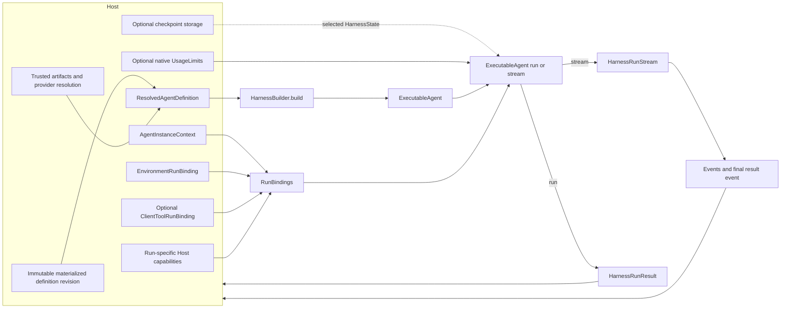
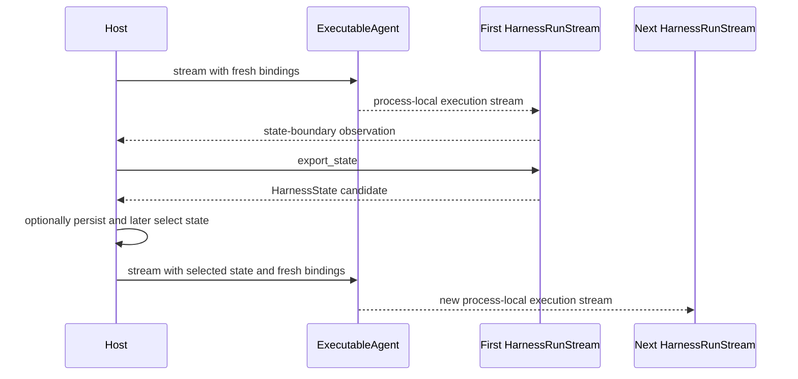

# Harness Hosting Contract

## Design Position

Embedded applications and hosted execution services use the same public Harness API. A code-first host materializes a process-local build plan from a native `AgentSpec`, while a hosted service selects an immutable materialized `AgentDefinitionRevision` and resolves it into the same `ResolvedAgentDefinition`. The hosting contract maps Host-owned definition, Identity, Environment, input resolution, active-run command, and persistence facts into Harness types; it does not add another execution API or wire protocol.

The canonical surfaces are:

- [`Public API and Packaging`](14-public-api-and-packaging.md) for `HarnessBuilder`, `ExecutableAgent`, `RunBindings`, `HarnessRunStream`, and `HarnessRunResult`;
- [`Execution Context and Lifecycle`](06-execution-context-and-lifecycle.md) for `AgentContext` and process-local results;
- [`Harness State and Resume`](10-snapshot-and-resume.md) for `HarnessState` and checkpoint candidates;
- [`Events, Observability, and Usage`](12-events-observability-and-usage.md) for the canonical event stream and native Pydantic usage semantics.

## Boundary

| Concern                                                        | Host                               | Harness                                             |
| -------------------------------------------------------------- | ---------------------------------- | --------------------------------------------------- |
| Caller and product authorization                               | Owns                               | Receives no caller authority                        |
| Definition source, Presets, revision, and artifact selection   | Owns and resolves                  | Consumes one materialized definition and build plan |
| Agent Identity, Environment, and permitted client-tool binding | Issues and selects                 | Consumes through `RunBindings`                      |
| Model and tool execution                                       | Supplies configured providers      | Runs Pydantic AI                                    |
| Events, `RunUsage` snapshots, and continuation state           | Selects persistence and projection | Produces                                            |
| Durable completion, retry, recovery, and delivery              | Owns                               | Reports process-local result only                   |

Host definition records, durable executions, attempts, queues, and scheduler records stay outside the harness. Opaque host correlation can be attached to `AgentInstanceContext` without transferring lifecycle authority.

## Mapping

### Definition Mapping

The hosted control plane first materializes inline or typed Preset input into one immutable definition revision as specified by [Agent Definitions and Presets](../foundation-service/01-agent-definitions-and-presets.md). The execution Host selects that revision, verifies its transitive dependency locks, dereferences complete child definitions, and resolves authority-neutral model-integration descriptors, any attested credential-free Model, plugin artifacts, trusted native tools and Toolsets, non-model-selecting build Capabilities, and deployment-specific providers. It assembles one recursive `ResolvedAgentDefinition` and passes that single plan to `HarnessBuilder.build()`; authored and resolved child edges correspond exactly, hosted-capable child declarations carry their own resolved edge references, and every resolved output type is schema-equivalent to its durable output schema.

A Python application can instead call `build_code()` with a native `AgentSpec`, explicit output type, Harness-specific Environment or child declarations, and at most one optional `ResolvedAgentComponents` bundle. This call materializes the same definition and build path. Advanced embedded composition can construct `ResolvedAgentDefinition` directly. Neither path bypasses multi-Environment binding, Identity, state, tool dispatch, or result semantics.

Preset source, definition revision, dependency locks, and plugin version metadata remain opaque Host data. The Harness uses `definition_id` for logical correlation and leaves durable revision selection and semantic compatibility policy to the Host. `Agent.from_spec()` validates and constructs upstream Agent behavior after Host resolution; it does not interpret the Host revision or Preset source. For a hosted node whose concrete Model remains run-bound, build uses `defer_model_check=True` and executable entry skips native `Agent.__aenter__()` so ambient inference cannot run before the reserved integration Capability is bound.

### Run Mapping

For each execution, the host creates a new `AgentInstanceContext` or intentionally preserves one for continuation, composes a single-use `EnvironmentRunBinding`, optionally supplies a `ContentResolver`, optionally selects a `ClientToolRunBinding`, optionally binds an immutable `ModelCostCalculator`, and supplies run-specific Capabilities as `RunBindings`. For every hosted node with a logical model, those Capabilities contain exactly one instance matching its `ResolvedModelIntegration` reserved type and ID. That integration Capability is the sole model resolver, receives current policy, credentials, and any validated continuation route pin, and returns an allowed native Model or raises; arbitrary resolver delegation, `get_model()` contribution, explicit run-model override, and ambient inference are prohibited. The run set also contains the reserved `DelegationRunCapability` when child dispatch is allowed. A client-tool binding is accepted only through the materialized Client Tools Capability's explicit whole-run replacement policy; it contains schemas, not handlers or authority, and cannot serve as a generic Toolset injection path. A process-local application can use `RunBindings.local()` while still selecting its explicit Environment and client-tool bindings and explicitly adding any local child-binding factory. The Harness allocates the run ID, binds and enters the Environment to obtain `AgentContext.environment`, resolves the fixed external client-tool surface, then creates the run-local event emitter, active-run bridge, and `ActiveRunCapability`. Native Pydantic `UsageLimits` are an optional direct run argument rather than a generic binding; live commands target the returned `HarnessRunStream`, not a binding.

`ExecutableAgent.run()` and `ExecutableAgent.stream()` allocate one process-local Harness run using the same canonical parameters. The Harness derives `AgentContext` from trusted bindings and resolved Capabilities; the host does not construct Pydantic AI `RunContext` directly. After Environment entry and state restore, an optional semantic `RunInputFactory` can create input from current Environment resources, then the configured resolver maps references. A top-level hosted call omits the optional `usage` argument and receives fresh `RunUsage`; explicit in-process composition can share one, and inline delegation does so automatically. The host may pass `usage_limits` to select Pydantic AI's native limits for the run, and omission uses the upstream defaults.

Host integrations remain typed `AbstractCapability[AgentContext]` instances rather than a generic Host-services object. Reentrant behavior whose possession grants no current-run authority can enter `ResolvedAgentComponents.capabilities`. The one locked model integration receives current-run Identity, policy, credentials, and any continuation route pin through its fresh run Capability. That Capability and the run Capabilities for checkpointing, invocation policy, credential brokerage, child binding, hosted-submission authority, telemetry correlation, and every other execution-scoped or authority-bearing integration enter only through `RunBindings.capabilities`. The Host retains the typed instances and collaborators it constructs; Capabilities use Pydantic AI `RunContext.capabilities` for explicit run-bound dependencies.

For checkpointing, the host places a run-specific `CheckpointCapability` in `RunBindings.capabilities`. Its `CheckpointStore.save()` receives complete `HarnessCheckpoint` candidates. The locked model integration also receives a Host-owned route recorder; when a candidate ends in a provider-suspended response, the recorder must provide the exact non-secret target pin that the Host commits atomically with the candidate. A hosted service may wrap checkpoints with additional continuation state and apply its own ownership, concurrency, and fencing rules; an embedded application or CLI may use memory, file, or database storage directly. Environment state is already inside the Environment Capability entry. The host selects a reference and calls the same store's host-side `load()` before `run()` or `stream()`; the Capability never loads state implicitly.

### Output Mapping

`HarnessEvent` values and the terminal `HarnessRunResultEvent` share the canonical single-consumer `HarnessRunStream`. Pydantic `RequestUsage` remains attached to complete `ModelResponse` messages, one `ModelUsageObservation` preserves its stable run-local identity, source, and pricing coverage, the terminal result carries a cumulative `RunUsage` snapshot, and checkpoint candidates use their own typed collaborator. Receiving any observation does not imply that it was persisted or that a host lifecycle transition occurred. Foundation Service idempotently records each delivered usage observation and does not add a cumulative snapshot to those request records.

The host consumes the stream once and can persist, coalesce, or fan out events. Replay and delivery stay outside `HarnessRunStream`. A normal terminal event or `run()` return is emitted only after run-scoped teardown succeeds; `RunCleanupError` instead carries any primary outcome candidate under explicit host uncertainty policy. An inline root result already includes its inline descendant tree, although native checks over its shared accumulator are not an atomic tree-wide budget. A hosted child starts a fresh accumulator with the submitted child `UsageLimits` or Pydantic AI's defaults, narrowed if required by host policy. Cumulative snapshots are useful process-local observations but overlap; durable per-run, Attempt, Execution, and lineage estimates aggregate distinct response observations instead. The process-local result is candidate input to host completion logic rather than a durable completion fact.

## State and Resume Mapping

The host stores and selects `HarnessState`; the Harness validates its envelope and messages and installs Capability entries for owner acceptance. State contains message history and recoverable Capability namespaces. A hosted service binds every selected state to one fenced Attempt and commits checkpoint selection under the [Durable Execution Lifecycle](../foundation-service/03-execution-lifecycle.md); a stale worker cannot advance it. Identity, Environment topology, provider clients, client-executor authorization, and host Capabilities are rebound on every run. Before constructing the binding, the Host gives any separately persisted adapter lifecycle record to a backend that needs vendor attachment or daemon reachability; a direct-local backend normally needs no such record. For a pending external client call, it separately selects the exact frozen client-tool attachment that produced the call; that attachment is Host launch/continuation state, not `HarnessState` or Environment state. When history ends in a provider-suspended response, the Host likewise selects the exact model route pin committed with that checkpoint and gives it only to the same locked integration; missing or unrecoverable target state fails continuation without rerouting. Harness preparation then binds and enters `EnvironmentRunBinding`, uses the Environment Capability codec to restore only compatible backend-local state before any input factory, and withholds other pending entries from that factory. Their owners accept them on first iteration before model or tool work. The new `HarnessRunStream` creates a fresh `AgentRunEvents` wrapper and run-local bridge. Live `RunContext`, pending enqueue content, cancellation state, and safe-pause requests are never restored. Usage starts fresh and is not restored from state.

Fork uses the same mapping with host-selected derived input and authority. Durable state lineage and fork identity remain host concerns.

## Dynamic Environment Mapping

A host that supports live mounts selects the complete initial `EnvironmentTopologyRequest` before stream entry and retains the `EnvironmentTopologyController` paired with its single-use `EnvironmentRunBinding`. Stream entry initializes requested providers and publishes the resulting observed `EnvironmentTopology` through `BoundEnvironment`. While the Pydantic run is active, the host resolves changed durable mount records and provider inputs, then submits one complete monotonic request containing no caller-supplied descriptor. The controller prepares and initializes new providers, derives descriptors and effective ceilings, and atomically publishes the new snapshot without exposing mutation to the Agent. It rejects pre-start and post-terminal updates; after teardown, the host resolves its persisted desired request into a fresh binding and controller rather than reusing the closed handle.

The Environment Capability observes a successful update, emits the Harness context event, and delivers a coalesced model notice through native enqueue at the user-content suffix. The host does not modify Toolset instructions, rebuild tool schemas, or reach into private binding collections. Host persistence of topology version, mount records, command acceptance, and retries remains separate from the process-local change receipt.

## Control Mapping

Live steering, cooperative safe pause, and cancellation target `HarnessRunStream`, the only public active-run control facade. The host decides which live run receives a command and what happens when no eligible process exists. A hosted API authenticates, authorizes, durably accepts, and routes a command before invoking that process-local facade; those host steps are not Harness control state. Foundation Service uses the stable acceptance, fixed-Attempt steering, command-receipt, and event-replay rules in [Execution API and Durable Events](../foundation-service/04-execution-api-and-events.md).

Steering calls the stream's `enqueue()` wrapper and ultimately the bound Pydantic AI `RunContext.enqueue()`; cancellation calls the stream's `cancel()` wrapper and ultimately `AgentRunEvents.cancel()`. The wrappers may perform Harness lifecycle checks, content policy, safe correlation, event adaptation, result normalization, and cleanup, but they do not reproduce the upstream pending queue, background event task, cancellation token, or task cancellation logic. Pydantic AI enqueue correlation reports when steering enters process-local history. Host receipt, durable acceptance, client acknowledgement, and model response are separate observations.

Safe pause ends the process at a complete boundary with `HarnessState` committed before native `RunContext.cancel()`, allowing the wrapper to distinguish its resulting `RunCancelled` from explicit cancellation. [Execution Context and Lifecycle](06-execution-context-and-lifecycle.md#steering-safe-pause-and-cancellation) owns the boundary and race rules. Pydantic's pending-message queue is not continuation state.

An enqueue ID and `EnqueuedMessagesEvent` are process-local observations, not a durable delivery transaction. Injection can complete before suspension or cancellation while the host loses the corresponding event, so absence of an observed event never proves non-delivery. The base Harness does not automatically resubmit. The host treats the outcome as unknown and reconciles its accepted command against any durably projected event, selected `HarnessState`, and configured incorporated-ID state. It resubmits only after establishing non-delivery or under an explicit at-least-once policy with duplicate suppression. The host maps the terminal result to its own handoff or recovery lifecycle; the Harness does not create a durable attempt or takeover record.

Deferred approvals and external tool results normally start a new run with host-selected state and Pydantic AI `DeferredToolResults`. External client calls use the exact pending `.calls` collection and frozen client-tool attachment; approval decisions use `.approvals`, and neither category can satisfy the other. Foundation Service persistence, authenticated delivery, and idempotent result fencing are defined by [Client-Side Tools](../foundation-service/02-client-side-tools.md). Hosted delegation submission enters only through the parent run's `DelegationRunCapability`; when the child attempt starts, the Host reauthorizes the edge and creates complete fresh child `RunBindings` rather than restoring or reusing parent Environment, client-tool, or other authority. The hosting layer does not keep a suspended Python task alive.

## Embedded and Hosted Profiles

An embedded host can use `build_code()`, native string or `Sequence[UserContent]` input, `RunBindings.local()`, a no-operation, direct-local, EIP-backed, or mixed multi-binding Environment, optional custom model pricing, and result convenience methods without defining hosted records. It can consume the run stream directly and explicitly share one `RunUsage` accumulator across an in-process Agent composition. Durable state and distributed control are optional.

A hosted execution service maps its resources into the same definition, bindings, state, stream, result-usage, and Capability interfaces. Those resources remain opaque; `agent-harness` imports no host lifecycle types.

The difference between the profiles is host implementation, not harness execution semantics.

## Compatibility

Compatibility is evaluated independently for the public Python API, Pydantic AI public surface, capability state codecs, message codecs, plugin packages, and EIP versions.

The host selects a mutually compatible set before build or resume. Additive descriptive fields can use defined defaults; unknown authority or state semantics stop the affected mapping before model or tool work.

## Trade-offs

- Reusing the public API avoids a second hosting abstraction, while each host supplies its own orchestration.
- Opaque host correlation preserves embedded portability but limits harness inspection of host lifecycle.
- Fresh bindings on every run avoid serialized live authority at the cost of rebinding providers during resume.

## Invariants

1. Embedded and hosted execution Hosts use the same `ResolvedAgentDefinition`, `HarnessBuilder`, `ExecutableAgent`, `HarnessRunStream`, and `HarnessRunResult` contracts; code-first values materialize the canonical definition and build plan.
2. The hosting specification defines mappings, not duplicate run, context, state, or result schemas.
3. Each `run()` or `stream()` call creates at most one process-local run; a stream starts on first iteration.
4. The host owns durable lifecycle, retry, recovery, and delivery.
5. Harness events and results remain observations until the host accepts them.
6. Hosting compatibility depends only on documented public contracts.
