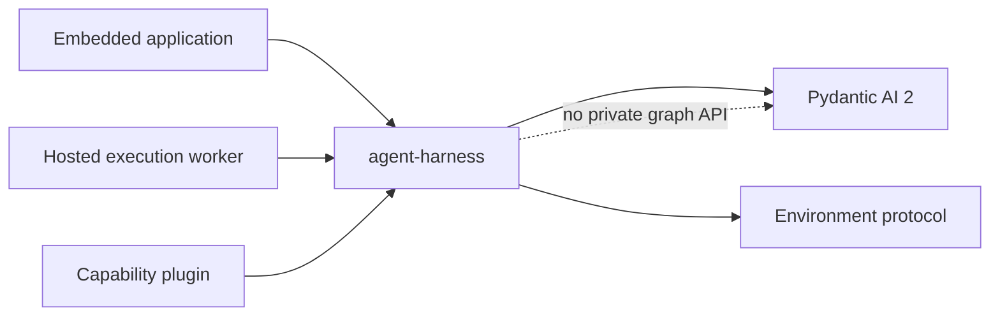
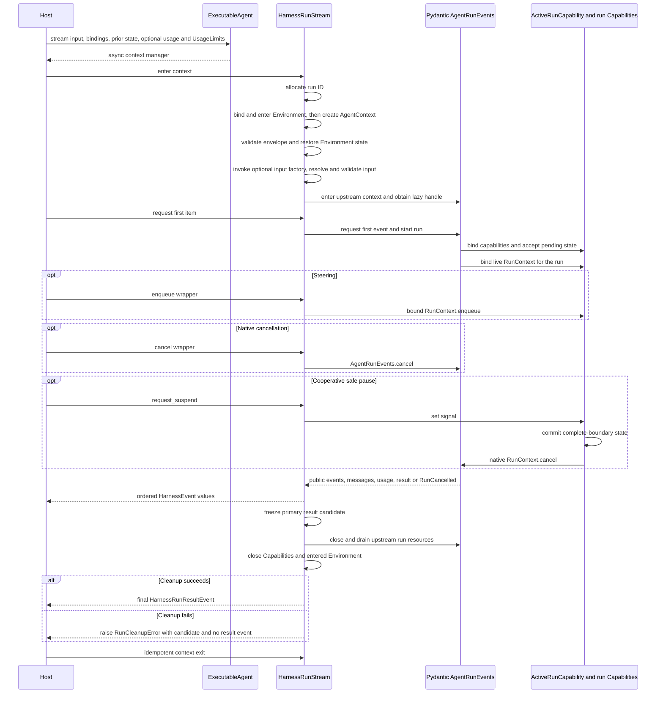

# Public API and Packaging

## Design Position

The `agent-harness` component is distributed as `converge-agent-harness` and exposes one async Python API for embedded applications and hosted execution workers. It builds a Pydantic AI Agent from one process-local `ResolvedAgentDefinition`, while the code-first convenience materializes the same plan from a native `AgentSpec`. Every execution creates a fresh `AgentContext` and returns process-local events, output, usage, and continuation state. Code-first conveniences retain the same definitions, bindings, input, and result semantics rather than forming a second runtime.

Pydantic AI public types remain public when they already express the required semantics.



## Public Namespaces

| Namespace                             | Public surface                                                                                                                                                                  |
| ------------------------------------- | ------------------------------------------------------------------------------------------------------------------------------------------------------------------------------- |
| `converge_agent_harness.definition`   | `AgentDefinition`, Environment requests, `ResolvedAgentComponents`, `ResolvedAgentDefinition`, `ResolvedSubagentDefinition`, `ResolvedDefinitionRef`, and subagent declarations |
| `converge_agent_harness.execution`    | `HarnessBuilder`, `ExecutableAgent`, `HarnessRunStream`, `HarnessRunResult`, `RunBindings`, `ClientToolRunBinding`, `AgentContext`                                              |
| `converge_agent_harness.input`        | `NativeRunInput`, `RunInputValue`, `RunInput`, input parts, `RunInputFactory`, preparation, and content resolution                                                              |
| `converge_agent_harness.identity`     | `AgentIdentityRef`, `AgentInstanceContext`, delegation lineage                                                                                                                  |
| `converge_agent_harness.environment`  | `EnvironmentRunBinding`, `BoundEnvironment`, topology snapshots and controller, paths, descriptors, and state                                                                   |
| `converge_agent_harness.tools`        | `HarnessTool`, managed-tool metadata and semantic types, client-tool declaration types, `ToolResourceResolver`, and `ToolInvocationContext`                                     |
| `converge_agent_harness.capabilities` | Mandatory first-party Capabilities, deny/local invocation-policy providers, and common Capability helpers                                                                       |
| `converge_agent_harness.plugins`      | `CapabilityPlugin`, `ResolvedCapabilityCatalog`, discovery adapters                                                                                                             |
| `converge_agent_harness.state`        | `HarnessState`, `HarnessCheckpoint`, `CheckpointStore`, `AgentContextState`, `CapabilityState`, `EnvironmentState`                                                              |
| `converge_agent_harness.events`       | `HarnessEvent`, `HarnessRunResultEvent`, `HarnessEventEmitter`                                                                                                                  |
| `converge_agent_harness.errors`       | `HarnessError`, `RunCleanupError`, `SafeFailure`, stable categories, and safe failure normalization                                                                             |
| `converge_agent_harness.testing`      | In-memory bindings, deterministic models, stores, and Capability assertions                                                                                                     |

Capability authors import `AbstractCapability`, Toolsets, messages, models, deferred values, events, and usage types from `pydantic_ai`. The Harness does not re-export parallel aliases for the upstream extension API.

## Build API

```python
class HarnessBuilder:
    async def build(
        self,
        definition: ResolvedAgentDefinition,
    ) -> ExecutableAgent[Any]: ...

    async def build_code[OutputT](
        self,
        agent: AgentSpec,
        *,
        output_type: OutputSpec[OutputT],
        components: ResolvedAgentComponents | None = None,
        definition_id: str | None = None,
        source_ref: ResolvedDefinitionRef | None = None,
        environment: EnvironmentRequest | None = None,
        subagents: Sequence[SubagentDefinition] = (),
    ) -> ExecutableAgent[OutputT]: ...


class ExecutableAgent(Protocol, Generic[OutputT]):
    definition: ResolvedAgentDefinition

    async def run(
        self,
        input: RunInputValue | None = None,
        *,
        input_factory: RunInputFactory | None = None,
        bindings: RunBindings,
        previous_state: HarnessState | None = None,
        usage: RunUsage | None = None,
        usage_limits: UsageLimits | None = None,
    ) -> HarnessRunResult[OutputT]: ...

    def stream(
        self,
        input: RunInputValue | None = None,
        *,
        input_factory: RunInputFactory | None = None,
        bindings: RunBindings,
        previous_state: HarnessState | None = None,
        usage: RunUsage | None = None,
        usage_limits: UsageLimits | None = None,
    ) -> AbstractAsyncContextManager[
        HarnessRunStream[OutputT]
    ]: ...

    async def __aenter__(self) -> Self: ...
    async def __aexit__(self, *exc_info: object) -> None: ...
    async def close(self) -> None: ...
```

`build()` accepts the complete immutable process-local plan produced after Host definition, Preset, provider, artifact, and trust resolution. Its `ResolvedAgentComponents` keeps the authority-neutral `ResolvedModelIntegration` descriptor, optional attested credential-free Model, native tools, Toolsets, custom Capability types, and reentrant non-model-selecting Host build Capabilities together. For every node in the finite child graph, the builder validates exact authored/resolved child correspondence and output-type/schema equivalence, combines those values with mandatory Harness Capabilities and the Capabilities constructed from `AgentDefinition.agent`, then calls `Agent.from_spec(..., deps_type=AgentContext, model=..., output_type=..., tools=..., toolsets=..., custom_capability_types=..., capabilities=..., defer_model_check=...)`. The defer flag is `True` exactly for a hosted node with a `ResolvedModelIntegration` and no attested concrete Model, so its logical ID cannot reach ambient inference before the required run Capability exists.

`build_code()` performs the code-first materialization defined by [Agent Definition and Build](03-agent-definition-and-build.md#code-first-materialization). It accepts one native `AgentSpec`, one typed output, and at most one process-local component bundle instead of reproducing separate model, tool, Toolset, and Capability configuration systems. Omitted `components` means that the spec and mandatory Harness core provide the build behavior. Advanced callers that need independently resolved child components construct a recursive `ResolvedAgentDefinition` and call `build()`.

`source_ref` remains optional opaque Host provenance for the root; each hosted-capable child carries an edge reference to the parent exact revision plus immutable child path so hosted submission uses the same embedded bytes and transitive lock closure as inline execution. `ExecutableAgent` is immutable after build and supports concurrent `run()` and `stream()` calls when all Agent-bound Capabilities and native build inputs follow their Pydantic reentrancy rules. Both methods use the same Agent construction, input, state, result, and cleanup semantics.

The executable is an async context manager, but its entry is model-resolution-aware. For each deferred hosted node described above, `__aenter__()` does not call upstream `Agent.__aenter__()`: the Agent-bound tree intentionally has no model resolver, and native entry would infer the logical ID before run bindings exist. The ordinary Pydantic run lifecycle instead enters the run-resolved Model and Toolsets after the locked resolver is bound. Nodes with an attested concrete Model and ordinary embedded nodes can use native Agent entry. `__aexit__()` calls the same idempotent `close()` that releases only resources actually entered and recursively owned inline child executables in reverse acquisition order.

## Run Bindings

```python
@dataclass(frozen=True)
class ClientToolRunBinding:
    toolsets: tuple[ClientToolsetDefinition, ...]


@dataclass(frozen=True)
class RunBindings:
    instance: AgentInstanceContext
    environment: EnvironmentRunBinding
    content_resolver: ContentResolver | None = None
    client_tools: ClientToolRunBinding | None = None
    model_cost_calculator: ModelCostCalculator | None = None
    capabilities: tuple[
        AbstractCapability[AgentContext],
        ...,
    ] = ()
    metadata: Mapping[str, JsonValue] = field(default_factory=dict)

    @classmethod
    def local(
        cls,
        *,
        environment: EnvironmentRunBinding,
        identity: AgentIdentityRef | None = None,
        content_resolver: ContentResolver | None = None,
        client_tools: ClientToolRunBinding | None = None,
        model_cost_calculator: ModelCostCalculator | None = None,
        capabilities: Sequence[
            AbstractCapability[AgentContext]
        ] = (),
        metadata: Mapping[str, JsonValue] | None = None,
    ) -> Self: ...
```

`RunBindings` is trusted host input. `environment` is a single-use host-composed `EnvironmentRunBinding`; during stream entry the Harness binds it to the allocated run ID and `instance`, enters it, and places the returned multi-binding `BoundEnvironment` on `AgentContext`. A one-binding or no-operation run binding is the simple case. The host retains its paired topology controller. `content_resolver` is the one optional core port needed before the Pydantic run for referenced input.

`model_cost_calculator` is the optional pure Host pricing seam. On the normal response path, the core usage-pricing Capability calls it after response transforms and before native Pydantic cost fill and accumulation; a finite non-negative USD amount overrides built-in pricing, while decline or failure falls back. Interrupted partial responses and hook short-circuits that bypass this seam keep provider or `genai-prices` cost and are explicitly observed as `custom_pricing_status="not_reached"`. The calculator receives no model content and is neither an `AgentContext` service nor persisted state. Foundation Service can bind an immutable selected catalog revision and retain both that revision and actual coverage with each durable usage record.

`client_tools` is the narrow per-run replacement surface for the first-party Client Tools Capability. Its typed declarations contain no handlers, callbacks, credentials, connections, or authority. If present, it replaces the Capability defaults only when the materialized Capability explicitly sets `allow_run_override`; otherwise run setup fails. The complete rules, upstream `ExternalToolset` mapping, deferred boundary, and non-inheritance semantics are owned by [Tool Execution](07-tool-execution.md#client-side-external-tools). There is deliberately no generic per-run `tools` or `toolsets` argument on `ExecutableAgent`: a Host cannot use this field to inject an in-process function tool, MCP client, Environment tool, or undeclared server behavior.

The Harness uses these values to create one `AgentContext`, an internal `HarnessEventEmitter`, a run-local active-run bridge, and the standard run-scoped Environment, event, usage-pricing, and `ActiveRunCapability` instances. For a hosted resolved node, `capabilities` must contain exactly one model-integration Capability matching the descriptor's concrete type and fixed ID; it is the sole model selector and either returns an allowed Model or raises. Any additional `resolve_model_id`, `get_model()`, or selected-Model replacement contribution fails setup. Other values cover authorization, credentials, child-binding and hosted-delegation authority, checkpointing, telemetry, or application behavior. Reserved run roles such as model integration, invocation policy, and `DelegationRunCapability` are recognized by explicit type and fixed ID; duplicates fail before model or tool work, and they cannot come from the immutable build plan. There is no generic control or services binding.

`RunBindings.local()` creates an embedded root `AgentInstanceContext` with process-local identifiers, no actor, and no host references. Because it is the explicit embedded convenience rather than the hosted profile, its caller can deliberately use ordinary Pydantic model contributors under the application's trust boundary. The caller still supplies the `EnvironmentRunBinding`, so this convenience does not hide single- versus multi-Environment composition or silently provision filesystem and shell authority. An optional model-cost calculator follows the same normal-path custom-first, explicit-coverage, and Pydantic-fallback behavior as an explicit binding. An optional `client_tools` value follows the same definition opt-in and whole-replacement rules as an explicit binding and still performs no client action in process. Like explicit bindings with no invocation-policy provider, the convenience installs the fail-closed `DenyManagedToolsCapability`; native unmanaged tools and external client tools retain their separate semantics. An embedded caller that wants managed Environment operations adds `LocalBoundEnvironmentPolicyCapability` to `capabilities`, scoped to the already supplied binding ceilings; broader managed tools require an explicit host policy provider. Delegation likewise requires an explicit local `DelegationRunCapability` and child-binding factory; the consumed parent Environment binding and client-tool binding are never reused implicitly. A caller that needs stable workload identity, durable continuation, actor provenance, or host correlation constructs `RunBindings` explicitly.

Binding values are core run ports or collaborators of Capabilities, not an alternate component lifecycle. They contain no model-authored authority.

## Run API

```python
type HarnessStreamItem[OutputT] = (
    HarnessEvent
    | HarnessRunResultEvent[OutputT]
)


class HarnessRunStream(
    Protocol,
    Generic[OutputT],
    AsyncIterator[HarnessStreamItem[OutputT]],
):
    run_id: str
    context: AgentContext

    @property
    def result(self) -> HarnessRunResult[OutputT] | None: ...

    @property
    def usage(self) -> RunUsage: ...

    async def export_state(self) -> HarnessState: ...

    async def enqueue(
        self,
        input: RunInputValue,
        *,
        priority: PendingMessagePriority = "asap",
    ) -> str: ...

    def request_suspend(self) -> None: ...

    def cancel(self) -> None: ...
```

`stream()` returns a single-entry async context manager containing one class-based `HarnessRunStream` over Pydantic AI `AgentRunEvents` from `Agent.run_stream_events()`. Context entry allocates the run correlation, binds and enters the Environment, creates `AgentContext`, validates the state envelope and messages, restores Environment state, invokes an optional `RunInputFactory` with restricted `RunPreparationContext`, resolves and validates the selected input, and enters the upstream stream context to obtain its still-unstarted event handle. Non-Environment Capability entries remain pending until their owners accept them on first iteration. This preparation performs no model or tool work. First `__anext__()` delegates to the upstream handle, which binds run Capabilities, verifies the reserved hosted model-integration role and rejects unrelated model contributors, validates pending state before model or tool work, starts the background run, and binds `ActiveRunCapability`. Entering and exiting without iterating can perform declared input preparation but never starts the Pydantic Agent run. The stream has one consumer, provides natural backpressure, does not replay events, and delegates fan-out to the host.

For a Harness-handled outcome consumed through its terminal boundary, the iterator adapts upstream `AgentStreamEvent` values, finalizes a result candidate and state, closes all run-scoped resources, and only then yields exactly one `HarnessRunResultEvent` before stopping. `result` is `None` until that terminal item has been yielded and then contains the same `HarnessRunResult`; context exit after it is idempotent. Leaving the context earlier delegates to `AgentRunEvents.aclose()`, which quietly cancels and drains a started run, then closes remaining run-scoped resources without synthesizing a result. A caller that explicitly requests cancellation and needs the normalized `cancelled` result continues consuming through the terminal item; cancellation of the consumer task itself keeps ordinary async cancellation semantics.

If teardown fails after a primary outcome was finalized, the iterator raises `RunCleanupError` before yielding a terminal event. The exception retains the immutable primary `outcome` candidate plus bounded cleanup diagnostics and protected causes; `HarnessRunStream.result` remains `None`. `run()` uses the same pipeline and raises the same exception. This preserves a validated output for host decision-making without falsely claiming a clean Harness terminal boundary. A host commits a normal result only after receiving the terminal event or return value; handling `RunCleanupError.outcome` is an explicit uncertainty policy.

`run()` executes the same pipeline while consuming its event stream internally and returns the terminal result directly. It is the convenience path for callers that do not observe events or issue live commands; callers that need enqueue, safe suspend, or normalized run cancellation use `stream()`. An immediate `input` and `input_factory` are mutually exclusive. Omitting both passes no new user content, matching Pydantic AI and allowing a host-selected message history to continue without inventing an empty prompt. Native `str | Sequence[UserContent]` is the code-first input form, while `RunInput` retains hosted provenance and reference semantics.

Before obtaining the lazy Pydantic event handle, both methods resolve the immutable effective client-tool surface from the definition and `RunBindings.client_tools`. A non-empty surface is passed through the native per-run `toolsets=` argument, any declaration-owned guidance uses the native per-run `instructions=` argument, and only that run's output type is widened with `DeferredToolRequests`; the public generic `OutputT` and configured successful output schema do not change. A client-tool selection therefore reaches the ordinary suspended result path rather than appearing as an invalid business output.

Both methods pass `usage` and `usage_limits` directly to Pydantic AI. Omitting `usage` creates a fresh `RunUsage`, while supplying it explicitly shares one in-process accumulator. Omitting `usage_limits` uses Pydantic AI's defaults; supplying it selects the native limits for this run. On responses that reach its normal hook, the core usage-pricing Capability applies `RunBindings.model_cost_calculator` before `RequestUsage` enters that accumulator. Every newly observed response with usage also emits one stable `ModelUsageObservation`, including explicit cost source and custom-pricing coverage; this observation never increments the accumulator.

### Active-Run Control

`HarnessRunStream` is the sole public active-run control facade. It privately wraps the public Pydantic AI `AgentRunEvents` handle; callers do not receive that handle, a `RunContext`, graph nodes, or private runtime state. `RunBindings` and `AgentContext` contain no parallel queue, cancellation token, or generic control service. Code already executing inside the Agent uses `RunContext.enqueue()` and `RunContext.cancel()` directly.

Pydantic AI's event handle deliberately exposes cancellation but not enqueue. Run assembly therefore includes the run-specific active-run bridge owned by [Execution Context and Lifecycle](06-execution-context-and-lifecycle.md#steering-safe-pause-and-cancellation). It connects the wrapper to native `RunContext` operations for the duration of the run, is invalidated before a terminal outcome is exposed, and never becomes an `AgentContext` field, persisted value, host service, queue, or cancellation token.

`enqueue()` is the only steering execution primitive. The async wrapper requires a bound active run, normalizes native `str | Sequence[UserContent]` or applies configured content resolution to steer-eligible `RunInput` parts, converts them to Pydantic `EnqueueContent`, and invokes the bound `RunContext.enqueue()` with the native `PendingMessagePriority`. The exact allowlist and all-or-nothing conversion are owned by [Input, Model, and Output Boundaries](16-input-model-and-output.md#live-enqueue-mapping); deferred tool results are rejected rather than assigned alternate steering semantics. The Harness owns no second pending-message queue. Because content resolution can outlive the run, enqueue and terminal transition are linearized immediately before the native append: terminal wins with `RunError(code="run_not_active")`, while enqueue wins with the upstream enqueue ID and delivery remains separately observable through a later Pydantic `EnqueuedMessagesEvent`. An observed event confirms process-local delivery, but its absence does not prove non-delivery across teardown or host projection races. Host receipt, wrapper acceptance, delivery, and a model response remain distinct observations. “Steering” names this use of enqueue; it is not another method or state machine.

`cancel()` invokes `AgentRunEvents.cancel()` directly; command authorization and durable correlation remain host concerns. Pydantic AI owns cancellation of the background run, in-flight model request, tool tasks, and supported server-side work. The Harness catches the resulting `RunCancelled`, uses its complete messages and usage to export the latest valid `HarnessState` and terminal snapshot, closes remaining resources, and emits the normalized `cancelled` result. It does not maintain a second cancellation token or independently race the same tasks. Native pre-start cancellation prevents execution from starting; repeated calls and calls after completion are no-ops. Because no `RunContext` is bound in the pre-start case, its normalized result has `state=None` and snapshots the Harness-owned `RunUsage` supplied to the pending run, preserving an existing shared accumulator rather than using the fresh zero usage carried by upstream pre-start `RunCancelled`. Input preparation and compatible state restore may already have occurred during context entry, but the prepared input never reaches Pydantic and imported state is not advanced. External cancellation of the consumer task remains ordinary `asyncio.CancelledError` and takes precedence.

`request_suspend()` is the one Harness-owned control operation because immediate cancellation is not safe pause. It may be requested after context entry, including before first iteration. A request during model or tool work waits for the complete tool batch, including inline children and parallel sibling tools. At the next complete boundary before a model request, the Harness exports state and uses native Pydantic cancellation to produce `status="suspended"` with `suspend_reason="host_pause"`. Completion or deferred `End` wins if no next model request exists; explicit cancellation wins if it takes effect before safe-pause commit. The detailed boundary and classification rules are owned by [Execution Context and Lifecycle](06-execution-context-and-lifecycle.md#steering-safe-pause-and-cancellation).

Before first iteration, `enqueue()` fails with `RunError(code="run_not_active")`, `request_suspend()` records a request for the first safe boundary, and `cancel()` delegates to native pre-start cancellation. After a terminal result, enqueue and safe suspend fail with `run_not_active` while cancel is a no-op. Enqueue and safe-suspend operations are serialized on the run's event loop; `cancel()` retains the upstream `AgentRunEvents.cancel()` concurrency behavior.

`usage` reports the live Pydantic `RunUsage`, including its best-effort USD `cost`. It starts at zero when the call omitted `usage`, or at the caller-supplied aggregate when one was provided. The terminal result stores a copy of the accumulator at that boundary, so later increments to a shared object cannot mutate an already returned result. Request-level messages retain model, provider, timestamp, token, and cost attribution; an aggregate cost can be partial when some requests remain unpriced. `CheckpointCapability` can publish complete boundaries automatically through its `CheckpointStore`.

`export_state()` is valid only while the stream context is entered and returns an immutable snapshot of the latest complete semantic boundary:

| Call time                                                 | Result                                                                                                               |
| --------------------------------------------------------- | -------------------------------------------------------------------------------------------------------------------- |
| Before first iteration                                    | Imported messages; refreshed Environment state; other imported entries preserved as pending; unconsumed input absent |
| During a model stream or tool batch                       | Last complete boundary, never partial deltas or in-flight effects                                                    |
| After a complete boundary                                 | That boundary, including any complete pending model request defined by the state contract                            |
| After terminal state is committed and before context exit | The exact terminal `result.state` when that result carries state                                                     |
| After context exit                                        | `RunError(code="run_not_active")`                                                                                    |

A fresh pre-start run therefore exports empty message history plus current Environment state and any newly created preparation-safe core state. A resumed pre-start export preserves pending non-Environment entries byte-for-byte at the value level; it does not claim that their owners accepted or refreshed them. Once the Pydantic run starts, exports contain only entries accepted or produced by their owning Capabilities. This explicit operation does not change the separate rule that native pre-start cancellation produces `state=None`. Export failure raises `StateError` and never substitutes an older snapshot without identifying it as the last complete boundary.



## Result

```python
class HarnessRunResult(BaseModel, Generic[OutputT]):
    run_id: str
    status: Literal["completed", "suspended", "failed", "cancelled"]
    suspend_reason: Literal["deferred", "host_pause"] | None
    output: OutputT | None
    deferred: DeferredToolRequests | None
    state: HarnessState | None
    usage: RunUsage
    failure: SafeFailure | None

    def all_messages(self) -> tuple[ModelMessage, ...]: ...
    def new_messages(self) -> tuple[ModelMessage, ...]: ...
    def raise_for_status(self) -> None: ...
    def output_or_raise(self) -> OutputT: ...


class HarnessRunResultEvent(BaseModel, Generic[OutputT]):
    run_id: str
    sequence: int
    occurred_at: datetime
    result: HarnessRunResult[OutputT]
```

Handled terminal outcomes whose teardown succeeds produce one `HarnessRunResultEvent`. Early context exit performs quiet cleanup without a result event; external task cancellation, programming errors, broken Harness invariants, and cleanup failure raise without synthesizing one. `RunCleanupError` is distinct because it retains a primary outcome candidate. A result event's `run_id` equals the nested result's `run_id`, so `run()` and `stream()` expose the same process-local correlation. Pydantic AI `UsageLimitExceeded` is normalized as a failed result with `failure.code="usage_limit_exceeded"` and retains the terminal usage snapshot.

The model enforces these combinations:

| Status                      | Required values                                                           | Absent values                                     |
| --------------------------- | ------------------------------------------------------------------------- | ------------------------------------------------- |
| `completed`                 | terminal `state`; validated `output`, which may itself be `None`; `usage` | `suspend_reason`, `deferred`, `failure`           |
| `suspended` with `deferred` | `suspend_reason="deferred"`, `deferred`, terminal `state`, `usage`        | `output`, `failure`                               |
| `suspended` with host pause | `suspend_reason="host_pause"`, terminal `state`, `usage`                  | `output`, `deferred`, `failure`                   |
| `failed`                    | `failure`, `usage`; latest complete `state` when safe export succeeded    | `suspend_reason`, `output`, `deferred`            |
| pre-start `cancelled`       | `usage`, `state=None`                                                     | `suspend_reason`, `output`, `deferred`, `failure` |
| started `cancelled`         | `usage`; latest complete `state` when safe export succeeded               | `suspend_reason`, `output`, `deferred`, `failure` |

`all_messages()` and `new_messages()` preserve Pydantic AI's default complete-message view and imported-history offset without requiring callers to inspect `HarnessState`. They deliberately omit the upstream `output_tool_return_content` rewrite option; callers that need to synthesize a follow-up output-tool return operate on the returned public `ModelMessage` values explicitly rather than adding mutation policy to the Harness result. The live process-local result retains the complete terminal message view and imported-history offset needed by these methods; those implementation values are not a second durable message envelope, and `HarnessState` remains the continuation representation. A pre-start cancelled result returns empty tuples because no Agent run consumed the supplied history or input. `raise_for_status()` returns normally only for `completed`; it raises `RunError(code="run_suspended")` for either suspension reason, the normalized `SafeFailure.code` for `failed`, and `RunError(code="run_cancelled")` for cancellation. `output_or_raise()` applies that check and returns the validated output, including a valid `None` output when `OutputT` permits it.

The result's `usage` is the terminal snapshot of the complete supplied accumulator: normally this run alone, or this run plus every inline descendant when delegation explicitly shares it. `suspended` means external deferred work or a cooperative host pause ended the process at a safe boundary; no Python task is retained. For client-side tools, `deferred.calls` is the native external-call batch and remains distinct from `deferred.approvals`. A host decides whether any result becomes a durable lifecycle transition and must durably bind client feedback to that exact result before starting another run.

## Capability Authoring API

Capability authors use:

- `AbstractCapability[AgentContext]` and `CapabilityOrdering`;
- `Capability` and `CombinedCapability`;
- `AbstractToolset`, `FunctionToolset`, and `WrapperToolset`;
- `RunContext[AgentContext]` and `RunContext.capabilities`;
- public model, output, deferred-tool, message, `RunUsage`, `UsageLimits`, `ModelCostInput`, `ModelCostCalculator`, `ModelUsageObservation`, and event types;
- `AgentContext.state` for explicitly versioned Capability namespaces, including Environment, working-state, compaction, and discovery state.

Host integrations receive typed collaborators in their constructors. Hosts retain those collaborators or Capability instances when they need direct coordination; `HarnessRunStream` exposes no generic Capability lookup.

## Errors

```python
class SafeFailure(BaseModel):
    code: str
    message: str
    details: Mapping[str, JsonValue] = Field(default_factory=dict)
    retry_hint: Literal[
        "none", "new_run", "dependency_change"
    ] = "none"


class HarnessError(Exception):
    code: str
    details: Mapping[str, JsonValue]
    retry_hint: Literal["none", "new_run", "dependency_change"]


class RunCleanupError(HarnessError, Generic[OutputT]):
    outcome: HarnessRunResult[OutputT] | None
```

`HarnessError` is the process-local exception hierarchy; `SafeFailure` is its bounded serializable terminal projection and never contains an exception object or traceback. A failed result has `output=None`, `deferred=None`, and a non-`None` `failure`. Its `state` is the latest complete semantic boundary when one can be exported safely.

Failure delivery is phase- and type-specific:

| Failure class                                                                                                                                                                                                  | Delivery                                                                                                                             |
| -------------------------------------------------------------------------------------------------------------------------------------------------------------------------------------------------------------- | ------------------------------------------------------------------------------------------------------------------------------------ |
| Definition, catalog, Environment binding, state-envelope, input-factory, or initial content-resolution failure before first iteration                                                                          | The call or stream entry raises its typed `HarnessError`; no Pydantic run or terminal result exists                                  |
| Recognized operational model/provider failure, exhausted output validation, managed tool failure escaping the Agent loop, declared Capability failure, usage limit, or pending state rejection after run start | Normalize to `status="failed"` with bounded `SafeFailure`, terminal usage, and safe latest state when available                      |
| Per-call misuse such as enqueue while inactive or explicit `export_state()` failure                                                                                                                            | That method raises its typed `HarnessError` without changing the run outcome                                                         |
| External async cancellation, arbitrary plugin/programming exception, or broken Harness invariant                                                                                                               | Propagate the exception and do not synthesize a result                                                                               |
| Teardown failure                                                                                                                                                                                               | Raise `RunCleanupError` before terminal delivery; `outcome` contains the frozen primary candidate when one existed, otherwise `None` |

Only errors with an explicit safe normalization contract become failed results. An arbitrary exception from trusted Python code is not guessed to be an operational failure. This classification is identical for `run()` and `stream()`.

For Pydantic AI `UsageLimitExceeded`, the Harness produces `status="failed"`, `failure.code="usage_limit_exceeded"`, `failure.message="Pydantic AI usage limit exceeded."`, and `failure.retry_hint="dependency_change"`. `failure.details` may contain only `limit_name`, `limit_value`, and `observed_value`. `limit_name` is the canonical `UsageLimits` field name. Count and token values are JSON integers; cost values are exact base-10 decimal strings and never JSON floats, preserving Pydantic AI's `Decimal` precision. A value that is unavailable or non-authoritative is omitted rather than encoded as `null`. Details never copy the raw upstream exception message. The result carries the terminal `RunUsage` snapshot and any latest complete state, while `output` and `deferred` remain absent. The internal `RunError` retains the upstream exception as its protected cause.

| Category             | Boundary                                                                      |
| -------------------- | ----------------------------------------------------------------------------- |
| `DefinitionError`    | Harness definition or Pydantic Agent spec validation                          |
| `PluginError`        | Plugin export, type, or serialization-name conflict                           |
| `CompatibilityError` | Harness, Capability state, or Pydantic AI compatibility                       |
| `IdentityError`      | Invalid workload or lineage binding                                           |
| `InputError`         | Run input validation, resolution, or live enqueue mapping                     |
| `EnvironmentError`   | Environment binding or provider operation                                     |
| `RunError`           | Active-run operation or normalized model, Capability, tool, or output failure |
| `RunCleanupError`    | Run teardown uncertainty with an optional frozen primary outcome              |
| `StateError`         | State validation, import, or export                                           |

Upstream exceptions remain protected causes. Public details omit credentials, secret values, private installation paths, and arbitrary object representations. Async cancellation retains its runtime semantics.

## Base Package

The base distribution depends on:

- Pydantic AI 2;
- Pydantic;
- async runtime support used by the execution facade;
- Agent Environment protocol types.

It contains definitions, code-first and durable build paths, run APIs, `AgentContext`, Identity, state, metadata-aware tool authorization, event normalization, Pydantic usage exposure, and plugin discovery.

The base distribution does not require model vendor SDKs, MCP servers, Langfuse, skill registry clients, media codecs, object-storage clients, container runtimes, code sandbox engines, A2A, browser tools, document processors, or OAuth providers.

## Optional Capability Packages

Optional packages are grouped by cohesive dependency and trust boundaries:

| Package family        | Contents                                                                          |
| --------------------- | --------------------------------------------------------------------------------- |
| model providers       | model resolution, provider settings, bounded compatibility recovery               |
| environment providers | local, relay, container, and hosted sandbox bindings                              |
| tool capabilities     | filesystem, shell, web, MCP, document, and media tools                            |
| agent features        | compaction, working state, delegation, tool discovery, skills, code orchestration |
| host integrations     | checkpoint storage, policy, credential broker, stream projection adapters         |
| observability         | OTel configuration and vendor enrichment/export                                   |

A single distribution can contain several related Capabilities. Package boundaries avoid installing unrelated vendor code and do not create another runtime abstraction.

Importing `converge_agent_harness` performs no plugin scan, network request, credential lookup, provider initialization, event-loop creation, or global instrumentation.

## Compatibility

The public Python API, canonical `AgentDefinition`, process-local `ResolvedAgentDefinition`, `HarnessState`, Pydantic message codec, and each Capability state model evolve independently. Hosted Preset and definition-revision schemas evolve under the Host contract rather than the Harness package.

The base package tracks the repository-selected latest stable Pydantic AI release and does not promise broad older-minor compatibility; coordinated upstream work may temporarily select an exact unreleased commit until that behavior is released. The Harness uses only documented public Agent, Capability, Toolset, Model, profile, run, stream, output, deferred, message, event, and usage surfaces, and compatibility tests cover that boundary.

Plugin distributions declare compatible Harness and Pydantic AI ranges in normal package metadata. The host selects exact artifacts when reproducible deployment is required.

## Boundaries

| Concern                                                                                                                | Owner                       |
| ---------------------------------------------------------------------------------------------------------------------- | --------------------------- |
| Agent loop, Capability API, `RunUsage` accumulation, and native `UsageLimits` checks                                   | Pydantic AI                 |
| Materialized definition, resolved build plan, context, run facade, terminal usage snapshots, state, events, and errors | Harness                     |
| Environment protocol and provider-native state                                                                         | Agent Environment subsystem |
| Package installation, plugin selection, Presets, definition revisions, durable attempts, and fencing                   | Host                        |
| Hosted HTTP, queues, persistence, and scheduling                                                                       | Host                        |

## Trade-offs

### Small Facade vs. Raw Pydantic AI

`ExecutableAgent`, `HarnessRunStream`, `AgentContext`, and `HarnessState` provide the Identity, Environment, hosting, and continuation semantics shared by products. Model, prompt, and tool primitives remain upstream types to avoid one-to-one wrappers. `build_code()`, native string or `Sequence[UserContent]` input, and `RunBindings.local()` remove ceremony while still materializing these shared abstractions.

### Async-only Core vs. Convenience APIs

The core is async because every relevant provider and cleanup path can perform I/O. Sync conveniences can be separate adapters and do not define a second lifecycle.

### Small Base vs. Default Feature Breadth

Explicit optional Capability packages keep installation and trust surfaces bounded. A batteries-included distribution can depend on those packages without changing the core contracts.
