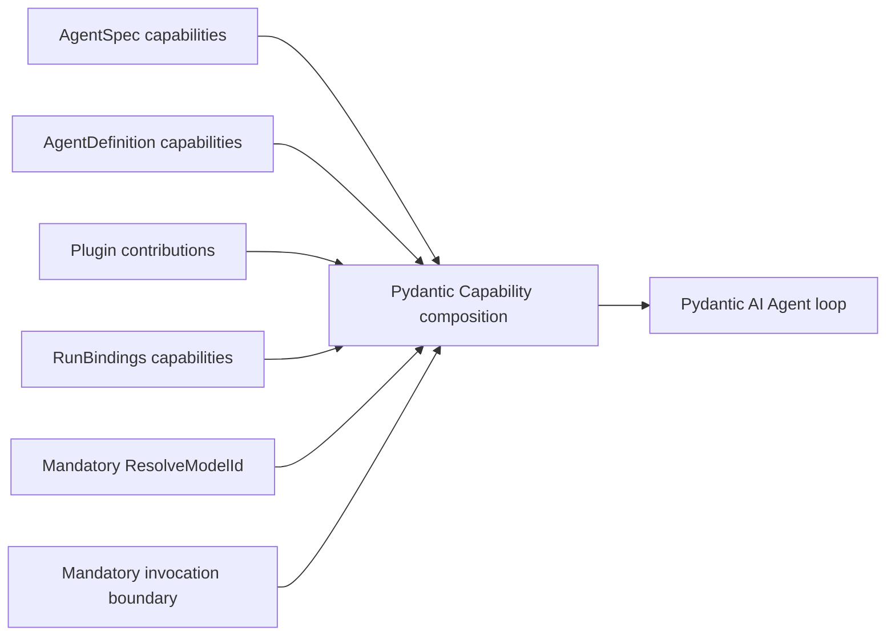

# Core Capability Catalog

## Design Position

Pydantic AI Capabilities remain the reusable extension mechanism inside the Agent loop and the only top-level feature-behavior plane in `AgentDefinition`. This document names first-party composition roles and points to their owning contracts. It is a documentation catalog only: it is not the narrow Host-supplied custom Capability type catalog used for `AgentSpec` reconstruction, a serialized plugin catalog, package installer, or source of authority.

Concrete Capabilities enter through:

- `AgentSpec.capabilities` under native Pydantic AI rules;
- `AgentDefinition.capabilities` as trusted code-first instances;
- `RunBindings.capabilities` as fresh invocation instances;
- an Agent-bound Harness plugin's code-first contribution.

The Harness does not resolve Capability classes from export IDs or manifests.

## Mandatory Harness Composition

The current mandatory build contribution is deliberately narrow:

| Entry                    | Primitive                                     | Purpose                                                                                            | Owner                                                    |
| ------------------------ | --------------------------------------------- | -------------------------------------------------------------------------------------------------- | -------------------------------------------------------- |
| Logical model resolver   | Pydantic `ResolveModelId`                     | Consult fresh `ModelRunBinding` or delegate to native inference                                    | [Input, Model, and Output](16-input-model-and-output.md) |
| Typed run dependencies   | `AgentContext`                                | Carry Identity, Environment, model binding, events, plugins, child collection, metadata, and state | [Capability Model](04-capability-model.md)               |
| Invocation boundary      | Capability-contributed outer `WrapperToolset` | Validate reserved metadata, preserve unmanaged dispatch, and enforce managed policy when selected  | [Tool Execution](07-tool-execution.md)                   |
| Continuation coordinator | `AgentContextState` typed methods             | Provide detached versioned JSON namespaces without a second Capability registry                    | [Harness State and Resume](10-snapshot-and-resume.md)    |

Model self-healing is a Model wrapper, not a Capability. Interrupted-stream semantic recovery is owned by `HarnessRunStream`, not a Capability. Plugin input/result middleware remains outside the Agent loop.

## Optional Capability Roles

| Role                             | Preferred Pydantic primitive                                        | Owning document                                                          |
| -------------------------------- | ------------------------------------------------------------------- | ------------------------------------------------------------------------ |
| Managed function policy          | Fresh typed policy Capability consumed by the core wrapper          | [Tool Execution](07-tool-execution.md)                                   |
| Client-side external tools       | `ExternalToolset` and native deferred values                        | [Tool Execution](07-tool-execution.md)                                   |
| Environment tools and context    | Optional `EnvironmentToolsCapability` projecting `BoundEnvironment` | [Environment Integration](08-environment-integration.md)                 |
| Guidance and repository context  | Capability instructions or Toolsets                                 | [Context and Memory](09-context-and-memory.md)                           |
| Compaction                       | Native history/compaction Capability                                | [Context and Memory](09-context-and-memory.md)                           |
| Working state                    | Capability using one `AgentContextState` namespace                  | [Context and Memory](09-context-and-memory.md)                           |
| Delegation                       | Capability-owned Toolsets over `SubagentCollection`                 | [Delegation and Subagents](11-delegation-and-subagents.md)               |
| Telemetry                        | Pydantic instrumentation and focused Capabilities                   | [Events, Observability, and Usage](12-events-observability-and-usage.md) |
| Checkpoint observation           | Capability using public complete message boundaries                 | [Harness State and Resume](10-snapshot-and-resume.md)                    |
| Provider-specific Agent behavior | Capability public hooks only when profile/adapter is insufficient   | [Input, Model, and Output](16-input-model-and-output.md)                 |

Native function tools and Toolsets remain valid code-first Pydantic inputs only inside a Capability. A small native `Capability(tools=[...])` or Toolset Capability is the ordinary one-to-one adapter; it does not require a Harness-specific subclass. The owning Capability also owns any tool timeout and stable Capability/Toolset identity because top-level `AgentSpec.tool_timeout` does not implicitly configure Capability-owned Toolsets. `EnvironmentToolsCapability` is richer because it combines stable Toolsets with request-dynamic topology context and native notices; the Environment resource itself still enters through the fixed `RunBindings.environment` field.

## Composition

Pydantic AI owns Capability construction, `for_agent()`, `for_run()`, ordering, dependencies, Toolset composition, and lifecycle hooks. The Harness preserves contribution order as input to those native rules and does not pre-sort a competing graph.

A Capability needing another run-bound Capability uses Pydantic's public run-bound mapping. A Capability needing its contributing Harness plugin resolves the fresh plugin through `AgentContext.plugins` by stable ID and expected type.

## State

Stateful Capabilities use `AgentContextState.read()` and `write()` with a stable non-blank namespace ID, exact version, and typed Pydantic model. The Harness snapshots all namespaces but does not inspect a global list of active owners. Unknown entries can remain opaque across a run; only the owning read accepts their semantics. Environment portable state uses the explicit core-owned `HarnessState.environment_state` field and is never stored as an `EnvironmentToolsCapability` namespace.

A trusted plugin can also transform the complete `HarnessState` at the result boundary. This does not create a second Capability lifecycle or provenance system.

## Authority

Capability presence does not itself grant external authority. Current Identity and Environment enter through typed `RunBindings`; credentials, policy decisions, invocation grants, durable checkpoints, provider launch state, controllers, and provider sessions remain with their owning Host, Harness resource, or provider binding. `EnvironmentToolsCapability` can project only the current facade and cannot mount, refresh, remove, or restore a resource.

A Host that requires a particular run Capability constructs and retains the typed instance it trusts. The Harness does not validate class-free role names against a private catalog. Feature-specific code performs any exact type, ID, policy, or collaborator checks required before side effects.

## Provider Compatibility and Recovery

Stable model/provider/adapter compatibility belongs to the native Model profile and adapter. Transport retries belong to the provider/client configuration. `SelfHealingModel` owns exact one-shot history repairs. `HarnessRunStream` owns bounded semantic attempts after model interruption.

A Capability is appropriate only for actual Agent/run behavior exposed through public Pydantic hooks. It is not the default place for provider profile facts, stream reconstruction, or retry orchestration.

## Boundaries

| Concern                           | Owner                                        |
| --------------------------------- | -------------------------------------------- |
| Capability lifecycle and order    | Pydantic AI                                  |
| Code-first contribution seams     | Harness                                      |
| One Capability's behavior/state   | Owning Capability package                    |
| Environment lifecycle/topology    | Harness core and trusted Host controller     |
| Plugin middleware                 | [Harness Plugin System](05-plugin-system.md) |
| External authority                | Host or provider                             |
| Durable package and revision lock | Host                                         |

## Trade-offs

### Documentation Catalog vs. Runtime Registry

A documentation catalog provides shared vocabulary without a second factory or compatibility layer. Trusted embedding code remains responsible for constructing the exact Python types selected by its own revision and artifact policy.

### Small Mandatory Core vs. Uniform Feature Set

Only model resolution, shared context/state coordination, and the inert-by-default invocation boundary are mandatory. Optional Agents may expose very different tool and behavior surfaces, while native Pydantic composition stays authoritative. Without reserved managed metadata or a client definition marker, the wrapper preserves ordinary native dispatch.
