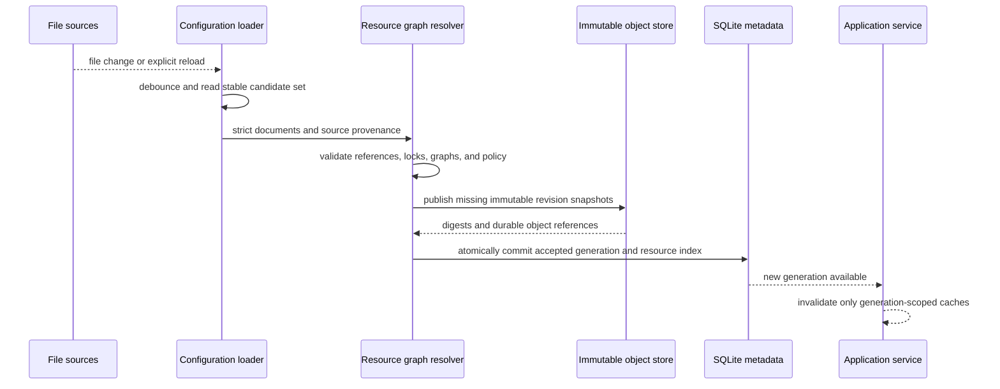

# Configuration and Resource Catalog

## Design Position

Agent UI configuration is a reloadable, human- and agent-editable file-backed contract. It separates process settings from reusable product definitions and accepts all reloadable sources as one validated configuration generation. External editors, WebUI, and TUI can change the same source documents; the application service publishes a new generation only after the complete resource graph validates.

SQLite is not the authority for desired configuration. It records accepted generation metadata, resource indexes, diagnostics, and references from durable Sessions, while immutable resolved snapshots preserve the exact content selected by existing Sessions. A source edit therefore changes the latest catalog without rewriting earlier revisions or active runtime objects.

## Boundaries

| Concern                                                                       | Owner                                | Contract                                                                            |
| ----------------------------------------------------------------------------- | ------------------------------------ | ----------------------------------------------------------------------------------- |
| Process settings and resource source documents                                | Local configuration files            | Human- and agent-readable desired state                                             |
| Source discovery and layer precedence                                         | Agent UI configuration loader        | Deterministic input set for one candidate generation                                |
| Schema and graph validation                                                   | Agent UI resource catalog            | All-or-nothing accepted generation                                                  |
| Model provider, Harness plugin, and Environment provider package availability | Installed trusted catalogs           | Availability and provenance, not user authority                                     |
| Current credential material                                                   | Credential resolver                  | Fresh process-local lookup; absent from configuration snapshots and Session history |
| Accepted-generation and resource query metadata                               | SQLite metadata store                | Mutable index over accepted file-backed content                                     |
| Exact Session composition                                                     | Content-addressed resolved snapshots | Immutable even after configuration reload                                           |
| Native Model, plugin, Capability, Agent, or Environment resource              | Owning runtime package               | Reconstructed only at explicit runtime boundaries                                   |

## Configuration Sources

Agent UI reads one process-settings document and zero or more ordered definition roots. A definition root contains resources in these namespaces:

- Models;
- Prompts;
- Plugin instances;
- Skills;
- Agents;
- Environments.

Structured definitions use strict versioned YAML or its exact JSON equivalent. Prompt bodies and Skill packages can use their native Markdown and directory forms with a strict metadata document. The loader rejects unknown schema fields, duplicate keys, aliases that create non-JSON graphs, non-finite values, traversal outside an authorized source root, and inputs above configured local bounds.

Source layers are ordered from lowest to highest precedence. Built-in resources form the lowest layer, followed by configured user roots and then an explicitly selected project root. A higher layer can replace one lower-layer resource only by the same stable resource ID and compatible resource kind. Replacement selects different content in the candidate generation; it does not mutate or delete the lower revision. Two definitions of the same identity at the same precedence are an error.

The process settings document selects the data root, definition roots, project-root policy, credential backends, provider/plugin allowlists, logging and telemetry exporters, concurrency limits, retention policy, and Web transport settings. Settings are classified as:

- **reloadable**, when a new accepted value can affect later commands without replacing process-owned infrastructure;
- **restart-bound**, when the value owns already-open infrastructure such as the data root, SQLite location, listener address, TLS mode, or credential-store implementation.

A valid reload containing a changed restart-bound value records the accepted desired value and reports `restart_required`; the running process continues to use its previously activated value. It never applies only part of an infrastructure change or silently starts a second store or listener.

## Resource Identity and Revisions

Every reusable definition has one kind-prefixed stable resource ID. Normalization produces immutable revision content and a digest:

```python
class ResourceRef(BaseModel):
    kind: Literal[
        "model",
        "prompt",
        "plugin",
        "skill",
        "agent",
        "environment",
    ]
    resource_id: str


class ResourceRevisionRef(ResourceRef):
    content_digest: str


class ResourceRevision(BaseModel):
    ref: ResourceRevisionRef
    schema_version: str
    normalized_content: JsonValue
    source: SafeSourceRef
    dependency_provenance: tuple[DependencyLock, ...]
```

`content_digest` covers the canonical normalized content and all behavior-affecting dependency references owned by the revision. Source path, modification time, UI display ordering, diagnostics, and accepted generation do not change the digest unless they change normalized behavior.

A revision stores no credential, native provider object, live plugin, imported module object, Environment attachment, `HarnessState`, or process authority. Exact immutable snapshot persistence is owned by [Local Storage and Recovery](03-local-storage-and-recovery.md).

## Resource Documents

### Models

A Model definition selects one trusted adapter and reusable model defaults:

```python
class ModelDefinition(BaseModel):
    schema_version: str
    model_id: str
    display_name: str
    provider_key: str
    model_name: str
    endpoint: str | None
    settings: dict[str, JsonValue]
    credential_ref: str | None
```

`provider_key` selects an Agent UI-supported model adapter that returns a native Pydantic AI Model through a fresh Harness `ModelRunBinding`. `credential_ref` names a resolver entry but contains no secret. `endpoint` is a credential-free network location and rejects URL user information or secret query parameters. A credential value can rotate under the same reference and affect later Runs without changing a pinned Model revision; changing the reference, endpoint, provider, model name, or model settings creates different revision content.

Installed provider packages and model names are validated as far as possible without credential or network I/O. Connectivity and credential validity remain runtime facts.

### Prompts

A Prompt definition owns ordered Agent instructions:

```python
class PromptDefinition(BaseModel):
    schema_version: str
    prompt_id: str
    display_name: str
    description: str | None
    instruction_blocks: tuple[PromptBlock, ...]
```

A block contains normalized instruction content or one source-relative Markdown reference. Reload resolves the complete referenced content before computing the revision digest. A Prompt revision never depends on a mutable path at execution time. Prompt files are inspectable text and do not embed executable templates or arbitrary Python expressions.

### Plugin Instances

A Plugin instance is the local reusable form of one exact entry in the [Harness plugin configuration document](../agent-harness/05-plugin-system.md#configuration-document):

```python
class PluginInstanceDefinition(BaseModel):
    schema_version: str
    plugin_resource_id: str
    display_name: str
    plugin_key: str
    plugin_id: str
    enabled: bool
    configuration: dict[str, JsonValue]
```

The resource catalog discovers metadata without importing targets, verifies the selected distribution provenance under Host policy, and delegates plugin-specific meaning to the selected Harness factory at Agent reconstruction. Several resources can select the same `plugin_key` when their `plugin_id` values differ. Installed metadata is availability, not enablement.

Plugin configuration is credential-free. A plugin that requires current external authority uses an Agent UI-supported credential reference or fresh run collaborator under its package contract; a literal credential, bearer token, or private key is rejected from the resource document and resolved snapshot.

### Skills

A Skill resource names one bounded Skill package:

```python
class SkillDefinition(BaseModel):
    schema_version: str
    skill_id: str
    display_name: str
    description: str
    source: SkillSource
    compatibility: SkillCompatibility
```

The accepted revision includes a manifest and content digest over every materialized Skill file allowed by the Skill contract. Symlinks or references escaping the authorized source root are rejected. A Skill revision is read-only input to Agent composition; current Environment placement and writable workspace state remain runtime concerns.

### Agents and Environments

Agent documents reference exact resource identities in the candidate generation and are owned in detail by [Agent Composition and Snapshots](02-agent-composition-and-snapshots.md). Environment documents wrap one or more provider specifications and Session lifecycle policy and are owned by [Sessions, Environments, and State](04-sessions-environments-and-state.md).

## Accepted Configuration Generation

A generation is the complete immutable view published by one successful reload:

```python
class ConfigurationGeneration(BaseModel):
    generation_id: str
    accepted_at: datetime
    process_settings_digest: str
    resources: tuple[ResourceRevisionRef, ...]
    catalog_digest: str
    restart_required: bool
```

`generation_id` is compact correlation, not authority. `catalog_digest` covers the ordered resource identities, their content digests, active source precedence, and selected trusted adapter/factory provenance.

Reload follows this sequence:



The loader reads a stable point-in-time candidate set after a bounded debounce and verifies each selected file did not change during that read. It retries an unstable read. Direct external edits to several independent files have no implicit author transaction, so a graph-valid intermediate point-in-time set can become an accepted generation. Generation atomicity governs validation and publication, not inferred editor intent.

An application-owned multi-resource edit uses a source transaction manifest. The application stages all replacement files, records their exact relative paths and content digests in one versioned manifest, and atomically replaces the active manifest only after every staged value verifies. The loader accepts that transaction only when all manifest digests match; a missing, extra, or mismatched value rejects the transaction. A single-resource UI edit is the one-entry form of the same contract. External tools that require multi-file authoring atomicity publish the same manifest or invoke the application batch-edit command.

The new generation is visible atomically. Queries and commands capture one generation at entry and never mix resources from two accepted generations. Existing Sessions retain their pinned snapshots. Existing `ExecutableAgent` values and active Runs continue unchanged. New Sessions and explicit forks select from the latest accepted generation unless the caller names another retained exact revision.

Package discovery can participate in reload. A newly installed trusted plugin or provider distribution can enter a later generation. Already imported Python modules are not unloaded or replaced in place, existing factory catalogs remain immutable, and existing executables retain their built plugin graph.

## Dynamic and Pinned Values

| Value                                                                | Reload effect                                                              |
| -------------------------------------------------------------------- | -------------------------------------------------------------------------- |
| Agent, Prompt, Plugin, Skill, Model, or Environment behavior content | New revision available; existing Sessions remain pinned                    |
| Model credential value behind the same `credential_ref`              | Resolved fresh for later Runs under current credential policy              |
| Provider credential value behind a stable reference                  | Resolved fresh for later management operations                             |
| Concurrency, retention, and safe display policy                      | Applies to later commands; cannot retroactively strengthen completed facts |
| Plugin/provider installation metadata                                | Available only in a newly accepted catalog; no active module replacement   |
| Data root, SQLite path, listener, TLS, credential backend            | Accepted as desired process setting and reported restart-bound             |
| WebUI or TUI presentation preferences                                | Applies to the owning surface without changing Agent or Session semantics  |

## Credential Resolution

Credentials live in configured local credential backends such as environment variables or the system keyring. The resource catalog stores only bounded references. Reads occur only when a trusted model adapter or Environment provider runtime requests a current credential for an authorized operation.

A configuration listing, export, diagnostic, snapshot, Session, AG-UI event, model context, or default telemetry record never includes credential values. Missing, expired, or denied credentials fail the current operation without rewriting the resource revision or substituting another credential reference.

## Failure Semantics

| Failure                                                                    | Outcome                                                                                          |
| -------------------------------------------------------------------------- | ------------------------------------------------------------------------------------------------ |
| Malformed, oversized, or unstable source                                   | Candidate rejected; last accepted generation remains active                                      |
| Duplicate identity at equal precedence                                     | Entire candidate generation rejected                                                             |
| Missing or wrong-kind reference                                            | Entire candidate generation rejected with bounded dependency diagnostics                         |
| Agent cycle, invalid plugin, unavailable adapter, or invalid provider spec | Candidate generation rejected before publication                                                 |
| Immutable snapshot publication failure                                     | No generation metadata points to the incomplete object                                           |
| SQLite generation commit failure                                           | Published unreferenced objects remain cleanup-safe; old generation remains active                |
| External edit races a UI edit                                              | Revision conflict or later reload; no silent merge                                               |
| Multi-file manifest is incomplete or mismatched                            | Transaction candidate rejected; previous accepted generation remains active                      |
| Restart-bound setting changes                                              | Desired generation accepted with `restart_required`; active infrastructure is unchanged          |
| Credential lookup fails                                                    | Current runtime operation fails; configuration remains accepted                                  |
| File watcher loses events                                                  | Periodic reconciliation or explicit reload detects divergence; watcher delivery is not authority |

## Compatibility

Process-settings schema, each resource schema, content normalization, model adapter keys, Harness plugin document version, Skill contract, Environment provider schema, and snapshot codec evolve independently. Unknown schema versions fail explicitly. A migration writes a new source representation or immutable revision; it never changes the meaning of content already addressed by a digest.

An Agent UI version can retain and run a pinned Session only when its locked adapters and snapshot codecs remain available and current policy permits reconstruction. The latest file-backed catalog need not contain the original source definition once its immutable snapshot is retained.

## Trade-offs

### File authority and dynamic reload

Readable configuration lets users and Agents inspect, edit, diff, and version-control product definitions without SQLite tooling. Atomic generation acceptance is more expensive than mutating one database row, but prevents a running Host from observing half-updated Agent graphs.

### Immutable Sessions and live configuration

Reload gives immediate availability to new Sessions while preserving deterministic existing histories. Applying changed behavior to old history requires an explicit fork instead of implicit hot mutation.

### Fresh credential references

Separating credential values from revision content allows safe rotation and reauthorization. Reproducing a Session therefore pins the credential selector and behavior, not the historic secret value or provider account state.

## Invariants

01. Desired product configuration is file-backed and accepted only as a complete validated generation.
02. SQLite indexes accepted configuration but never becomes the sole authority for its desired content.
03. A failed reload leaves the previous generation fully active.
04. One command or query observes exactly one configuration generation.
05. Dynamic reload never mutates an active Run, built executable, or existing Session snapshot.
06. Every behavior-affecting resource revision has immutable normalized content and a digest.
07. A source path, package installation, resource ID, or credential reference grants no runtime authority.
08. Credentials and live provider values never enter resource snapshots, Session history, AG-UI files, or default telemetry.
09. Restart-bound settings are never partially applied to already-open infrastructure.
10. UI edits and external file edits pass through the same validation and generation-publication path; multi-file authoring atomicity requires an explicit source transaction manifest.
