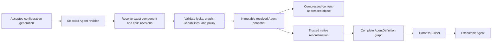

# Agent Composition and Snapshots

## Design Position

An Agent UI Agent is a reloadable local product definition composed from exact Model, Prompt, Plugin instance, Skill, Capability, and child-Agent revisions. Agent UI resolves the complete finite graph into an immutable content-addressed snapshot and reconstructs one process-local Harness `AgentDefinition` graph before a Session can use it.

An Agent definition is not a serialized Harness `AgentDefinition`. It contains no Python class, callable, native Model, Capability instance, Toolset, plugin instance, provider client, credential, Environment binding, or live Agent. Trusted Agent UI adapters map supported declarative resources to installed code under the accepted configuration generation.

Environment is deliberately outside Agent composition. An Agent declares authored Environment behavior through Capabilities and requirements, while a Session selects an independent Environment snapshot and supplies fresh provider attachments for every root and child invocation.

## Boundaries

| Concern                                                   | Owner                                     | Agent relationship                                                              |
| --------------------------------------------------------- | ----------------------------------------- | ------------------------------------------------------------------------------- |
| Reloadable Agent source document and component references | Agent UI configuration catalog            | Validates and versions desired composition                                      |
| Model, Prompt, Plugin, and Skill revision content         | Owning Agent UI resource catalogs         | Referenced exactly during resolution                                            |
| Native Agent definition and build lifecycle               | Harness                                   | Receives reconstructed native values through its public build contract          |
| Capability behavior and namespaced state                  | Capability and Harness                    | Agent selects supported declarative forms; state remains in `HarnessState`      |
| Harness plugin factories and middleware                   | Harness plugin system                     | Agent UI constructs the exact Harness plugin document and trusted Build Context |
| Child topology and inline delegation                      | Harness subagent contract                 | Snapshot reconstructs complete child definitions and authored edge ceilings     |
| Local asynchronous child tools                            | Agent UI Host Capability                  | Agent selects behavior; fresh run attachment supplies process-local authority   |
| Environment desired state and provider resources          | Agent UI Session and Environment Provider | Independent Session selection; never serialized into Agent composition          |
| Current Model, Environment, credentials, and Identity     | Fresh Host bindings                       | Reauthorized for every invocation                                               |
| Durable hosted definitions and Presets                    | Foundation Service                        | Independent schema and revision authority; no implicit conversion               |

## Agent Definition Document

The conceptual strict serialized form is:

```python
class AgentDefinitionDocument(BaseModel):
    schema_version: str
    agent_id: str
    display_name: str
    description: str | None
    model: ResourceRef
    prompt: ResourceRef
    plugins: tuple[ResourceRef, ...]
    skills: tuple[ResourceRef, ...]
    capabilities: tuple[FirstPartyCapabilitySelection, ...]
    environment: AgentEnvironmentRequirements
    subagents: tuple[SubagentEdge, ...]
    delegation: DelegationPresentation
    output: AgentOutputSelection
    model_recovery: ModelRecoverySelection


class SubagentEdge(BaseModel):
    name: str
    description: str
    agent: ResourceRef
    context: DelegationContextPolicy
    usage_limits: UsageLimits | None
    environment: ChildEnvironmentPolicy


class AgentEnvironmentRequirements(BaseModel):
    bindings: tuple[EnvironmentBindingRequirement, ...]


class EnvironmentBindingRequirement(BaseModel):
    binding_name: str
    required_operations: frozenset[str]


class ChildEnvironmentPolicy(BaseModel):
    mode: Literal[
        "none",
        "dedicated",
        "shared_root",
        "serialized_root",
    ]
    bindings: tuple[str, ...] | None


class DelegationPresentation(BaseModel):
    inline: Literal["unified", "named", "disabled"]
    background: Literal["agent-ui", "disabled"]
```

`model`, `prompt`, `plugins`, `skills`, and child `agent` values reference resources by stable identity in one candidate configuration generation. Resolution replaces every reference with its exact `ResourceRevisionRef`; an immutable resolved snapshot never retains “latest” lookup semantics.

Plugin order and Skill order are significant. Immediate child names are unique. A child edge selects one complete child Agent, authored context and usage ceilings, and an explicit Environment resource policy. It does not inherit the parent's tools, Capabilities, plugins, model, Prompt, credentials, or live bindings.

`AgentEnvironmentRequirements` declares the binding names and provider-neutral operation families that must be available when a Session pairs this Agent with an Environment. Agent resolution validates syntax and operation keys but cannot prove resource availability because Environment selection is independent. Session creation or fork performs the cross-snapshot compatibility check against the selected Environment topology and permission ceilings.

`none` supplies an empty child Environment topology. `dedicated` creates or resumes independently fenced provider resource instances scoped to the child invocation or background job and requires every selected provider to advertise `MULTIPLE_FROM_SPEC`. `shared_root` acquires separate concurrent attachments from the root resource instances and requires every selected provider to advertise `SHARED`; the child intentionally observes and can mutate the same underlying workspace. `serialized_root` waits for selected root instances to have no active attachment, then acquires fresh attachments sequentially; it is valid only for background children because an inline child waiting for its still-entered parent binding would deadlock. `bindings` selects a subset of the Session Environment topology or is absent to select all bindings. Unknown names, insufficient operations, or unsupported allocation/concurrency capabilities fail Agent/Environment compatibility during Session creation or fork, before provider effects.

`AgentOutputSelection` maps through a trusted Agent UI adapter to one native Harness business-output contract. The interactive default is text, but structured first-party output contracts can be selected by schema key and version. Arbitrary Python output classes and import targets are not serialized.

## Composition Formula

One resolved Agent is exactly:

```text
Agent revision
  = Model revision
  + Prompt revision
  + ordered Plugin instance revisions
  + ordered Skill revisions
  + curated Capability selections
  + Environment requirements
  + complete child Agent revisions and edges
  + output and recovery policy
```

The sources have distinct responsibilities:

- **Model** selects native provider/model behavior and defaults; fresh credentials and native Model resolution remain run-scoped.
- **Prompt** supplies complete ordered instructions.
- **Plugin instances** supply trusted Harness-wide middleware through the Harness-owned plugin contract.
- **Skills** supply inspectable reusable instructions and artifacts through the first-party Skills Capability.
- **Capabilities** own Agent-loop tools, Toolsets, guidance, settings, and hooks.
- **Environment requirements** declare provider-neutral binding/operation needs without selecting provider resources.
- **Child Agents** are complete recursively resolved Agent definitions.

A plugin can contribute Capabilities through the Harness lifecycle, but Agent UI does not add a second plugin hook model. A Skill cannot directly install Python code, a plugin, a provider, or a Capability. A Prompt cannot enable tools by naming them. Every executable code-selection surface is an installed trusted adapter, curated Capability key, Harness plugin factory key, or Environment provider key selected under Host policy.

## Model Reconstruction

The resolved Model revision contributes a logical model ID to `AgentSpec`. Every root and child Run receives a fresh Agent UI `ModelRunBinding` that:

1. verifies the pinned Model revision and current Host policy;
2. resolves current credential material behind the pinned `credential_ref`;
3. constructs or obtains the exact native Pydantic AI Model through the selected adapter;
4. applies the pinned endpoint and model settings;
5. returns the Model only for that Run's resolver scope.

A Model adapter can reuse a documented reentrant native client or Model internally, but that cache is process-local and keyed by non-secret configuration plus credential generation. A Session snapshot never stores the native value or historic secret. Credential rotation behind one reference can affect a later Run without changing Agent behavior content; changing provider, endpoint, model name, settings, or credential reference creates another Model revision.

## Prompt, Skill, and Capability Reconstruction

Prompt resolution produces complete immutable instruction content before the Harness build. The executable never rereads a mutable Prompt source file.

Each selected Skill revision is verified and materialized through the Skills Capability's trusted source/materializer contract. Skill content is immutable for the executable snapshot. A run can place or expose that content in the selected Environment only through fresh Environment authority; Skill selection alone grants no filesystem access.

`FirstPartyCapabilitySelection` is a discriminated union owned by the Agent UI schema. Each member has an exact key, schema version, and typed configuration. Unknown keys or versions fail resolution. Agent UI adapters construct public Harness/Pydantic Capability values; there is no arbitrary Capability import registry.

The curated catalog includes the dynamic Environment, Working State, user interaction, document/media/web, Session-read, and Agent UI background-child behavior supported by the selected Agent UI release. A Capability that requires Host collaboration follows the two-layer pattern:

- the definition-selected Capability owns stable model-visible behavior;
- a fresh run Capability supplies current Session, Environment, repository, or background-monitor authority.

Missing or mismatched fresh collaboration fails the affected operation before side effects.

## Plugin Reconstruction

Agent resolution uses the public Harness plugin factory catalog to construct the ordered Plugin instances selected by each resolved Agent node. For every selected Plugin resource, Agent UI supplies its exact `plugin_key`, `plugin_id`, normalized configuration, and Host-owned bounded extensions to `HarnessPluginFactoryCatalog.create_plugin()`, then places the resulting trusted concrete object in that node's `AgentDefinition.plugins` tuple. The ordinary Harness build path owns ordering, Agent binding, run binding, Capability contribution, middleware, result validation, and cleanup.

The resolved snapshot locks:

- plugin resource revision;
- `plugin_key` and `plugin_id`;
- normalized credential-free configuration;
- selected distribution name/version and factory provenance;
- Harness plugin factory/configuration contract version.

At reconstruction, Agent UI verifies current policy and provenance and builds a fresh immutable factory catalog containing only the selected keys. An unavailable or changed locked plugin fails explicitly; it is never replaced with the latest similarly named factory. Root and child Agents can select different Plugin resources because concrete direct Plugin tuples belong to their complete definitions. One recursive `HarnessBuilder` still constructs the finite graph; Agent UI never mutates the builder or an executable after construction.

Agent UI does not use ambient Harness plugin files or environment switches for product Agent composition. A process-wide operator Plugin document, when explicitly supported by process settings, remains a separate builder-wide layer governed by the Harness configuration contract and participates in the executable digest; it cannot replace per-Agent Plugin resources or be changed in an active executable.

## Resolution and Snapshot



Resolution occurs before Session creation, explicit fork, or validation preview. It:

1. captures one accepted configuration generation;
2. resolves the root Agent and every Model, Prompt, Plugin, Skill, Capability, output, and child reference;
3. expands the finite child graph and rejects missing revisions, duplicate immediate-child names, and cycles;
4. validates Capability combinations, Environment requirements, delegation presentations, and child edge ceilings;
5. verifies selected adapter and package provenance under current policy;
6. canonicalizes all behavior-affecting content and dependency locks;
7. computes a logical Agent digest;
8. publishes the immutable resolved snapshot before a Session can reference it.

The conceptual snapshot is:

```python
class ResolvedAgentSnapshot(BaseModel):
    snapshot_schema_version: str
    root_agent: ResourceRevisionRef
    logical_agent_digest: str
    resolved_agents: tuple[ResolvedAgentNode, ...]
    models: tuple[ResolvedModelRevision, ...]
    prompts: tuple[ResolvedPromptRevision, ...]
    plugins: tuple[ResolvedPluginRevision, ...]
    skills: tuple[ResolvedSkillRevision, ...]
    capability_schemas: tuple[CapabilitySchemaLock, ...]
    adapter_locks: tuple[DependencyLock, ...]
    harness_release: str
```

The snapshot contains every authority-neutral value needed to repeat trusted reconstruction. It contains no secret, native Model, current credential, Environment specification or resource state, plugin object, live Skill materialization, repository, task, client, or run Capability.

## Session Pinning and Executable Lifetime

A Session pins one exact resolved Agent snapshot identity and digest. A dynamic configuration reload can publish another Agent revision and executable, but it does not alter the Session. Applying another Agent composition to existing history requires an explicit [Session fork](04-sessions-environments-and-state.md#forking-and-composition-change).

An `ExecutableAgent` corresponds to one resolved Agent snapshot and complete child graph. Agent UI can cache it by logical Agent digest, Harness release, locked adapter provenance, and activated restart-bound process configuration. A cache entry contains no Session state, credential, Environment resource, or run authority.

Changing any behavior-affecting component creates another logical digest and executable. Agent UI never hot-toggles instructions, plugins, Skills, Capabilities, output, recovery policy, or child edges inside an active executable. Closing the last cache reference closes the complete built child and plugin graph through the ordinary Harness ownership order.

Run-time values vary only through contracts designed for fresh binding: Identity, current model binding, credentials, Environment attachments, policy narrowing, Session-read collaborator, and background-job collaborator. Fresh binding can narrow configured behavior but cannot add a Capability, plugin, Skill, output type, or child edge absent from the snapshot.

## Child Definitions

Every child edge resolves to one complete [Harness `SubagentDefinition`](../agent-harness/11-delegation-and-subagents.md#child-definitions-and-built-collection). The child owns its Model, Prompt, Plugins, Skills, output, Capabilities, recovery policy, nested children, and Environment requirement.

A `self` authoring convenience can be exposed by the configuration editor, but resolution expands it to a finite complete child revision and narrows recursive delegation before snapshot publication. Runtime cloning of the parent Agent, context, credentials, or authority is not supported.

The root separately selects presentation:

- inline `unified` exposes the first-party Harness `delegate` selector;
- inline `named` exposes one bounded named tool per child;
- inline `disabled` retains built children for trusted Host behavior without an inline model tool;
- background `agent-ui` enables Agent UI background tools for the same exact built collection;
- background `disabled` supplies no local asynchronous child tools.

Inline and background presentations can coexist. They use different lifecycle owners but never construct separate child definitions or alternative Agent loops.

## Configuration Reload

A newly accepted configuration generation can add, remove, or change source definitions. Resolution caches are generation-aware, while immutable snapshot and executable caches are digest-aware:

- an unchanged resolved digest can reuse a compatible executable;
- a changed digest creates another snapshot and executable;
- removed current source content does not delete a snapshot pinned by a retained Session;
- an active Run and its background jobs retain the snapshot with which they started;
- package refresh can make a new adapter available but cannot unload or replace code already captured by an executable.

Validation preview can resolve and build a candidate Agent without creating a Session, but it uses ordinary reconstruction and cleanup rather than a second approximate validator.

## Failure Semantics

| Failure                                                                     | Outcome                                                                                        |
| --------------------------------------------------------------------------- | ---------------------------------------------------------------------------------------------- |
| Missing or wrong-kind component reference                                   | Candidate generation or explicit resolution fails; no latest substitution                      |
| Child graph cycle or duplicate immediate name                               | Resolution fails before snapshot publication                                                   |
| Invalid Capability combination or output selection                          | Resolution fails before Harness build                                                          |
| Unavailable locked plugin, model adapter, Skill codec, or Capability schema | Reconstruction fails explicitly; retained snapshot remains unchanged                           |
| Current Host policy denies locked composition                               | Executable creation denied; snapshot is not rewritten                                          |
| Plugin or Capability build failure                                          | Harness build fails and closes already acquired resources                                      |
| Credential missing during a Run                                             | Model resolution or affected operation fails; Agent snapshot remains valid                     |
| Environment requirement unsatisfied                                         | Session creation or Run binding fails before Harness dispatch, according to requirement timing |
| Configuration changes during resolution                                     | Resolver finishes against its captured generation or restarts; it never mixes generations      |
| Configuration changes during an active Session                              | Existing Session and executable continue with pinned snapshot                                  |

## Compatibility

Agent source schema, component resource schemas, snapshot schema, normalization rules, adapter lock format, Harness release, Plugin document version, Capability schemas, Skill contract, and `HarnessState` versions evolve independently. A migration creates a new revision or a verifiably equivalent normalized representation; it never changes content addressed by an existing digest.

A Session can continue only when Agent UI can decode its snapshot, verify its locks, reconstruct the exact logical Agent definition, and import its `HarnessState` under the owning Harness contracts. Name similarity and readable message history cannot authorize substitution of another child, Plugin, Capability, or state codec.

## Trade-offs

### Explicit component resources

Separate Model, Prompt, Plugin, and Skill resources allow reuse, independent validation, UI management, and agent-readable configuration. Resolution must maintain exact cross-resource revisions, but Agent behavior is reviewable without serializing native Python objects.

### Immutable snapshots and live catalogs

Snapshots keep Session continuation deterministic while the file-backed catalog reloads dynamically. Applying new behavior to old history requires an explicit fork rather than implicit mutation.

### Complete child Agents

Complete children repeat some authoring values but match the Harness graph and keep every behavior and authority edge explicit. Authoring conveniences disappear during resolution rather than becoming runtime inheritance.

## Invariants

01. Agent composition is the exact combination of pinned Model, Prompt, Plugin, Skill, Capability, output, and child-Agent revisions.
02. Environment desired state and provider resources remain outside Agent composition and are selected by a Session.
03. Every Session pins one immutable resolved Agent snapshot and logical digest.
04. Dynamic reload, Plugin toggles, and Prompt/Skill edits never mutate an active executable or existing Session.
05. Every child edge resolves to one complete finite child definition; no separate subagent builder or runtime inheritance plane exists.
06. Curated Capability keys, trusted model adapters, enabled Harness plugin keys, and selected Environment providers are the only declarative code-selection surfaces; arbitrary imports are rejected.
07. Snapshots restore no Identity, credential, Environment, provider client, repository, scheduler, plugin object, or execution authority.
08. Every root and child invocation receives fresh model, Environment, policy, and Host collaboration bindings.
09. Applying another Agent composition to existing history requires an explicit Session fork.
10. Reconstruction uses the public Harness build contract and never implements a second Agent loop.
