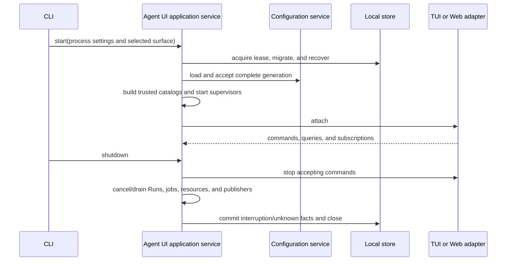
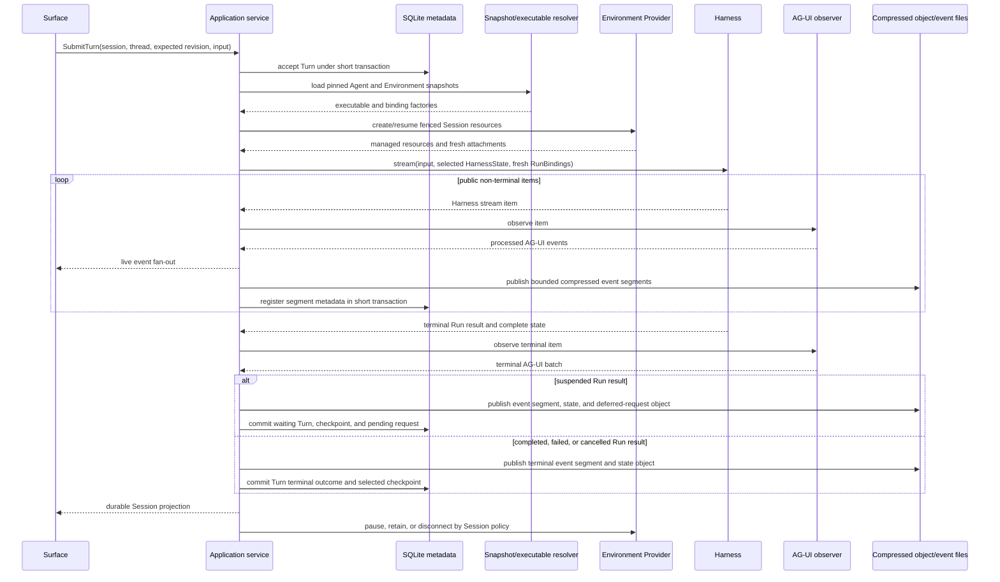
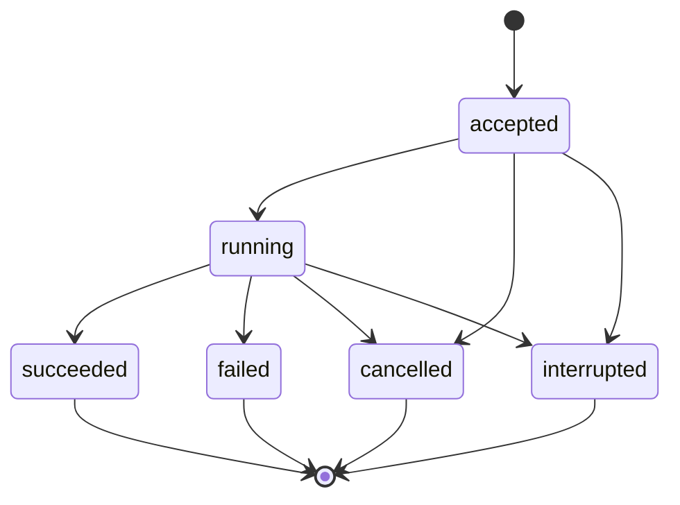
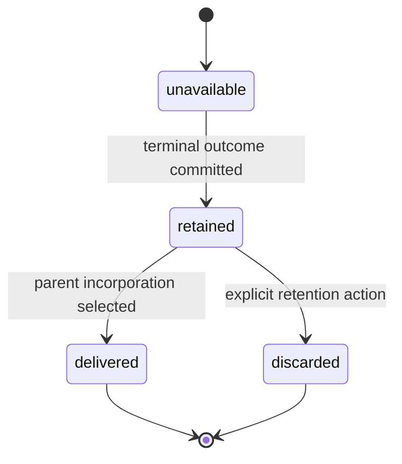
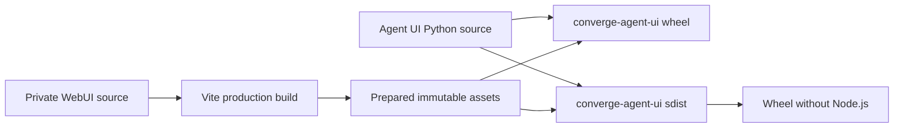

# Runtime, Subagents, and Surfaces

## Design Position

Agent UI has one surface-neutral application service, one foreground execution coordinator, and one process-local background-child monitor. The service is the only product boundary for configuration, composition, Environment lifecycle, Sessions, Runs, replay, and cleanup. TUI calls it directly in process. WebUI reaches the same typed commands and queries through a thin loopback HTTP/SSE adapter.

The coordinator consumes every root Harness stream exactly once. Inline children remain owned by the Harness `DelegationCapability`; background children use an Agent UI Host Capability and fresh run attachment around the exact child executable graph already built by the Harness. Agent Stream Protocol converts every complete root and background-child Harness stream once. Forwarded inline-child events can also be observed as child-correlated detail, but they do not form an independent terminal AG-UI Run when the Harness does not forward the child terminal result.

## Boundaries

| Concern                                  | Owner                                                         | Agent UI behavior                                                                                       |
| ---------------------------------------- | ------------------------------------------------------------- | ------------------------------------------------------------------------------------------------------- |
| Configuration source mutation and reload | Configuration service                                         | Atomic source write, generation acceptance, diagnostics, and subscriptions                              |
| Resource CRUD and validation             | Model, Prompt, Plugin, Skill, Agent, and Environment services | Typed application operations over one captured generation                                               |
| Complete root and child executable graph | Agent resolver and Harness build                              | Reuses exact immutable snapshot; no runtime child rebuilding                                            |
| Foreground Agent loop and continuation   | Harness                                                       | One entered `HarnessRunStream` with fresh bindings                                                      |
| Blocking inline child invocation         | Harness Delegation Capability                                 | Normal tool call, nested child `HarnessState`, usage, and parent checkpoint boundary                    |
| Background child presentation            | Agent UI behavior Capability                                  | Bounded spawn/status/wait/steer/cancel tools over exact built children                                  |
| Live background scheduling               | Agent UI monitor                                              | Supervised tasks, queues, cancellation, terminal retention, and process generation                      |
| Environment resource lifecycle           | Agent UI plus Environment Provider Manager                    | Fenced create/resume/pause/destroy and fresh attachments                                                |
| Active Environment topology              | Harness                                                       | Adapts complete fresh attachment set into provider-neutral bindings                                     |
| AG-UI conversion                         | Agent Stream Protocol                                         | Complete observer per root/background Run; bounded detail observation for forwarded inline-child events |
| Session/state/event persistence          | Agent UI local store                                          | SQLite control facts and compressed immutable payload files                                             |
| Web and terminal presentation            | Surface adapters                                              | Submit typed commands and consume safe query/event projections                                          |
| Distributed durable execution            | Foundation Service                                            | Not emulated by local process tasks or storage                                                          |

## Application Service

One `AgentUiApplication` owns the supervised lifetime of:

- configuration and accepted-generation services;
- product resource catalogs and editors;
- Agent/Environment snapshot resolvers;
- executable cache;
- local metadata/object/event stores;
- model and credential adapters;
- Environment provider resources;
- foreground run coordinator;
- background-child monitor;
- retained/live event subscriptions;
- Web or terminal surface adapter.

Its public surface is grouped by semantic services rather than storage tables:

```python
class AgentUiApplication(Protocol):
    configuration: ConfigurationApplicationService
    models: ModelApplicationService
    prompts: PromptApplicationService
    plugins: PluginApplicationService
    skills: SkillApplicationService
    agents: AgentApplicationService
    environments: EnvironmentApplicationService
    sessions: SessionApplicationService
    runs: RunApplicationService
    events: EventApplicationService
```

Commands carry stable resource selectors, expected revisions, bounded content, and explicit operation intent. Queries return detached safe projections. No application value exposes a SQLite connection, filesystem path as authority, `HarnessRunStream`, native Model, plugin object, provider Manager, Environment attachment, credential, task, lock, or raw `HarnessState`.

All mutation and execution paths are available to both TUI and WebUI according to the same local-user policy. A surface cannot acquire extra authority by reading storage or calling runtime packages directly.

## Application Lifetime



Startup does not accept surface commands until authoritative SQLite metadata, selected state objects, configuration generation, projections required for queries, and prior-process interruption transitions validate. Shutdown stops acceptance, preserves external cancellation across cleanup, drains within configured bounds, closes every entered Harness stream in its entering task, applies Environment lifecycle policy, seals pending AG-UI segments, and commits unknown/interrupted outcomes before releasing the store lease.

## Configuration Editing and Reload

WebUI and TUI resource editors call the same application commands. An edit:

1. reads one resource and its source revision from a captured configuration generation;
2. validates the proposed strict document locally;
3. stages the replacement source values and publishes a one- or multi-resource source transaction manifest under a source-specific edit lease;
4. requests an immediate configuration reload against the exact manifest digests;
5. succeeds only when the intended digest set appears in a newly accepted generation;
6. returns bounded diagnostics while leaving the prior accepted generation active on failure.

External file edits enter through the same reload pipeline. A file watcher is an optimization; periodic source reconciliation and explicit reload prevent dropped watcher events from becoming authority. One application event announces accepted generation, changed resource digests, and restart-bound settings without leaking source content or credentials.

Deleting or replacing current source content never removes immutable snapshots referenced by Sessions or active executables. A validation command can perform complete Agent reconstruction and cleanup without creating a Session.

## Foreground Run Flow

The `SubmitTurn` command names a Session, Thread, expected Thread revision, and bounded input. The coordinator performs one canonical flow:



The coordinator is the sole `HarnessRunStream` consumer. It routes every item to the observer before any surface sees it, captures the terminal result, validates complete state, and closes the stream and fresh attachments in their owning scope.

Model resolution, credential reads, Host run Capabilities, Plugin run binding, Session-read collaboration, background collaboration, Environment attachments, Identity, usage, and policy are fresh for every root and child Run. Pinned snapshots can narrow current authority but cannot restore it.

Input acceptance, Environment availability, Harness start, live event delivery, event-file registration, Harness terminal result, checkpoint selection, Environment pause, OTel export, and surface rendering are independent facts. A surface disconnect does not cancel work. Explicit cancellation requests ordinary Harness cancellation and records its actual outcome.

For inline delegation, the fresh parent bindings include an Agent UI child-binding collaborator constrained by the pinned child edge. `dedicated` policy persists child-scoped resource instances and operation fences before provider dispatch, acquires fresh attachments from `MULTIPLE_FROM_SPEC` providers, and returns complete child bindings to the Harness delegation path. `shared_root` acquires distinct concurrent attachments from `SHARED` root resources without creating a second lifecycle record. The parent checkpoint remains the authority for nested inline child state, while SQLite retains provider lifecycle and cleanup responsibility. `none` returns an empty child topology. `serialized_root` is rejected before the parent Run because its wait condition cannot become true while the parent attachment remains entered.

## Deferred Input and Approval

A suspended Harness result keeps the same Host Turn in `waiting`. The coordinator publishes the complete selected `HarnessState`, the separate exact public `DeferredToolRequests` object returned by the Harness, and pending event segments, then atomically commits the `waiting` transition, both object references, unconsumed status, and Thread revision in SQLite. A valid waiting Turn survives process restart. Surfaces render the corresponding safe projection and submit one typed response command bound to the Session, Thread, Turn, expected revision, and exact deferred identifiers.

The application service loads and validates the complete pending request object, combines the authorized responses with that exact value in `DeferredToolResume`, records one consuming `run_id` before dispatch, creates fresh model/Environment/Host bindings, and appends the Run to the same Turn. AG-UI replay and identifiers alone never reconstruct or satisfy deferred state. Stale, duplicate, mismatched, already-consumed, corrupt, or incompatible responses conflict before another Harness dispatch.

## Environment Operations

Environment application commands provide full local product control:

- validate an Environment definition and provider availability;
- provision required or optional Session resources;
- inspect safe lifecycle and provider observations;
- resume or pause one binding under its supported mode;
- reset by explicit destroy-and-create after authoritative absence;
- detach caller-owned resources;
- destroy Session-owned resources;
- reconcile `unknown` operations with provider-specific evidence;
- subscribe to safe topology/lifecycle changes.

Every effectful operation commits a fence before calling the Provider Manager and commits returned state only under the same fence. The application service never exposes arbitrary vendor API passthrough. Provider credentials enter through fresh runtime collaborators and are absent from commands, SQLite payload columns, AG-UI, model context, and default logs/telemetry.

When a Run is active, its Harness topology is fixed by the complete fresh attachment set entered for that invocation except where the public Harness topology controller explicitly supports a higher complete revision. Host topology change cannot add a Dynamic Environment Capability or Toolset absent from the Agent snapshot. Environment attachment and provider resource lifecycle remain independent from Agent configuration reload.

## Agent UI Background Capability

The Agent-selected Agent UI Background Capability has stable tools and configuration but no monitor. A fresh run attachment binds exact current authority:

```python
@dataclass(frozen=True, slots=True)
class AgentUiBackgroundRunCapability(
    AbstractCapability[AgentContext]
):
    session_id: str
    parent_thread_id: str
    parent_turn_id: str
    parent_run_id: str
    monitor: BackgroundJobService
    child_binder: BackgroundChildBinder
```

The public attachment exposes methods rather than mutable fields. The behavior Capability selects one exact `BuiltSubagent` from `AgentContext.subagents`; it cannot submit an arbitrary executable or resource ID. The binder applies the pinned child edge, context and usage ceilings, child Environment policy, fresh Model binding, current Host policy, and independently authorized fresh Environment attachment.

For `dedicated` child Environment policy, job acceptance first persists child-scoped resource-instance records and operation fences before provider dispatch. The child starts only after required `MULTIPLE_FROM_SPEC` instances are available, and those instances retain independent pause, recovery, destroy, and Session-delete cleanup responsibility. `shared_root` waits only for provider admission, then acquires distinct concurrent attachments from `SHARED` root resources. For `serialized_root`, the accepted background job remains queued without a child Harness Run until every selected root instance releases its active attachment; it then acquires fresh sequential attachments. Inline delegation permits `dedicated`, `shared_root`, or `none`; `serialized_root` is background-only.

Model-facing operations use compact parent-scoped references:

```python
class SpawnBackgroundChild(BaseModel):
    subagent: str
    task: JsonValue


class BackgroundSpawnResult(BaseModel):
    subagent_ref: str
    status: Literal["accepted"]


class BackgroundControlRequest(BaseModel):
    subagent_ref: str
```

`spawn` returns after the monitor durably accepts job metadata in SQLite. It is not a deferred Pydantic tool call. Status, bounded wait, steer, and cancel resolve `subagent_ref` together with the trusted current Session and parent Thread. A compact ref cannot address another scope.

Steering is bounded input delivered only through a compatible child Host seam. It never mutates private Pydantic history or a live `AgentContext`. Acceptance means queued/delivered to the live job, not that a later model request incorporated it.

## Background Job Lifecycle

Execution outcome and result delivery advance independently:





A retained record contains stable job/parent/child identities, exact child definition identity, process generation, outcome, delivery, run correlation, safe result/failure, and optional compressed child `HarnessState` reference. The child state belongs to the child Thread and never becomes the parent's selected checkpoint.

The monitor allocates the job and returns acceptance, then creates fresh child bindings and runs the exact child executable in a supervised task. Live task, stream, model, Environment, cancellation scope, queue, usage accumulator, and authority are not persisted.

At terminal close, the monitor publishes any complete child state, commits outcome and safe result, writes child AG-UI segments under a distinct stream, and notifies subscribers. A later parent incorporation is typed Host-generated input naming the job and outcome. It creates or participates in an ordinary serialized parent Turn and advances `delivery` at most once under revision checks. Delivery means selected for parent input, not proof that a model used it.

A prior-process `accepted` or `running` job becomes `interrupted`; it is never restarted automatically. Durable retry/failover belongs to Foundation Service.

## Cancellation and Unknown Outcomes

Foreground or background cancellation requests the exact live coordinator/monitor task, drains its Harness stream and attachments, and records the observed terminal outcome. Cancellation does not roll back provider, tool, Environment, or external effects. If cleanup or external dispatch outcome is uncertain, the Turn/job/resource remains `interrupted` or `unknown` with bounded reconciliation evidence.

Duplicate event notification, surface reconnect, or repeated status query never duplicates execution or parent incorporation. A stale run Capability cannot control jobs after its Run closes unless a later fresh Capability is explicitly authorized for the same Session and Thread.

## Retained and Live AG-UI

The application service observes each complete root and background-child Harness Run once, applies the Agent UI processor, assigns Session presentation sequence and event identity, stores compressed segments, updates query projection, and fans out detached values to subscribers.

Forwarded inline-child events use a child-correlated detail observer while the Harness delegation tool invocation is active. Because the Harness consumes the inline child's terminal result internally, Agent UI does not synthesize `RUN_FINISHED` or `RUN_ERROR` for that detail stream. The owning parent delegation tool lifecycle supplies the visible invocation outcome, closes the detail presentation, and preserves nested child state through the Harness parent checkpoint. This closure is not represented as child Run terminality and cannot be used to resume the child independently.

A subscription consists of:

1. a retained replay query from an opaque cursor or Session snapshot boundary;
2. an atomic handoff to live events after the replay watermark;
3. deduplication by Host event identity;
4. explicit gap/snapshot response when retention or corruption prevents exact continuation.

Subscribers never consume the Harness stream, file watcher, SQLite WAL, or event files directly. A query can page durable Items and protocol events without loading complete `HarnessState` or provider-state payloads.

## WebUI

WebUI is a complete browser product compiled into `converge-agent-ui`. It exposes pages and workflows for:

- Models and credential-reference status;
- Prompts;
- Plugin instances and factory provenance;
- Skills;
- Agent composition, validation, child topology, and revision history;
- Environment definitions, provider resources, lifecycle, and topology;
- Session list/search/resume/fork/archive/delete;
- streaming Agent interaction, reasoning, tools, approvals, questions, cancellation, and queued input;
- background children and result delivery;
- configuration reload diagnostics and restart-required settings;
- retained AG-UI protocol inspection and replay gaps.

The Python Host serves immutable bundled assets plus a thin command/query API and SSE event transport. Request handlers finish authorization and required short reads before streaming. An SSE generator holds no yielded database session and opens fresh short store operations only when needed.

The browser never becomes a model provider, Environment provider, EIP requester, Harness client, plugin loader, or storage reader. It receives safe projections and submits typed commands.

### Loopback Authority

The Web transport binds loopback by default for one local user. Each application lifetime creates an unguessable browser capability presented by every command and stream attachment. The server validates exact `Host`, `Origin`, and capability values, exposes no wildcard credentialed CORS policy, and keeps browser API, static routes, and SSE routes distinct. Unknown API/stream paths never receive the browser shell through history fallback.

The capability is process-local, absent from configuration, Session storage, model context, URLs intended for sharing, and ordinary logs. Non-loopback exposure requires an adopting wrapper to provide authentication, authorization, TLS, Host, and origin policy; the built-in local capability is not a remote multi-user contract.

## TUI

TUI runs the same application service in the terminal process and performs no HTTP request, starts no FastAPI/Uvicorn server, and listens on no network port. It provides the same semantic configuration, Environment, Session, Run, approval, child, and replay operations as WebUI.

TUI renders the same AG-UI schemas and durable query projections. It can collapse token deltas, reasoning, background detail, or completed tools for terminal readability; expansion reads retained AG-UI/Item projections rather than private Harness objects. Terminal resize, key binding, clipboard, color, and pager behavior do not alter command or Session semantics.

TUI exit uses the same application shutdown choices as WebUI process exit: continue only when another supported local owner exists, or explicitly cancel/drain current work and apply Environment policy. Closing a terminal renderer alone is not an implicit claim that provider work stopped.

## Surface Equivalence

Surface equivalence is semantic command and observation parity, not identical layout. Both modes can:

- manage all configuration resource kinds and trigger reload;
- validate and select Agent and Environment revisions;
- create, list, search, resume, rename, fork, archive, and delete Sessions;
- provision, inspect, pause, resume, reset, detach, and destroy authorized Environment resources;
- submit and queue input, cancel, answer approvals/questions, and inspect terminal outcomes;
- observe root/child/tool/reasoning/Environment events and replay history;
- control authorized background children;
- inspect safe configuration, storage, and replay diagnostics.

A renderer-only preference can remain surface-specific. Any operation that affects execution, storage, configuration, Environment resources, or authority belongs to the application service and cannot exist only as hidden renderer behavior.

## Packaging

`apps/harness-ui` remains private source input to the Python distribution:



Generated browser assets are not committed. Source-checkout builds use locked frontend dependencies and copy a manifest plus hashed assets into the package. The sdist contains prepared assets, so sdist-to-wheel construction does not require Node.js. Build and release verification fail when the application shell or referenced assets are missing.

Agent UI releases independently and pins one exact compatible Harness release group in published metadata. The private WebUI has no independent npm publication, version, tag, or release channel.

## Failure Semantics

| Failure                                         | Outcome                                                                                           |
| ----------------------------------------------- | ------------------------------------------------------------------------------------------------- |
| Configuration edit or manifest fails validation | Application-owned transaction manifest is not selected; prior generation remains active           |
| Stale command revision                          | Conflict before affected dispatch or mutation                                                     |
| Model or credential resolution fails            | Run fails before model use; pinned snapshot remains unchanged                                     |
| Required Environment cannot become available    | Run does not enter Harness; provider lifecycle retains exact failure/unknown state                |
| Harness stream/projection fails                 | Coordinator closes stream and attachments; Turn records actual failed/interrupted outcome         |
| Event persistence fails after live delivery     | Subscriber saw a non-durable observation; replay later exposes a gap                              |
| Surface disconnect                              | Work continues unless explicit cancellation/policy says otherwise                                 |
| Unknown child name or scoped ref                | Validation/not-found before background side effects                                               |
| Fresh child bindings denied                     | Accepted job fails with bounded outcome before child Harness dispatch                             |
| Child cleanup uncertain                         | Job becomes interrupted; no invented terminal success                                             |
| Duplicate notification                          | Same job/event identity; no duplicate execution or delivery                                       |
| Process exits during active work                | Runs/jobs become interrupted, resources follow bounded cleanup, and no live authority is restored |

## Compatibility

Application command/query schemas, configuration generation schema, Agent/Environment snapshots, Session store, background Capability, selected Harness/Provider/Protocol release, Web API/SSE transport, and TUI renderer evolve independently. Bundled surfaces are built against the exact Agent UI application contract and selected AG-UI version.

A running Run/job retains the executable snapshot, child definition, Environment resource selection, and process generation with which it started. Configuration reload or renderer upgrade cannot mutate it. Unknown custom AG-UI events can remain inspectable even when a renderer does not assign them a specialized widget.

## Trade-offs

### One application service with two complete surfaces

A shared application core prevents terminal and browser products from diverging in configuration, resume, Environment, child, and event semantics. It requires all product behavior to be expressed as typed commands/queries rather than direct widget-to-runtime shortcuts.

### Process-local background children

Local supervised tasks provide parallel Agent work and immediate visibility without introducing distributed execution. Process loss interrupts them, so durable acceptance, retry, and failover remain Foundation responsibilities.

### Stored AG-UI as the presentation contract

Using one processed event sequence makes live delivery, replay, protocol inspection, and both renderers consistent. It cannot replace `HarnessState` or provider state, so storage and UI must preserve those independent authorities.

## Invariants

01. TUI and WebUI use one application-service contract, one local store, one execution coordinator, one Environment lifecycle path, and one AG-UI sequence.
02. TUI is completely in process and never starts or calls the Web transport.
03. No surface reads SQLite/object files for authority, constructs Agents, calls `ExecutableAgent.stream()`, manages provider resources, or translates Harness events independently.
04. Every root and child Run receives fresh model, Environment, credential, policy, and Host collaboration bindings.
05. Inline delegation remains Harness-owned; Agent UI background execution uses exact built children and never copies the Agent loop.
06. A background spawn completes with ordinary accepted metadata; child terminal result and parent delivery are later independent facts.
07. Live event delivery, durable event registration, Harness result, checkpoint selection, Environment lifecycle, OTel export, and rendering remain independent.
08. Dynamic configuration reload can affect new selections but never mutates an active executable, Run, job, or Session composition.
09. Browser capability, model credential, Environment credential/attachment, and Session selector are separate authority domains.
10. Work requiring distributed durable acceptance, failover, retry, or remote multi-user policy uses Foundation Service rather than local process state.
