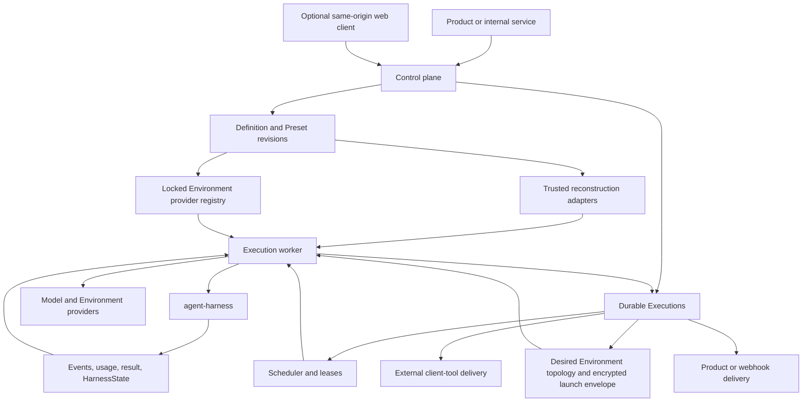

# Foundation Service Overview

## Design Position

`foundation-service` adds durable hosting around `agent-harness`. It accepts a Foundation-owned Agent definition source, materializes an immutable revision, durably accepts work against that revision, and assigns fenced worker Attempts. Each worker reconstructs one process-local Harness `AgentDefinition`, resolves operator-approved Environment provider integrations and current desired topology, creates fresh `RunBindings`, retains the paired topology controller, and consumes one logical Harness run.

The service does not add another Agent loop, plugin lifecycle, Model abstraction, Toolset runtime, Harness state format, or platform-owned Sandbox resource.

## Architecture



## Major Components

| Component               | Owns                                                                                               | Boundary                                               |
| ----------------------- | -------------------------------------------------------------------------------------------------- | ------------------------------------------------------ |
| Definition control      | Host schemas, typed Presets, immutable revisions, dependency locks, provenance                     | Reconstructs but never stores Python execution objects |
| Reconstruction adapters | Trusted mapping from one Host revision to native Harness/Pydantic objects                          | Process-local only                                     |
| Environment integration | Locked provider registry, desired topology, launch-envelope custody, and active-run reconciliation | Live bindings/controller remain process-local          |
| Execution lifecycle     | Durable acceptance, fenced Attempts, selected checkpoints, recovery, terminal commit               | Harness result is a candidate                          |
| Scheduler               | Runnable work, leases, wakeups, maintenance                                                        | Coordination is not lifecycle authority                |
| Client-tool lifecycle   | Pending external calls/approvals, authenticated feedback, continuation eligibility                 | External client owns side effect                       |
| Async child hosting     | Child Executions, Attempts, task scope, result retention, and delivery ledger                      | Spawn returns normally                                 |
| Usage recording         | Idempotent response observations, pricing revision, projections                                    | Terminal `RunUsage` is not another additive record     |
| API and events          | Idempotent acceptance/commands, durable lifecycle events, replay and delivery                      | Live streams are projections                           |

## Definition-to-Execution Flow

```mermaid
sequenceDiagram
    participant Caller
    participant Control
    participant Worker
    participant Adapter as Trusted adapters
    participant Harness

    Caller->>Control: inline Foundation definition or typed Preset invocation
    Control->>Control: resolve exact revisions and materialize Host document
    Control->>Control: validate and commit immutable definition revision
    Caller->>Control: accept work against selected revision
    Control->>Control: durably create Execution and schedule Attempt
    Worker->>Control: acquire fenced Attempt and revision
    Worker->>Worker: verify Host dependency/artifact locks
    Worker->>Adapter: reconstruct native AgentSpec, output, tools, and Capabilities
    Adapter-->>Worker: process-local AgentDefinition
    Worker->>Harness: construct HarnessBuilder with Foundation extensions and build
    Harness->>Harness: optionally apply deployment-scoped Harness plugin configuration
    Worker->>Worker: resolve locked Environment providers and current desired topology
    Worker->>Worker: persist provider operation identities before allocative I/O
    Worker->>Worker: materialize/reconcile bindings, stage launch envelope, and bump replacement incarnation revisions
    Worker->>Worker: create fresh Identity, Environment, model binding, and run Capabilities
    Worker->>Harness: run with fresh RunBindings and selected HarnessState; retain controller
    Harness-->>Worker: events, usage, result, and state candidates
    Worker->>Control: fenced checkpoint, waiting, or terminal proposal
    Control-->>Caller: durable Host status or delivery
```

Foundation never invokes a Harness compiler or catalog. Its durable definition is a Host schema, and trusted execution adapters are ordinary installed code selected by Host dependency locks.

## Model Resolution and Recovery

A Foundation model-integration revision owns its durable provider configuration and reconstruction adapter. For a logical model alias, the worker supplies a fresh `ModelRunBinding` that returns an allowed native Model or raises. Foundation's hosted profile fails worker setup if a required binding is absent; the base Harness itself still preserves native inference when no binding is supplied.

One Foundation Attempt starts one logical Harness run. That run may start several Pydantic inner attempts under its bounded `ModelRecoveryPolicy`. Inner attempts share one Harness run ID, Agent context, Environment aggregate/controller lifetime, plugin graph, state coordinator, and usage accumulator, and do not create more Foundation Attempt rows. The current worker can reconcile a newer authorized desired Environment topology through that retained controller during attempts or recovery backoff.

Worker or lease loss creates a new fenced Foundation Attempt and a fresh logical Harness run from an authoritative selected checkpoint. Side effects without authoritative receipts require reconciliation rather than blind replay.

Provider-suspended continuation remains native Pydantic behavior. Foundation defines no universal route-pin field. A provider integration that needs additional durable target state owns that typed provider-specific launch envelope and validates it before returning a Model.

## Asynchronous Subagents

Definition-selected Host behavior can submit an exact child target through a fresh typed Foundation Capability. The service creates an independent child Execution and returns an ordinary bounded model result with a compact parent-scoped `subagent_ref`; canonical spawn and Execution identities remain in Foundation records and APIs. The parent continues and does not wait through Pydantic deferred values.

The child receives its own process-local reconstructed definition, Identity, bindings, Attempt generations, checkpoints, usage records, and result. Completion enters a durable delivery ledger and can be retained, routed to one exact active parent Attempt, or consumed into a new continuation Execution under policy.

## Authority and Completion

| Fact                               | Authority                                  |
| ---------------------------------- | ------------------------------------------ |
| Source and materialized revision   | Definition control                         |
| Installed adapter/artifact lock    | Operator and Foundation catalog            |
| Process-local Agent construction   | Trusted adapters and Harness               |
| Model/provider selection           | Fresh model integration binding            |
| Environment provider/desired state | Locked integration and execution lifecycle |
| Effective process-local topology   | Harness controller under current Attempt   |
| Process-local result/state         | Harness                                    |
| Durable checkpoint/terminal state  | Execution lifecycle                        |
| Durable event                      | Lifecycle transaction                      |
| Usage record                       | Usage accounting                           |
| External delivery                  | Product or connector                       |
| Client-side action                 | Authenticated external executor            |

## Stable Principles

01. One immutable Foundation definition revision is selected before durable work begins.
02. Presets are authoring inputs, not runtime inheritance or authority.
03. Foundation records serializable Host data; workers reconstruct Python objects in-process.
04. Fresh current-run authority enters through explicit `RunBindings` fields and narrowly owned typed Capabilities; Environment lifecycle is never Capability-owned.
05. One durable Attempt maps to one logical Harness run, not one row per inner model attempt.
06. Stale workers cannot advance durable state.
07. Harness result delivery and Foundation terminal commit remain separate.
08. Unknown side effects require provider evidence or reconciliation.
09. Client tools use native Pydantic deferral and durable Foundation feedback fencing.
10. Async children use independent Executions and a delivery ledger.
11. Live streams, queues, Redis, webhooks, and telemetry are projections, not authority.
12. Desired Environment acceptance, initial or dynamic effective controller publication for one exact Harness run, Harness event delivery, model notice delivery, and checkpoint selection are distinct facts.

## Trade-offs

### Host-owned Definition Schema vs. a Harness Compiler

Foundation gains explicit durable compatibility and can evolve its authoring surface independently. Trusted adapters must be maintained alongside revisions, but arbitrary Python objects never need a universal wire representation.

### Fresh Reconstruction vs. Persisted Clients

Reconstructing providers and bindings preserves current credentials, revocation, and deployment health. It costs setup work on each Attempt and requires explicit provider continuation contracts.
