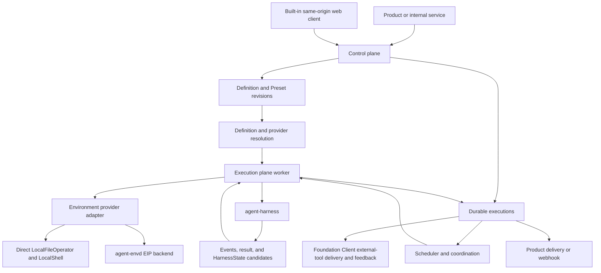

# Foundation Service Overview

## Design Position

`foundation-service` is the optional hosted control and execution service for Agent Foundation. It turns an accepted Agent definition source into an immutable materialized definition revision, durably accepts root or asynchronous subagent work against an exact path in that revision, and delegates one process-local Attempt at a time to `agent-harness`.

The service adds hosting, coordination, persistence, and policy around the Harness. It does not add another Agent loop, Harness plugin or Pydantic Capability lifecycle, tool runtime, Environment state model, process-local result contract, or platform-owned Sandbox subsystem. An execution worker selects a Host provider adapter that returns a fresh Harness binding. Direct-local adapters use first-class `LocalFileOperator` and `LocalShell`; Docker, E2B, remote, and optional local-daemon adapters use the equally first-class `agent-envd` EIP backend.



## Major Components

| Component                   | Owns                                                                                                                                                 | Explicit boundary                                                                                                                                                                            |
| --------------------------- | ---------------------------------------------------------------------------------------------------------------------------------------------------- | -------------------------------------------------------------------------------------------------------------------------------------------------------------------------------------------- |
| Definition control          | Definition sources, typed Presets, immutable revisions, dependency locks, provenance, and selection                                                  | Produces the canonical `AgentDefinition`; never stores live clients or plaintext credentials                                                                                                 |
| Durable execution lifecycle | Accepted root and asynchronous child work, selected definition target, fenced Attempts, checkpoints, recovery, completion, and cancellation          | A Harness terminal result is only a candidate until the service commits its own transition                                                                                                   |
| Subagent hosting            | Idempotent spawn, exact child-path derivation, durable task coordination, child control, result retention, wake-up, and delivery ledger              | Spawn is an ordinary parent tool result; child completion is later Host input, never deferred completion                                                                                     |
| Scheduler and coordination  | Runnable work, leases, wakeups, maintenance, and worker ownership                                                                                    | Coordination delivery is not an independent durable execution authority                                                                                                                      |
| Execution API and events    | Foundation Client resources, idempotent acceptance and commands, lifecycle event replay, and delivery projections                                    | Streams, webhooks, and queues never replace the durable Execution authority                                                                                                                  |
| Built-in web client         | Immutable browser assets and same-origin projection of control-plane APIs in the shared image                                                        | Owns no durable lifecycle, authorization, persistence, or execution fact; execution-only processes do not serve it                                                                           |
| Usage recording             | Idempotent per-response observation identity, lineage, actual cost source, pricing coverage and revision, and rebuildable estimates                  | `RunUsage`, durable records, billing, and payment are distinct facts                                                                                                                         |
| Execution worker            | Export-lock and opaque-catalog verification, provider selection, fresh run bindings, Harness consumption, checkpoints, and terminal commit proposals | Uses public Harness and EIP boundaries; never handles extension classes and does not interpret provider-native state                                                                         |
| Hosted service plugins      | Ingress, storage, lifecycle projection, connectors, and hosted policy outside the Harness run                                                        | Agent-affecting boundary middleware enters through definition-level Harness plugin specs and locked export IDs resolved by the Harness facade; inner behavior uses Capabilities and Toolsets |
| Client-tool lifecycle       | Accepted external-tool attachment, durable pending batch, authenticated delivery, feedback, and resume                                               | Client owns the side effect; Harness and `agent-envd` execute no client handler                                                                                                              |

## Definition-to-Execution Flow

```mermaid
sequenceDiagram
    participant Caller
    participant Control
    participant Catalog as Preset and artifact catalogs
    participant Worker
    participant Provider as Environment provider adapter
    participant Harness

    Caller->>Control: submit inline definition or exact Preset input
    Control->>Catalog: resolve typed Preset and dependency revisions
    Catalog-->>Control: typed contributions and candidate locks
    Control->>Control: compose effective definition document
    Control->>Harness: compile through opaque catalog; receive definition, manifest, and required export IDs
    Control->>Control: lock exports and commit immutable definition revision
    Caller->>Control: request work against selected revision
    Control->>Control: durably accept and schedule execution
    Worker->>Control: acquire selected revision and attempt
    Worker->>Worker: verify export locks; reconstruct opaque catalog; resolve model plans, native inputs, and build Capability instances
    Worker->>Harness: catalog-bound build of ResolvedAgentDefinition
    Worker->>Provider: provision or attach with selected adapter lifecycle record
    Provider-->>Worker: fresh direct-local, EIP-backed, or mixed EnvironmentRunBinding
    Worker->>Worker: bind Identity, policy, credentials, checkpointing, telemetry, and permitted client tools for this run
    Worker->>Harness: run with fresh RunBindings
    Harness->>Harness: bind fresh plugins and execute the ordered run chain
    Harness-->>Worker: events, validated result, usage, and optional HarnessState
    Worker->>Control: commit checkpoint, durable deferred wait, or terminal transition
    Control-->>Caller: host-owned status or delivery
```

Preset materialization and definition revision commit complete before a durable Execution selects its exact root or child path. Definition control selects stable extension export IDs, calls the Harness definition compiler through an opaque catalog, and stores only its class-free manifest plus exact export/artifact locks. Execution-time build resolution verifies that closure, reconstructs a matching opaque catalog, and passes neither registrations nor plugin/Capability classes through `ResolvedAgentDefinition`; it also compiles authority-neutral model-integration plans, may select only attested credential-free Models, and can select reentrant provider clients without mutating the selected definition. The catalog-bound Harness builder defensively recompiles the definition, constructs and stable-ID-orders plugin instances, and injects their Capability contributions before the one native `Agent.from_spec()` call. A model integration that needs current Identity, policy, credentials, revocation state, or a continuation route pin realizes its locked logical selection through exactly one fresh run Capability. Current-run Identity, Environment, task-state binding, inline child binding, Foundation asynchronous-subagent submission, checkpoint, telemetry, and all other authority likewise enter through `RunBindings` and never enter the immutable executable. The executable owns only the immutable child topology projected into each run context; that topology grants no submission authority. The first-party Client Tools Capability can additionally permit a typed whole-run replacement of external tool declarations through `ClientToolRunBinding`; those declarations contain no handler or authority and are frozen with the accepted execution for exact deferred resume.

A durable Attempt can retain an opaque, versioned provider-adapter lifecycle record so a later worker can attach or resume an optional local daemon, Docker container, E2B environment, or other vendor resource before constructing the next binding. Direct-local roots normally need no provider lifecycle record. This record is outside `HarnessState`; the service applies storage encryption, size limits, retention, and deletion, while the adapter exclusively owns its schema, validation, migration, and lifecycle meaning. The service stores backend-local `EnvironmentState` only as opaque bytes inside complete Harness checkpoints under the same generic custody controls; each direct or EIP backend codec owns those bytes' semantics.

[Durable Execution Lifecycle](03-execution-lifecycle.md) defines one stable root or child `Execution` across monotonic, fenced Attempt generations and a separate durable delivery ledger between child and parent work. [Execution API and Durable Events](04-execution-api-and-events.md) defines idempotent acceptance and command receipts plus replayable committed events; transient queues, live Harness streams, SSE, WebSocket, and webhooks remain projections. [Usage Recording and Cost Estimation](05-usage-accounting.md) defines one idempotent record per newly produced model response and Foundation-selected pricing injection without turning terminal `RunUsage` into a bill.

## Asynchronous Subagent Hosting

The Harness builds complete child definitions into an immutable `SubagentCollection`, projects that authority-neutral collection into every fresh parent `AgentContext`, and provides State-backed blocking inline delegation. When the materialized parent definition selects the Foundation asynchronous-subagent Capability, the Capability reads that collection during its run lifecycle to define a stable model-visible Host tool surface, while a separate fresh run-bound Capability owns the current Execution authority and typed service collaborator. The locked extension export registers both the behavior and the adapter's stable Host-bound run role, catalog-internal type, and fixed ID. Foundation run assembly names that role in `RunBindings.required_run_capability_roles` and supplies exactly one fresh adapter. Catalog-bound setup validates the input before Pydantic binding and the finalized replacement after concurrent `for_run()` binding; absence, duplication, or incompatibility fails before model work without child submission. The behavior Capability obtains the peer anew from finalized `RunContext.capabilities` by fixed ID and expected type, so neither it nor its plugin factory captures current authority or caches a sibling replacement. The service never injects an undeclared model-visible subagent surface solely because it is hosting the run. A successful spawn atomically creates or returns one independent child `Execution` under the selected parent revision and derived child path, then returns an ordinary receipt to the parent model. The parent Attempt remains runnable and never enters `waiting` merely because the child is still active.

The child worker resolves the derived target into that child's complete locked definition, verifies the revision's graph-wide export closure and matching opaque catalog, and resolves its tools, Toolsets, explicit Capability instances, output, and nested graph. The child has its own Agent instance, Agent-bound plugin graph, fresh run-bound plugins, Attempts, checkpoints, `HarnessState`, usage records, policy evaluation, and terminal state. It never receives the parent's live plugin instance or chain, `RunBindings`, Environment, credentials, or client-tool attachment by inheritance. When asynchronous or inline parent and child Agents coordinate on tasks, their definitions use provider-backed Working State and the service binds each Agent instance in the current Attempt to its authorized durable task scope. Agent-originated mutations require the current Attempt fence, derive ownership from trusted stable Agent instance identity, and use durable operation receipts plus revision compare-and-swap. Workers do not share a Python `TaskStateCell`, and Harness State contains neither the durable task map nor its scope selector.

A child terminal commit also creates one immutable result and one durable delivery ledger entry. The service may route it to one exact active parent Attempt through a typed internal enqueue, retain it for explicit status or later consumption, or atomically consume it into a newly accepted continuation Execution with typed predecessor/source lineage and selected parent state. It never maps the completion to `DeferredToolResults`, satisfies the original spawn tool-call ID, or reopens a terminal parent Execution.

## Authority and Completion

| Fact                                            | Authority                                                     |
| ----------------------------------------------- | ------------------------------------------------------------- |
| Accepted definition source                      | Control plane                                                 |
| Materialized definition revision                | Definition control                                            |
| Installed extension export/artifact or provider | Operator-selected artifact catalog and exact revision lock    |
| Process-local plugin and Agent construction     | Harness and Pydantic AI                                       |
| Process-local result and state                  | Harness                                                       |
| Durable checkpoint selection                    | Hosted execution lifecycle                                    |
| Durable execution completion                    | Hosted execution lifecycle                                    |
| Durable lifecycle event                         | Hosted execution lifecycle transaction                        |
| Model-usage record and estimate                 | Usage recording subsystem                                     |
| External delivery                               | Product or connector that commits the delivery fact           |
| Client-side tool action                         | Authenticated external executor and the system it affects     |
| Client-tool pending/result fact                 | Hosted execution lifecycle                                    |
| Async subagent child lifecycle                  | Child Execution and Attempt records                           |
| Async subagent task coordination                | Foundation durable task scope                                 |
| Child-result retention/delivery                 | Foundation subagent delivery ledger                           |
| Environment-local side effect                   | Environment provider and the external system that performs it |

Definition acceptance, Preset materialization, Execution or subagent-spawn acceptance, Harness completion, durable deferred-call commit, client-side action, result-submission acceptance, child terminal commit, child-result routing or incorporation, durable Host completion, and external delivery are independent boundaries. Later observations do not retroactively commit an earlier authority's state. [Client-Side Tools](02-client-side-tools.md) owns the hosted external-tool flow.

## Extension Boundary

Agent behavior is configured by the materialized `AgentDefinition`, including Harness `PluginSpec` values and nested Pydantic Capability specs, plus resolved native tools and Toolsets. Hosted service plugins operate outside the Harness run and can contribute typed Preset catalogs, approved stable extension-export/artifact candidates, provider resolvers, or typed providers that supply fresh run Capability instances for definition-selected Host behavior. Foundation business code still does not receive catalog extension classes, construct or execute the Harness plugin chain, silently mutate an immutable definition revision, or activate an undeclared plugin or Capability surface during execution.

Provider resolution can vary reentrant authority-neutral clients while preserving the selected logical definition. Short-lived credentials, model-selection policy, and policy grants are resolved through the current run's bindings rather than stored in the build plan. Any change to model or tool configuration that changes the materialized Agent behavior creates a new definition revision.

## Stable Principles

01. One immutable materialized definition revision is selected before durable work starts.
02. Presets are deterministic authoring inputs, not runtime inheritance or authority.
03. Definition-level plugin specs, a class-free catalog manifest, and exact export locks remain durable. The live class-bearing catalog stays opaque inside the Harness compiler/builder; process-local models, native tools, Toolsets, and explicit reentrant build-Capability instances enter `ResolvedAgentDefinition` without type registries.
04. Identity, Environment, policy, credential, child submission, checkpoint, telemetry, and every other execution-scoped authority enter through fresh `RunBindings`; the executable-owned child topology projected into `AgentContext` grants none of them.
05. Environment provider adapters expose direct-local and EIP-backed bindings as first-class peers; the service defines no Sandbox resource and has storage custody, not semantic ownership, over opaque adapter lifecycle and backend-local state.
06. One durable Execution spans fenced, monotonic Attempt generations; stale workers cannot advance checkpoints or lifecycle.
07. Durable acceptance and lifecycle event append commit before ephemeral scheduling or delivery can claim success.
08. The execution plane consumes the public Harness contract and does not duplicate plugin construction, the Pydantic Agent loop, or result validation.
09. Harness completion, Host durable completion, event or webhook delivery, telemetry, durable usage recording, billing, and payment remain separate facts.
10. The built-in web client is a replaceable control-plane projection over the first-party HTTP namespace and never becomes lifecycle authority.
11. Minimal and distributed deployments use the same durable semantics; storage and coordination adapters can differ.
12. Client-side tools use native external deferral; the service durably fences authenticated feedback, while Foundation Client owns local execution and `agent-envd` remains uninvolved.
13. Asynchronous subagents use independent Foundation Executions and a durable delivery ledger; spawn returns normally and never reuses Pydantic deferred-tool continuation.

## Trade-offs

### Materialized definitions vs. late Preset evaluation

Persisting the complete materialized `AgentDefinition` makes execution, recovery, inspection, and comparison independent from later Preset edits. It consumes more durable storage than retaining only a Preset reference, but definitions are small and reproducibility is more important than deduplicating their configuration bytes.

### Host resolution vs. persisted live configuration

Resolving clients, credentials, policy, and Environment bindings at execution time preserves revocation and deployment portability. A definition revision therefore identifies logical behavior and locked artifacts without claiming that live infrastructure remains unchanged.
