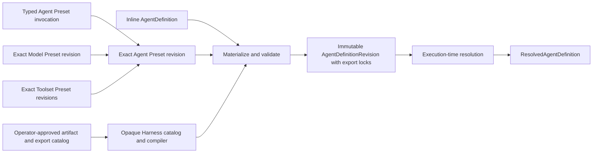
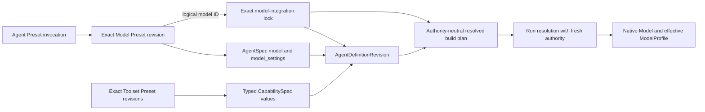

# Agent Definitions and Presets

## Design Position

The hosted authoring surface produces one canonical, complete [`AgentDefinition`](../agent-harness/03-agent-definition-and-build.md#agentdefinition). Users submit either that definition inline or an exact typed Preset invocation. The control plane materializes the input once through a catalog-bound Harness definition compiler and commits an immutable `AgentDefinitionRevision` containing the complete definition, a class-free Harness catalog manifest, exact extension export locks, and the remaining dependency provenance. Foundation Service selects stable artifact/export IDs but never constructs, transports, or interprets plugin or Capability Python classes.

A Preset is an authoring mechanism. It does not survive as an unresolved runtime inheritance layer, grant authority, resolve credentials, or replace the canonical definition. Model and Toolset Presets contribute typed sections to an Agent Preset; the final effective view is always one materialized `AgentDefinition`.



## Definition Source

The following Python-like models are conceptual typed contracts rather than a serialized API schema.

```python
class PresetRevisionRef(BaseModel):
    preset_id: str
    revision_id: str


class InlineAgentDefinitionSource(BaseModel):
    definition: AgentDefinitionDocument


class AgentPresetInvocation(BaseModel):
    definition_id: str
    preset: PresetRevisionRef
    parameters: Mapping[str, JsonValue] = Field(default_factory=dict)
    model_preset: PresetRevisionRef | None = None
    toolset_presets: tuple[PresetRevisionRef, ...] | None = None


type AgentDefinitionSource = (
    InlineAgentDefinitionSource | AgentPresetInvocation
)
```

Every stored `PresetRevisionRef` names one immutable revision. An API can accept a human-friendly selector, but the control plane resolves it to an exact revision before materialization and records that exact reference. `definition_id` becomes the final materialized definition identity and replaces the baseline's template-local identity; it is not a parameter target. `toolset_presets=None` selects the Agent Preset defaults, while an explicit tuple replaces the complete default Toolset Preset selection; it never performs an implicit list merge.

Inline input already contains the complete logical definition as a raw JSON object document and uses its `definition_id` unchanged after Harness compilation. In every committed revision, `AgentDefinitionRevision.definition_id` equals `AgentDefinition.definition_id` and the identity selected by the source; materialization cannot alias one logical definition ID to another. The Foundation request envelope does not parse `InlineAgentDefinitionSource.definition` as the base `AgentDefinition` model before the Harness compiler; its OpenAPI/authoring schema embeds the compiler-produced definition schema and preserves the raw object until dynamic plugin dispatch completes. Preset input contains only declared typed parameters and typed component-Preset selections. It has no generic `overrides`, JSON Merge Patch, arbitrary deep merge, inheritance chain, ambient environment substitution, or executable Python import path.

## Preset Kinds

All Preset kinds share immutable revision identity, provenance, compatibility metadata, and catalog lifecycle. Their payloads and materialization semantics remain typed by kind.

| Kind           | Typed contribution                                                                                                           | Excludes                                                                                                                                     |
| -------------- | ---------------------------------------------------------------------------------------------------------------------------- | -------------------------------------------------------------------------------------------------------------------------------------------- |
| Agent Preset   | Complete canonical baseline `AgentDefinitionDocument`, declared parameter targets, and default Model and Toolset Preset refs | Live clients, credentials, policy grants, Environment bindings, arbitrary patches, and multiple bases                                        |
| Model Preset   | One logical model ID and complete canonical `DurableModelSettings` contribution                                              | Agent-level profile overrides, `ModelProfileSpec` callables, Python types, raw headers, clients, secrets, mutable health, and request policy |
| Toolset Preset | Ordered Pydantic `CapabilitySpec` values with stable explicit Capability IDs                                                 | Python objects, package installation, credentials, implicit tool authority, and generic config bags                                          |

An Agent Preset has at most one baseline. Shared composition uses typed Model and Toolset Preset references rather than multiple Agent Preset inheritance. A Toolset Preset configures the owning Capability types; it does not recreate a parallel Toolset plugin lifecycle.

```python
type DurableModelSettings = Mapping[str, JsonValue]


class ModelPresetRevision(BaseModel):
    ref: PresetRevisionRef
    model: str
    model_settings: DurableModelSettings | None = None


class ToolsetPresetRevision(BaseModel):
    ref: PresetRevisionRef
    capabilities: tuple[CapabilitySpec, ...]
```

These are declarative values. `DurableModelSettings` is a recursively JSON-safe authoring value that is validated and normalized through the selected model integration before it is placed in `AgentSpec.model_settings`; it is not the unrestricted upstream `dict[str, Any]`. A Model Preset does not contain a Pydantic `Model` instance, and a Toolset Preset does not contain Python tools or Toolset objects. It also does not copy `ModelProfileSpec`: that contract belongs to native Model construction, can contain callables and Python types, and is not an `AgentSpec` field. Provider facts and trusted native build inputs remain execution-resolution data.

### Typed Agent Parameters

An Agent Preset declares each parameter with a value schema and one exact leaf target in its baseline definition. Every declared parameter is required; defaults already live in the valid baseline and omission is expressed by declaring no parameter for that leaf. Parameter names and targets are each unique within a Preset revision, so tuple order never creates last-writer-wins behavior. The target uses an RFC 6901 JSON Pointer and replaces the complete value at that path. It cannot address definition identity, `agent.model`, `agent.model_settings`, Capability list membership, Capability serialization type or ID, subagent list membership, Environment requirement operation set, revision provenance, dependency locks, credentials, or process-local fields. Model and Toolset selection use their typed invocation fields; structural customization uses another Preset revision or inline definition.

```python
class AgentPresetParameter(BaseModel):
    name: str
    value_schema: JsonSchema
    target: JsonPointer


class AgentPresetRevision(BaseModel):
    ref: PresetRevisionRef
    baseline: AgentDefinitionDocument
    parameters: tuple[AgentPresetParameter, ...] = ()
    default_model_preset: PresetRevisionRef | None = None
    default_toolset_presets: tuple[PresetRevisionRef, ...] = ()
```

The baseline is `DefinitionCompilation.document` previously produced by a catalog-bound Harness compiler when the Agent Preset revision was accepted. Preset storage never attempts to parse that document through the static outer `AgentDefinition` field annotation; every later materialization preserves it as raw canonical JSON until the selected compiler performs dynamic plugin dispatch. The baseline is valid with its defaults. Parameter values can replace declared non-structural leaves such as a prompt, threshold, limit, feature flag, portable `PluginSpec` argument, or portable Capability argument, but cannot add undeclared paths, interpolate substrings, execute expressions, conditionally rewrite the document, or alter object or list structure. A parameter cannot target a Capability contributed by a separately selected Toolset Preset or a plugin absent from the Agent Preset baseline because that value is not part of the parameterized baseline.

This restricted substitution is intentionally less expressive than a template language. It gives every accepted input a generated schema and deterministic target while keeping the materializer independent from Jinja, shell variables, Python evaluation, and undocumented merge precedence.

## Component Contributions

A Model Preset replaces `AgentDefinition.agent.model` and the complete `agent.model_settings` value as one unit. An invocation-selected Model Preset replaces the Agent Preset default. No field-level deep merge occurs; provider-specific non-secret request settings stay within the selected integration-validated `DurableModelSettings` value.

Each logical model ID in the complete materialized root-and-child graph resolves against one exact Host model-integration revision. That integration owns the Pydantic model class, provider/adapter construction rules, permitted routing envelope, trusted declarative profile input, profile validation, and executable artifact lock needed to construct a native `Model`. The lock does not freeze a live endpoint, credential, or target model: permitted run-specific routing can return different native Models, and each returned Model resolves the profile appropriate to its actual provider/model/adapter. Changing those compatibility-construction rules requires a new integration revision; fixed variants that coexist as separate author choices use distinct logical model IDs. Agent policy and dynamic transformations remain typed Capabilities rather than profile data.

### Model Integration Revisions

A model integration revision is an immutable Host catalog entity, not a fourth Preset kind or an Agent field. Its installed integration type owns a discriminated, JSON-safe configuration schema for logical model membership, native model/provider/adapter construction, permitted route classes, the strict durable-settings schema for each logical model, and any declarative profile inputs or named trusted profile collaborators. It also names the stable Harness extension `export_id`, run-Capability registration name, and fixed Capability ID that realize its reserved fresh run role; the name and ID must equal that export manifest's class-free role entry, while the Python class remains catalog-internal. The common catalog envelope owns integration identity, revision, artifact locks, digest, and lifecycle; it does not flatten every provider into one generic config mapping.

The durable configuration contains no client object, callable, Python type, credential, endpoint health, tenant route decision, or current policy result. The trusted integration artifact compiles the validated compatibility data and named collaborators into a stable native dict or callable `ModelProfileSpec` when needed. At resolution, it combines that construction contract with the permitted target and fresh run authority to construct the native Pydantic `Model`; current Identity or policy can select a route but cannot rewrite compatibility facts. Foundation Service does not interpret, merge, or partially override profile keys. A profile input invalid for that model/provider/adapter fails integration-revision validation or model construction instead of falling back to guessed defaults.

Within one materialization catalog snapshot, a logical model ID resolves unambiguously to one accepted integration revision. Inline definitions and Preset-derived definitions use the same lookup and dependency lock. Updating routing rules, adapter artifacts, profile construction, or typed integration configuration publishes another integration revision; existing Agent definition revisions continue to name the old lock.

### Unified Model Preset Path

An Agent Preset invocation has at most one effective Model Preset selection: an invocation revision replaces the Agent Preset default, and if neither exists the complete baseline model and settings remain. Authors never select model, settings, and profile independently. When selected, the Model Preset contributes the root logical model ID and complete default request settings; every logical model ID in the resulting graph binds an exact model integration and its native profile construction contract as a dependency; optional behavior remains in the Agent or Toolset Preset's typed Capability specs. There is no Profile Preset kind, Agent-level profile patch, or cross-layer last-writer-wins merge.



This keeps reusable request tuning in Model Presets while allowing operators to correct or extend compatibility by publishing a model-integration revision. Moving a compatibility fact upstream into Pydantic AI changes the integration implementation and lock, not every Agent schema. Adding Agent behavior changes the owning Capability spec, not the model profile.

The durable model-settings contract is narrower than upstream `AgentSpec.model_settings` and `ModelSettings`. For each logical model, the locked integration publishes one strict schema and canonicalizer covering the safe setting subset accepted by every target in its permitted routing envelope. A target-specific request setting requires a distinct logical model or an integration-owned typed setting that deterministically constrains routing; it cannot rely on a provider silently ignoring an incompatible key.

Validation recursively accepts only `JsonValue`, rejects unknown or misspelled keys, and normalizes equivalent values to one canonical JSON representation before definition hashing. It rejects `extra_headers`, `extra_body`, other passthrough request-body or header bags, non-JSON timeout/client objects, and every field that can carry authorization tokens, API keys, cookies, proxy credentials, or another secret. An integration may expose a narrower explicitly typed JSON field only when its schema fixes the exact provider meaning and secret policy; it cannot reopen an arbitrary map. The same validation applies to inline `AgentDefinition` input, Agent Preset baselines, and Model Presets before source or materialized bytes are committed.

A hosted integration constructs every native Model with `Model.settings=None`. All durable static request defaults live in the materialized `AgentSpec.model_settings`; otherwise the Model Preset's whole-replacement and inspectability guarantees would be false. Typed Capabilities may still contribute documented dynamic request intent through Pydantic's normal merge order, but the hosted Harness API exposes no arbitrary per-run model-settings bag. Runtime headers and credentials enter through the fresh run-bound model integration, never through a logical secret reference embedded inside settings.

A Toolset Preset contributes ordered `CapabilitySpec` entries to `AgentDefinition.agent.capabilities`. Harness plugin specs remain explicit fields of the complete Agent Preset baseline or inline `AgentDefinition`; Toolset Presets cannot silently add outer run middleware. The invocation-selected Toolset Preset tuple replaces the Agent Preset default tuple. Entries are appended in declared Preset order after baseline capabilities, and every contributed entry has an explicit stable Capability ID. This can include the first-party Client Tools Capability's portable default external-tool declarations and explicit run-replacement policy or the Foundation asynchronous-subagent Capability's presentation configuration. The latter reads the immutable built collection from each fresh `AgentContext` and does not add an execution mode to child declarations; current submission authority still enters through a separate fresh run Capability that owns its typed service collaborator. The same locked Foundation extension export registers the definition-selectable behavior and its stable Host-bound adapter role, whose class-free manifest entry fixes the role name and Capability ID while keeping the concrete type catalog-internal. The definition stores neither the adapter nor its authority; Foundation execution assembly names the required role in fresh `RunBindings`. Neither Capability spec includes a client handler, service credential, live connection, or execution grant. Duplicate IDs, conflicting serialization types for one ID, duplicate model-visible tool names, and duplicate managed tool IDs fail materialization or build at the earliest owning validation boundary; they are never resolved by last-writer-wins behavior.

Capability and plugin arguments contain portable behavior configuration and typed logical references. Foundation selects operator-approved stable Harness export IDs and exact artifact revisions; a Harness-owned loader retains the corresponding Capability and plugin classes behind an opaque catalog. The catalog-bound compiler returns the canonical definition and exact referenced export IDs. Foundation locks those IDs but never builds registration tuples, `custom_capability_types`, class refs, or configured plugins. Secrets and live provider collaborators are resolved only after an execution selects the definition revision. A plugin spec selects no Python import path and grants no run authority.

## Materialization

```mermaid
sequenceDiagram
    participant Caller
    participant Control
    participant Catalog
    participant HarnessCompiler as Harness definition compiler

    Caller->>Control: inline definition or exact AgentPresetInvocation
    Control->>Catalog: load exact Agent, Model, and Toolset Preset revisions
    Catalog-->>Control: typed immutable contributions
    Control->>Control: select complete component refs
    Control->>Control: compose baseline, component contributions, and declared parameters
    Control->>Catalog: select logical models and operator-approved Harness export IDs
    Catalog-->>Control: exact model-integration and artifact candidates
    Control->>HarnessCompiler: compile complete definition through opaque selected catalog
    HarnessCompiler-->>Control: canonical definition, class-free manifest, required export IDs
    Control->>Catalog: union definition and model-run export IDs; bind exact artifact locks
    Control->>Control: compute canonical digest and commit immutable revision
```

Materialization proceeds in this order:

1. Resolve every supplied selector to an exact Preset revision and validate the Preset-kind relationship.
2. Start from the one complete already compiled Agent Preset baseline, or preserve the inline raw definition document for compiler dispatch.
3. For Preset input, select the invocation Model and Toolset Presets when present; otherwise use the Agent Preset defaults.
4. Validate and apply every declared leaf-value parameter substitution to the Agent Preset baseline; reject missing or unknown parameters and any duplicate name or target in the Preset revision.
5. Replace model and complete model settings, then append Toolset Preset Capability specs in selected order.
6. Resolve every logical model ID to one exact compatible model-integration revision, validate and canonicalize its model-settings value, and collect the stable Harness export ID and named run-Capability role declared by each integration. Select one operator-approved Harness catalog snapshot whose stable export IDs cover those roles plus the permitted plugin and declarative Capability names for the complete finite graph.
7. Ask that catalog's `HarnessDefinitionCompiler` to parse and validate the complete definition. The compiler dynamically dispatches concrete plugin specs before base-model parsing can discard fields, preserves the nested native `AgentSpec` and `CapabilitySpec` values, recursively validates children, and returns the canonical definition, class-free manifest, and exact referenced export IDs.
8. Union the compiler-referenced export IDs with every selected model integration's run-Capability export ID. Project the catalog manifest to that exact union, bind every ID to one installed artifact revision and digest, reject missing or ambiguous bindings, canonically serialize the definition, compute its digest, and atomically commit the revision with all Preset, model-integration, Harness export, and other artifact dependency locks.

Materialization performs no package installation, network-backed secret lookup, provider-client construction, Environment allocation, or policy grant. Catalog reads needed to obtain already accepted immutable revisions complete before the database transaction that commits the new definition revision.

## AgentDefinitionRevision

```python
class DefinitionDependencyLock(BaseModel):
    kind: Literal[
        "agent_preset",
        "model_preset",
        "toolset_preset",
        "model_integration",
    ]
    logical_id: str
    revision: str
    digest: str | None = None


class HarnessExportLock(BaseModel):
    export_id: str
    artifact_id: str
    artifact_revision: str
    artifact_digest: str


class AgentDefinitionRevision(BaseModel):
    definition_id: str
    revision_id: str
    source: AgentDefinitionSource
    definition: AgentDefinitionDocument
    harness_catalog: HarnessCatalogManifest
    harness_exports: tuple[HarnessExportLock, ...]
    dependencies: tuple[DefinitionDependencyLock, ...]
    definition_digest: str
```

A revision stores source provenance, the complete canonical materialized `AgentDefinitionDocument`, the class-free Harness catalog manifest projected to all definition-referenced and model-integration-required exports, exact Harness export locks, and remaining dependencies. Execution, retry, recovery, comparison, and export read the canonical `definition` document; they never rematerialize the source against a newer Preset or extension catalog. A process that needs the typed view first reconstructs the locked catalog and calls `HarnessDefinitionCompiler.compile(definition)`; no generic ORM or request model may deserialize this field directly as `AgentDefinition`. `source` explains how the definition was authored. `harness_exports` binds every compiler-reported or selected model-integration-required `export_id` exactly once to an installed artifact revision and digest covering root and child Harness plugins, declarative custom Capabilities, reserved run-Capability roles, and their declared executable closure. `dependencies` records exact Preset and model-integration revisions. The model-integration locks fix compatibility/profile construction contracts while allowing fresh credentials and permitted live routing; no manifest or lock grants execution authority.

The digest covers the producing service's canonical serialization of the complete materialized definition. It is an opaque integrity and audit value within that service's schema-and-canonicalizer compatibility domain, not a protocol-wide content identity, revision ID, cache key, or cross-implementation equality claim. Consumers compare digests only when the producer declares the same canonicalization compatibility. Dependency and export locks remain explicit because two installations can provide different trusted Harness plugin, Capability, native Toolset, tool-adapter, model-adapter, or profile construction for identical declarative Agent bytes. `HarnessCatalogManifest` names serialization-to-export availability but is not executable and carries no class. Revision selection binds the definition snapshot, exact export locks, and remaining dependency set.

The materialized recursive definition contains complete children but no per-edge execution mode, hosted submission reference, or Harness `source_ref`. Foundation Service identifies any executable node with an exact `AgentDefinitionTarget` composed of this revision and an immutable authored-name path from its root; the root path is empty. When accepting an asynchronous child Execution, the service derives the next path from the authenticated current parent target and selected immediate child name, then validates the embedded child bytes against the revision's graph-wide Harness export closure and the child path's model-integration dependencies. It never accepts a caller-supplied independent child revision as a substitute. Inline Harness execution and Foundation asynchronous execution therefore use identical Agent bytes and model-integration/artifact locks without encoding Host lifecycle in `SubagentDefinition`.

The revision contains no plaintext secret, provider client, Python type, Toolset object, Environment binding, client handler, accepted run-specific client-tool attachment, policy decision, caller identity, execution state, or `ResolvedAgentDefinition`. Those values are selected or constructed at execution time. Client-tool defaults and `allow_run_override` remain ordinary typed Capability configuration in the complete definition; any exact replacement is stored with the accepted execution rather than patched back into this revision.

## Resolution Boundary

After an Execution selects one immutable definition target, build resolution verifies every root and child model-integration and artifact lock and reconstructs one live `HarnessCatalog` from the exact locked export IDs. It compares the catalog's runtime compatibility ID and class-free export manifest with the revision, calls that catalog's compiler on the durable definition document to recover one typed `AgentDefinition`, gives only that process-local typed value to the catalog-bound builder, and never extracts internal classes, spec decoders, registrations, or factories. It also compiles one authority-neutral `ResolvedModelIntegration` descriptor per node using a stable registered run-Capability name and fixed ID rather than a class; constructs only credential-free Models whose possession grants no current-run authority; constructs trusted native tools and Toolsets; accepts explicit authority-neutral integration-produced build Capability instances without selecting their classes; derives the process-local output type; recursively resolves complete child plans; and produces the process-local [`ResolvedAgentDefinition`](../agent-harness/03-agent-definition-and-build.md#resolvedagentdefinition). The service remains authoritative for the durable revision, export/artifact closure, stable export-ID selection, and target path outside that Harness plan and uses those facts for child acceptance and audit. The Harness remains authoritative for definition recompilation, custom Capability type resolution, configured plugin construction, validation, ordering, run binding, middleware execution, and the final internal `Agent.from_spec()` call. It may copy one opaque target provenance value into the selected plan root's optional `source_ref`; no authored or resolved child edge carries a separate Host submission reference.

Extension factories construct no configured plugin instance in Foundation Service and retain no current-run Identity, credential, policy result, or other authority; the Harness invokes them during build. A normal hosted provider Model is not constructed during that phase. A node that retains its logical ID is built with Pydantic's public `defer_model_check=True` and is not passed through native `Agent.__aenter__()` before a run, preventing eager ambient inference while the run resolver is absent. At each run, the Host supplies exactly one fresh Capability matching the node's stable registered model-integration name and fixed ID through `RunBindings`; the Harness verifies its concrete type through the private catalog. After `AgentContext`, current policy, any continuation route pin, and credentials exist, that Capability returns an allowed native Pydantic `Model` with its effective `ModelProfile` or raises; it never declines to ambient inference. Other model ID resolvers, `get_model()` contributors, explicit run-model overrides, and hooks that replace the selected Model are prohibited in the hosted profile. Identity, Environment, policy, credentials, checkpointing, telemetry correlation, and every other execution-scoped authority remain fresh run inputs.

Resolution cannot mutate or silently patch the materialized definition, construct a configured plugin in Host code, activate an undeclared plugin, inject an undeclared model-visible component, omit a required declared component, or bypass the locked model integration. The only dynamic model-visible schema exception is an exact external client-tool whole-list replacement explicitly authorized by the materialized Client Tools Capability. The control plane validates and freezes that typed attachment with one accepted execution, and the Harness maps it only to per-run Pydantic `ExternalToolset` values; it cannot introduce server code or authority. If a compatibility repair changes model settings, plugin or Capability configuration, Environment requests, or child definitions, the control plane creates another definition revision. Rebinding a logical model to an allowed live provider client or refreshing short-lived credentials does not change the logical definition.

## Failure Semantics

| Failure                                                                                                                   | Result                                                                                                   |
| ------------------------------------------------------------------------------------------------------------------------- | -------------------------------------------------------------------------------------------------------- |
| Unknown, deleted, or wrong-kind Preset revision                                                                           | Materialization stops before revision commit                                                             |
| Unknown, missing, duplicate, or invalid parameter                                                                         | Field-local validation failure; no partial definition is stored                                          |
| Parameter target absent, duplicate, protected, or type-incompatible                                                       | Preset revision or invocation is rejected                                                                |
| Unknown, non-JSON, passthrough, route-incompatible, or secret-bearing model setting                                       | Integration-owned validation fails before Preset or definition bytes are committed                       |
| Duplicate Harness plugin or Capability identity, unknown serialization name, or conflicting contribution                  | Compiler or Harness build fails deterministically; no last-writer-wins merge                             |
| Missing, ambiguous, or untrusted Harness export/artifact binding                                                          | Definition revision is not accepted and no live class fallback is attempted                              |
| Harness runtime compatibility ID differs from the committed manifest                                                      | Worker rejects the revision before compiler or extension construction                                    |
| Definition validation failure                                                                                             | No revision is committed                                                                                 |
| Commit conflict or database failure                                                                                       | No successful revision identity is returned and no partial revision becomes selectable                   |
| Missing, duplicate, invalid, or incompatible locked model integration or reserved run Capability                          | Materialization, build, or run setup fails before provider dispatch; no profile or Model is guessed      |
| Deferred logical ID reaches eager Agent construction or Agent-level entry                                                 | Build or executable entry fails closed; ambient inference is never attempted                             |
| Resolver contract violation (`None`/decline), unauthorized model contributor, or target outside the locked route envelope | Run setup fails closed; Pydantic ambient inference is never attempted                                    |
| Execution-time provider, credential, route-pin, or policy resolution                                                      | The execution attempt fails before model-controlled work; the immutable definition revision is unchanged |

Errors identify the owning Preset, parameter, target, Harness plugin, model integration, or Capability without including secret values, private installation paths, or arbitrary plugin object representations.

## Compatibility

Preset revisions and Agent definition revisions are immutable. Changing a baseline, parameter schema or target, default component selection, Model Preset value, Harness plugin specs, Toolset Capability specs, model-integration profile construction, Harness runtime compatibility identity, or dependency lock creates a new revision. A model-integration change first creates a new immutable integration revision; selecting its new lock creates a new Agent definition revision rather than changing existing executions in place. Attempt scheduling selects a worker whose live catalog has the committed `runtime_compatibility_id`; an incompatible worker rejects rather than recompiling old bytes under new built-in semantics.

Additive fields in a typed Preset schema are compatible only when old materialized snapshots remain valid without rematerialization. Capability state compatibility remains owned by each Capability; selecting a newer definition revision does not imply that an older `HarnessState` can resume under it. The host explicitly selects or performs any required state migration.

## Boundaries

| Concern                                                                                                                 | Owner                                                                                  |
| ----------------------------------------------------------------------------------------------------------------------- | -------------------------------------------------------------------------------------- |
| Definition source, Preset revisions, materialization, revision identity, and dependency locks                           | Foundation Service control plane                                                       |
| Canonical `AgentDefinitionDocument` and catalog-compiled typed `AgentDefinition`                                        | [Agent Harness definition contract](../agent-harness/03-agent-definition-and-build.md) |
| Harness `PluginSpec`, extension export, opaque catalog/compiler, construction, and ordering                             | [Harness Plugin System](../agent-harness/05-plugin-system.md)                          |
| `AgentSpec`, native `ModelProfile`, and `CapabilitySpec` syntax                                                         | Pydantic AI                                                                            |
| Logical model integration revisions and profile construction configuration                                              | Host model-integration catalog                                                         |
| Capability configuration schema                                                                                         | Owning Capability type                                                                 |
| Harness extension, native Toolset, tool-adapter, and model-adapter artifact installation, exact export locks, and trust | Host catalog and operator                                                              |
| Stable Harness export selection, class-free manifest, and exact artifact locks                                          | Foundation definition resolver and artifact catalog                                    |
| Live plugin/Capability classes, spec decoders, registrations, and internal `custom_capability_types`                    | Opaque Harness catalog and catalog-bound compiler/builder                              |
| Process-local model, native tools, Toolsets, and explicit reentrant build Capability instances                          | Execution-time integration resolver and Harness build contract                         |
| Identity, Environment, policy, credentials, checkpointing, telemetry, and other run authority                           | Host `RunBindings` and owning providers                                                |
| Accepted run-specific external client-tool replacement and durable feedback lifecycle                                   | [Client-Side Tools](02-client-side-tools.md)                                           |
| Root/child target path derivation and asynchronous child Execution acceptance                                           | Foundation Service execution lifecycle                                                 |
| Definition migration and rollout                                                                                        | Foundation Service control plane                                                       |

## Trade-offs

### One materialized definition vs. layered runtime configuration

A complete snapshot avoids the former need to reconstruct effective behavior from Agent, model, tool, plugin, and deployment bags during every run. It duplicates small configuration values across revisions, but makes inspection, comparison, recovery, and execution deterministic.

### Typed substitution vs. generic templates

Declared whole-value targets cover common threshold, prompt, and feature choices without defining a general programming language. Reusable model selection uses the dedicated Model Preset field rather than a parameter target; an unchanged Agent Preset baseline or complete inline definition already carries its whole model-and-settings value. Compatibility profile selection follows the resulting logical model's locked integration. Complex conditional generation requires another Preset revision or inline definition, which is an accepted cost for predictable schemas and provenance.

### Component Presets vs. global ModelConfig and ToolConfig

Model and Toolset Presets contribute only the fields they own. A Model Preset selects a logical model integration but does not copy or override its compatibility profile. Portable feature behavior stays in Capability schemas; privileged clients and secrets stay in execution resolution. This removes global extensible configuration bags while preserving reusable model and tool bundles.

## Invariants

01. Every durable execution selects one immutable `AgentDefinitionRevision` before process-local build.
02. Every accepted revision contains one complete canonical `AgentDefinitionDocument`; execution reconstructs its typed `AgentDefinition` only through the locked catalog's compiler and never re-evaluates the Preset source.
03. Stored Preset dependencies name exact immutable revisions.
04. Preset composition has one Agent baseline, whole Model selection, whole Toolset selection, and required, uniquely named non-structural leaf parameters with unique targets; it has no generic patch, defaults outside the baseline, or multiple inheritance.
05. Presets and definition content contain no raw request-header map, plaintext secret, live client, binding, policy grant, or execution state.
06. The revision, materialized definition, and source-selected logical `definition_id` agree.
07. Runtime resolution reconstructs an opaque catalog from exact locked Harness export IDs and can bind live resources, but Foundation cannot extract or pass plugin/Capability classes, construct configured plugins, or change selected logical Agent behavior in place; an external client-tool replacement exists only where the selected definition explicitly declares that run-level variability and is frozen with the accepted execution.
08. Every root or child logical model selection is dependency-locked to one model-integration revision; exactly one reserved run Capability realizes each node, returns an allowed native Model or raises, and never permits ambient inference, an unrelated model contributor, or an Agent-level profile override.
09. Every durable model-settings value is canonical JSON validated by the locked integration, and every hosted native Model has `Model.settings=None`; no integration contributes hidden static request intent.
10. Child declarations contain no execution mode or Host submission reference; every asynchronous child target is derived from one selected revision and immutable authored-name path.
