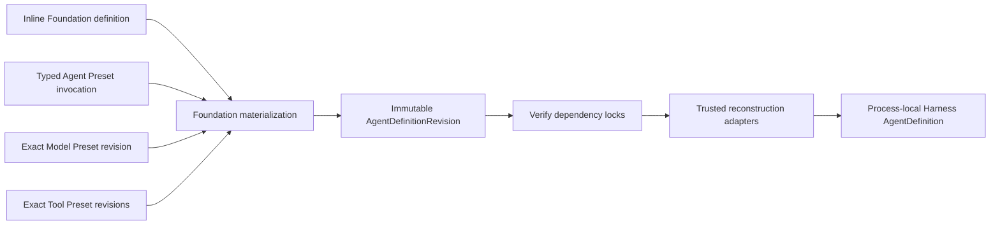
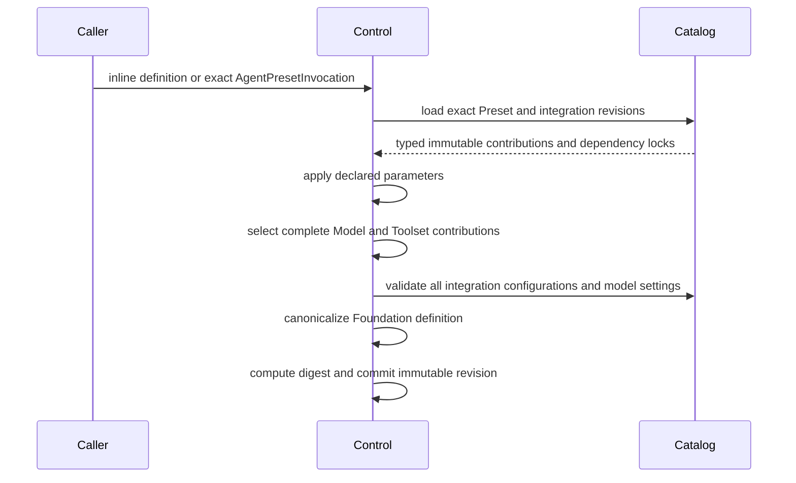

# Agent Definitions and Presets

## Design Position

Foundation Service owns the durable authoring format for hosted Agents. It accepts either an inline Foundation definition or a typed Preset invocation, materializes one complete immutable `AgentDefinitionRevision`, and records exact dependency locks and provenance.

This durable definition is not the process-local Harness `AgentDefinition`. It contains only Foundation-owned serializable values. At execution time trusted installed adapters reconstruct native Pydantic AI and Harness objects and call `HarnessBuilder`.

A Preset is an authoring mechanism. It grants no Identity, credential, provider session, Environment binding, tool invocation authority, or execution state, and it is never evaluated again after revision commit.



## Foundation Definition

The following schema is conceptual; the API specification owns its exact transport representation.

```python
class FoundationAgentDefinition(BaseModel):
    definition_id: str
    agent: FoundationAgentSpec
    plugins: tuple[FoundationPluginConfig, ...] = ()
    environment: FoundationEnvironmentRequest | None = None
    subagents: tuple[FoundationSubagentDefinition, ...] = ()


class FoundationAgentSpec(BaseModel):
    model: str
    instructions: FoundationInstructions
    model_settings: Mapping[str, JsonValue] | None = None
    output: FoundationOutputSchema
    capabilities: tuple[FoundationCapabilityConfig, ...] = ()
```

Foundation owns these serializable configuration types. They describe enough behavior for trusted adapters to reconstruct a native Pydantic `AgentSpec`, an optional process-local code-first `OutputSpec`, concrete plugins, and top-level Capabilities. A Capability owns every function tool, Toolset, instruction, setting, and hook contributed by its feature; Foundation does not reconstruct peer top-level tool or Toolset fields. `FoundationEnvironmentRequest` is the initial topology template and immutable authority ceiling owned by [Environment Provider Integrations](06-environment-providers.md#definition-configuration); it is not reconstructed into `AgentDefinition` and performs no allocation during materialization. These types do not attempt to serialize arbitrary Python objects or mirror every Pydantic constructor option.

Plugin and Capability configuration uses Foundation-owned discriminated typed schemas selected from operator-approved installed integrations. A configuration type identifies a logical integration and its arguments, not a Python import path. Foundation validates it through that integration's authoring codec without constructing a run-bound object or resolving credentials.

## Definition Source

```python
class PresetRevisionRef(BaseModel):
    preset_id: str
    revision_id: str


class InlineAgentDefinitionSource(BaseModel):
    definition: FoundationAgentDefinition


class AgentPresetInvocation(BaseModel):
    definition_id: str
    preset: PresetRevisionRef
    parameters: Mapping[str, JsonValue] = {}
    model_preset: PresetRevisionRef | None = None
    toolset_presets: tuple[PresetRevisionRef, ...] | None = None


type AgentDefinitionSource = (
    InlineAgentDefinitionSource | AgentPresetInvocation
)
```

Every selector is resolved to an exact immutable revision before materialization. `definition_id` is the final logical definition identity. `toolset_presets=None` selects Agent Preset defaults; an explicit tuple replaces the complete default selection.

There is no generic patch bag, arbitrary deep merge, executable template language, ambient environment substitution, or Python import path in source data.

## Preset Kinds

| Kind           | Contribution                                                                         | Excludes                                                            |
| -------------- | ------------------------------------------------------------------------------------ | ------------------------------------------------------------------- |
| Agent Preset   | Complete valid Foundation baseline, declared leaf parameters, default component refs | Live clients, credentials, arbitrary patches, multiple bases        |
| Model Preset   | One logical model ID and complete validated default request settings                 | Model instance, profile callable, raw headers, secret, health state |
| Toolset Preset | Ordered typed Foundation Capability/tool configurations with stable IDs              | Python objects, installed code, invocation grants                   |

An Agent Preset has one complete baseline. Model and Toolset Presets provide typed reusable contributions; they do not form another inheritance graph.

### Typed Parameters

A parameter has a unique name, typed value schema, and one exact allowed leaf target in the baseline. Parameter substitution replaces the complete value at that target. Parameters cannot alter definition identity, model integration identity, Capability/plugin discriminator or stable ID, subagent membership, dependency locks, credentials, or run authority.

Structural changes require another Preset revision or inline definition. This keeps materialization deterministic and schema-driven.

## Model Integration Revisions

A model integration revision is an immutable Foundation catalog entity. It owns:

- logical model membership;
- the strict JSON settings schema and canonicalizer;
- native Model/provider/adapter construction rules;
- permitted routing classes and profile inputs;
- the trusted adapter artifact lock;
- any provider-specific continuation envelope codec.

It contains no live client, credential, callable, current health, tenant route decision, or policy result.

Every root and child logical model ID in a materialized definition locks exactly one model integration revision. At worker startup, the adapter verifies the locked configuration and constructs a fresh `ModelRunBinding`. For each requested logical ID, that binding uses current Identity, policy, credentials, and provider state to return an allowed native Pydantic Model or raises.

Foundation's hosted profile requires this binding for logical aliases. The base Harness preserves native inference when no binding is supplied, so the worker must fail setup rather than accidentally omit a required hosted binding.

Stable compatibility facts remain on the native Model profile and provider adapter. Foundation does not persist a generic Agent-level `ModelProfile` mapping or merge profile keys.

### Model Settings

Hosted model settings are canonical JSON validated by the selected integration. The schema rejects:

- unknown keys;
- arbitrary request-header/body passthrough maps;
- client, timeout, callable, or other non-JSON objects;
- raw tokens, API keys, cookies, proxy credentials, or other secret carriers;
- settings incompatible with every route allowed by the logical model.

A Model Preset replaces the logical model and complete settings value as one unit. No hidden static settings may be added below the materialized definition unless the integration's published contract explicitly makes them part of native provider construction rather than Agent request intent.

## Plugin, Capability, and Output Contributions

Foundation configuration identifies operator-approved logical integrations and stable IDs. The selected dependency lock names the exact artifact and adapter revision that can reconstruct each concrete Python object.

At execution:

- plugin configuration reconstructs concrete `AbstractHarnessPlugin` instances;
- Capability configuration reconstructs native Pydantic Capability specs or trusted instances, including every feature-owned function tool and Toolset;
- code-first output configuration reconstructs one process-local `OutputSpec`, while declarative object JSON Schema remains in native `AgentSpec.output_schema`; exactly one build-time source is selected;
- model configuration supplies a model name and fresh `ModelRunBinding` or a trusted concrete Model.

Foundation business records never contain plugin or Capability classes, live factories, live Toolsets, native Models, output Python types, or collaborators. They can contain an operator-approved `provider_key`, strict typed canonical parameters, and an exact Environment integration dependency lock; those are selectors for worker reconstruction, not Python factories. Foundation supplies exact authorized custom Capability types to the Harness builder and can populate its provider registry from verified selected Environment entry points, but Foundation remains responsible for locks, configuration codecs, and durable reconstruction.

Duplicate stable IDs, duplicate model-visible tool names, conflicting output schemas, and unsupported integration configurations fail during materialization or worker reconstruction at the earliest owning boundary.

## Materialization



Materialization:

1. resolves every selector to an exact revision;
2. starts from one complete baseline or inline Foundation definition;
3. applies uniquely declared leaf parameters;
4. selects one effective Model Preset and complete Toolset Preset tuple;
5. resolves every logical integration to one exact compatible dependency revision;
6. validates all typed configurations, canonical model settings, and Environment provider parameters and policy;
7. locks every Environment provider key allowed by the definition, including dynamic-only keys;
8. validates recursive child structure, stable IDs, and output schemas;
9. canonically serializes the Foundation definition, computes its digest, and commits the revision and locks atomically.

Materialization performs no package installation, secret lookup, provider-client construction, Environment allocation, or execution policy grant.

## AgentDefinitionRevision

```python
class DefinitionDependencyLock(BaseModel):
    kind: Literal[
        "agent_preset",
        "model_preset",
        "toolset_preset",
        "model_integration",
        "environment_provider_integration",
        "plugin_integration",
        "capability_integration",
        "tool_integration",
        "output_adapter",
    ]
    logical_id: str
    revision: str
    artifact_digest: str | None = None


class AgentDefinitionRevision(BaseModel):
    definition_id: str
    revision_id: str
    source: AgentDefinitionSource
    definition: FoundationAgentDefinition
    dependencies: tuple[DefinitionDependencyLock, ...]
    definition_digest: str
    harness_api_compatibility: str
```

A revision stores source provenance, one complete canonical Foundation definition, exact dependency locks, its digest, and the Harness public API compatibility domain expected by reconstruction adapters.

The digest is an integrity and audit value within Foundation's canonicalization domain. It is not a protocol-wide content identity or execution authority.

The revision contains no plaintext secret, provider client, Python class/type, plugin, Capability, Toolset, Environment binding, caller identity, accepted client-tool attachment, or execution state.

Recursive subagent definitions use immutable authored-name paths within the same revision. A Host asynchronous child target derives from the selected revision and parent path; callers cannot substitute an unrelated child revision.

## Worker Reconstruction

After an Execution selects one revision, the worker:

1. verifies `harness_api_compatibility` and every dependency/artifact lock;
2. loads only trusted installed adapters selected by those locks;
3. reconstructs native `AgentSpec`, the selected build-time output contract, model selection, top-level Capabilities, and concrete plugins;
4. constructs one process-local Harness `AgentDefinition` per executable node;
5. calls `HarnessBuilder.build()`;
6. resolves locked Environment providers only through the operator-approved registry;
7. materializes current desired topology and fresh provider bindings under the Attempt lifecycle;
8. creates fresh run authority separately in `RunBindings`.

Reconstruction cannot mutate the durable revision, add undeclared model-visible behavior, infer arbitrary Python imports, or fall back to an unlocked adapter. Environment materialization is a later Attempt operation with provider I/O and a Host launch envelope; it never runs during pure Agent-definition reconstruction. A reconstruction or required Environment setup failure stops the Attempt before model or tool work.

Self-healing and `ModelRecoveryPolicy` are part of the materialized behavior only when Foundation's definition schema explicitly selects them. Any change to those values creates another definition revision.

## Failure Semantics

| Failure                                     | Outcome                                            |
| ------------------------------------------- | -------------------------------------------------- |
| Unknown/wrong-kind Preset revision          | No definition revision is committed                |
| Invalid parameter or protected target       | Materialization fails field-locally                |
| Invalid integration configuration           | Materialization fails under the owning codec       |
| Missing/ambiguous/untrusted dependency lock | Revision acceptance or worker reconstruction fails |
| Unsupported Harness API compatibility       | Worker rejects before object construction          |
| Model binding required but absent           | Attempt setup fails before provider dispatch       |
| Adapter returns invalid Python object       | Harness build or worker reconstruction fails       |
| Commit conflict/database failure            | No successful revision identity is returned        |

Errors identify stable logical integrations and fields without exposing credentials, private paths, or arbitrary Python representations.

## Compatibility

Changing the Foundation baseline, parameter schema, model/settings contribution, plugin/Capability/tool/output configuration, recovery policy, dependency lock, or reconstruction compatibility creates another immutable revision.

Capability state, Environment portable-state, provider parameter, and provider launch-state compatibility remain independently owned by their respective codecs. Selecting a newer definition does not imply older Harness or launch state can resume under it; Foundation chooses and applies any explicit migration before starting a run.

## Boundaries

| Concern                                                              | Owner                                                            |
| -------------------------------------------------------------------- | ---------------------------------------------------------------- |
| Foundation source, Presets, revisions, locks                         | Foundation control plane                                         |
| Native `AgentSpec`, Models, Toolsets, Capabilities                   | Pydantic AI                                                      |
| Process-local `AgentDefinition` and build                            | Agent Harness                                                    |
| Reconstruction codecs and adapter artifacts                          | Foundation integration packages and operator                     |
| Environment provider registry, desired topology, and launch envelope | [Environment Provider Integrations](06-environment-providers.md) |
| Fresh Identity, Environment, model, policy                           | Worker `RunBindings` and providers                               |
| Durable execution and state selection                                | Foundation lifecycle                                             |

## Invariants

1. Every durable Execution selects one immutable Foundation definition revision.
2. The revision contains one complete serializable Foundation definition and exact locks.
3. Process-local Python objects are reconstructed only inside the trusted worker.
4. Foundation never relies on a Harness compiler, universal catalog, export manifest, or serialized plugin spec; exact custom Capability classes and selected Environment entry points remain trusted locked reconstruction inputs.
5. Every logical hosted model locks one integration and receives a fresh required `ModelRunBinding`.
6. Every allowed Environment provider key locks one integration; provider objects and credentials never enter the definition revision.
7. Presets contain no live authority or secret material.
8. Runtime reconstruction cannot silently add or remove authored Agent behavior.
9. Changing materialized behavior or dependency locks creates another revision.

## Trade-offs

### Foundation Schema vs. Native Python Objects

Foundation gains inspectable, versioned durable records while the worker preserves native Pydantic and Harness composition. Integration adapters must explicitly bridge the two and remain locked with the revision.

### Materialized Snapshot vs. Runtime Inheritance

Complete snapshots duplicate small configuration values but make execution, inspection, and recovery independent from later Preset edits.
