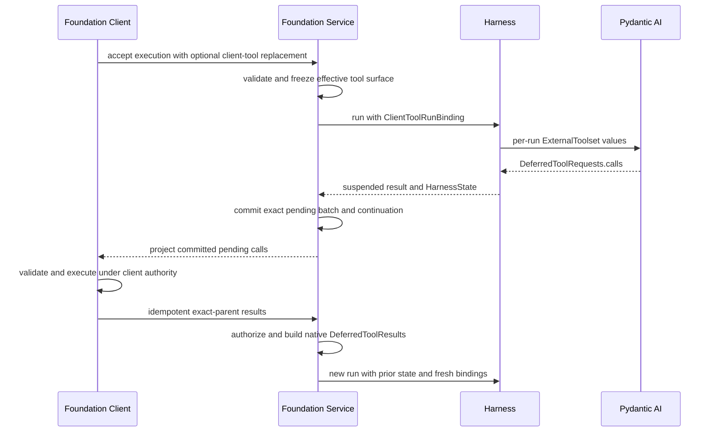

# Client-Side Tools

## Design Position

Client-side tools are model-visible tools whose implementation and side effects live outside the active Agent process, usually in a browser, desktop or mobile application, or another authenticated Foundation Client. The Foundation Service exposes an accepted tool schema to the model, but neither the service, the Harness, nor `agent-envd` executes that tool body.

The Harness maps the effective surface to Pydantic AI `ExternalToolset` values. A selected call ends the process-local run with `DeferredToolRequests.calls`. The Foundation Service durably commits the pending batch and continuation state before making the call available to a client. A later, independently authorized submission supplies results for the exact pending calls, and the service starts a new Harness run with fresh bindings.



This contract reuses the [Harness client-tool contract](../agent-harness/07-tool-execution.md#client-side-external-tools) and Pydantic AI deferred values. It does not create a client callback runtime, a second tool loop, or another deferred state machine.

## Boundary

| Concern                                                                   | Owner                                                        |
| ------------------------------------------------------------------------- | ------------------------------------------------------------ |
| Portable client-tool declarations and default/override policy             | Materialized Agent definition and Client Tools Capability    |
| Exact effective surface for one accepted execution chain                  | Foundation Service durable execution lifecycle               |
| Model tool preparation and deferred request/result semantics              | Pydantic AI through the Harness                              |
| Client handler registration and local argument validation                 | Foundation Client or another external executor               |
| Client-side side-effect authorization, timeout, and rollback              | External executor and product                                |
| Result-submission authentication, ownership, idempotency, and correlation | Foundation Service                                           |
| Environment-local files, processes, and state                             | `BoundEnvironment`, EIP, and `agent-envd`; not this contract |

An external tool is not an Environment tool, MCP tool, approval-gated server tool, or provider-native tool. Observing an ordinary tool-call event does not make an external request client-executable. Approval requests remain in `DeferredToolRequests.approvals`; external execution requests remain in `DeferredToolRequests.calls`. A client result never grants approval for a server-executed operation.

## Accepted Tool Surface

The Client Tools Capability in the materialized `AgentDefinition` contains default portable declarations and an explicit `allow_run_override` decision. The declaration schema and exact replacement rules are owned by [Tool Execution](../agent-harness/07-tool-execution.md#client-side-external-tools).

The service accepts the following conceptual attachment when the definition permits replacement:

```python
class ClientToolRunAttachment(BaseModel):
    toolsets: tuple[ClientToolsetDefinition, ...]
```

After validation and durable acceptance, an execution worker converts that exact value to the Harness `ClientToolRunBinding`. The service attachment has no handler, callback endpoint, credential, connection, or bearer capability.

For one newly accepted execution:

1. no run attachment selects the definition defaults;
2. a run attachment is rejected unless `allow_run_override` is true;
3. an allowed attachment replaces the complete default list, including with an explicitly empty list;
4. the service validates identifiers, JSON Schema, metadata bounds, duplicate IDs and names, and service input limits;
5. the service freezes the exact effective list and a producer-local canonical digest before scheduling model work.

The digest is an integrity and correlation value within the producing service's declared canonicalizer compatibility domain. It is not a cross-implementation content identity. The exact declarations, not only the digest, remain available for recovery and deferred resume.

The accepted attachment is a typed execution input, not a generic configuration override or an authority-bearing `RunBindings.metadata` value. It cannot add server-side Python code, handlers, credentials, Environment access, MCP connections, or provider-native tools. Tool descriptions, instructions, argument schemas, and public metadata are untrusted model content and follow ordinary content, size, and telemetry policy.

An active run's tool surface is immutable. Live steering cannot replace, add, or clear its client tools. A new independent turn can accept another surface under the selected definition's policy, but every resume of one pending deferred chain uses the exact frozen surface that produced its calls. A definition edit or a newly submitted replacement cannot reinterpret an existing pending call.

## Durable Pending Batch

A model tool-call event and a Pydantic `DeferredToolRequestsEvent` are observations. They do not authorize a client action and do not prove that the service can resume it.

Client execution becomes available only after the service atomically commits a waiting transition containing or referencing:

- the exact parent execution and attempt;
- the selected definition revision;
- the complete `HarnessState` candidate accepted for continuation;
- the complete native `DeferredToolRequests` value;
- the frozen client-tool attachment and its digest;
- a pending-batch identity, digest, and monotonic version;
- ownership, expiry, cancellation, and result-submission fencing data;
- separate accepted-result state for `.calls` and `.approvals` plus a unique resume-source identity.

The pending-batch digest covers the producer's canonical projection of the parent, deferred call IDs and kinds, effective arguments, and client-tool surface identity. It prevents a result submitted for one batch from being replayed against a different parent; it does not attest that the external side effect occurred.

If the model response contains both external calls and approvals, the durable record keeps the native categories separate. Client-call feedback can resolve only `.calls`, and the approval subsystem can resolve only `.approvals`. Each category update compares the pending-batch version and commits its idempotency receipt, result digest, new batch version, and durable feedback event together. An incomplete batch remains `waiting`; the service starts no continuation run until every deferred entry required by Pydantic has an accepted result.

A worker crash before the waiting transition commits leaves no client-executable batch. A crash after commit recovers from the durable record without retaining the original Python task, stream, connection, or credential.

## Client Delivery

Polling, SSE, WebSocket, webhooks, and product-specific push are projections of the same durable pending record. Delivery loss or duplication does not change its state. A delivery payload contains a client-safe Execution and pending-batch submission reference, bounded call identity, exact declared name, validated toolset provenance, model arguments, and explicitly public metadata. It contains no service credential, Environment binding, invocation grant, Attempt lease fence, or server-only correlation value; possession of its correlation fields grants no authority.

The service authenticates every delivery consumer and authorizes access to the owning tenant, execution, and configured client-executor scope. Possessing a `tool_call_id`, stream event, pending-batch digest, or attachment ID is not authorization. Delivery grants visibility, not an exclusive execution claim: a product that enables unattended handlers routes one batch to one executor identity or requires provider idempotency or explicit reconciliation. The base service does not add a generic client lease protocol.

The external executor must validate each call's arguments against the accepted declaration before any side effect. It separately applies product authentication, user confirmation, local policy, timeout, and rollback behavior. It deduplicates redelivery by pending-batch and call identity within its execution domain and passes a stable operation key to the affected provider when that provider supports idempotency. The Foundation Service does not claim that model-schema validation authorizes the action.

## Result Submission

A result submission targets one exact durable pending batch and carries:

- the exact parent execution or pending-batch reference;
- a client-generated idempotency key;
- results keyed by the original `tool_call_id`;
- bounded success or typed failure projections supported by Pydantic deferred calls.

Before accepting feedback, the service:

1. authenticates the submitting Principal and authorizes the execution and client-executor scope;
2. loads the authoritative pending record rather than trusting caller-supplied deferred metadata or message history;
3. verifies the parent, pending-batch identity and digest, current waiting state, expiry, and cancellation fence;
4. rejects unknown, duplicate, approval-kind, already resolved, or conflicting call IDs;
5. requires complete coverage of the batch's pending external `.calls` in one accepted submission;
6. validates result codecs, media and inline-size limits, and safe metadata policy;
7. calls the persisted `DeferredToolRequests.build_results(calls=...)` rather than constructing unchecked result maps.

The default success codec accepts a bounded `return_value` and the service constructs `ToolReturn(return_value=...)`. A product can explicitly enable a bounded multimodal or authorized content-reference representation inside that value. Caller-supplied `ToolReturn.content`, `ToolReturn.tools`, arbitrary `ToolReturn.metadata`, and equivalent fields are rejected by default: result authority cannot inject a sibling user prompt, reveal deferred tools, or add an application control channel. A separately typed product policy can enable a specific additional field without widening the base codec.

Explicit safe failure projections can map to supported `ToolFailed`, `ModelRetry`, or `RetryPromptPart` values. Business-specific result validation remains with the client and product. Operational result metadata is stored outside model content and is not copied into `ToolReturn.metadata` or treated as authorization by default.

The base contract does not automatically spill oversized results into the Agent Environment or define a second blob store. A host that supports large results uses an already authorized content-reference or media representation and resolves it before constructing `DeferredToolResults`; otherwise the submission fails its declared bound. This keeps client-tool feedback independent from `agent-envd` and avoids persisting raw oversized content merely to enqueue a resume.

The category update that resolves the final outstanding entry uses one lifecycle authority transaction to:

1. revalidate the pending-batch version, waiting state, expiry, and cancellation fence;
2. persist the final idempotency receipt and result digest;
3. mark the exact batch resolved with complete `.calls` and `.approvals` results;
4. append the dependency-resolution event; and
5. create one durable resume-eligibility fact uniquely keyed by the pending batch.

The transaction can also create the next Attempt and move the Execution to `running`. Otherwise it moves the Execution from `waiting` to runnable `accepted`, and later Attempt acquisition consumes that resume fact atomically. A crash therefore cannot leave accepted feedback waiting on an already resolved dependency or create two continuation Attempts. The new process-local Harness run receives:

- the same selected definition revision;
- the exact frozen client-tool surface;
- the accepted prior `HarnessState`;
- native `DeferredToolResults` built from the authoritative pending request;
- fresh Identity, Environment, policy, credential, checkpoint, telemetry, and other `RunBindings` values.

The service never keeps the original Python task alive and never treats a client result as permission to reuse a prior credential or Environment binding.

## Idempotency and Unknown Outcomes

The service scopes a result-submission idempotency key to the exact parent and pending-batch digest. Repeating the same key and semantically identical result returns the previously accepted receipt and current batch outcome without creating another resume fact. Reusing the key with different content, parent, or batch fails closed. A retry after the batch is resolved reads the committed receipt; it does not reopen the batch.

Transport loss after a client-side side effect but before result acknowledgement is an unknown submission outcome, not evidence that the side effect failed. A Foundation Client convenience executor therefore proves complete local handler coverage before starting any handler, caches the complete resolved feedback under the pending-batch identity before submission, and retries submission from that cache. It does not rerun non-idempotent handlers merely because acknowledgement was lost.

The service does not automatically execute or retry a client handler. A client timeout or local failure becomes an explicit deferred failure result when the client can report it. Disconnect alone leaves the durable execution waiting until an authorized result, cancellation, or expiry policy resolves it.

The versioned batch transition plus uniquely consumed resume fact prevents duplicate continuation runs; it cannot make an already dispatched external side effect exactly once. Concurrent executors, local crashes after dispatch, and providers without idempotency can still require product reconciliation. Cancellation or expiry fences the pending batch and rejects late results, but neither action proves that an already dispatched side effect was rolled back.

## Delegation and Scope

Client tools do not implicitly pass to inline or hosted children. A child exposes them only when its own materialized definition contains the Client Tools Capability and its fresh child `RunBindings` receives an explicitly selected attachment under host policy. Hosted children never inherit a parent client connection, caller Principal, or pending-batch authority.

This default prevents background or delegated Agents from creating calls that no authorized online client has agreed to execute. A product can deliberately rebind the same Foundation Client to a child, but that is a new host authorization decision rather than Capability inheritance.

## Failure Semantics

| Failure                                                          | Outcome                                                                                                        |
| ---------------------------------------------------------------- | -------------------------------------------------------------------------------------------------------------- |
| Definition does not allow a submitted replacement                | Execution acceptance fails before scheduling                                                                   |
| Invalid schema, duplicate name, or assembled tool collision      | Acceptance or run preparation fails before model exposure                                                      |
| Harness defers but durable waiting commit fails                  | No client-executable pending batch is published                                                                |
| Client disconnects or delivery is lost                           | Durable batch remains waiting; no inferred result                                                              |
| Unknown, wrong-kind, incomplete, stale, or unauthorized feedback | Submission fails without starting a continuation                                                               |
| Conflicting idempotency-key reuse                                | Submission fails closed                                                                                        |
| Feedback or final-resolution transaction fails                   | No partial receipt, resolved batch, or resume fact is claimed; retry uses the same key                         |
| Result exceeds codec or size limits                              | Submission is rejected; raw content is not silently persisted or truncated                                     |
| Continuation binding or state restore fails                      | New attempt fails; accepted pending/result facts remain durable for host recovery policy                       |
| Cancellation races with feedback                                 | The durable transition that wins the service fence determines acceptance; neither implies side-effect rollback |

## Compatibility

Client-tool declaration codecs, Foundation Service API projections, Pydantic deferred codecs, and Harness state versions evolve independently. A pending batch retains the exact declaration and deferred payload versions that produced it. A service upgrades or migrates those durable values explicitly; it does not reinterpret them through the current Preset or current client registry.

Transport adapters may expose AG-UI, Vercel AI, or another frontend representation. Those are codecs over this durable contract. Caller-supplied message history, tool frames, or adapter interrupt values never replace the server-persisted parent, pending request, and result-correlation authority.

## Trade-offs

### Native ExternalToolset vs. a Client Tool Runtime

Using Pydantic AI `ExternalToolset` gives model preparation, collision detection, deferred output, events, and result integration one owner. It means client-specific delivery and handler ergonomics live in Foundation Client rather than inside the Agent loop.

### Frozen Per-Execution Surface vs. Live UI Mutation

Freezing one surface permits deterministic recovery and exact result correlation. A UI must start a new run or turn to change tools rather than mutating an active model request.

### Complete Batch Feedback vs. Partial Resume

Requiring complete external-call coverage avoids another partially resumed Agent lifecycle and lets the client prove handler coverage before side effects. Long-running independent operations can return explicit pending references or use a product workflow rather than keeping the Harness half-resumed.

### Bounded Results vs. Automatic Environment Spill

A bounded codec and explicit references keep Foundation Service, Foundation Client, and Environment authority separate. Products that need large results perform an authorized upload or reference step instead of relying on hidden server-side file placement.

## Invariants

01. Every client-side tool reaches Pydantic as `kind="external"`; no client handler runs in the Harness process.
02. Definition defaults and an allowed run replacement have deterministic whole-list semantics; an active surface never mutates.
03. Every deferred resume uses the exact frozen surface, parent state, and pending request that produced the call.
04. `.calls` and `.approvals` remain distinct in storage, API validation, authorization, and result construction.
05. A client action is available only after the durable pending batch commits; stream events are observational.
06. Result feedback is authenticated, parent-bound, complete, idempotent, and constructed through the authoritative `DeferredToolRequests` value.
07. Resume creates a new Harness run with fresh authority and no retained Python task.
08. Delivery loss, duplication, cancellation, and timeout never fabricate client side-effect outcomes; feedback fencing does not imply exactly-once execution.
09. Client tools are independent from Environment, EIP, MCP, and hosted delegation execution.
10. Tool definitions, arguments, public metadata, and results contain no credential or authorization claim.
