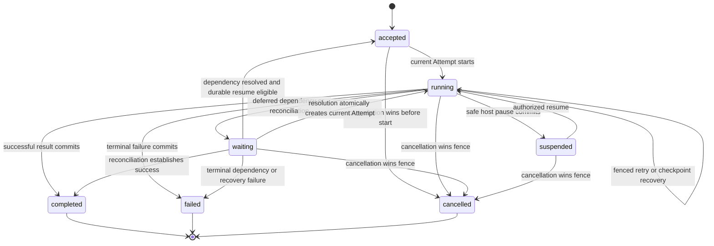
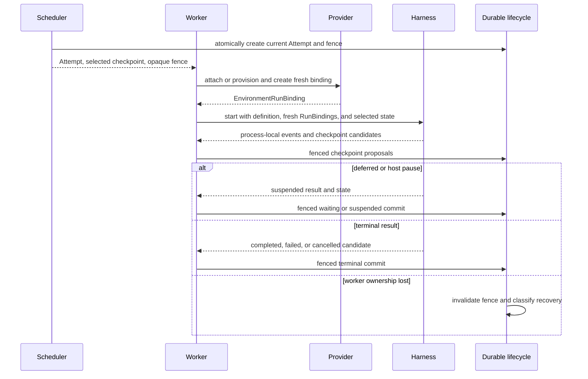

# Durable Execution Lifecycle

## Design Position

An `Execution` is the Foundation Service's durable logical unit of accepted Agent work. An `Attempt` is one fenced worker ownership interval that can start at most one root process-local Harness run. Inline descendants follow the Harness delegation contract inside that root and do not become additional Host Attempts. A retry, checkpoint recovery, deferred-tool continuation, or resume after a host pause creates another Attempt under the same Execution; it never resurrects a prior Python task or reuses its authority.

The service owns acceptance, scheduling, Attempt fencing, checkpoint selection, recovery, and durable completion. The Harness owns only the process-local result and `HarnessState` candidate described by [Execution Context and Lifecycle](../agent-harness/06-execution-context-and-lifecycle.md). `agent-envd` and Environment providers own their native resources and side-effect evidence, not the Execution state machine.

```mermaid
flowchart LR
    Accept[Durable acceptance] --> Execution[Execution]
    Execution --> Attempt1[Attempt generation 1]
    Attempt1 --> Harness1[Harness run]
    Harness1 --> Checkpoint[Committed checkpoint]
    Checkpoint --> Attempt2[Attempt generation 2]
    Attempt2 --> Harness2[New Harness run]
    Harness2 --> Terminal[Durable terminal commit]
```



This contract defines logical identities, states, fencing, and completion rules. It does not prescribe database tables, lease duration, heartbeat cadence, queue technology, worker scanning, or provider-specific recovery states.

## Boundaries

| Concern                                          | Owner                                                      | Relationship                                            |
| ------------------------------------------------ | ---------------------------------------------------------- | ------------------------------------------------------- |
| Durable Execution identity and state             | Foundation Service                                         | Sole public lifecycle authority                         |
| Attempt lease, generation, and commit fence      | Foundation Service scheduler and execution lifecycle       | Prevent stale workers from advancing durable state      |
| Process-local run, result, and `HarnessState`    | Harness                                                    | Candidate observations submitted by the current Attempt |
| Provider-adapter lifecycle record                | Environment provider adapter                               | Service has bounded opaque storage custody              |
| Environment-local state and side-effect evidence | EIP provider and affected external system                  | Revalidated under every fresh binding                   |
| Accepted input and command receipts              | [Execution API and Events](04-execution-api-and-events.md) | Inputs to lifecycle transitions, not Attempt state      |
| Durable model-usage records and estimates        | [Usage Recording](05-usage-accounting.md)                  | Independent observation boundary                        |
| Product delivery or webhook completion           | Connector or product                                       | Never commits Execution completion retroactively        |

## Core Model

The following Python-like types are conceptual domain contracts, not a serialized API or persistence schema.

```python
type ExecutionState = Literal[
    "accepted",
    "running",
    "waiting",
    "suspended",
    "completed",
    "failed",
    "cancelled",
]


type AttemptState = Literal[
    "leased",
    "running",
    "finished",
    "abandoned",
]


class Execution(BaseModel):
    execution_id: str
    definition_revision_ref: str
    acceptance_ref: str
    state: ExecutionState
    version: int
    current_attempt_id: str | None
    selected_checkpoint_ref: str | None
    wait_reason: str | None
    result_ref: str | None
    failure: SafeFailure | None


class Attempt(BaseModel):
    attempt_id: str
    execution_id: str
    generation: int
    state: AttemptState
    selected_checkpoint_ref: str | None
    harness_run_id: str | None
    started_at: datetime | None
    finished_at: datetime | None
```

`execution_id` remains stable across every retry and resume. It is the ordinary Foundation Client resource identity. The selected immutable definition revision and accepted root input identity are fixed when the Execution is created and never change within it. For a hosted child, `definition_revision_ref` identifies the parent exact revision plus immutable child path; its embedded child bytes and transitive dependency-lock slice are the Execution's definition and cannot be substituted with an independent child revision. Compatibility migration can translate a durable value through declared codecs without changing its semantic definition selection; running under another revision creates another Execution with explicit lineage.

`version` is the monotonic compare-and-swap domain for lifecycle transitions. `current_attempt_id` identifies the only Attempt that can submit new checkpoints or outcomes. `wait_reason`, `result_ref`, and `failure` are state-constrained values rather than independent status flags.

An Attempt generation is monotonic within one Execution. `attempt_id` and generation identify worker ownership but grant no authority by themselves. The scheduler issues a separate opaque lease fence to one worker. That fence is never accepted from model input, a client, `HarnessState`, or provider metadata.

`harness_run_id` is absent until the Attempt actually starts its root Pydantic run. It correlates root process-local events and usage; inline descendants retain their own Harness run IDs and Agent lineage without changing the Attempt identity. It does not replace `attempt_id` or `execution_id`. An Attempt that dies before Harness start still remains an Attempt and can be abandoned without inventing a run ID.

## Execution States



`accepted` means the service durably owns runnable work; it does not mean a worker or model request exists. Initial acceptance and a resolved dependency with a durable resume-eligibility fact can both enter this state. Queue delivery, worker acquisition, and provider preparation can occur while the Execution remains accepted.

`running` means one current Attempt owns progress or that the service is replacing an expired Attempt without changing the public lifecycle. Internal states such as starting, leasing, recovering, or worker-crashed are diagnostics, not new public Execution states. `current_attempt_id` is cleared when a waiting, suspended, or terminal transition releases worker ownership.

`waiting` means no process-local Harness task remains and an external fact is still required. Stable reason families include deferred external calls or approvals, hosted-child completion, dependency availability, and unknown-effect reconciliation. Final dependency resolution atomically leaves this state by creating durable resume eligibility or the next Attempt. The owning detail contract supplies typed reason data; [Client-Side Tools](02-client-side-tools.md) owns client-call pending batches.

`suspended` is an explicit safe host pause with a selected complete checkpoint. It is not a worker crash, provider timeout, or deferred dependency.

`completed`, `failed`, and `cancelled` are terminal durable facts. A failed Execution has a bounded safe failure and can identify whether recovery was exhausted or reconciliation established a terminal outcome. A terminal state never reopens; another requested run creates another Execution.

## Attempt Fencing

Attempt acquisition atomically selects the input checkpoint, increments the generation, creates the Attempt, and makes it current. When acquisition follows a resolved dependency, the same transaction consumes one durable resume-eligibility fact keyed by its exact pending or reconciliation source; retrying acquisition cannot consume that fact into another Attempt. The scheduler then gives one worker an opaque lease fence. Only a request carrying the current Attempt and valid fence can:

- acknowledge Harness start and bind its `run_id`;
- commit a checkpoint;
- commit a deferred or suspended boundary;
- propose or commit a terminal outcome;
- renew or release worker ownership.

Every write also compares the expected Execution version. Expiry, explicit revocation, or replacement of the current Attempt invalidates the old fence before another Attempt can become current. A late worker can finish local cleanup and report diagnostics, but it cannot select a checkpoint, append an authoritative lifecycle event, resume a dependency, or commit a terminal result.

Lease renewal is coordination, not lifecycle progress. Redis, in-memory queues, database notifications, or another wakeup mechanism can lose or duplicate messages without creating another durable owner.

## Checkpoints

A committed Host checkpoint binds all data needed to start a later Attempt under fresh authority:

```python
class ModelRoutePin(BaseModel):
    integration_ref: str
    route_key: str
    provider_ownership_ref: str | None = None


class ExecutionCheckpoint(BaseModel):
    checkpoint_ref: str
    execution_id: str
    attempt_id: str
    generation: int
    sequence: int
    harness_state: HarnessState
    launch_state_ref: str | None
    model_route_pin_ref: str | None
    incorporated_input_sequences: tuple[int, ...]
```

`harness_state` is the complete portable Harness value. `launch_state_ref` identifies a bounded encrypted Host envelope that can contain the selected definition provenance, opaque provider-adapter lifecycle record, exact client-tool attachment, delivery/recovery correlation, and other Host-owned continuation data. `model_route_pin_ref` separately selects an immutable encrypted `ModelRoutePin` produced by the locked model integration's run-bound recorder. Its opaque route key and provider-ownership reference contain no credential and grant no authority; they let that same integration validate and reconstruct an exact suspended-response target under fresh authority. Referenced envelopes cannot contain a live client, socket, task, plaintext credential, or provider object. Provider adapters and feature-specific codecs retain semantic ownership of their portions.

`sequence` is monotonic within the Attempt. `incorporated_input_sequences` is a strictly sorted, duplicate-free, gap-aware set of Execution-local input sequences proven represented by this checkpoint's message history or a declared compaction of it. It includes the accepted root input once incorporated and can retain entries from prior Attempts. A later sequence can therefore be represented without falsely confirming an earlier `delivery_unknown` or `terminal_without_effect` command. Terminal-state selection applies the same rule. [Execution API and Events](04-execution-api-and-events.md) owns those receipts, ordered dispatch, and delivery states.

A `HarnessCheckpoint` is only a process-local candidate. The service commits it only when:

1. the Attempt fence and expected Execution version remain current;
2. the candidate is a complete semantic boundary;
3. referenced Host launch state and any model route pin have passed their owning validation and bounds;
4. if `harness_state.message_history` ends in `ModelResponse(state="suspended")`, an exact route pin from the current integration and target is present; otherwise no stale pin is carried forward;
5. checkpoint sequence does not move backward, and the incorporated-input set only adds sequences that authoritative receipts and this exact state prove incorporated;
6. any immutable payload bytes are durable before the authority transaction, and checkpoint, launch-state, route-pin selection, plus its lifecycle event commit atomically.

A checkpoint is Execution-owned continuation state with producing-Attempt provenance. It can be emitted after a complete model, tool-batch, compaction, or terminal boundary, but it is not owned by a generic Step or Item and does not prove that an external side effect completed. The current model intentionally defines no durable `Step` resource.

A newer committed candidate can supersede the selected checkpoint, but old values remain immutable for audit and in-flight reader safety. When payload bytes live outside the authority database, the worker writes them under an immutable content reference first; the lifecycle transaction atomically selects that reference and appends the event. A failed transaction can leave an unselected blob for garbage collection but never an authoritative checkpoint without an event. Selection is an explicit Host fact; the Harness never loads an implicit latest checkpoint.

## Attempt Flow and Completion



A normal `HarnessRunResultEvent` or `run()` return becomes a durable result only through one fenced state transition. `RunCleanupError.outcome` remains an uncertain candidate; Host policy can recover, reconcile, or fail it, but cannot report a clean Harness completion that was never delivered.

A terminal commit is single-winner and idempotent. Repeating the same Attempt, fence, expected version, and semantically identical outcome returns the committed result. A conflicting outcome, stale fence, or stale version fails without rewriting the winner.

A deferred result commits `waiting` only after the service durably stores the exact pending request, selected checkpoint, and owning feature state. The final dependency-resolution transaction later creates exactly one durable resume-eligibility fact before another Attempt can be acquired. A host pause commits `suspended` only with the exact safe-pause checkpoint. In both cases the worker releases ownership after commit; no Python run stays alive.

## Recovery

Worker or transport loss does not by itself determine the Execution outcome. After invalidating the old fence, the service classifies the last authoritative boundary:

| Classification                                                        | Durable action                                                                            |
| --------------------------------------------------------------------- | ----------------------------------------------------------------------------------------- |
| Complete selected checkpoint; no unresolved effect                    | Create a new Attempt from that checkpoint                                                 |
| No run start and immutable accepted input remains unconsumed          | Create a new Attempt from accepted input                                                  |
| Retry-safe dependency change required                                 | Keep or return the Execution to accepted/running and create a new Attempt when eligible   |
| Deferred external fact already committed                              | Keep `waiting`; delivery or dependency recovery continues without an Agent task           |
| Possible external mutation without authoritative receipt              | Commit or retain `waiting` with reconciliation reason; do not replay the mutation blindly |
| Incompatible state, exhausted policy, or established terminal failure | Commit `failed` with bounded reason                                                       |

Recovery always creates a new Attempt and fresh Identity, Environment, policy, credential, model, telemetry, and client-executor bindings. For provider-suspended history, “fresh model” means the same locked integration reconstructs the pinned provider/account/deployment/region target and refreshes its credentials; ordinary health routing and fallback are disabled. If the target or provider-side job is no longer recoverable, the Attempt reports an explicit continuation failure rather than selecting another target. Recovery never increments a counter on a live Attempt and pretends the old fence is valid.

"No unresolved effect" requires affirmative evidence that no dispatch boundary was reached, that replay is read-only or protected by the same provider idempotency key, or that an authoritative provider receipt established the outcome. A crash during an operation without such evidence enters reconciliation or an attributed terminal failure rather than automatic replay. In particular, unmanaged in-process tools and provider-native mutations without receipts cannot be classified as safely undispatched merely because the Host observed no result; the base service does not add a durable dispatch protocol for them.

A provider reconciliation result is ordinary Host-owned input to another Attempt or terminal transition. Absence of evidence is not converted into success or failure. Provider-specific diagnostics such as crashed, disconnected, or container missing remain attributed details, not public Execution states.

## Suspend and Cancel Races

Suspend and cancel requests first produce durable command receipts under [Execution API and Events](04-execution-api-and-events.md). Acceptance proves only that the service owns the command.

For safe suspend, the current worker requests `HarnessRunStream.request_suspend()`. `suspended` commits only if the resulting complete state wins the Execution version and Attempt fence. If completion or deferred work commits first, the command resolves without rewriting that outcome.

For cancellation, the service fences new Attempt creation and asks any current worker to invoke native cancellation. The durable `cancelled` transition and a competing terminal transition use the same Execution compare-and-swap domain. Whichever valid transition commits first wins. A later local cancellation observation or result is stale. Cancellation never proves rollback of a provider or client-side effect; unresolved evidence can be retained in diagnostics and reconciliation records.

## Failure Semantics

| Failure                                                               | Durable outcome                                | Retry or reconciliation                                  |
| --------------------------------------------------------------------- | ---------------------------------------------- | -------------------------------------------------------- |
| Acceptance transaction fails                                          | No Execution identity is returned              | Caller retries with the same idempotency key             |
| Worker dies before Harness start                                      | Current Attempt becomes abandoned              | New Attempt can use accepted input                       |
| Worker dies after a complete checkpoint                               | Old fence is invalidated                       | New Attempt uses the selected checkpoint                 |
| Worker dies during a possible mutation                                | Execution does not fabricate a terminal result | Provider reconciliation or explicit policy is required   |
| Stale worker submits checkpoint or result                             | Submission is rejected                         | Worker performs local cleanup only                       |
| Immutable checkpoint payload is written but selection fails           | Unselected payload can be garbage-collected    | No lifecycle checkpoint or event is visible              |
| Checkpoint selection and lifecycle event diverge                      | Invalid implementation outcome                 | Authority transaction must commit them atomically        |
| Harness result conflicts with cancel or another terminal proposal     | One compare-and-swap winner                    | Loser remains diagnostic, not lifecycle truth            |
| State, launch envelope, or model route pin is missing or incompatible | Attempt stops before model or tool work        | Explicit migration, target recovery, or terminal failure |
| Recovery policy is exhausted                                          | Execution commits `failed`                     | Another request creates a new Execution                  |

## Compatibility

Execution, Attempt, checkpoint-envelope, durable-event, Harness-state, provider-lifecycle, and feature-specific continuation versions evolve independently. An upgrade reads old durable values only through declared codecs and migrations. Unknown required state fails before a new Attempt starts and never causes a fallback to accepted input that could replay completed side effects.

Public Execution states are stable semantic categories. Additive reason codes and diagnostics do not add new state transitions. Internal lease or scheduling implementations can change without altering Foundation Client behavior.

## Trade-offs

### Execution and Attempt vs. a public Session or Step graph

A stable Execution plus fenced worker Attempts captures retry and resume without exposing queue rows, worker crashes, provider startup states, transport sessions, or generic Steps as application resources. A product-facing Turn can project one Execution, while model and tool Items remain observations. Operators lose a single public status for every implementation detail but retain Attempt diagnostics.

### New Attempt on every recovery vs. in-place takeover

Creating a new generation makes stale ownership mechanically rejectable and keeps one root Harness run per Attempt. It creates more immutable records than mutating an old Session, but removes ambiguous in-place takeover semantics.

### Complete checkpoints vs. maximum restart progress

Only complete semantic boundaries can be selected. More work may replay after a crash, but no checkpoint claims a partial tool batch or unknown side effect is safe.

## Invariants

01. One `execution_id` identifies one durably accepted logical work item and selected definition revision.
02. At most one Attempt fence can advance an Execution at a time.
03. One Attempt starts at most one root process-local Harness run; inline descendants remain part of that root, while retry or resume creates another Attempt generation.
04. A stale worker cannot commit a checkpoint, waiting boundary, lifecycle event, or terminal outcome.
05. A Harness result is a candidate until one fenced durable transition commits it.
06. Checkpoint selection never moves backward; its gap-aware incorporated-input set never guesses across an unresolved receipt, and state never restores authority.
07. Every selected checkpoint whose message tail is provider-suspended atomically selects the exact non-secret model route pin; resume reconstructs that target or fails without rerouting.
08. Deferred waiting and safe suspension retain no live Python task.
09. Worker loss and cancellation never fabricate rollback or a provider side-effect outcome.
10. Public lifecycle states exclude provider-specific and scheduler-internal recovery states.
11. Execution completion, external delivery, telemetry export, durable usage recording, billing, and payment remain independent facts.
