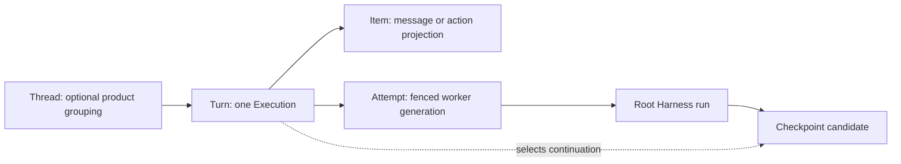

# Execution API and Durable Events

## Design Position

The Foundation Service API exposes durable `Execution` resources, immutable definition revisions, command receipts, and replayable lifecycle events. Creating an Execution first commits durable acceptance and returns an identity; streaming is a separate observation path and never determines whether the service owns the work.

A Foundation Client treats `Execution` as the ordinary logical work resource. An `Attempt` is a read-only worker-ownership child of that resource, not the primary application handle. A Codex-style product can project `Thread -> Turn -> Item`: one Turn maps to exactly one Execution, while Items project messages, reasoning, tool calls, commands, file changes, and outputs. Thread and Item grant no execution authority, and Attempt is not renamed to Step.

This contract owns language-neutral service semantics. It does not fix REST paths, generated SDK shape, SSE or WebSocket libraries, broker technology, pagination syntax, or require a Thread product model.

## Boundaries

| Concern                                         | Owner                                                    | Relationship                                                              |
| ----------------------------------------------- | -------------------------------------------------------- | ------------------------------------------------------------------------- |
| Execution and Attempt state                     | [Durable Execution Lifecycle](03-execution-lifecycle.md) | API projects the authoritative resource                                   |
| Creation and command idempotency                | Foundation Service API                                   | Commits stable receipts before returning success                          |
| Process-local enqueue, suspend, and cancel      | Harness `HarnessRunStream`                               | Attempt worker invokes after durable command acceptance                   |
| Durable lifecycle event log and replay cursor   | Foundation Service                                       | Authority for reconnect and downstream projection                         |
| High-frequency model/tool stream                | Harness and live delivery adapter                        | Optional observation; not necessarily durable or replayable               |
| Outbound webhook delivery                       | Hosted connector plugin                                  | At-least-once projection of committed durable events                      |
| Inbound connector event                         | Hosted connector plugin and acceptance API               | Maps one source identity to one idempotent acceptance request             |
| Client-side tool feedback                       | [Client-Side Tools](02-client-side-tools.md)             | Separate exact-parent mutation using this API's auth and event boundaries |
| Caller authentication and product authorization | Adopting product and service policy                      | Required before every read or mutation                                    |

## Foundation Client Resource Model

```text
FoundationClient
├── definitions
│   └── revisions
└── executions
    ├── create
    ├── get
    ├── attempts
    ├── events
    ├── steer
    ├── request_suspend
    ├── cancel
    └── client_tool_feedback
```

`definitions` and `revisions` expose the immutable authoring contract from [Agent Definitions and Presets](01-agent-definitions-and-presets.md). `executions` exposes accepted work from [Durable Execution Lifecycle](03-execution-lifecycle.md). Attempt details can include generation, Harness run correlation, timing, safe failure, and provider diagnostics, but ordinary application control always targets the Execution or a command's explicitly fenced Attempt.

A new independent user turn or task creates another Execution. Optional `thread_ref`, workflow correlation, or parent Execution lineage is non-authoritative grouping metadata. The base API does not require a next-turn queue, mutate a terminal Execution back to running, or make single-active Thread routing part of correctness.

### Thread, Turn, Item, and Attempt



`Thread` is an optional product-owned grouping and routing scope. `Turn` is its application vocabulary for one accepted unit of work and maps one-to-one to `Execution`, including every retry, deferred continuation, and host-pause resume. `Item` is an observation or content unit; it can represent model messages, tool calls, command runs, file changes, and outputs without becoming lifecycle authority.

`Attempt` remains the internal distributed ownership interval because Codex-style Thread/Turn/Item has no corresponding fencing primitive. The unqualified term `Step` is deliberately not a resource: it is ambiguous among a model request, tool invocation, workflow node, plan entry, and retry. Specifications use qualified terms such as model step or workflow step only where their local meaning is explicit.

A checkpoint belongs to the Execution/Turn and records the Attempt and Harness run that produced it. It may be captured after complete Item or tool-batch boundaries, but it is not owned by an Item or Step. A product can expose Thread/Turn/Item routes as a projection without renaming the core lifecycle records or weakening fences.

Every resource response includes its stable identity, schema version, lifecycle version or ETag-equivalent, and safe links or references needed for reconciliation. SDK conveniences preserve unknown additive fields and the raw safe response so applications do not lose evidence needed during upgrades.

## Execution Acceptance

The following Python-like types are conceptual contracts rather than exact wire models.

```python
class ExecutionAcceptance(BaseModel):
    acceptance_id: str
    execution_id: str
    idempotency_key: str
    request_digest: str
    accepted_at: datetime
    execution_version: int


class CreateExecutionRequest(BaseModel):
    definition_revision_ref: str
    input: RunInput
    client_tool_attachment: ClientToolRunAttachment | None
    metadata: Mapping[str, JsonValue]
```

The authenticated caller supplies an idempotency key outside model-visible input. The service canonicalizes the authority-relevant request inside its declared compatibility domain and stores the digest with the acceptance.

Acceptance atomically:

1. authenticates and authorizes the caller, definition revision, input, optional client-tool attachment, and requested policy scope;
2. validates all bounded payloads and referenced content ownership and rejects `ToolResultInputPart` because root creation has no authoritative pending parent;
3. creates the immutable acceptance record and `Execution(state="accepted")`;
4. appends the matching durable `execution.accepted` event;
5. makes the work eligible for scheduling.

A successful response means the service durably owns the work even when no worker, Environment, stream, or webhook exists. Deferred approvals, external-call results, hosted-child results, and reconciliation inputs target their exact existing Execution through owning typed operations rather than creating a root Execution with caller-asserted deferred state. Repeating the same Principal scope and idempotency key with the same canonical request returns the original acceptance. Reusing it with different content fails as an idempotency conflict. A timeout before the caller receives the response is reconciled by reading or retrying the same key; the caller does not invent another key merely because acknowledgement was lost.

Authentication failure, policy denial, invalid input, unknown definition revision, or transaction failure returns no successful acceptance. The service never returns a successful Execution identity for work it has only placed on an ephemeral queue.

## Commands and Receipts

Live steering, safe suspend, and cancellation are durable commands whose process-local effects remain separate facts.

```python
type CommandKind = Literal["steer", "suspend", "cancel"]

type CommandStatus = Literal[
    "accepted",
    "delivered",
    "incorporated",
    "applied",
    "terminal_without_effect",
    "delivery_unknown",
    "rejected",
]


class CommandReceipt(BaseModel):
    command_id: str
    execution_id: str
    kind: CommandKind
    idempotency_key: str
    request_digest: str
    target_attempt_id: str | None
    target_generation: int | None
    status: CommandStatus
    accepted_sequence: int | None
    reason: str | None
```

A command mutation authenticates the caller, validates the expected Execution version when supplied, chooses its target under one lifecycle transaction, stores the receipt, and appends a durable command event. Repeating an identical idempotency key returns the same receipt; conflicting reuse fails.

### Steering

A steering command always targets one exact active Attempt and generation. It carries bounded `RunInput` content that passes the Harness live-enqueue allowlist; deferred results and client-tool schema changes are rejected. The service assigns each accepted root input and steerable input an Execution-local monotonic input sequence; the root input establishes the initial incorporated-set entry and a steering receipt records its `accepted_sequence`. `accepted` means the service durably owns the fixed-target command. It does not mean the worker called `enqueue()`, Pydantic delivered it, or a checkpoint incorporated it.

For one Attempt, the worker dispatches accepted steering receipts serially in `accepted_sequence` order and uses native queue priority in a way that cannot let a later sequence overtake an earlier one. It does not invoke `enqueue()` for a later receipt while an earlier receipt's delivery is unknown. Across replacement Attempts, an older unknown can coexist with later accepted work, so `ExecutionCheckpoint.incorporated_input_sequences` records the exact proven set rather than a maximum. It never infers a missing lower sequence from a higher incorporated one.

The worker transitions the receipt through these observations:

1. `delivered` after the current fenced Attempt successfully invokes `HarnessRunStream.enqueue()` and durably records the native enqueue ID before dispatching the next sequence;
2. `incorporated` after a committed checkpoint or terminal state includes that exact accepted sequence in its gap-aware incorporated-input set;
3. `terminal_without_effect` only when durable routing evidence proves the command never reached the process-local enqueue boundary;
4. `delivery_unknown` when the worker may have enqueued or consumed the input but no committed checkpoint or delivery receipt proves either outcome.

Attempt loss or Execution terminality alone does not prove non-delivery. A steer command with unknown delivery never silently reroutes to a replacement Attempt, turns into a new Execution, or replays after recovery based only on a missing live event. A later committed checkpoint can still resolve it as incorporated; otherwise the receipt preserves uncertainty. A product that wants next-turn queuing creates another Execution or implements an explicit higher-level scheduler.

### Safe Suspend

A suspend command targets the current Attempt generation. It becomes `applied` only when the service commits `Execution(state="suspended")` with the complete safe-pause checkpoint. Completion, deferred waiting, cancellation, or Attempt replacement can instead resolve it as `terminal_without_effect`. It is not reinterpreted as cancellation.

### Cancellation

A cancel command targets the Execution and fences future Attempt creation when accepted. The service asks a current worker to invoke native cancellation when one exists. When no current worker can advance state, the lifecycle authority can commit `cancelled` directly after invalidating any old fence and preserving unresolved-effect diagnostics. The receipt becomes `applied` only when the durable `cancelled` transition wins the Execution compare-and-swap. A previously committed terminal result resolves the command as `terminal_without_effect`. Cancellation never reports provider or client-side rollback.

`rejected` records a stable policy, lifecycle, version, or validation refusal when the API chooses to retain a receipt for reconciliation. It never appears as if an accepted command later became unauthorized; a fresh live policy check can still prevent a privileged downstream action and produce an attributed terminal or waiting outcome.

## Durable Event Log

```python
class DurableEvent(BaseModel):
    event_id: str
    execution_id: str
    sequence: int
    type: str
    schema_version: str
    committed_at: datetime
    attempt_id: str | None
    harness_run_id: str | None
    payload: JsonValue
```

`sequence` is strictly increasing within one Execution and spans every Attempt. `event_id` is globally stable for delivery deduplication. Attempt and Harness run correlation are present only when the event observes those scopes. Payloads are bounded, typed by `(type, schema_version)`, and omit credentials, private provider state, arbitrary exceptions, and content not enabled by policy.

Every authoritative lifecycle mutation appends its corresponding event in the same authority transaction. A database commit that changes Execution state without its event, or emits an authoritative event without the state change, violates the contract. Events do not derive lifecycle state asynchronously from logs or telemetry.

The durable catalog includes at least:

- Execution acceptance and terminal transitions;
- Attempt acquisition, Harness start correlation, abandonment, and completion;
- checkpoint selection;
- waiting, dependency resolution, and safe suspension;
- command acceptance and terminal receipt status;
- committed client-tool pending and feedback facts;
- delivery and model-usage-record references when those subsystems commit.

The service can persist selected bounded semantic Harness events, final output references, or content blocks under policy. It does not need to store every token delta, reasoning fragment, tool argument, or provider-native frame in the lifecycle log.

## Replay and Live Streaming

`events(execution_id, after_cursor)` returns committed durable events in sequence order and an opaque next cursor. A cursor is scoped to its service, tenant, resource selection, filter, and codec version; it is not an integer that callers manufacture.

A retained cursor provides at-least-once replay. Consumers deduplicate by `event_id`. When a cursor precedes the retention watermark, the service returns a typed cursor-expired outcome containing the earliest available watermark and a link or instruction to reload the current Execution snapshot before continuing. It never silently starts at the newest event and implies no gap.

SSE, WebSocket, long polling, and another push transport can carry durable events plus live Harness observations. The transport identifies which envelopes are durable and cursor-addressable. A disconnected client recovers lifecycle truth from the durable cursor; it can be told that unretained content deltas were lost and use retained messages or final output rather than treating their absence as proof they never occurred.

A stream connection can open before or after acceptance, but opening it is not part of the acceptance transaction. Closing it does not cancel the Execution. Backpressure or a slow consumer affects only the delivery adapter unless explicit product policy submits a separate cancellation command.

## Outbound Event Delivery

A webhook or connector subscription is an immutable revision containing an activation watermark, event filter, payload codec version, destination reference, and credential/signing reference. Plain destination secrets and headers do not enter Agent definitions or event payloads.

Every matching `(event_id, subscription_revision)` must become a durable outbox intent without a crash gap. An implementation satisfies this contract in one of two ways:

1. it inserts every matching intent in the same authority transaction that commits the event; or
2. it replays the durable event log from a per-subscription durable materialization cursor, inserts the intent under a unique `(event_id, subscription_revision)` key, and advances that cursor atomically with the insertion or proof that the event does not match.

The second form retains each source event until every applicable subscription materializer has advanced through it. A crash after event commit but before intent creation therefore causes replay rather than loss. This materialization cursor is internal connector state, not a Foundation Client event cursor.

Each intent binds:

- stable `delivery_id`;
- exact `event_id`;
- exact subscription revision;
- payload schema version;
- attempt and terminal delivery state.

Delivery is at least once. A lost response can cause another attempt with the same `delivery_id` and `event_id`; receivers deduplicate on stable identity. Retry exhaustion, dead-letter handling, or abandonment is a delivery fact and never changes Execution terminality. Editing or deleting a subscription does not silently redirect an already frozen delivery intent.

Synchronous policy, approval, credential, and tool invocation callbacks are not lifecycle webhooks. They use their owning typed run contracts because Agent correctness can depend on their immediate result.

## Inbound Connectors

An inbound connector maps an authenticated source identity and immutable source event ID to the ordinary `CreateExecutionRequest` or another typed acceptance operation. The pair becomes the idempotency scope. Replaying identical source content returns the original acceptance; conflicting content for the same source event fails closed.

Connector acknowledgement and Foundation acceptance are separate. A connector acknowledges its upstream only according to its source protocol after it can recover or reproduce the Foundation acceptance. Provider-specific payload transformation, OAuth, polling, and product mapping remain plugin concerns; they cannot bypass definition selection, caller policy, input validation, or durable acceptance.

## Error Contract

Every service error has a stable category, safe message, request correlation, and retry guidance. A conceptual envelope is:

```python
class ServiceError(BaseModel):
    code: str
    message: str
    request_id: str
    retry_hint: Literal[
        "none",
        "same_idempotency_key",
        "refresh_resource",
        "after_dependency_change",
    ]
    details: Mapping[str, JsonValue]
```

Transport status codes and language exceptions map to this envelope without replacing it. Details can include current resource version, expected lifecycle state, retention watermark, or conflicting field identity. They exclude credentials, private URLs, lease fences, stack traces, SQL errors, and arbitrary object representations.

Network timeout without a response is not a service error fact. The client retries or reads using the same idempotency key, command ID, Execution ID, or event cursor according to the operation. For steering, loss after possible process-local dispatch can surface as `delivery_unknown`; a client must not infer safe resubmission from the timeout.

## Compatibility

Resource, command, event, cursor, connector-payload, and error-envelope versions evolve independently. Additive fields are safe for clients that preserve unknown data. Changing event meaning uses a new schema version; reusing an old type/version pair with different semantics is incompatible.

A cursor is opaque and can be invalidated only through the declared retention or codec rules. An SDK release cannot invent stronger replay, cancellation, or idempotency behavior than the service reports.

## Trade-offs

### Durable acceptance before streaming

Committing first adds one persistence boundary before low-latency output. It lets clients recover from connection loss without guessing whether work exists and prevents an ephemeral stream from becoming the work owner.

### Fixed-target steering vs. automatic rerouting

A fixed Attempt makes non-delivery explicit and avoids injecting one input into both an old run and a replacement. Products that prefer convenience implement a higher-level policy using receipts rather than hiding the race in the core API.

### Durable lifecycle events vs. every token delta

Persisting bounded semantic events gives reliable state recovery without making a high-volume content stream the primary database. Clients can miss transient deltas and still recover the authoritative Execution and final output.

### Execution core vs. Thread-first product API

Execution identity remains stable across retries and deferred resumes without requiring single-active Thread or queue semantics. Products can expose Thread/Turn/Item vocabulary with `Turn == Execution`; non-conversational adopters keep the Execution-first API, and neither path invents a generic Step.

## Invariants

01. A successful create response always names a durably committed Execution and acceptance record.
02. Idempotency-key reuse with identical content returns the original fact; conflicting reuse fails closed.
03. Steering targets one exact Attempt generation and never silently reroutes.
04. Command acceptance, ordered worker delivery, unknown delivery, gap-aware checkpoint incorporation, and lifecycle application are distinct observable facts.
05. Execution lifecycle mutation and its durable event commit atomically.
06. Durable event replay is at least once, cursor-scoped, and explicit about retention gaps.
07. Live stream connection state never determines acceptance, cancellation, or durable completion.
08. Every matching webhook intent is materialized without a crash gap before at-least-once delivery; connectors still do not become Execution authority.
09. Attempt diagnostics remain subordinate to the Execution resource.
10. Conversation, thread, queue, and workflow grouping remain optional product layers.
