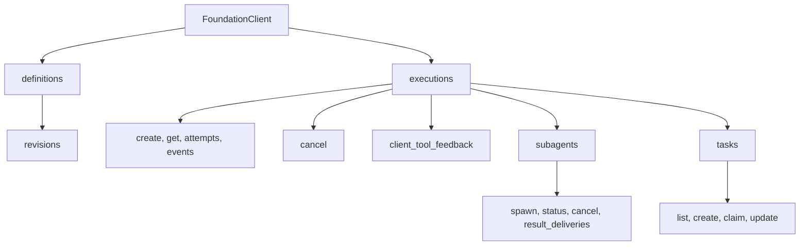
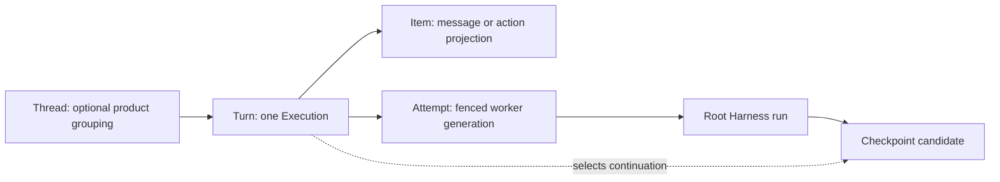

# Execution API and Durable Events

## Design Position

The Foundation Service API exposes durable `Execution` resources, immutable definition revisions, asynchronous subagent operations and receipts, durable task coordination, command receipts, result-delivery records, and replayable lifecycle events. Creating an Execution first commits durable acceptance and returns an identity; streaming is a separate observation path and never determines whether the service owns the work.

A Foundation Client treats `Execution` as the ordinary logical work resource. An `Attempt` is a read-only worker-ownership child of that resource, not the primary application handle. A Codex-style product can project `Thread -> Turn -> Item`: one Turn maps to exactly one Execution, while Items project messages, reasoning, tool calls, commands, file changes, and outputs. Thread and Item grant no execution authority, and Attempt is not renamed to Step.

This contract owns language-neutral service semantics. It fixes the first-party HTTP namespace boundary but not individual REST resource layouts below that boundary, generated SDK shape, SSE or WebSocket libraries, broker technology, pagination syntax, or a required Thread product model.

## Boundaries

| Concern                                         | Owner                                                    | Relationship                                                              |
| ----------------------------------------------- | -------------------------------------------------------- | ------------------------------------------------------------------------- |
| Execution and Attempt state                     | [Durable Execution Lifecycle](03-execution-lifecycle.md) | API projects the authoritative resource                                   |
| Creation and command idempotency                | Foundation Service API                                   | Commits stable receipts before returning success                          |
| Process-local cancellation                      | Harness `HarnessRunStream.cancel()`                      | Attempt worker invokes after durable command acceptance                   |
| Durable lifecycle event log and replay cursor   | Foundation Service                                       | Authority for reconnect and downstream projection                         |
| High-frequency model/tool stream                | Harness and live delivery adapter                        | Optional observation; not necessarily durable or replayable               |
| Outbound webhook delivery                       | Hosted connector plugin                                  | At-least-once projection of committed durable events                      |
| Inbound connector event                         | Hosted connector plugin and acceptance API               | Maps one source identity to one idempotent acceptance request             |
| Client-side tool feedback                       | [Client-Side Tools](02-client-side-tools.md)             | Separate exact-parent mutation using this API's auth and event boundaries |
| Async subagent spawn, status, and control       | Foundation subagent service                              | Independent child Execution; compact model ref plus trusted receipt       |
| Durable task claim and update                   | Foundation task service                                  | Shared scope with trusted actor and CAS revision                          |
| Child-result routing and incorporation          | Foundation subagent delivery ledger                      | Fixed Attempt, retention, or new continuation Execution                   |
| Caller authentication and product authorization | Adopting product and service policy                      | Required before every read or mutation                                    |

## HTTP Namespace and Built-in Web Client

The first-party Foundation Service HTTP transport reserves `/api` for product-facing APIs, API schemas, and interactive API documentation. Every public HTTP resource defined by this contract is reachable below that prefix even though the exact resource paths and transport encodings can evolve independently. Process liveness at `/healthz` and dependency readiness at `/readyz` are operational endpoints outside the product API namespace. They do not become Foundation Client resources or application compatibility surfaces merely because they use HTTP.

The shared service image includes an optional built-in browser application as a same-origin control-plane client. The `all` and `control` roles can serve its immutable production assets and browser routes from `/`; the `execution` role serves neither the browser application nor product-facing APIs. The browser application invokes relative `/api` paths and owns no lifecycle, persistence, authorization, or execution fact. A product can replace that experience while preserving the same Foundation Client semantics.

Browser history fallback applies only to browser routes. It never converts an unknown `/api` request, `/healthz`, `/readyz`, or their responses into the application shell. Development may serve browser assets from a separate local origin, but that server proxies `/api` unchanged to Foundation Service so development and production use the same application paths.

## Foundation Client Resource Model



`definitions` and `revisions` expose the immutable authoring contract from [Agent Definitions and Presets](01-agent-definitions-and-presets.md). `executions` exposes accepted work from [Durable Execution Lifecycle](03-execution-lifecycle.md). Attempt details can include generation, Harness run correlation, timing, safe failure, and provider diagnostics, but ordinary application control always targets the Execution or a command's explicitly fenced Attempt.

A new independent user turn or task creates another Execution. An asynchronous subagent spawn also creates another Execution, but its immutable parent/root/spawn lineage is authoritative for child targeting and result delivery rather than optional grouping metadata. Optional `thread_ref` and workflow correlation remain non-authoritative grouping metadata. The base API does not require a next-turn queue, mutate a terminal Execution back to running, or make single-active Thread routing part of correctness.

### Thread, Turn, Item, and Attempt



`Thread` is an optional product-owned grouping and routing scope. `Turn` is its application vocabulary for one accepted unit of work and maps one-to-one to `Execution`, including every retry, deferred continuation, and host-pause resume. `Item` is an observation or content unit; it can represent model messages, tool calls, command runs, file changes, and outputs without becoming lifecycle authority.

`Attempt` remains the internal distributed ownership interval because Codex-style Thread/Turn/Item has no corresponding fencing primitive. The unqualified term `Step` is deliberately not a resource: it is ambiguous among a model request, tool invocation, workflow node, plan entry, and retry. Specifications use qualified terms such as model step or workflow step only where their local meaning is explicit.

A checkpoint belongs to the Execution/Turn and records the Attempt and Harness run that produced it. It may be captured after complete Item or tool-batch boundaries, but it is not owned by an Item or Step. A product can expose Thread/Turn/Item routes as a projection without renaming the core lifecycle records or weakening fences.

Every resource response includes its stable identity, schema version, lifecycle version or ETag-equivalent, and safe links or references needed for reconciliation. SDK conveniences preserve unknown additive fields and the raw safe response so applications do not lose evidence needed during upgrades.

## Execution Acceptance

The following Python-like types are conceptual contracts rather than exact wire models.

```python
class ExecutionAcceptance(BaseModel):
    acceptance_id: str
    execution_id: str
    idempotency_key: str
    request_digest: str
    accepted_at: datetime
    execution_version: int


class CreateExecutionRequest(BaseModel):
    definition_revision_ref: str
    input: RunInput
    client_tool_attachment: ClientToolRunAttachment | None
    metadata: Mapping[str, JsonValue]
```

The authenticated caller supplies an idempotency key outside model-visible input. The service canonicalizes the authority-relevant request inside its declared compatibility domain and stores the digest with the acceptance.

Acceptance atomically:

1. authenticates and authorizes the caller, definition revision, input, optional client-tool attachment, and requested policy scope;
2. validates all bounded payloads and referenced content ownership and rejects `ToolResultInputPart` because root creation has no authoritative pending parent;
3. derives the empty-path root `AgentDefinitionTarget`, selects a Host-owned task scope when that definition exposes the durable task service, materializes the definition's initial Environment template into the Execution's first desired-topology revision, then creates the immutable acceptance record and `Execution(state="accepted")`;
4. appends the matching durable `execution.accepted` event;
5. makes the work eligible for scheduling.

A successful response means the service durably owns the work even when no worker, Environment, stream, or webhook exists. Deferred approvals, external-call results, asynchronous child results, and reconciliation inputs use their owning typed operations rather than creating a root Execution with caller-asserted continuation state. A child result can be retained, target one fixed active parent Attempt, or be consumed into a service-created continuation Execution; it never reopens the parent or enters root creation as caller-asserted `DeferredToolResults`. Repeating the same Principal scope and idempotency key with the same canonical request returns the original acceptance. Reusing it with different content fails as an idempotency conflict. A timeout before the caller receives the response is reconciled by reading or retrying the same key; the caller does not invent another key merely because acknowledgement was lost.

Authentication failure, policy denial, invalid input, unknown definition revision, or transaction failure returns no successful acceptance. The service never returns a successful Execution identity for work it has only placed on an ephemeral queue.

## Asynchronous Subagent Operations

The Foundation Subagent Capability is definition-selected, artifact-locked model-visible behavior reconstructed by the worker from the immutable Foundation revision. Foundation run assembly supplies exactly one fresh typed service adapter in `RunBindings.capabilities`. Feature-specific setup and each tool operation require its documented public type and stable Capability ID from finalized `RunContext.capabilities`; a missing, duplicate, or incompatible adapter fails before child submission. The behavior Capability reads the current executable's immutable immediate-child collection from `AgentContext.subagents`; topology supplies no authority. Model-visible arguments select only an immediate child name, bounded task input, and any Capability-defined presentation options. The fresh adapter owns the service collaborator and current parent Execution, Attempt, Harness run, and invocation identity, then applies the locked edge configuration to produce bounded child input, effective limits, and the task-sharing choice. The service independently derives the parent Agent instance, exact definition target, and policy from immutable records; the model cannot forge those values.

```python
class SpawnSubagentRequest(BaseModel):
    """Model-visible tool arguments."""

    subagent_name: str
    task: JsonValue


class ModelSubagentRefRequest(BaseModel):
    """Model-visible status, wait, or control selector."""

    subagent_ref: str


class ModelSubagentSpawnResult(BaseModel):
    """Bounded model-visible ordinary tool result."""

    subagent_ref: str
    status: Literal["accepted"]


class ModelSubagentStatusResult(BaseModel):
    """Bounded model-visible status projection."""

    subagent_ref: str
    state: ExecutionState
    outcome_available: bool
    failure: SafeFailure | None


class SubmitSubagentSpawn(BaseModel):
    """Trusted run-adapter operation; never model-visible."""

    operation_id: str
    parent_execution_id: str
    parent_attempt_id: str
    parent_generation: int
    parent_harness_run_id: str
    tool_call_id: str
    subagent_name: str
    input: RunInput
    effective_usage_limits: UsageLimits
    task_state: Literal["shared", "isolated"]


class SubagentSpawnLink(BaseModel):
    model_config = ConfigDict(frozen=True)

    spawn_id: str
    subagent_ref: str
    operation_id: str
    parent_execution_id: str
    parent_attempt_id: str
    parent_harness_run_id: str
    tool_call_id: str
    child_execution_id: str
    child_agent_instance_ref: AgentInstanceRef
    child_definition_target: AgentDefinitionTarget
    task_state: Literal["shared", "isolated"]
    accepted_at: datetime


class SubagentSpawnReceipt(BaseModel):
    operation_id: str
    spawn_id: str
    subagent_ref: str
    parent_execution_id: str
    child_execution_id: str
    child_agent_instance_ref: AgentInstanceRef
    child_definition_target: AgentDefinitionTarget
    status: Literal["accepted"]
    accepted_at: datetime
    child_execution_version: int


class SubagentStatus(BaseModel):
    spawn_id: str
    subagent_ref: str
    child_execution_id: str
    state: ExecutionState
    execution_version: int
    result_ref: str | None
    failure: SafeFailure | None
    delivery: SubagentResultDelivery | None
```

`task` is untrusted model content. The locked run adapter applies the exact authored `DelegationContextPolicy` to construct bounded child `input`, intersects the authored edge limits with current parent and Host limits, and invokes `SubmitSubagentSpawn` with trusted run identity. The model selects only the immediate child name and task; it cannot supply a definition revision, Agent identity, Attempt, Harness run, tool-call identity, limits, task scope, or child bindings.

The service reads the immutable parent Execution and current Attempt, verifies their generation and worker fence, and resolves `subagent_name` against the exact immediate child in the parent's definition target. It derives `child_definition_target` by extending that immutable revision path, allocates one stable child `AgentInstanceRef`, records its parent and spawn lineage in Foundation records, and applies the edge's `task_state` ceiling. Shared provider-backed tasks use the authorized parent scope; isolated tasks use no scope or a distinct child scope. A one-sided or incompatible task configuration fails before acceptance rather than falling back to another scope.

The same acceptance transaction allocates a compact `subagent_ref` in the durable namespace of the stable parent `AgentInstanceRef`. Its first-party form is `{subagent_name}-{suffix}` with a four-character lowercase hexadecimal suffix, such as `code-reviewer-a7b9`. Allocation checks every retained link in that parent namespace; a collision selects another candidate, and bounded exhaustion fails before acceptance without exposing or truncating `spawn_id`, `child_execution_id`, or the child Agent instance ID. A reference is never reused for another child. A continuation Execution that preserves the same parent Agent instance can resolve an earlier reference under fresh policy; another parent instance cannot.

For each observed parent tool dispatch, the run adapter assigns one operation ID in the explicit domain `(parent_execution_id, parent_attempt_id, parent_harness_run_id, tool_call_id)`. The service stores a canonical digest of the derived target, parent lineage, bounded input, effective limits, and task-state choice. Repeating that exact operation ID and digest returns the original `SubagentSpawnReceipt`; conflicting reuse fails closed.

The operation domain deliberately does not equate a newly generated call in a replacement Attempt with an earlier uncheckpointed call. Same-dispatch retries and receipt lookup are idempotent. Before a replacement Attempt replays parent work, any accepted spawn newer than its selected checkpoint is exposed as reconciliation input; the worker must not blindly issue a semantically similar spawn under a new operation ID.

`spawn()` atomically creates one immutable `SubagentSpawnLink`, the child `Execution(state="accepted")`, its acceptance record fixing the bounded input and effective limits, and their events, then returns the trusted `SubagentSpawnReceipt`. `spawn_id` remains the canonical internal and Foundation Client link identity used by the child Execution, status/control authorization, and result-delivery ledger. The child worker later resolves the exact `child_definition_target` into that child's complete definition, model, top-level Capabilities with their owned tools/Toolsets, nested child graph, and initial desired Environment topology. It materializes fresh Environment provider, model, credential, client-tool, task-state, and other run bindings for the child rather than inheriting live parent objects or rebuilding behavior from ad hoc overrides.

The behavior Capability projects that receipt to `ModelSubagentSpawnResult`; only `subagent_ref` and bounded semantic status enter the ordinary model tool result. The result is never `CallDeferred`, contains no pending Pydantic tool request, and does not promise child completion or delivery. `operation_id`, `spawn_id`, parent or child Execution IDs, Agent instance identity, definition target, Attempt/run/tool-call correlation, result or delivery references, and versions remain in trusted adapter, service, event, and public API records. The internal adapter transport is service wiring rather than part of the model-visible or public spawn schema.

Model-facing `status()` and bounded `wait` accept only `subagent_ref`. The fresh adapter combines it with the trusted current parent Agent/Execution lineage, resolves the immutable link, and reads the authoritative child Execution and delivery ledger. It never inspects a parent Harness State registry, accepts another parent's ref, or derives a durable ID from the four-character suffix. `wait`, when offered, is bounded polling or notification over `status()` and does not place the original spawn call into deferred state. The model result is `ModelSubagentStatusResult`; a public Foundation Client can separately receive the full `SubagentStatus`.

Model-facing `cancel()` likewise accepts only `subagent_ref` and returns a bounded semantic projection of the command outcome. The adapter resolves it to the immutable link, then uses the child Execution's ordinary cancellation command. An Agent-originated operation must also present the still-current parent Attempt ID, generation, and lease fence through its fresh run adapter; a stale parent worker cannot cancel the child even if it still holds a compact ref, durable IDs, or an old `AgentInstanceContext`. A separately authenticated product Principal follows its own policy path and can use public durable resource IDs. The internal operation returns a normal `CommandReceipt` and inherits command idempotency and cancellation-without-rollback semantics. A parent cannot cancel an unrelated child by presenting its reference.

### Result Delivery Operations

```python
class RouteSubagentResultRequest(BaseModel):
    delivery_id: str
    expected_version: int
    route: Literal["retain", "continuation_execution"]


class SubagentDeliveryReceipt(BaseModel):
    delivery_id: str
    status: SubagentDeliveryStatus
    version: int
    continuation_execution_id: str | None
```

Child terminal commit creates the initial retained delivery entry before routing. `retain` leaves the immutable child result available for status, later explicit route, or product retrieval. `continuation_execution` atomically consumes the delivery once, selects a compatible parent checkpoint or state under Host policy, and creates a new Execution targeting the parent Agent with typed `predecessor_execution_id` and `continuation_source_ref` lineage. It never changes the old parent Execution state or injects content into a live Harness run. Identical retries return the same route receipt; a conflicting expected version, route, target, or second continuation consumption fails closed.

Automatic policy can invoke the same operation after child terminal commit. It retains the result by default and creates a continuation only when explicit product policy authorizes that behavior. No route maps the child outcome to `DeferredToolResults` or the spawn tool-call ID.

### Durable Task Operations

```python
class CreateTaskMutationRequest(BaseModel):
    operation_id: str
    mutation: CreateTask


class ClaimTaskMutationRequest(BaseModel):
    operation_id: str
    expected_revision: int | None = None
    mutation: ClaimTask


class UpdateTaskMutationRequest(BaseModel):
    operation_id: str
    expected_revision: int
    mutation: TaskMutation


type TaskMutationRequest = (
    CreateTaskMutationRequest
    | ClaimTaskMutationRequest
    | UpdateTaskMutationRequest
)


class TaskMutationReceipt(BaseModel):
    operation_id: str
    request_digest: str
    task_scope_ref: str
    revision: int
    task: Task
    committed_at: datetime
```

A `task_scope_ref` is selected by Host policy and is never a bearer capability. Agent-originated task operations travel through the fresh provider-backed `TaskStateRunCapability` cell in `RunBindings.capabilities` and carry the current Execution, Attempt ID, generation, lease fence, and the cell's bound stable `AgentInstanceRef`. Before honoring either a receipt replay or a new Agent operation, the service authenticates that originating Attempt ownership is still current and that the bound instance is either the Execution's root instance or an inline child authorized through that current run's trusted lineage; an old worker cannot retrieve a prior success as authority for another effect, refresh the scope revision, or win after takeover. A committed Agent operation retains that trusted provenance in the service's operation record even when the public receipt omits those fields. A separately authenticated product Principal uses another policy path rather than an Agent fence.

Every create, claim, and update has a stable operation ID and canonical request digest covering the selected scope, mutation, and identity-bound `AgentInstanceRef`; reusing an operation ID from another Agent instance conflicts. Within the authenticated operation's durable idempotency domain, the service checks a committed operation receipt before evaluating any expected revision: identical replay returns the original result, while conflicting ID reuse fails closed. A genuinely new Agent create atomically allocates the next `task-{N}` reference from the durable task scope's monotonic sequence and needs no prior scope revision; model input cannot select it. A separately authenticated product operation can validate an explicit application identity through its own schema, but that identity never replaces the Agent tool's compact reference or hidden scope. A claim may omit the revision because current status, dependencies, eligibility, and same-owner rules form its atomic conflict predicate. A general update, dependency edit, owner change, or status transition must carry the exact expected scope revision and conflicts when it is stale. Every path derives owner or actor from the identity-bound cell's stable trusted `AgentInstanceRef` and atomically stores the task mutation, compact reference allocation, immutable receipt, new revision, and corresponding task event. This ordering makes same-owner claim retry idempotent after a lost response, prevents duplicate creates, and prevents a stale general update from overwriting newer state.

`TaskMutationReceipt`, `operation_id`, `request_digest`, `task_scope_ref`, Attempt-fence provenance, and internal owner identity remain trusted service/API data. The Working State model tool projects only the compact `task_id`, bounded task fields, semantic status, and revision. Dynamic context renders a root owner as a fixed safe label and a known child through its model-facing child reference when available; it never serializes `AgentInstanceRef`. Those labels remain observations, while claim and mutation ownership always derive from the fresh identity-bound cell.

If a committed inline-child mutation outlives the parent checkpoint that would expose that child selector and the originating Attempt loses its fence, the recorded Attempt and owner make the task a Host reconciliation target. An ordinary replacement Agent claim conflicts. A separately authorized Host reconciler can use `UpdateTaskMutationRequest` with the current expected revision to release or reassign the stale owner; it cannot infer rollback from the missing checkpoint.

Every Foundation definition that exposes the durable task service uses explicit provider-backed Working State mode; a definition without that feature need not expose task tools. The API-backed task map remains Host authority; Harness State contains no task map or scope selector and can retain only a bounded non-authoritative provider cursor. Foundation workers never share `TaskManager`, a local `TaskStateCell`, or another Python object across Executions.

## Commands and Receipts

Cancellation is a durable command whose process-local request and durable lifecycle result remain separate facts. Foundation does not expose a Harness live-steering or safe-pause API.

```python
type CommandKind = Literal["cancel"]

type CommandStatus = Literal[
    "accepted",
    "applied",
    "terminal_without_effect",
    "rejected",
]


class CommandReceipt(BaseModel):
    command_id: str
    execution_id: str
    kind: CommandKind
    idempotency_key: str
    request_digest: str
    target_attempt_id: str | None
    target_generation: int | None
    status: CommandStatus
    accepted_sequence: int | None
    reason: str | None
```

A command mutation authenticates the caller, validates the expected Execution version when supplied, chooses its target under one lifecycle transaction, stores the receipt, and appends a durable command event. Repeating an identical idempotency key returns the same receipt; conflicting reuse fails.

### Cancellation

A cancel command targets the Execution and fences future Attempt creation when accepted. The service asks a current worker to invoke native cancellation when one exists. When no current worker can advance state, the lifecycle authority can commit `cancelled` directly after invalidating any old fence and preserving unresolved-effect diagnostics. The receipt becomes `applied` only when the durable `cancelled` transition wins the Execution compare-and-swap. A previously committed terminal result resolves the command as `terminal_without_effect`. Cancellation never reports provider or client-side rollback.

`rejected` records a stable policy, lifecycle, version, or validation refusal when the API retains a receipt for reconciliation. A fresh live policy check can still prevent downstream cancellation delivery; only the durable compare-and-swap determines whether cancellation became `applied`.

## Durable Event Log

```python
class DurableEvent(BaseModel):
    event_id: str
    execution_id: str
    sequence: int
    type: str
    schema_version: str
    committed_at: datetime
    attempt_id: str | None
    harness_run_id: str | None
    payload: JsonValue
```

`sequence` is strictly increasing within one Execution and spans every Attempt. `event_id` is globally stable for delivery deduplication. Attempt and Harness run correlation are present only when the event observes those scopes. Payloads are bounded, typed by `(type, schema_version)`, and omit credentials, private provider state, arbitrary exceptions, and content not enabled by policy.

Every authoritative lifecycle mutation appends its corresponding event in the same authority transaction. A database commit that changes Execution state without its event, or emits an authoritative event without the state change, violates the contract. Events do not derive lifecycle state asynchronously from logs or telemetry.

The durable catalog includes at least:

- root and asynchronous child Execution acceptance, lineage, and terminal transitions;
- Attempt acquisition, Harness start correlation, abandonment, and completion;
- checkpoint selection;
- deferred waiting and dependency resolution;
- command acceptance and terminal receipt status;
- subagent spawn acceptance, task-scope mutation, and child-result delivery routing or incorporation;
- committed client-tool pending and feedback facts;
- delivery and model-usage-record references when those subsystems commit.

Each child Execution has its own event sequence and replay cursor. The spawning parent log contains bounded spawn and result-delivery references but does not flatten the child's complete event log into the parent sequence; cross-Execution timestamps do not establish a total order. A lineage-aware product follows the stable child Execution and delivery IDs.

The service can persist selected bounded semantic Harness events, final output references, or content blocks under policy. It does not need to store every token delta, reasoning fragment, tool argument, or provider-native frame in the lifecycle log.

## Replay and Live Streaming

`events(execution_id, after_cursor)` returns committed durable events in sequence order and an opaque next cursor. A cursor is scoped to its service, tenant, resource selection, filter, and codec version; it is not an integer that callers manufacture.

A retained cursor provides at-least-once replay. Consumers deduplicate by `event_id`. When a cursor precedes the retention watermark, the service returns a typed cursor-expired outcome containing the earliest available watermark and a link or instruction to reload the current Execution snapshot before continuing. It never silently starts at the newest event and implies no gap.

SSE, WebSocket, long polling, and another push transport can carry durable events plus live Harness observations. The transport identifies which envelopes are durable and cursor-addressable. A disconnected client recovers lifecycle truth from the durable cursor; it can be told that unretained content deltas were lost and use retained messages or final output rather than treating their absence as proof they never occurred.

A stream connection can open before or after acceptance, but opening it is not part of the acceptance transaction. Closing it does not cancel the Execution. Backpressure or a slow consumer affects only the delivery adapter unless explicit product policy submits a separate cancellation command.

## Outbound Event Delivery

A webhook or connector subscription is an immutable revision containing an activation watermark, event filter, payload codec version, destination reference, and credential/signing reference. Plain destination secrets and headers do not enter Agent definitions or event payloads.

Every matching `(event_id, subscription_revision)` must become a durable outbox intent without a crash gap. An implementation satisfies this contract in one of two ways:

1. it inserts every matching intent in the same authority transaction that commits the event; or
2. it replays the durable event log from a per-subscription durable materialization cursor, inserts the intent under a unique `(event_id, subscription_revision)` key, and advances that cursor atomically with the insertion or proof that the event does not match.

The second form retains each source event until every applicable subscription materializer has advanced through it. A crash after event commit but before intent creation therefore causes replay rather than loss. This materialization cursor is internal connector state, not a Foundation Client event cursor.

Each intent binds:

- stable `delivery_id`;
- exact `event_id`;
- exact subscription revision;
- payload schema version;
- attempt and terminal delivery state.

Delivery is at least once. A lost response can cause another attempt with the same `delivery_id` and `event_id`; receivers deduplicate on stable identity. Retry exhaustion, dead-letter handling, or abandonment is a delivery fact and never changes Execution terminality. Editing or deleting a subscription does not silently redirect an already frozen delivery intent.

Synchronous policy, approval, credential, and tool invocation callbacks are not lifecycle webhooks. They use their owning typed run contracts because Agent correctness can depend on their immediate result.

## Inbound Connectors

An inbound connector maps an authenticated source identity and immutable source event ID to the ordinary `CreateExecutionRequest` or another typed acceptance operation. The pair becomes the idempotency scope. Replaying identical source content returns the original acceptance; conflicting content for the same source event fails closed.

Connector acknowledgement and Foundation acceptance are separate. A connector acknowledges its upstream only according to its source protocol after it can recover or reproduce the Foundation acceptance. Provider-specific payload transformation, OAuth, polling, and product mapping remain plugin concerns; they cannot bypass definition selection, caller policy, input validation, or durable acceptance.

## Error Contract

Every service error has a stable category, safe message, request correlation, and retry guidance. A conceptual envelope is:

```python
class ServiceError(BaseModel):
    code: str
    message: str
    request_id: str
    retry_hint: Literal[
        "none",
        "same_idempotency_key",
        "refresh_resource",
        "after_dependency_change",
    ]
    details: Mapping[str, JsonValue]
```

Transport status codes and language exceptions map to this envelope without replacing it. Details can include current resource version, expected lifecycle state, retention watermark, or conflicting field identity. They exclude credentials, private URLs, lease fences, stack traces, SQL errors, and arbitrary object representations.

Network timeout without a response is not a service error fact. The client retries or reads using the same idempotency key, command ID, Execution ID, or event cursor according to the operation. A client never invents a new key merely because acknowledgement was lost.

## Compatibility

Resource, subagent-operation, task-scope, result-delivery, command, event, cursor, connector-payload, and error-envelope versions evolve independently. Additive fields are safe for clients that preserve unknown data. Changing event meaning uses a new schema version; reusing an old type/version pair with different semantics is incompatible.

A cursor is opaque and can be invalidated only through the declared retention or codec rules. An SDK release cannot invent stronger replay, cancellation, or idempotency behavior than the service reports.

## Trade-offs

### Durable acceptance before streaming

Committing first adds one persistence boundary before low-latency output. It lets clients recover from connection loss without guessing whether work exists and prevents an ephemeral stream from becoming the work owner.

### Independent Subagent Execution vs. Deferred Spawn

A bounded ordinary model result with a durable compact reference lets the parent continue, while the trusted spawn receipt lets the child use the same Execution APIs, fencing, recovery, and command model as any other work. The cost is an explicit reference mapping, lineage, and delivery surface. Reusing deferred tools would reduce API types but would incorrectly suspend the parent tool call and couple child completion to one Pydantic call ID.

### Durable lifecycle events vs. every token delta

Persisting bounded semantic events gives reliable state recovery without making a high-volume content stream the primary database. Clients can miss transient deltas and still recover the authoritative Execution and final output.

### Execution core vs. Thread-first product API

Execution identity remains stable across retries and deferred resumes without requiring single-active Thread or queue semantics. Products can expose Thread/Turn/Item vocabulary with `Turn == Execution`; non-conversational adopters keep the Execution-first API, and neither path invents a generic Step.

## Invariants

01. A successful create response always names a durably committed Execution and acceptance record.
02. Idempotency-key reuse with identical content returns the original fact; conflicting reuse fails closed.
03. Steering targets one exact Attempt generation and never silently reroutes.
04. Command acceptance, ordered worker delivery, unknown delivery, gap-aware checkpoint incorporation, and lifecycle application are distinct observable facts.
05. Execution lifecycle mutation and its durable event commit atomically.
06. Durable event replay is at least once, cursor-scoped, and explicit about retention gaps.
07. Live stream connection state never determines acceptance, cancellation, or durable completion.
08. Every matching webhook intent is materialized without a crash gap before at-least-once delivery; connectors still do not become Execution authority.
09. Attempt diagnostics remain subordinate to the Execution resource.
10. Conversation, thread, queue, and workflow grouping remain optional product layers.
11. Async subagent spawn atomically creates an independent child Execution and returns an ordinary idempotent result containing a compact scoped `subagent_ref`; trusted and public records retain the full receipt and durable IDs, and spawn never suspends the parent through deferred tools.
12. Model-facing subagent status and control resolve only a parent-scoped `subagent_ref`; they remain parent/link authorized, operate on the child Execution's durable state rather than Harness inline State, and additionally require a current parent Attempt fence for Agent-originated mutations.
13. One child result delivery is versioned, duplicate-safe, retained, or consumed once into a new typed-predecessor continuation Execution; live and terminal parents never reopen.
14. Cross-Execution task mutations derive a stable trusted `AgentInstanceRef`, require a fresh Attempt-fenced provider binding for Agent calls, and use operation receipts plus durable compare-and-swap rather than model-supplied ownership, stale snapshots, or shared Python memory.
