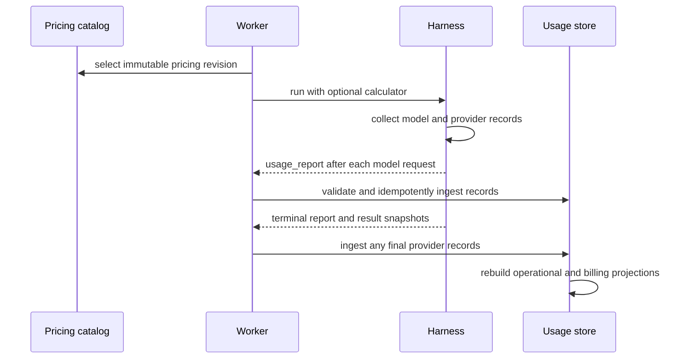

# Usage Recording and Cost Estimation

## Design Position

Foundation Service consumes the Harness mixed-source `UsageRecord` stream and stores idempotent usage facts. A report can contain model usage and provider receipts produced by media, document, Web, managed-tool, or other Capability-owned paths. The Harness reports pending records after every committed model request and once more at the terminal boundary, while Foundation owns durable ingestion, cross-run projection, reconciliation, and billing integration.

Pydantic AI `RunUsage` remains the process-local model accumulator and limit input. It is useful for live display and consistency checks but is never added to immutable records as another billable contribution. Missing usage or price remains unknown rather than becoming zero.

## Boundaries

| Concern                                                      | Owner                            |
| ------------------------------------------------------------ | -------------------------------- |
| Model request counters, accumulation, and supported limits   | Pydantic AI                      |
| Mixed-source attribution and bounded process-local reports   | Agent Harness                    |
| Model pricing policy and injected calculator                 | Foundation deployment            |
| Durable identity, deduplication, projections, and retention  | Foundation Service               |
| Provider invoices, adjustments, credits, tax, and settlement | Billing or provider integration  |
| Admission, reservation, and distributed balance enforcement  | Host policy or billing extension |

A Harness report is evidence from one entered run, not provider-grade billing proof. Provider-native reconciliation can strengthen that evidence without changing the Harness record union.

## Ingestion and Identity

The execution worker consumes `usage_report` extensions from the canonical Harness stream. It validates each report against the immutable Execution, Attempt, root run, child lineage, and current worker fence before accepting new origins. A stale worker cannot introduce a previously unknown run or lineage, although retrying an already accepted immutable fact remains idempotent.

Foundation applies these identity rules:

- a model record ID identifies one Harness run and response ordinal;
- a provider record ID identifies the provider, product, and provider usage ID independently of the Harness run;
- a report ID identifies one bounded delivery batch and may be retried without minting records;
- identical reuse returns the existing fact, while conflicting semantic payload reuse is an integrity error.

Provider records carry the run and tool attribution under which the receipt was observed. If the same provider receipt is observed again in another run, Foundation deduplicates the canonical provider fact by its stable receipt identity and may retain the additional validated origin separately; it does not charge the same receipt twice merely because delivery or recovery repeated it.

Report chunking, event delivery retries, terminal result snapshots, and cumulative `RunUsage` do not alter record identity. Foundation never reconstructs model records from message position, imported history, telemetry, or aggregate deltas.

## Pricing

Before a root run, Foundation selects an immutable pricing revision and injects a ready `ModelCostCalculator` through `ModelCostRunCapability`. The calculator is synchronous, content-free, and deterministic for that revision. A valid custom value overrides normal-path model cost before native accumulation; decline or failure falls back without failing execution.

Model records preserve the cost that actually reached native usage together with its source and custom-pricing status. A selected revision does not imply that every response reached the custom hook: interrupted or short-circuited responses can remain provider-priced, fallback-priced, or unpriced. Catalog refresh, network I/O, currency conversion, discounts, and repricing occur outside the Harness model path.

Provider records already carry provider-neutral quantities and an optional currency-denominated cost. Foundation does not mix those values into model token totals or reinterpret provider units through the model price catalog. Financially authoritative reconciliation requires provider evidence and explicit billing policy.

## Projections and Limits

Foundation builds replaceable projections from immutable records, for example by Harness run, Attempt, Execution, model, provider, product, or child lineage. A projection can show model token totals, known model estimates, provider quantities and costs by currency, and priced versus unpriced counts. It is a rebuildable view rather than an invoice or another authority table.

Three facts remain separate:

| Fact                                | Purpose                                                           |
| ----------------------------------- | ----------------------------------------------------------------- |
| Pydantic `UsageLimits`              | Guard one process-local run and its explicitly shared inline tree |
| Foundation admission or reservation | Decide whether distributed work may start or continue             |
| Recorded usage projection           | Describe immutable observations already accepted                  |

Inline children can share one live `RunUsage` while retaining their own attribution records. Host-managed asynchronous children and resumed root runs normally use fresh accumulators and ledgers. Consequently, cumulative terminal usage snapshots overlap and are never summed as independent contributions.

## Flow

## Failure Semantics

| Failure                                       | Outcome                                                       |
| --------------------------------------------- | ------------------------------------------------------------- |
| Calculator declines, fails, or is bypassed    | Preserve available fallback cost and explicit coverage status |
| Model or provider price is unavailable        | Store usage with unknown cost, never zero                     |
| Duplicate identical report or record          | Return the existing fact; totals do not change                |
| Stable ID is reused for conflicting semantics | Reject as an integrity conflict                               |
| Worker dies before durable ingestion          | Expose an accounting gap; do not fabricate usage              |
| Telemetry or downstream billing fails         | Durable usage facts remain unchanged                          |

## Invariants

1. Every durable usage fact originates from a validated Harness usage record or a separately defined provider reconciliation source.
2. Model and provider identities remain stable across delivery retry; provider receipt identity also survives Harness-run retry.
3. Every committed model request is followed by a bounded report of all usage pending at that boundary, and terminal reporting catches later provider usage.
4. Imported history, enqueued responses, cumulative snapshots, and telemetry do not become new usage records.
5. Provider usage never inflates native model token totals or limits.
6. Missing usage, units, currency, or price is never represented as zero or guessed.
7. Usage recording, process-local limits, distributed admission, lifecycle completion, telemetry, billing, and payment remain separate facts.
8. No calculator, ledger, usage record, durable projection, or billing state enters `HarnessState`.
