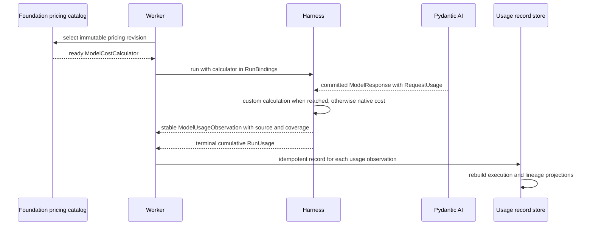

# Usage Recording and Cost Estimation

## Design Position

The Foundation Service durably records one idempotent `ModelUsageRecord` for each attributed `ModelUsageObservation` delivered by a Harness run. It selects a versioned pricing policy before that run and injects its pure `ModelCostCalculator` through `RunBindings`. On the normal response path, the calculator can override selected prices; declined responses fall back, while interrupted or hook-short-circuited responses explicitly report that custom pricing was not reached.

Pydantic AI `RunUsage` remains the sole process-local accumulator. Its terminal value is useful for live display and consistency checks, but it is not added to request records as another billable contribution. Retry, resume, and Host-managed asynchronous children produce new Harness runs and new response records; imported message history produces none.

This contract deliberately stops before a general billing ledger. It does not define arbitrary resource quantities, provisional snapshot remainders, provider adjustments, settlement watermarks, invoices, credits, tax, prepaid reservations, or a universal tool and Environment meter. Those features belong to a billing extension when concrete provider evidence and product requirements exist.

## Boundaries

| Concern                                                            | Owner                                | Relationship                                              |
| ------------------------------------------------------------------ | ------------------------------------ | --------------------------------------------------------- |
| Per-response `RequestUsage` and process-local `RunUsage`           | Pydantic AI and Harness              | Native usage and best-effort USD cost                     |
| Custom-first normal-path calculation                               | Harness with a Host calculator       | Executes before native cost fill when its hook is reached |
| Per-response identity, source, and pricing coverage                | Harness usage observation            | One stable observation per newly committed response       |
| Pricing catalog, calculator implementation, and revision           | Foundation Service deployment        | Selected before a run and retained with records           |
| Durable model-usage identity and deduplication                     | Foundation Service                   | One immutable record per originating observation          |
| Execution admission or reservation                                 | Host policy or billing extension     | Independent from observed usage                           |
| Provider invoice, credits, payment, and final financial settlement | External billing system or extension | May consume records but does not control Execution state  |
| Telemetry, SSE, and webhooks                                       | Observability and delivery adapters  | Non-authoritative projections                             |

A model price estimate is not proof of provider billing. Missing cost is represented as unknown, never as zero.

## Pricing Injection

Foundation Service owns its catalog representation. The Harness accepts only the narrow [`ModelCostCalculator`](../agent-harness/12-events-observability-and-usage.md#cost-calculation) interface, so a deployment can use a static table, tenant-specific rates, peak and off-peak windows, or another deterministic algorithm without exporting that schema into Agent definitions.

For each root Harness run, the execution worker:

1. selects an immutable pricing revision under deployment policy;
2. constructs a ready, synchronous calculator over that revision;
3. places it on `RunBindings.model_cost_calculator`;
4. retains the selected revision when it stores model-usage records.

The calculator sees the response's optional model name, provider identity, provider URL when safe and available, response timestamp, and a copy of `RequestUsage` with any existing cost cleared. It sees no prompt, response content, credential, or arbitrary provider payload. A finite non-negative USD amount overrides an existing provider value. `None`, an invalid amount, or a calculator failure declines the override, after which an existing provider cost or Pydantic AI's `genai-prices` lookup can supply the estimate.

A pricing revision identifies the complete deployment policy, including the locked Pydantic AI and `genai-prices` fallback baseline. Hosted workers use bundled pricing data from their dependency lock and do not enable mutable process-global price auto-update during runs. A fallback-data update therefore creates another composite pricing revision rather than changing an active worker invisibly. Catalog refresh and external I/O happen outside the Harness model path. The selected calculator is immutable for one root-plus-inline run; inline descendants sharing `RunUsage` use the same selection. A Host-managed asynchronous child or later Attempt has another root run and records whichever revision its Host selects.

Pydantic AI pricing is a best-effort compatibility fallback, not the Foundation Service catalog store. The service does not mutate the process-global `genai-prices` snapshot to emulate per-tenant catalogs. The current public Pydantic hook is not a universal response-commit seam: interrupted partial streams and earlier hook short-circuits can bypass the custom calculator, and continuation segments can be natively priced before their final logical response is merged. Their observations retain the actual cost and explicitly distinguish `not_reached` custom coverage. Exact segment-aware valuation is deferred until Pydantic exposes a unified segment-commit seam or a provider receipt extension supplies the evidence.

## Durable Model Usage

The following schema is conceptual rather than an exact database or wire model.

```python
class ModelUsageRecord(BaseModel):
    usage_record_id: str
    execution_id: str
    attempt_id: str
    harness_run_id: str
    response_ordinal: int
    lineage_ref: str | None
    response_state: str | None
    model_name: str | None
    provider_name: str | None
    response_timestamp: datetime
    request_usage: RequestUsage
    pricing_revision: str
    cost_source: Literal[
        "custom",
        "provider",
        "genai_prices",
        "provider_or_genai_prices",
        "unknown",
    ]
    custom_pricing_status: Literal[
        "applied",
        "declined",
        "failed",
        "not_configured",
        "not_reached",
    ]
    observed_at: datetime
    schema_version: str
```

`usage_record_id` is deterministically derived from the `harness_run_id` and `response_ordinal` assigned by the originating Harness usage observation. It is not reconstructed from final message position, which compaction can change. A provider response ID can be additional evidence but replaces this identity only when the provider guarantees stable uniqueness in a documented domain. Delivery retries never mint another ID.

`execution_id`, `attempt_id`, `harness_run_id`, and `lineage_ref` preserve logical work, worker ownership, process-local origin, and subagent attribution. Inline descendants retain their own Harness run and lineage IDs even when they share the root accumulator. Host-managed asynchronous children use their own Execution and records; a parent does not copy child totals into another record.

`model_name` remains `None` when the originating response has no reliable model attribution, including a usage-bearing `SkipModelRequest` response; the service never substitutes the Attempt's selected model. `request_usage` preserves the bounded supported Pydantic request-level token, detail, and best-effort `cost` fields from the observation; it is not an arbitrary provider metadata map. `request_usage.cost` is `None` when no source can price the response; the record does not duplicate it in a second estimate field. `pricing_revision` identifies the composite policy selected by Foundation Service, while `cost_source` and `custom_pricing_status` state what actually happened. A selected revision never implies that its custom calculator reached every response. Provider-native receipts, raw responses, credentials, private URLs, and arbitrary metadata do not enter the record.

An interrupted, suspended, retried, or normally completed response is recorded when the Harness emits an observation with reported usage. An interrupted response that bypasses the custom seam can retain cost with `custom_pricing_status="not_reached"`; when the Harness cannot distinguish whether that already-filled value came from the provider or `genai-prices`, it uses `cost_source="provider_or_genai_prices"` rather than guessing or labeling it custom-first. A provider operation that leaves no observation or receipt remains missing unless an extension later supplies authoritative evidence. The core does not fabricate a zero-cost response or a generic adjustment record.

## Ingestion and Idempotency

The worker derives records only from `ModelUsageObservation` usage extensions emitted for a proven native model or handled-partial commit in the current root or inline run. The event preserves child run identity and lineage even when an inline child result is consumed internally. Enqueued synthetic responses, imported history, final message positions, aggregate `RunUsage`, unqualified response deltas, and telemetry are not alternative attribution sources and are never reattributed to a recovery Attempt.

The Attempt's immutable root `harness_run_id` anchors attribution. When the root stream first forwards an inline-child event under a current worker fence, the service records a bounded immutable child-origin fact containing the Attempt, root run, child run, lineage, and selected pricing revision, transactionally with the first accepted child observation when practical. It does not create another Attempt or grant authority. Late child usage is accepted only when this origin was already established; a stale worker cannot introduce a previously unknown child run after losing its fence.

Ingestion canonicalizes the supported semantic payload and stores a digest:

1. a new record ID and valid payload creates one immutable record;
2. the same ID and digest returns the existing record;
3. the same ID with another digest is an integrity conflict;
4. the claimed `execution_id`, `attempt_id`, `harness_run_id`, lineage, and selected pricing revision must match the immutable historical run binding;
5. source and pricing-status values must be a valid combination and `request_usage.cost` must equal the observation's final request cost;
6. late delivery from that proven originating run remains idempotently acceptable even though its worker fence can no longer advance lifecycle state;
7. an unknown or mismatched run identity is rejected, and missing usage or price remains missing rather than becoming zero.

When the service and lifecycle data share one transactional store, a worker can append a record with the checkpoint or terminal transition that proves its source. Otherwise the record is an independently idempotent fact validated against the immutable Attempt-to-Harness-run binding. Accepting that observation grants no stale worker authority to change checkpoint or Execution state. A raw response delta, telemetry span, webhook, or downstream copy that merely contains similar values is not a validated originating `ModelUsageObservation` and is not record authority.

Worker loss after a provider request can leave usage unrecorded. The open-source core reports that gap rather than claiming billing completeness. A deployment that needs provider-grade recovery adds a provider-receipt adapter with its own stable identity and reconciliation rules; it does not generalize every tool and Environment unit into the base schema in advance.

## Run and Execution Projections

A root `HarnessRunResult.usage` is the cumulative process-local view for that root and every inline descendant that explicitly shared its accumulator. Inline child result copies overlap that total. Therefore terminal `RunUsage` values are never summed with request records or with one another as independent contributions.

Foundation Service can build replaceable projections by summing immutable `ModelUsageRecord` values:

- per Harness run;
- per Attempt;
- per Execution;
- per model or provider;
- across explicit Host-managed child-Execution lineage.

A projection reports token totals, known estimated USD cost, and priced versus unpriced request counts. It identifies the pricing revisions represented when more than one run or revision is included. These projections are rebuildable views, not another authority table and not an invoice.

The service does not inject a durable Execution aggregate back into a resumed Harness run. Every new root run receives a fresh `RunUsage` unless an in-process caller explicitly shares one, and every imported `ModelResponse` remains historical rather than new usage.

## Limits and Admission

Three facts remain separate:

| Fact                            | Purpose                                                                                         | Authority                                      |
| ------------------------------- | ----------------------------------------------------------------------------------------------- | ---------------------------------------------- |
| Pydantic `UsageLimits`          | Process-local request, token, tool, and supported cost guard for one run and shared inline tree | Pydantic AI                                    |
| Admission or reservation policy | Decide whether an Execution or Attempt may start or continue                                    | Foundation Service policy or billing extension |
| Recorded usage projection       | Report observations already produced                                                            | Foundation Service usage records               |

A live projection can inform soft admission but is not a distributed balance. Strict prepaid enforcement requires a reservation and commit provider with its own atomic semantics. When admission blocks work, the lifecycle records that policy outcome; it does not fabricate usage or rewrite prior records.

## Flow



## Failure Semantics

| Failure                               | Outcome                                                                                                               |
| ------------------------------------- | --------------------------------------------------------------------------------------------------------------------- |
| Custom calculator returns `None`      | Preserve provider cost or use Pydantic AI fallback and record `declined`                                              |
| Custom calculator raises              | Emit bounded diagnostic, fall back, and record `failed`; execution continues                                          |
| Response bypasses the custom hook     | Preserve cost, record `not_reached`, and use `provider_or_genai_prices` when its exact source is no longer observable |
| `genai-prices` has no matching price  | Store usage with `request_usage.cost=None` and `cost_source="unknown"`                                                |
| Duplicate identical record            | Return the existing fact; totals do not change                                                                        |
| Duplicate ID with conflicting payload | Integrity conflict; neither value silently wins                                                                       |
| Worker dies before durable ingestion  | Visible accounting gap; no fabricated zero                                                                            |
| Telemetry or delivery fails           | Usage records remain unchanged                                                                                        |
| Billing consumer rejects a projection | Billing or delivery failure; Execution and records remain unchanged                                                   |

## Compatibility

`ModelUsageObservation`, `ModelUsageRecord`, the supported `RequestUsage` codec, pricing-calculator input, and pricing revisions evolve independently. The implementation pins a Pydantic AI version whose public usage and cost hooks satisfy this contract; upgrades test normal ordering, hook short-circuit, interrupted partial response, continuation merging, usage-bearing `SkipModelRequest`, exclusion of enqueued and history-processed responses, custom override, decline and failure fallback, source/status classification, stable inline-child ordinals, aggregation, and serialization.

A pricing revision is immutable. Changing rates, matching, time windows, or fallback semantics creates another revision. Existing records retain their selected revision and `request_usage.cost`; the core does not silently reprice historical records. A billing extension can create an explicit revaluation if required.

## Trade-offs

### Request records vs. a generic contribution ledger

One record per model response directly matches the only usage source currently supplied by the Harness with stable attribution. It handles retry and resume deduplication without designing arbitrary units, provider adjustments, overlapping snapshots, and settlement watermarks before those sources exist.

### Injected calculator vs. serialized price table

A narrow calculator lets Foundation Service implement static or time-dependent pricing without coupling the Harness to catalog storage. The price revision remains Host state, so embedded users can rely on Pydantic fallback without adopting Foundation Service schemas.

### Estimates vs. financial settlement

Best-effort USD estimates are useful for limits, UI, and operations. Keeping invoices and provider reconciliation outside the core avoids implying that model token estimates are financially authoritative.

## Invariants

01. Every durable model-usage record identifies one stable Harness `ModelUsageObservation` for one response.
02. Record identity is stable across event delivery retries and compaction; conflicting reuse fails closed.
03. Enqueued responses, imported/history-processed messages, and cumulative usage never become new response records without a proven native usage commit.
04. Root and inline cumulative `RunUsage` snapshots are observations, not additional records to sum.
05. A Foundation calculator overrides only responses it actually prices; not-configured, declined, failed, and not-reached paths preserve actual fallback and coverage without failing the Agent run.
06. Missing usage or price is never represented as zero.
07. Every stored estimate names the immutable pricing revision selected for its run plus actual cost source and custom-pricing status.
08. Inline descendants sharing one accumulator use one calculator selection but retain child-correlated response observations; Host-managed asynchronous children and later root runs are independent.
09. Usage records, process-local limits, admission policy, Execution completion, telemetry, billing, and payment remain separate facts.
10. No calculator, catalog, aggregate, observation, or usage record enters `HarnessState`.
11. Inline-child records require immutable origin under their root Attempt; late ingestion cannot register a new child after the worker fence is lost.
