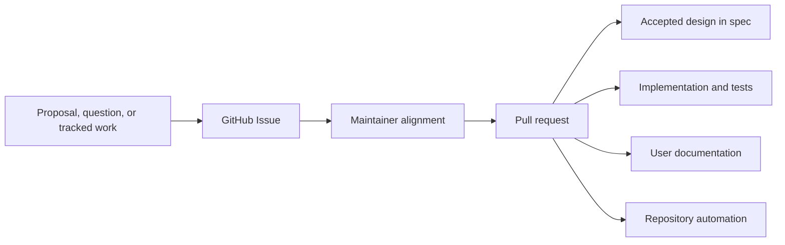

# Repository Model

## Purpose

This document defines the normative content and workflow boundaries of the Agent Foundation repository. It separates published documentation, accepted design, collaborative discussion, implementation, and contributor operations so that each durable fact has one clear home.

## Repository Surfaces

| Surface           | Responsibility                                                                                        | Excludes                                                                                                          |
| ----------------- | ----------------------------------------------------------------------------------------------------- | ----------------------------------------------------------------------------------------------------------------- |
| `docs/`           | User-facing documentation written as Markdown and published as the project documentation site         | Design drafts, issue history, progress tracking, and implementation planning                                      |
| `spec/`           | The current accepted product and architecture design                                                  | Discussions, RFC drafts, alternatives still under debate, meeting notes, issue transcripts, and progress tracking |
| GitHub Issues     | Primary venue for proposals, open questions, design discussion, coordination, and progress tracking   | Normative design or implementation state                                                                          |
| Pull requests     | Reviewed mechanism for changing specifications, documentation, code, tests, and repository automation | Long-running discussion that belongs in an issue                                                                  |
| `CONTRIBUTING.md` | Contributor setup, local development, validation, and pull-request workflow                           | Product or architecture design                                                                                    |
| `DEVELOPMENT.md`  | Repository-wide engineering standards for deployable services, persistence, migrations, and images    | Product semantics, package-specific commands, and rollout history                                                 |
| `AGENTS.md`       | Concise operational guidance for coding agents working in the repository                              | Detailed design owned by `spec/` or engineering standards owned by `DEVELOPMENT.md`                               |
| `apps/`           | Deployable application sources, including browser applications bundled into service images            | Independently published libraries or language package workspaces                                                  |
| `examples/`       | Runnable, tested developer examples of public integration and extension boundaries                    | Normative design, published user documentation, production packages, and release artifacts                        |
| `packages/`       | Python 3.13 uv workspace packages whose distribution names use the `converge-` prefix                 | Design discussion and unrelated generated artifacts                                                               |
| `crates/`         | Rust workspace crates whose package names use the `converge-` prefix                                  | Python packages and local reference repositories                                                                  |
| `proto/`          | Language-neutral protocol IDL consumed by deterministic repository generators                         | Handwritten language-local implementations, release artifacts, and normative design prose                         |

There is no repository-local `issues/` directory. "Issues" means the repository's GitHub Issues.

Workspace membership does not by itself select a release group. `packages/agent-envd-client` participates in root Python development and validation but is versioned and published with `crates/agent-envd` by the agent-envd release workflow. Foundation releases exclude that package and consume a compatible published version. Other release-group exceptions require an explicit owning specification and release workflow rather than inference from directory placement.

Projects under `examples/` may carry their own manifests and lock files when realistic packaging is part of the integration being demonstrated. They remain outside production package workspaces and release groups; example distribution names and artifacts are not platform packages.

`apps/foundation-web` is the source for the Foundation Service browser application. It is a private application rather than an npm-distributed library: repository automation validates and builds it, and the Foundation Service container image receives its production assets. Browser dependencies and lock state remain local to that application rather than joining a language-library release group.

## Change Flow

Issues preserve discussion and progress. A conclusion becomes normative only when a pull request updates the relevant specification or implementation and is merged. Specifications describe the accepted state directly rather than embedding the discussion that led to it.

Trivial corrections may start as a pull request when no material discussion or tracking is needed. Any change with unresolved product, architecture, security, compatibility, or scope questions starts in an issue.

## Documentation System

Documentation sources live in `docs/` and use Markdown. The site is built with MkDocs Material through the Python development environment declared in `pyproject.toml` and locked by `uv.lock`.

- `docs/index.md` is the initial documentation entry point.
- `mkdocs.yml` owns site metadata, navigation, Markdown extensions, and the build directory.
- `make docs-serve` runs the local documentation server.
- `make docs-build` performs the strict production build into `site/`.
- `.github/workflows/docs.yml` builds pull-request artifacts and deploys `main` to Cloudflare Pages through Wrangler.

Configuration and generated output do not live in `docs/`. Every source file under `docs/` is Markdown.

## Specification Discipline

A specification states the design that implementations and reviews must follow. It uses present-tense, testable language and identifies ownership and system boundaries explicitly.

Do not add the following to `spec/`:

- RFCs or proposal drafts;
- unresolved alternatives or open-question logs;
- implementation checklists, roadmaps, or status matrices;
- review transcripts, meeting notes, or issue summaries;
- temporary migration planning that is not part of the accepted design.

Keep those materials in GitHub Issues. When discussion changes the accepted design, update `spec/` through a pull request and make the resulting document internally consistent without requiring readers to reconstruct issue history.

## Development Standards

`DEVELOPMENT.md` defines how deployable services are implemented consistently across the repository. It owns cross-service coding and operational engineering conventions such as async I/O, database session and transaction lifetimes, migration generation and locking, streaming endpoint resource safety, logging, process roles, and container construction.

The development guide does not establish product semantics or subsystem ownership; those remain in `spec/`. It also does not replace package-local setup and command documentation or the contributor workflow in `CONTRIBUTING.md`. `AGENTS.md` may summarize high-risk rules and link to the guide, but must not become a second complete copy.

## Repository Automation

The root `Makefile` is the stable local entry point. `pre-commit` provides fast file hygiene and Markdown/configuration checks. Local contributors and CI use the same commands:

- `make install` prepares the locked Python environment and Git hooks;
- `make format` applies repository formatting hooks;
- `make lint` runs non-mutating file, Markdown, Ruff, and configuration checks;
- `make typecheck` runs Pyright over Python package sources;
- `make test` runs the Python workspace test suite;
- `make examples-check` validates independent example locks, style, types, tests, and offline smoke paths;
- `make build` builds every Python workspace package;
- `make check` runs the fast repository merge gate, including the independent examples.

Rust validation remains separate until Rust CI is accepted.

As implementation packages are added, their focused lint, type-check, test, and build commands must be added behind these stable Make targets rather than requiring contributors to discover unrelated tool-specific commands.
